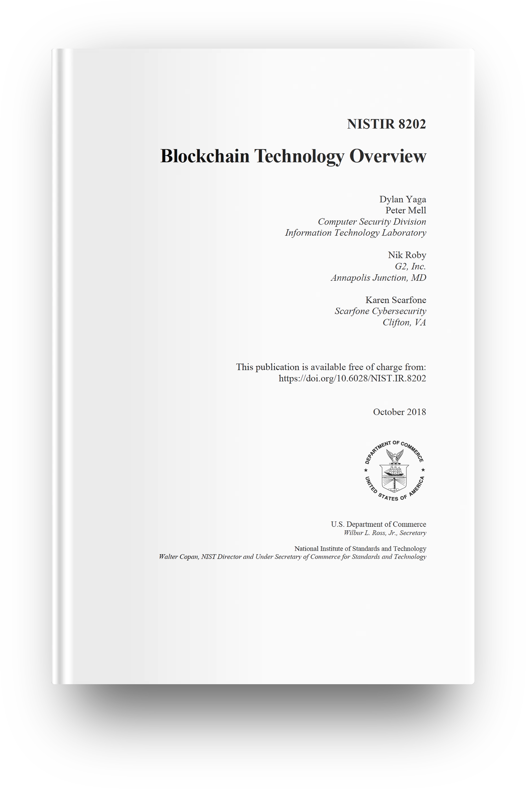
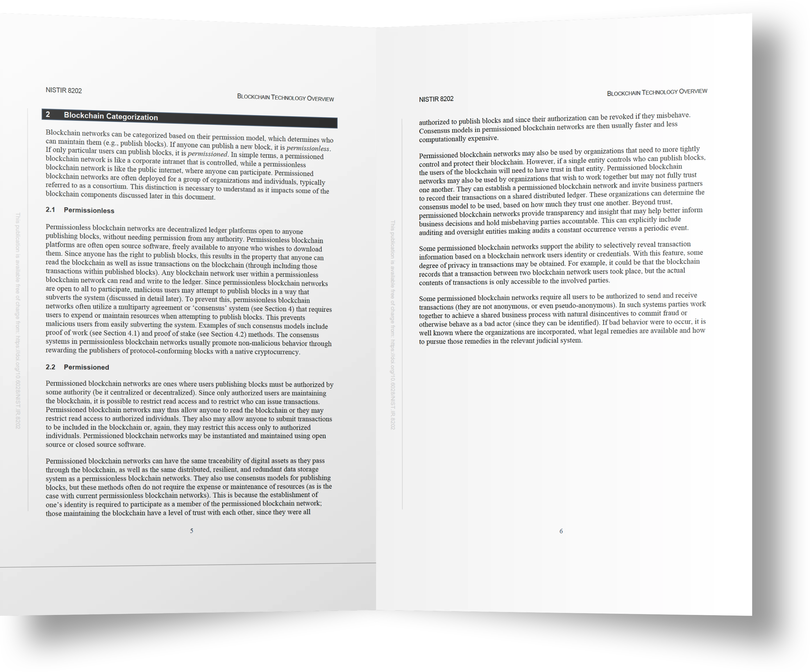

# 区块链如何分类？

**作者：** 冒志鸿、陈俊

> 由 ArcBlock 创始人兼 CEO 冒志鸿与副总裁陈俊合著、中信出版集团出版的《区块链实战：从技术创新到商业模式》，以通俗的语言和实际案例，从宏观的视角讲述区块链的起源、发展、技术趋势及落地应用场景，同时对层出不穷的新概念、新名词进行了辨析和讲解，破解了外界对区块链技术的各种迷思，帮助读者正确认识区块链的优势和局限之处。本书还以多个政府、企业的区块链项目情况，详解区块链应用的多层决策框架，以帮助组织决策者评估何时使用区块链。
>
> 《区块链实战》系列书摘，在此连载。

## 公链 、私链、联盟链

公链、私链、联盟链是区块链类型最常见的划分方式。

如前章所述，首度将区块链技术带入世人视野的比特币、在分布式账本上加载代码执行智能合约的以太坊，都是大家耳熟能详的公链（公有区块链），即任何人都能自由加入或离开这一完全开放的网络，任何用户都可以匿名读取链上数据或发布交易，这些采用工作量证明（PoW）类共识机制的公链往往通过“挖矿”奖励 BTC、ETH 之类的原生加密货币来吸引激励参与者维护网络的稳定和去中心化。

当 IT 金融界、大型商业机构，乃至政府日益重视区块链技术，希望将其从火热的数字货币应用抽离出来，应用于更广泛的行业场景，私链、联盟链兴起。与公链相对应，一个人或一群人控制的私链或联盟链只对身份经验证的受邀参与者开放，且控制谁可以参与、读写区块链数据的权限大小，以及执行共识协议（包括挖矿奖励）和维护共享账本。虽然与公链相比，私链的去中心化程度有所减弱，但作为加密算法保障的分布式账本，在多方参与的商业流程环境中能够发挥信任验证的降本增效作用，而且每秒交易吞吐量的性能大大提高，更符合技术应用的实际需求。

在实际应用中，私有链和联盟链有时界限并不是非常清晰。从区块链的应用价值而言，我们认为纯粹的“私链”可能是没有意义的，如果一个区块链始终不需要任何其他的参与方，那么没必要使用区块链。然而，在开发测试阶段、概念原型验证阶段，或者多方参与的联盟链真正形成之前，甚至一些公链在“真正”成为公链之前，的确有可能在一个阶段里，实际上处于“私链”的状态。

由于公链、私链、联盟链这种约定俗成的划分方式有些模糊和争议，以下根据“许可（Permission）”程度来划分可能是更严谨的分类方式。

## 无许可链、 许可链

公链和联盟链/私链，是从区块链网络参与者访问数据、写入交易的主体资格来分类，而许可链和无许可链则从成为发布区块的节点是否需要获得许可来区分。据 NIST 白皮书《区块链技术概述》描述，如果任何人都可以发布一个新的区块，它是无许可链。如果只有特定用户可以出块，它就是许可链。简单来说，许可区块链网络就像是受控的企业内部网，而无需许可的区块链网络就像公共互联网，任何人都可以参与。

无许可链和许可链、公链和私链或联盟链，这两大分类有何概念交集？和业界大部分人把公链与无许可链、私链与许可链划上等号的做法不同，我们认为，PoW 类公链是真正意义上的无许可链，是无需任何权威的许可、对任何人开放的分布式账本平台，任何人都有权且能够读取区块链数据、发布交易并发布区块。

而 PoS 类公链和联盟链/私链则属于许可链的范畴。联盟链/私链是许可链，这个好理解：从读取数据、发布交易到出块，用户是否能够参与、其权限有多大，完全须经链的所有者许可和授权。而 PoS 类公链，其区块链数据读写是对任何人开放的，但成为验证者出块，则需要质押该网络的通证来获得成为验证者的资格，尤其像 EOS 这种采用委托权益证明（DPoS）共识机制、全网设置 21 个超级节点的公链，验证出块的许可门槛垒的很高，并不符合无许可链的定义。因此，像 EOS 以及未来共识机制由从 PoW 转向 PoS 的以太坊 2.0，这些知名公链更准确的分类，或许应该称之为“公开许可链”。

之所以前面花些篇幅介绍区块链的分类定义，希望消除公链和联盟链/私链之间的“门户之见”。

有不少公链拥趸诟病联盟链/私链不是真正的区块链，而是分布式数据库。其实，联盟链/私链和公链一样，拥有相同的分布式、富有弹性和冗余数据存储系统，同样可在链上追溯数字资产的流通，也同样使用共识机制来出块，只是这些网络达成共识的方法不需要像公链那么耗费资源。这是因为用户身份确立和验证是其参与私链的前提条件，由于参与者是被授权出块，只要行为不端，其授权即可被撤销，这些人彼此之间存在一定程度的信任，因此其共识机制通常更快并且计算成本更低。

而且，公链与联盟链/私链并不是非此即彼的直接竞争关系，而是有各自的应用场景。显然，联盟链/私链以其用户身份可验证、更高性能、更易扩展、更快达成共识、更易合规监管的特性应用于更多商业需求场景。

有人认为，以太坊等公链平台无法用来创建许可区块链方案或控制对数据的访问。事实上，这些公链可以，只是没有提供可以在私链平台上找到的所有内置工具。你只需要明白，是否创建许可链方案取决于你，可以由你的软件架构师和开发者来完成，并且所有操作都始于某种身份管理系统。

> 目前，《区块链实战》一书可在中信出版集团以下官方渠道购得：
>
> - 纸质版：[京东](https://item.jd.com/70651034479.html)、[当当网](http://product.dangdang.com/28970979.html)、[天猫](https://detail.tmall.com/item.htm?spm=a1z10.3-b-s.w4011-15948767397.35.61556d99EoTsQn&id=621180059733&rn=b36e7bf4128178c5f1d9d47fdccb3d69&abbucket=19)、[中国图书网](http://www.bookschina.com/8339596.htm)
>
> - 电子版：[亚马逊](https://www.amazon.cn/dp/B08BYM7GCC/ref=zg_bs_661058051_5?_encoding=UTF8&psc=1&refRID=C77P1VDJR9J22RSQBHTN)、[豆瓣阅读](https://read.douban.com/ebook/151888899/)、[微信读书](https://weread.qq.com/web/appreader/3b63273071e8eda73b6dc4d)、[知乎](https://www.zhihu.com/pub/book/119902514)、[得到 ](https://www.biji.com/eBook/z4R9BQ7pP4ZEaXYkx8KvRdljeyqo608MRkW1m2bMAO9NnDL7gBGQr5VzJqrvmEVN)

新书更多情况，请扫码登录[官网](https://books.arcblock.io/)查看。
