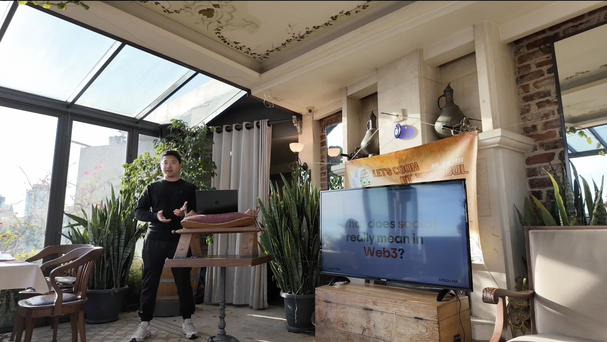
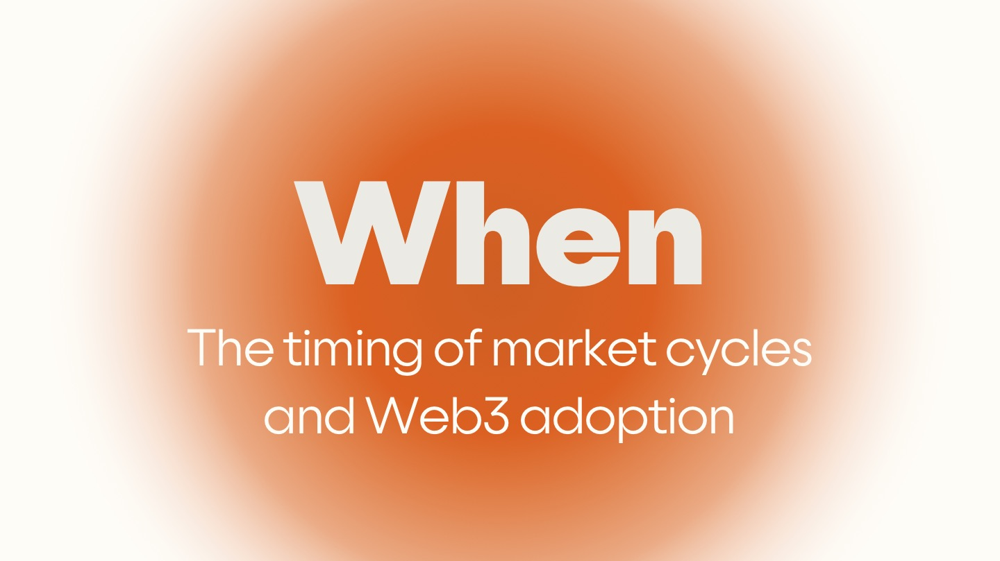
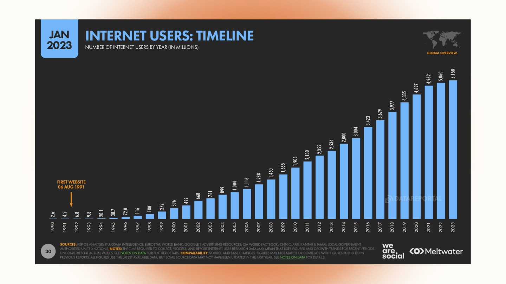
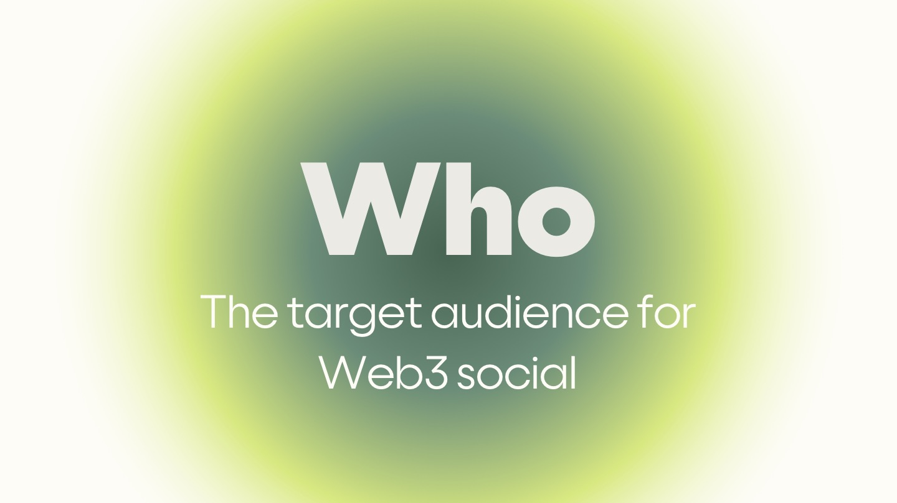
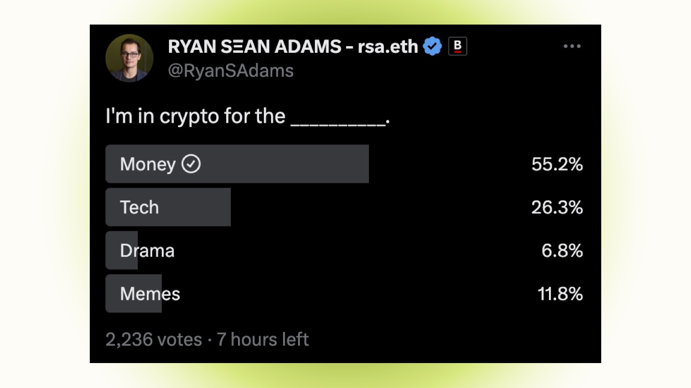
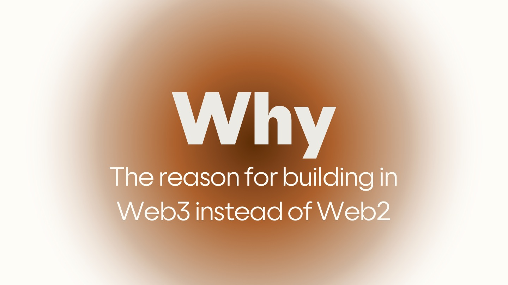
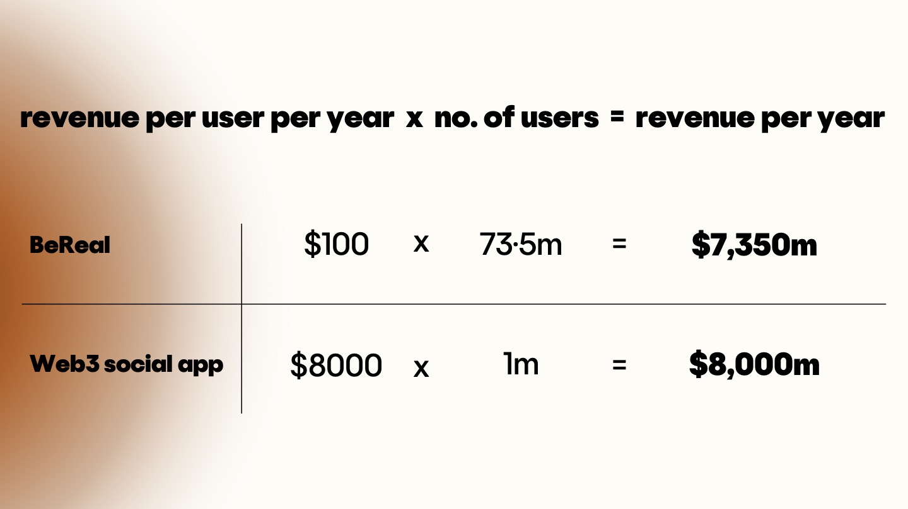
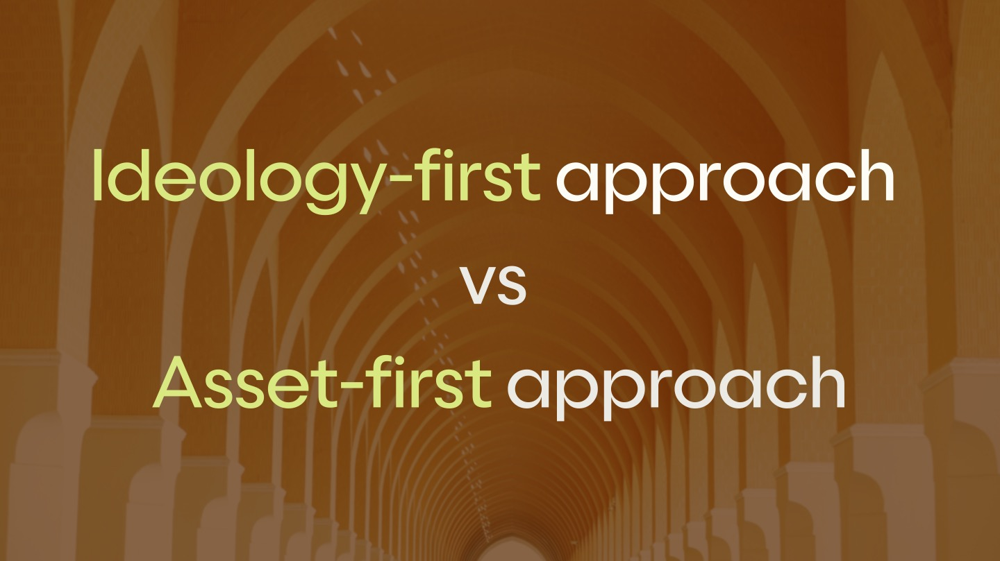
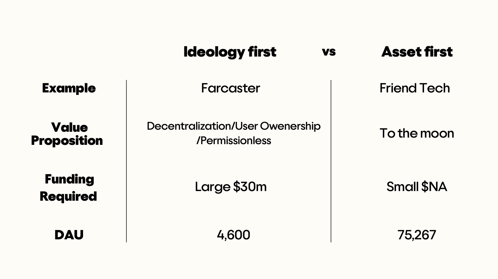
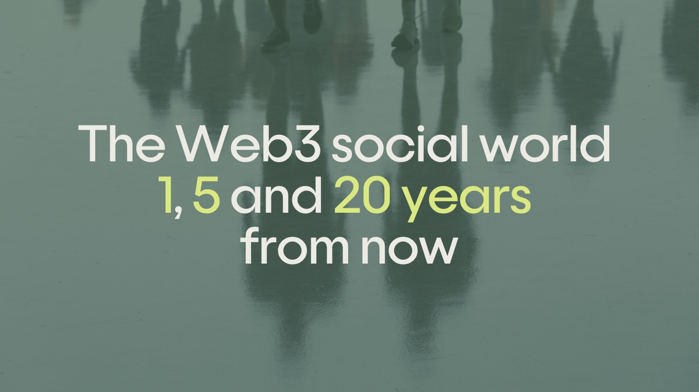

# 社交在 Web3 中的真正含义 | CryptoKitchen23 ⑤

> 社交在 Web3 中的真正含义是什么？在加密技术大规模普及之前，Web3 社交项目为谁而建，如何建设，以及生存？Atticc联合创始人 Jason Kan在首届加密厨房 DWeb Day中坦诚分享了他的真实思考，并与业内同行进行了热烈的交流。

(video)

我是 SocialFi 项目 Atticc 的创始人。Atticc 是社交类项目，集成了前面圆桌讨论提到的 CyberConnect,是他们协议上最受欢迎的社区建设应用之一，几乎所有中国用户都使用过我们。之前也谈到了通证绑定账户，我们最近刚通过直接向社区发售 NFT 的方式完成了种子轮融资。这个 NFT 目前是以太坊上第二大的通证绑定账户和 NFT 收藏。这就是 Atticc 的简介。但我今天的目的不是展示我的项目或讲课，我希望分享一些作为一个 Web3 社交应用建设者的学习心得，我也想从你们这里学习，所以我希望能更加互动，如果你对我说的有任何疑问或不同意见，请随时打断。我们的目标是建设一个社交效用平台，让用户能够更好地在链上讲述自己的故事。我们希望为 Web3 用户带来更多价值，也为更多 Web2 用户带入 Web3。

我今天的分享主题是 Web3 中的社交真正意味着什么。我的目的不是给出答案，而是提出一些关于为什么的重要问题，因为这个领域非常新。这是一个非常特殊的话题，对于其他领域像 DeFi 或 NFT 或 Game-Fi 来说，那里有一些明确的赢家，有一些主导的玩家，就像在 DeFi 中有 Uniswap、Sushiswap，在 NFT 中有 Blur 和 Opensea，在游戏中有 StepN 和 Axie Infinity，那里有明确的成功例子，当你谈论这些话题时你会想到要去看他们的应用。

而对于 Web3 社交来说，到今天为止还没有赢家。有一些大玩家如 Lens 协议或 Farcaster 或 CyberConnect，但他们还没有真正粘性的用户。现在任何人都很容易进来夺走他们的用户，就像 FriendTech 所做的那样，因为整个 SocialFi 中还没有用户粘性，没有产品市场契合。

所以在目前的阶段，因为它仍然很早，提出正确的问题比着急搭建解决方案更重要。重要的问题是什么？之前的分享可能更多地谈论基础设施，而我则从应用的角度来看。对于应用，你必须更现实，因为你需要在创立公司后 2 年内实现某种产品市场契合或盈利能力的迹象。否则，你会死。

所以有一些影响创业成功的因素。首先，你需要一个想法；其次，你需要一个商业计划；第三，你需要一个团队来执行。然后你需要资金。然后就是时间。在这 5 个因素中，你认为哪一个因素对创业成功影响最大？时机？完全正确。

大多数研究表明，时机是影响创业成功的最重要因素。这与你的想法有多好无关，因为在运行产品的整个过程中，你的想法会改变和多次迭代。团队也很重要，但如果一个优秀的团队选择了错误的时间，他们仍然可能无法取得成功。1990 年代提出的许多想法实际上是在今天实现的。在 iPhone 诞生的 10 年前就已被想象出来。今天我们拥有的许多应用实际上在 20 世纪 90 年代就已经被想象出来了，但由于各种因素它们无法取得成功，其中大多数在 2000 年的互联网泡沫中死亡。

所以对任何创始人来说第一个重要问题是市场周期和 Web3 普及的时机对 Web3 应用的建设者来说非常重要。如果我们看一下当前的市场周期，如果过去的周期可供参考的话，每个周期之间通常有 4 年。从 2017 年的峰值到 2021 年的峰值之间有 4 年。上一个周期从峰值下降到底部用了 2 年，再用 2 年达到峰值。现在我们距上一次峰值已经 2 年了。所以现在我们可能正处于一个转折点，市场上有一些看多的情绪，大多数人认为市场已经触底，或许我们还需要再用 2 年时间才能达到下一个峰值。所以我们有一个 2 年的窗口，情况可能会从现在开始变得更好。

如果我们看一下 Web3 的广泛应用，这里有一张互联网用户历时图。现在，我们的互联网用户已超过 50 亿。第一个网站诞生于 1991 年。至今已有 30 多年。我们用 30 年的时间让 50 亿人上网。这就是加密资产的采用率。因此，目前我们拥有约 4 亿加密用户，其中包括所有使用加密货币的人。因此，这些用户大多来自中心化交易所。从这个角度来看，4 亿人意味着什么？我认为区块链应用最终会赶上互联网应用，所以一旦区块链被采用，我们最终会看到类似的用户数量，如果我们将其映射到互联网用户的时间轴上，我们可以看到 2000 年的用户数量为 4 亿。2000 年，我们有 4 亿互联网用户，而现在，我们拥有的加密资产用户中没有链上用户。这是所有拥有加密资产的用户。如果我们只看链上用户，我想大概只占加密资产持有者总数的 1/10。因此，我们现在看到的是大约 400 万活跃的链上用户。400 万用户在互联网发展中意味着什么？

现在我们正处于 1991 年。这实际上是第一个网站出现的时候。就用户数量而言，我们的链上用户与 1991 年的互联网处于同一水平。这里有谁还记得 1991 年使用互联网是什么感觉？基本上就是今天的情况，我们需要对区块链有很多知识才能使用它。这就是 1991 年互联网使用的情况。从现在开始会变得更好，但我认为我们仍然需要很长时间。然而，与互联网相比，这一次普及的障碍现在更多不在于技术。就像对互联网来说，没有很多人受到这种新技术的破坏，但对每个人来说这基本上都是积极的。所以它没有我们现在加密技术上面临的阻力。互联网更多是技术演变，我们需要更多的人来建设东西以吸引更多的人普及。而对于加密技术来说，这更多地是政治方面，因为我们颠覆了世界各国的银行和政府。每个主要国家都有动机尽可能地减慢普及速度，以便他们仍然可以保留他们的蛋糕。所以这一次，普及的阻力更多地来自政治方面，而不是技术。但我仍然认为，我们将在 30 年内实现大规模普及，但我确实认为我们可能还需要 10 到 20 年的时间才能真正实现这一目标。

第一个问题的结论是，在这个市场周期内，我们可能已经见底。在未来 2 年内，情况将会好转，我们将有很多机会。加密市场可能在未来两年内增长 10 倍，但从更广泛的角度来看，我们仍然处于早期阶段。即使在下一个牛市之后，我认为我们仍然处于早期阶段。可能需要另外两三个市场周期才能实现大规模普及。

对于任何创业者来说，第二个重要问题是你的目标受众是谁？你是为谁而建设？因为这会影响你的产品设计、产品类型以及营销策略。我想问一下听众，为什么你们使用加密？为什么你们参与 Web3？是什么让你们进入 Web3？为什么你们今天在这个活动中？

ppqq **Cointelegraph 加速器 BD 负责人 Anna Shakola：** 我来自乌克兰，厌倦了所有人为的体制。乌克兰战争爆发之时，我们受益于区块链，在 24 小时内就把捐赠发送到了慈善机构。此外，乌克兰人更信任加密货币，而不是银行。一周前，我要转账 5 千美元，光是通过乌克兰银行 的 KYC 就花了一个半小时。这就是为什么我在这里的原因。

我认为今天我们有一些非常新颖的受众。而且今天更注重技术。这真的很好。但对于币圈里大多数人来说，他们因为金钱而来，这可能不会让人惊讶。

这是昨晚 Bankless 的 Ryan 的一句话，今早我们截了这些图。在 2000 多次投票中，绝大多数人投票支持金钱。他们参与币圈是为了金钱，这是今天的现实。Ryan 的 Bankless 其受众可能更符合以太坊的理念。即使如此，那些人也表示他们是为了金钱而在这里。

ppqq **Ceramic 首席技术官 Joel：** 但那是否一定是为了赚钱呢？这可能是为了独立赚钱，但金钱是动力。我希望比特币成为全球货币，而不仅仅是你的法币。我并不一定认为这是为了赚钱而来的。

当然，这对我来说可能是真的。当然，我需要为我的投资者获得回报，但也因为人们谈论的一些事情，我选择在这个行业工作，而不是在其他行业工作。但现实是，大多数用户是为了金钱而在这里，有一些用户是为了技术。如果你是基础设施建设者或开发系统建设者，那就没问题，你可以瞄准那些 26% 为了技术而在这里的人。但如果你是一个消费者应用建设者，你必须考虑到大多数人是为了金钱而在这里，无论是为了赚钱还是以更好的方式赚钱，就像那位先生说的那样。他们仍然在寻求一些利润，这对应用建设者来说非常重要，这是你所拥有的受众。你可能不想要他们，但这只是现实，如果你想在当前市场阶段建设，这就是你会得到的人。

最后一个问题是为什么我们要在 Web3 而不是 Web2 上建设？有人想回答吗？

ppqq Lita 基金会首席工程师 Chewy：大型科技公司开始受到地区化的限制，因为它们受到地区规则的束缚。所以我认为 Web3 更多地是关于分散，以免最终受到任何地区控制的影响。

很好，这再次强调了区块链的理念，这也是我们今天都在这里的原因。但是，如果你告诉一个投资者，他们可能不会因为你持有的那种理念而投资于你。归根结底，作为初创公司创始人，你仍然需要吸引投资，投资者之所以在这里，是因为他们希望通过投资于你获得更多的回报。在这一点上，这不仅仅适用于 Web3，而是适用于所有初创公司建设者。就像你正在做一样，因为你认为你可以通过我们拥有的资源最大化你创造的价值，而在这里我们选择在 Web3 中建设而不是 Web2。这必须是因为我们认为在 Web3 中我们可以创造比在 Web2 中更多的价值。否则，你可以直接在 Web2 中建设。如果你能够以更多的方式创造价值，那就太好了。没有理由以那种方式建设。但这意味着什么呢？就像我们之前讨论的，我们仍然在区块链普及的早期阶段。我们大致处于 2000 年或 1991 年，这取决于你如何看待加密技术普及。在整体互联网用户中，我们拥有非常少的用户。

回顾之前的第二个问题，大多数人都是为了钱。这就是币圈建设的一个丑陋现实。因此，我们在建设 Web3 时必须考虑到前两个问题的含义。

有一个简单的公式在这里。作为一家初创公司，最终你需要创造收入。SocialFi 应用的收入可以通过以上公式计算：每位用户每年的收入乘以用户数量，然后得到每年的总收入。那么对于社交应用的初创公司来说，这可能意味着什么呢？

有人听说过一个叫做 BeReal 的应用吗？BeReal 是一个 Web2 解决方案的初创公司，其用户数量曾经达到最高的 7350 万。如果你在建设 Web2 社交网络，我认为这是可以实现的。通过 3000 万美元的资金，他们达到了 7350 万用户。如果他们能够像推特一样成功地实现这些用户的变现，他们每个用户每月可能会收取几美元。如果说他们每用户可以创造大致相同的 10 美元，那么每年的总收入可能是 70 亿美元。这是一家伟大的业务，对于 Web2 社交初创公司来说，这是很大的收入。

现在，如果我们在 Web3 上建设，并且目标是在 Web3 中创造更多的价值，我们就必须超越 BeReal。如果 BeReal 可以创造 70 亿美元，我们需要创造 80 亿美元。所以为了证明这一点，我们可以建设在 Web3 上。以链上活跃用户的数量为基准，我们大约有 400 万。OpenSea 大约有 100 万活跃用户，我们可以以此为基准。假设我们变得像 OpenSea 一样大，成为 SocialFi 中的主导应用，并且我们拥有 100 万用户。那么如果我们想超越 BeReal，以每用户每年 8000 美元的总收入计算，我们就必须从每个用户那里创造 8000 美元。

现在这是让人们思考的事情。如果你在 Web3 中建设社交应用，你的目标受众非常有限，你必须从每个用户那里提取很多价值，才能让你的努力变得有价值，也才能对你的投资者有意义。在回答了这 3 个问题之后，即时间、我们目标受众是谁，以及为什么我们选择在其中建设。因此，得出的结论是我们仍然处于产品普及的早期阶段。我们有 2 年的时间窗口，有很大的机会让市场可能增长 10 倍。我们建设的目标受众主要是为了金钱，尤其是如果你在 Web3 中建设社交应用或消费者应用。然后，我们最终建设它作为一项业务，我们必须具有盈利性，必须为投资者创造价值，并且必须是一个可持续的业务。

建设一个 SocialFi 应用总体上有 2 种方法:一种是理念优先，他们将区块链的理想置于首位；另一种是资产优先，鉴于我们现在拥有的区块链在本质上主要是货币的分类账本，在其本质上，它是一个分布式账本，需要货币，所以归根结底，它回到了区块链本身所拥有的价值。

根据这 2 种不同的方法，有 2 个例子。一个是 Farcaster，我认为他们更吸引理念优先的方法，他们的主要价值主张是去中心化、用户所有权、无许可。对于 Farcaster 来说，他们获得了 3000 万美元的资金，而他们目前的 DAU（每日活跃用户）是 4000 和 600 人。这就是采用理念优先方法的结果。另一个在另一个极端上的例子，FriendTech 的价值主张很务实，有个售卖的粘合曲线，你如果越早参与，可以赚更多的钱。他们的方法非常明确，他们自称为你朋友的市场，对此，他们毫不隐晦。他们产品的所有设计都是针对人们能够赚钱而设计的。事实上，他们唯一具有的社交功能很长一段时间只是一个非常简单的聊天，甚至不支持图像。后来用了几个月的时间才开始支持图像。所以你可以看到这里 Farcaster 更像是推特的替代品。大家对它的印象是去中心化、用户自主权、无许可的内容主导。而 FriendTech 不谈论这些事情，只关注赚钱的那一面。但他们能够实现最高的 75000 DAU。我认为他们可能筹集的资金很少。据我所知，他们只有四个人的团队。他们从投资者那里得到了很多帮助。投资方是谁来着？Paradigm。但我认为 Paradigm 提供的帮助主要在声誉方面。所以在 Paradigm 之前，他们已经取得了小小的成功，然后他们的用户开始下降，然后在那时他们获得了 Paradigm 的投资，但他们没有透露多少钱。他们在那一点上已经成功了。

这就是这两种方法的区别的一个例子。但这是否意味着资产优先的方法总是正确的？我认为这是一种光谱，我们需要两者兼具，而 FriendTech 处于极端，他们专注于资产部分，Farcaster 更专注于理念部分。我们还有 Lenster，它更多地处于中间，我更偏向于资产优先，但考虑到我们之前回答的 3 个问题，我认为我们必须要疯狂地普及资产优先的方法，除非你筹集了 5000 万美元的资金，那么你可以忽略我在说的，因为你可以持续生存 3 个市场周期。 但是对于大多数创业者在应用和消费者应用建设的情况来说，如果你必须在 2 年内在当前的市场环境中实现盈利，我们有非常少的以赚钱为重点的受众，我们必须采取资产优先的方法，因为这将产生一种以前不可能的用户体验，只有当人们不再把你看作是推特的替代品时，你才能创造出与众不同的东西，人们才会有理由真正使用它。

ppqq **观众：** 我认为将 FriendTech 与 Farcaster 进行比较并不公平。实际上，Farcaster 的日活用户大约在 2000 左右。我认为 4000 只是刚开始的时候。所以它下降了一点，因为那里确实有很多撸毛用户。但同样的情况也适用于 FriendTech。我认为目前的日活跃用户约为 1000，而不是 75000，因为这可能是一个相当大的问题。是的，但我喜欢这里的比喻，就像是两个光谱，对吧？一个是追求金钱的，你在为人们调适如何买卖你的朋友。我认为一个有趣的社交互动是，有时他们试图不向朋友出售他们的密钥，比如，为什么你要出售我的密钥呢？另一光谱，它更像是纯粹的社交，几乎没有与经济相关的方面，但我猜尽管 Farcaster 仍在努力成为有朝一日可能达到 10 亿用户的社交协议，他们现在已经有点接受现实，并意识到，由于所有社交中的复杂性，像钱包、燃气费这样的关键问题，短期内他们必须建设一些能够应对受众审查的东西，尽管他们仍然希望成为主流，CyberConnect、Lens 也是一样的。我认为有趣的是，CyberConnect，我认为在一半的时候，他们刚开始建设与账户抽象相关的东西，我猜测了几个月，他们从一开始就意识到，它不会在第一天与推特竞争。它将是一个供许多加密原生功能的社交网络，供创作者赚钱，而且在 V2 版中，他们将开放所有的操作，你将能够在协议中进行功能交易。我认为在最近的未来，这将是社交协议汇聚的中间地带，因为你不想建设一个协议，因为没有人会评审它，因为推特是百倍更好的，但与此同时，FriendTech 既不一致也不可持续，就像热度下降一样，也会像所有的空气币一样下降。

我完全同意。所以通过采取理念优先的方法，我认为 Farcaster 的目标是成为第一。我认为他们的吸引力更多地来自在大规模普及之后，当每个人都参与币圈之后，那时 Farcaster 显然是与推特相比更好的选择，因为它是去中心化的，用户主权和无需许可。然而，根据他们今天的日活用户，正如你提到的，他们意识到他们在与他们的产品市场契合度方面遇到问题，尽管他们筹集了 3000 万美元。如果他们采取这种理念为先的方法，我认为他们的投资者很难获得回报。我的意思是，他们仍然可以发布通证，然后通过区块链投资者的声望赚钱，就像许多区块链产品一样，利用声望和人际关系赚钱，而不是产品本身。仅从产品方面来看，我认为 Farcaster 很难从他们的 4000 付费活跃用户中实现盈利，并为其投资者获得合理的投资回报。而对于 FriendTech，尽管如何，他们达到了巅峰，而且并没有下降，他们可能在几个月内就会消亡。在他们为用户、团队和投资者取得的成就方面，已经是成功的业务。从这个意义上说，对于 FriendTech 来说已经是一家成功的企业，但 FriendTech 专注于极短期内。它纯粹是为今天的受众而建的。他们可能没有考虑更长远的路线图。他们可能只是基本上只瞄准短期，对产品的长期路线图没有太多考虑。但我们必须在中间找到一些东西，作为初创企业的创业者，我们必须在短期内生存下来，在每个小的市场周期中取得成功，这样你才能积累足够的火药，希望它能够一直持续到有一天实现大规模普及。
