# 关于 $NAT 与数字物质理论 ：从「万链归一」到「万宇归一」……

> 从现实世界与数字世界的量子纠缠说起，在万链归一（BTC）的大趋势下，我们梦想中的终极数字世界也即将拉开万宇归一的序幕……

**作者：** 领航猿实验室（推特 @NavigatorLabs）、加密厨房（推特 @CryptoKitchen23）

## 核心观点

- **DMT 正在创造一个统一的非任意的数字世界，在万链归一（BTC）的大趋势下，我们梦想中的终极数字世界也即将拉开万宇归一的序幕；**
- **区块元素表，为发现 BTC 原生数字资产开辟了新大陆，意义等同于智能合约从智能合约（遵循 Code is Law ）回归到区块元素（遵循 Block as ledger），更符合比特币的极简主义精神；**
- **$NAT 是 DMT 数字物质理论 + 非任意代币发行模式 + 区块伴生物的首个协议代币，是 DMT 数字物质理论建设的数字世界的通用代币。**

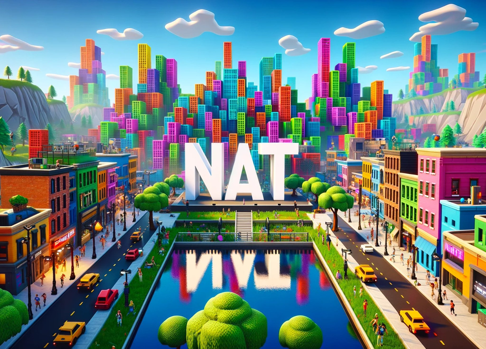

Ordinals 协议在过去一年里引发了基于最为去中心化、最强共识的比特币原生数字资产的寒武纪大爆发：Ordinals 铭文、BRC20、Bitmap、递归铭文、BRC420、TAP、Atom 原子、Runes 符文、Taproot Asserts……而这些为正在降临但绝大多数人难以想象的数字世界创造越来越丰沃的土壤，开启数字世界的哥伦布大航海发现新大陆的时代。

## DMT **数字物质理论，开启**数字物质及数字世界的新时代

Digital Matter Theory（数字物质理论，简称 DMT），由一些物理学家提出，他们认为数字信息可以被视为一种类似于实体物质（如木材或金属）的数字物质，预测未来数字信息的使用量有可能会超过原子。

就像现实世界由元素构成，元素周期表为寻找现实世界新元素提供了理论依据，科学家利用元素周期表在一定区域内寻找新物质（如半导体材料、催化剂等），服务于现实世界建设。

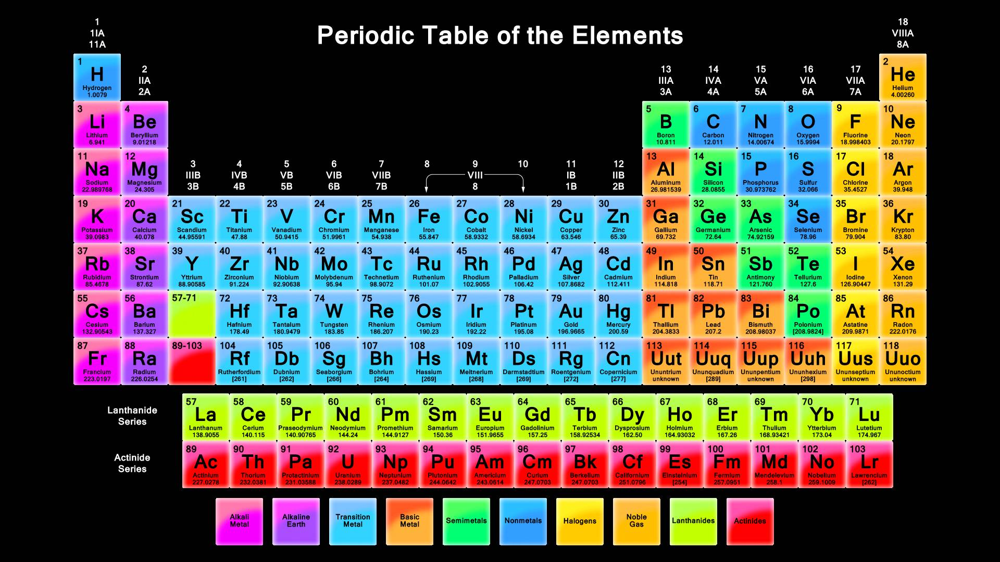

_现实世界：元素周期表_

在比特币区块链中，Trac 团队、Bitmap 创始人和 TheBlockRunner 团队提出可以通过利用区块数据中存在的固有模式来创建一种数字物质形式，也可以称为区块元素表。比特币区块和交易非常丰富，许多领域的信息永远记录并存储在去中心化且安全的公共分类账中。由此，我们可以应用 DMT 的原理，通过利用非任意模式的固有属性的统一流程来创建一类新的数字价值。这将引发比特币原生数字资产的大爆发。

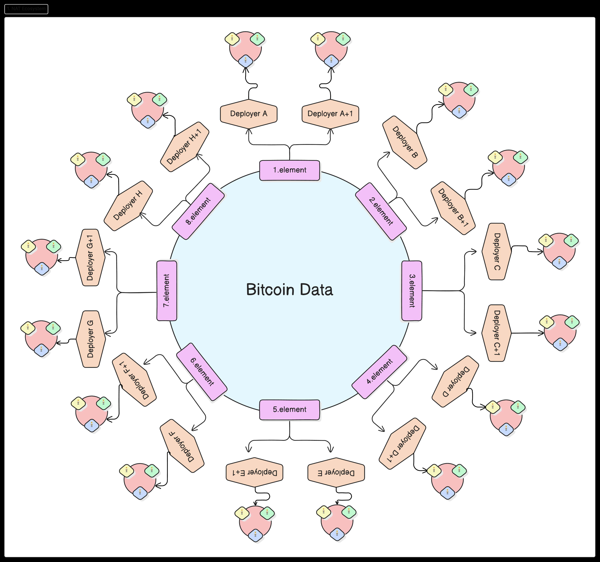

_数字世界：区块元素表（DMT 数字物质从比特币数据中产生，衍生出非任意代币生态系统）_

## 目前 DMT 在比特币生态中 3 种不同应用

- **第一个应用：Ordinals 序数理论。** Casey Rodarmor 提出的 Ordinal Theory 序数理论为 Sats（聪，比特币的最小单位，相当于一亿分之一的 BTC））赋予了硬币价值，让它们能够作为数字文物被收藏和交易，类似于现实世界用黄金锻造艺术品。这项分配模式为进入生态系统的每个聪分配一个唯一的 ID，任何人都可以利用该 ID 来创建要铭刻在聪之上的数字资产。
- **第二个应用：Rare Sats 稀有聪。** 根据序数理论，在比特币区块链上处于独特位置的 Sats 被认为是稀有 Rare Sats 稀有聪。一个例子是每个区块的第一个 Sats 被称为稀有聪。这种形式的模式识别将价值赋予稀有位置的聪，就像我们将价值赋予低铭文数量或稀有商品一样。
- **第三个应用：Bitmap 位图理论。** Bitoshi Blockamoto 提出的 DMT 的第三个已知应用，称为 Bitmap 位图理论。它将比特币区块链上的每个区块识别为数字地产。构成比特币区块的交易将该区域划分为单独的区块。这种机制实现了第一个非任意的元宇宙设计元素。

上述例子是第一批在比特币区块链上发现趋势、点燃模式的数字考古学家，让区块元素成为比特币区块链原生特色以及最大的叙事。DMT 希望提供一种系统的方法，从比特币区块链的数据中构建非任意的数字资产，特别是非任意代币，**目前以上三个仅为 DMT 的应用，缺少 DMT 理论的非任意代币发行方式及模型。**

---

## **DMT 正在创造一个统一的非任意的数字世界**

Bitmap 创始人提出的 DMT 正好从更高维度的理论与叙事将这些全新但各自独立的数字资产发行协议（Ordinals、BRC20、Bitmap、BRC420 等）进行概括和提升，就像化学元素构成了现实世界，区块元素将构成数字世界，开启基于比特币及区块元素的非任意数字物质世界的大门，与实体物质世界对应并产生量子纠缠，**DMT 正在统一创造一个非任意的数字世界 —— 非某个具体项目，而是一种新生态、新叙事、区块链搭建的数字文明的终极形态，所有人共同创造一个真正的元宇宙，我们梦想中的终极数字世界也即将拉开「万宇归一」的序幕：**

- 比特币对应现实世界中的黄金；
- Ordinals 铭文实现了资产上链与数字文物；
- Bitmap 确立了数字世界土地的尺寸与地貌；
- BRC420 实现了数字物质间价值纠缠与版税，统一了游戏资产的标准，实现游戏资产跨元宇宙互通；
- BRC20 等任意代币成为各个共识社区/项目/区域/生态的共识代币。

**现在，唯一缺少的是 DMT 数字物质世界的非任意代币、协议代币和一般等价物（即通用代币）**

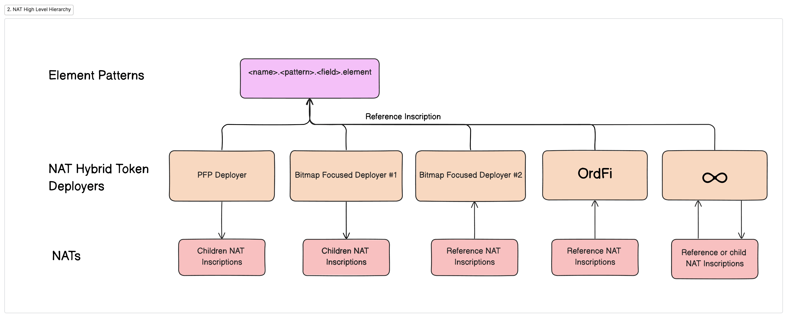

_NAT 部署的多个应用程序在不同的用例中使用相同的非任意数据根，$NAT 可用于任何应用_

## $NAT：DMT 数字物质理论的首个协议代币和通用代币

**$NAT** （Non-Arbitrary Tokens，非任意代币）是 DMT 数字物质理论在区块里发现的价值最大的数字物质，数量取自区块里 BITS 元素的数值（BIT 位是计算机信息量的最小单位，1 或 0 就是一个位），关于对 **$**NAT 的理解，我们从以下 4 个维度解析其价值。

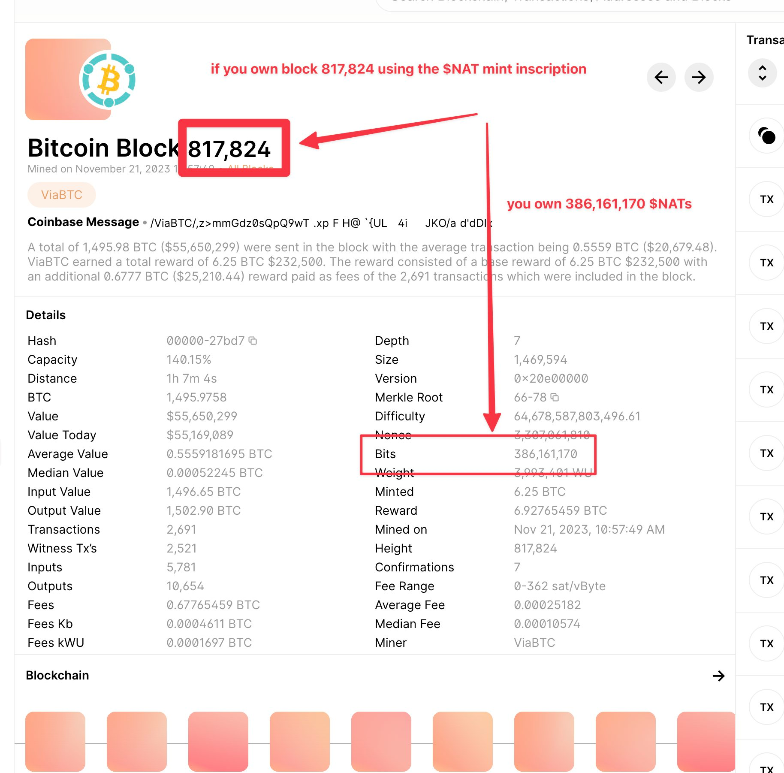

1. **$NAT 是 DMT 数字物质理论发行的首个协议代币**

DMT 数字物质理论的提出为区块链开辟了意义等同于智能合约的新大陆，从智能合约（遵循 Code is Law ）回归到区块元素（遵循 Block as ledger），回归到比特币的极简主义 ，让我们从全新的视角审视何为比特币原生数字物质，专属于比特币生态特性，从区块元素里发现而不是合约任意创造。$NAT 即是 DMT 数字物质理论同步发行的首个协议代币。

2. **$NAT 是非任意代币发行协议的首个代币**

DMT 数字物质理论认为代币发行协议主要分为任意代币与非任意代币两个路径，BTC、ETH、ORDI 都是任意代币的代表，由创造者主观设定；非任意代币更像采矿，从区块已有元素里挖掘，而非创造者主观设定。$NAT 即是非任意代币发行协议的首个代币，公开了挖掘区块元素的协议标准。

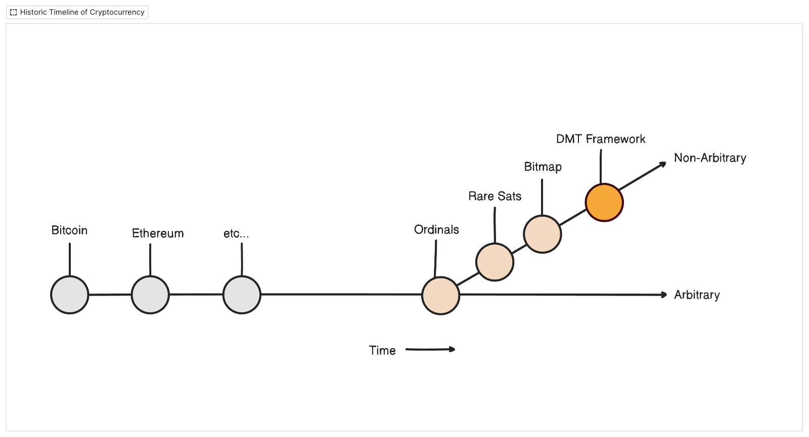

_两种代币发行模式中，NAT 代表代币发行模式的第一个分支，$NAT 成为其首个协议代币_

3. **$NAT 是区块伴生物的首个伴生代币**

就像现实世界挖掘金矿，总是有很多矿物质伴生一样，在挖掘 BTC 的同时，与比特币区块同步产生的数字物质，我们可以称之为区块伴生物，第一个区块伴生物是 Bitmap，是第一张区块伴生 NFT，它的发行根据区块数据增加，也是非任意资产的一种；$NAT 是区块伴生物的第一个代币，具备 FT（可互换同质化代币）的特性。Bitmap 与 NAT 的未来发展也会产生量子纠缠。

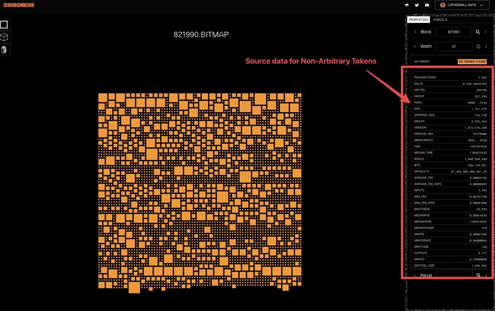

4. **$NAT 是 DMT 数字世界的通用代币**

DMT 数字物质理论正在拉开全新数字世界的序幕，就像在现实世界发现黄金并成为一般等价物的共识，数字物质世界也需要这样一个天然从区块中发现并成为一般等价物的代币，**并代表整个 DMT 协议、DMT 数字世界的价值**。

$NAT 随区块产生和增加 —— 每个区块、每个聪、每笔 UXTO 交易、每个 BRC20 创造的数字物质随 BITS 的产出被价值化 —— **NAT 可用于这个数字物质世界的通用货币，就像当今现实世界的美元，但它非主权发行，在区块里发现，并由社区共识达成，如同黄金白银作为一般等价物的共识过程**。

在数字世界发掘出的各类 DMT 数字物质的价值需要一个衡量与交换媒介，比特币作为以价值存储为主张的数字黄金，越来越不适用于通用支付，就像现实世界的黄金，法币以黄金作为储备，而 $NAT 在铭文铸造时同样储存了 546 聪，这样与 BTC 同随区块产出的 NAT 正好可以与 BTC 挂钩，替代比特币在相当多的场景中用于通用支付及流通。

[video](https://www.youtube.com/embed/7MppZ4juraU)

_数字物质理论（DMT）如何在 Bitmap 上生成 NAT_

## **$NAT 如何估值**

基于上述分析，可以从三个阶段来评估：

- **起步期：**

1. **估值方式一：**按平均铸造成本 $10 乘以 30-100 倍估算，约为 $300 - $1000；
2. **估值方式二：$**NAT ≈ SATS。SATS 成为铭文索引挖矿奖励，NAT 成为 DMT 数字世界通用代币，从实用性上都成为对应领域的核心代币。SATS 总计 2100 万张，现在每张 $75，市值 15 亿美金，NAT 才 80 万张，达到 10 亿美元时，相当于每张 $1250。
3. **估值方式三：$**NAT≈10 x Bitmap。Bitmap 位图作为土地 NFT，按 Decentraland 等多个元宇宙平台土地与平台代币的市值比例约为 1:10，所以 NAT 市值约是 Bitmap 的 10 倍，现在每个 Bitmap 为 0.005BTC，那 NAT 将价值 0.05BTC 一个，约 $2250。

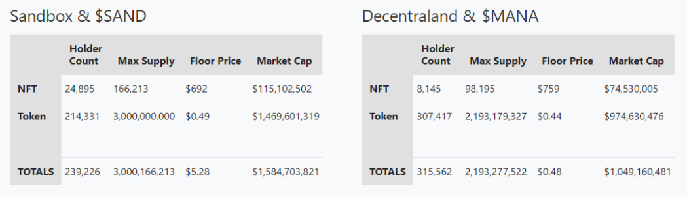

_数据来源：推特用户 @OrdinalNinja_

**发展期（本轮牛市）：**

- **发展期（本轮牛市）：**

1. **估值方式一：$** NAT 作为 DMT 协议首个代币，概念龙头，与其他如 BRC20 协议的首个代币 ORDI、FACET 首个代币 ETHS，这两个协议代币分别是大概一张价值 $70,000和$13,000 ，协议的首个代币目前都没有天花板。**$NAT 预计有机会达到一张 $10,000，约 100 亿美元市值，上不设限。
2. **估值方式二：** 比特生态 MEME 代币占 BTC 价值的 10%，以太坊生态的 SHIB 约占 ETH 市值的 5%。目前比特生态 MEME 代币刚处于发展期，ORDI 已经遥遥领先，约 $70,000 一张，** $NAT 也具备比特币 MEME 币龙头的潜力，按比特币价值的 5%，约有 500 亿市值，平均到每张约$50,000 起。**

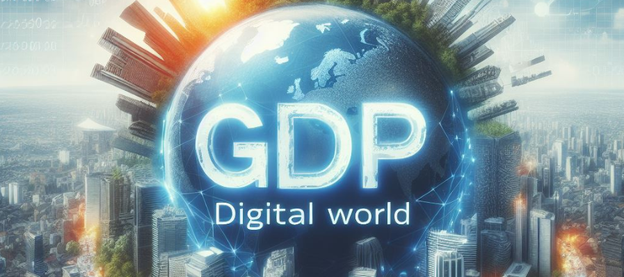

- **成熟期（未来几十年）：**

1. **估值猜想一：$**NAT ≈ Ordinals + Bitmap + 递归铭文 + BRC420 + BRC20 等所有数字物质的价值总和。现实世界有 GDP 国民生产总值，**$NAT 就相当于 DMT 数字世界生产总值或者说比特币链的数字物质生产总值**；
2. **估值猜想二：$**NAT 是否能大于比特币？根据世界黄金协会估计，已有约 209,000 吨黄金被开采出来，价值约合 13 万亿美元，而现实世界 2022 年全球 GDP 有 100 万亿美元，$NAT 作为类美元通用货币，是否也会超越比特币的价值，取决于未来数字世界的生产总值。2022 年美国 M2 总量 21 万亿美元，中国 M2 余额 33.5 万亿美元，世界各国发行的货币价值远超已开采黄金总价值（**注：本条仅为猜想及数据罗列，作者非经济专业人士，如有大神，可以设计一个数字世界的「GDP 统计模型及 M2 计算模型」**）。

[video](https://youtu.be/Dx_qf1196FQ?si=qmlc9XTyMC3311bW)

_数字物质理论发布，如何部署和生成 NAT_

## **$NAT 的建设前景**

- **建立以 $NAT 为结算代币的数字世界支付体系。**因为 DMT 本身就是整个数字世界，而支付体系又是这个数字世界最重要的金融工具。具体说就是搭建以 NAT 为结算代币的交易市场，以 NAT 为支付代币构建的工具市场、模型市场、皮肤市场、云渲染市场、Bitmap 交易市场，任何围绕 DMT 数字世界建立的生态项目均可使用这个交易支付系统，各市场建设方通过自己的服务收取 $NAT 的交易手续费。
- **搭建以 $NAT 为代币和以 Bitmap 为土地的生态体系。**DMT 是全新且巨大的数字世界，可以容纳所有加密数字原住民的梦想，而这个世界肯定不是某个或某几个项目方能够建成的，它需要社区的共识和社区共建，就像现在围绕比特币搭建的生态体系一样，任何人都可以基于 DMT 框架搭建基于 **NAT 为代币，Bitmap 为土地的元宇宙项目，且无须许可，只需社区认可，并收取$NAT 作为服务费用。同时因为土地和代币的通用性，这些生态项目又是互通的。**

[video](https://www.youtube.com/watch?v=oUJyRZbBhEY)

_你需要知道的关于 NAT 的知识_

## 答疑

**① $NAT 与 Bitmap 的区别是什么？**

$NAT 与 Bitmap 都是DMT数字物质理论发现的首批物质，是构成 DMT 非任意数字物质世界不可或缺的两大元素。其中 Bitmap 是这个非任意数字物质世界的土地，持有 Bitmap 就是持有这个数字世界土地的凭证，类似于现实世界的房产证，是 DMT 众多数字物质种类之一，并以 NFT 形式存在。NAT 是这个非任意数字物质世界的通用货币，是代币。如果非要类比解释，你可以把 Bitmap 理解为 Decentraland里的土地，$NAT 可以理解为 MANA。

**② DMT 数字世界与 Decentraland 等元宇宙有什么区别？**

- 在万链归一的大趋势下，我们梦想中的终极宇宙也即将拉开万宇归一的序幕，**DMT 数字世界是整个数字宇宙，会有 N 多个 Decentraland、Sandbox 在这个数字世界里，每个区块即是一个小宇宙。**
- Decentraland 等元宇宙是任意元宇宙，其土地供应、数字物质和 MANA 代币都是由项目方任意设置产生，这些数字物质本身不存在于 Decentraland 里，是空地，类似于产业园招商，需要将各种资源引入；
- DMT 数字世界是非任意的，构成这个世界的物质均来自于每个区块里创造的各类数字物质，DMT 数字世界所要做的只是把这些 3D 可视化呈现出来，**更直白的理解是，BTC 现在是 2D 化的，DMT 数字世界将整个比特币链、比特币生态 3D 化呈现出来，任何项目方内容需要首先写入比特币链，才能进入 DMT 数字世界。**

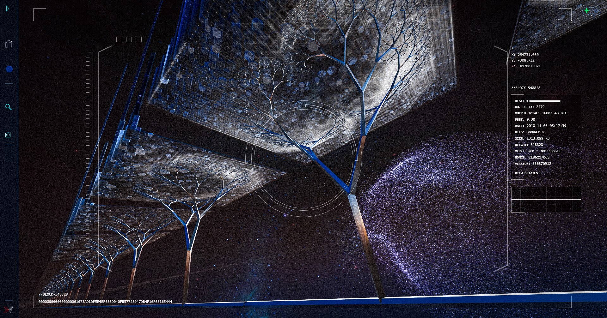

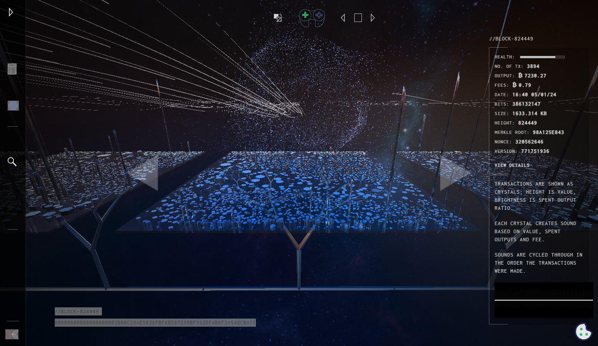

_区块 548829 的 3D 可视图：https://symphony.iohk.io/_

- Sandbox 等现有元宇宙的土地、平台代币均由项目方发行，发行权非公开免费铸造，而 DMT 数字世界的土地 Bitmap、代币 NAT 都是基于 Free Mint（免费铸造）的公平发射精神启动，**本质上土地 Bitmap、代币 $NAT 不属于任何项目方，但任何项目方又可以围绕这两个资产搭建生态项目，相互赋能。**
- Decentraland 最早于 2015 年诞生于比特币网络，因为拓展性问题 2017 年迁移到了以太坊，Decentraland 的去中心化大陆的思想诞生于比特币，适用于 DMT 数字世界，DMT 数字世界会将 Decentraland 的去中心化大陆的理念重新带回比特币。

**③ 关于 NAT 增发，$NAT 目前仅 80 多万张，非任意增发稀缺公平**

- 首先明确 NAT 的增发是随着区块的增加而增加，随着难度的提升而降低，其次过去 15 年，比特币区块也仅有 80 万多个，每年新增 5 万个区块，2024 年增长率约 6%，而且逐年降低（比如到 2050 年，增长率只有 2.2%，在 2114 年比特币挖完时，增长率降到 0.0076%，再引入销毁通缩机制，增长率更低），而 ETH 的增发是固定的，每年 5%，DOGE 也是每年增发 5%，对比发现 NAT 的增长更合理。往前推，NAT 在 2014 年的增长约为 10%，所以 **NAT 的增长率更符合一个现实世界国家从发展中国家高速增长到发达国家慢速增长的过程，更符合经济发展规律**。
- 每个区块里的 BITS 总量可以作为最小单位，就像 SATS 一张有一亿个一样，所以 **NAT 目前总量目前就是 80 多万张，持有地址约 1 万个，相当于每人持有 80 多张，相当稀缺**。NAT 随区块增加，也保证了后续参与者也有免费铸造的机会。最后矿工等也会参与到挖 NAT 的行列中，前期 NAT 作为比特币的区块伴生矿，在比特币挖完后，**$**NAT 可从伴生矿变为主矿，成为矿工挖取的主要资产。

**④ $SATS 或 $BPM 为何不能成为数字世界通用货币？**

- SATS 目前受到了社区广泛认可，比如 Unisat Wallet 把它作为铭文交易手续费和铭文索引挖矿的奖励。但是，目前 SATS 已经铸造完毕，无法根据未来数字世界价值增长而进行增发，其增长性受限。
- $BMP 目前总量 10 亿，只支持区块号在 817500 前的申领，同时规定最后申领日期为 2023 年 12 月 31 日，后续参与 DMT 数字物质世界的用户只能在二级市场购买，BMP 只根据是否持有 BITMAP 发放，对于 DMT 数字物质世界来说，BITMAP 只是资产之一，同时也无法根据未来数字世界价值增长而进行增发，其增长性也受限。

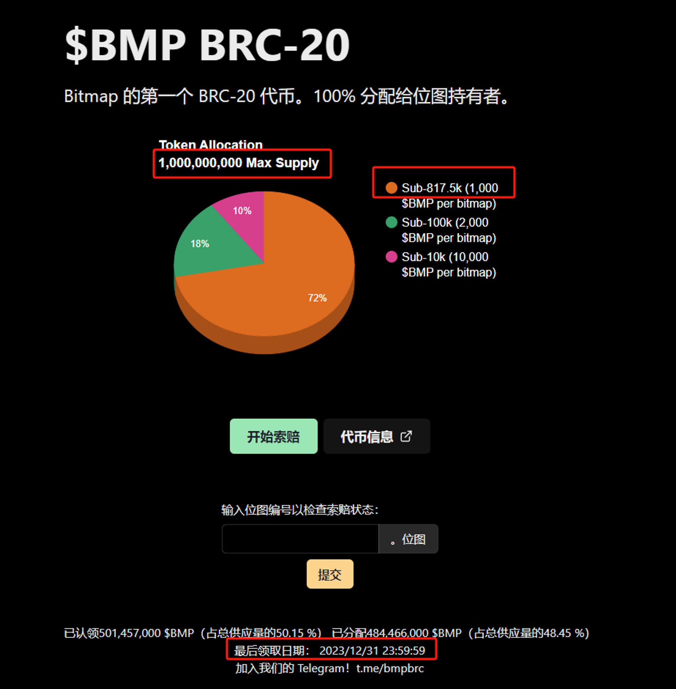

## 延伸信息

- DMT 白皮书：https://digital-matter-theory.gitbook.io/digital-matter-theory/introduction/digital-matter-theory
- NAT 持有数据分析：https://geniidata.com/user/ethan/tapdollarnatholder
- NAT 交易网站：
  - https://mscribe.io/ (专为 NAT 打造的第一个市场，未来 DMT 的数字物质很多会优先在此发布)
  - https://ordinalswallet.com/

**郑重声明：本文仅代表个人立场，部分观点集合了社区意见领袖的分析，不构成投资建议，DYOR！**
