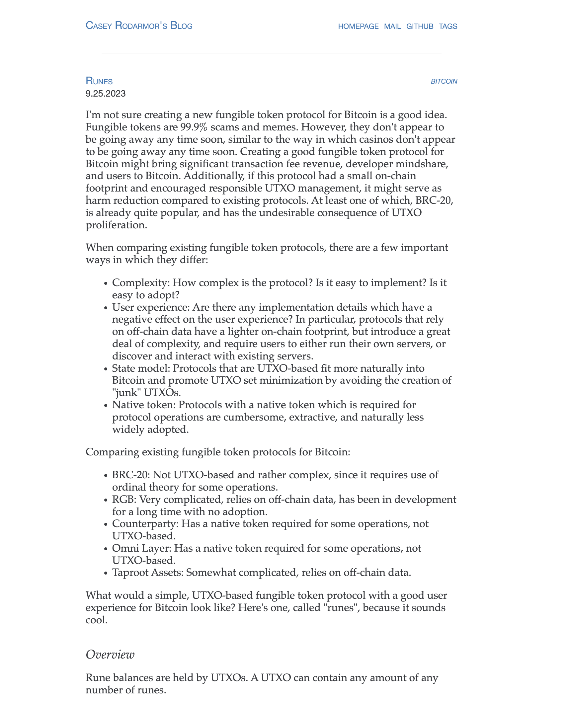
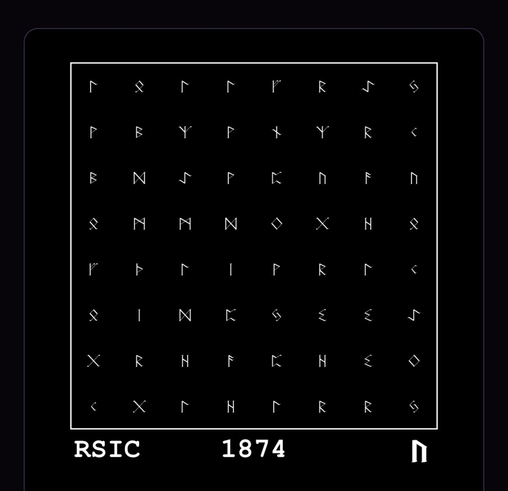
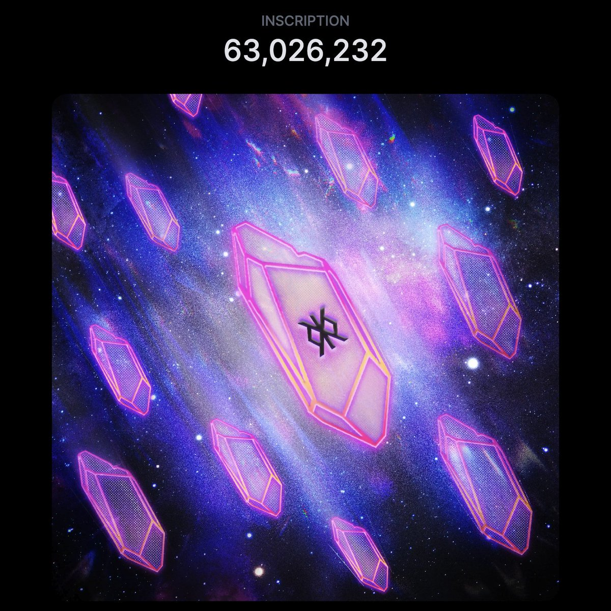
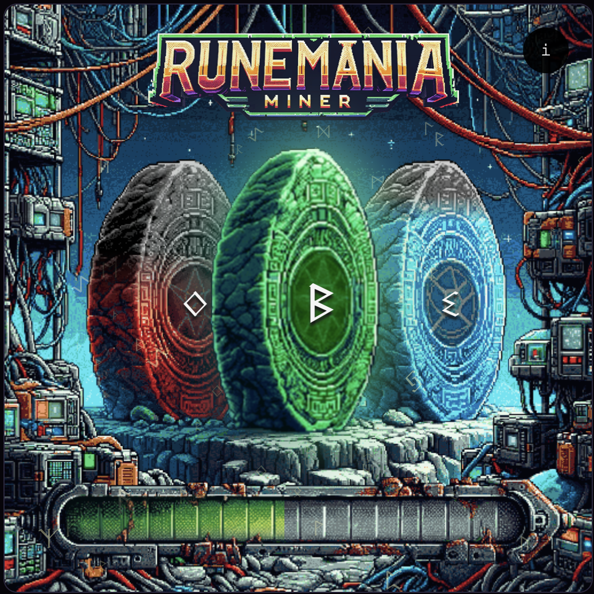
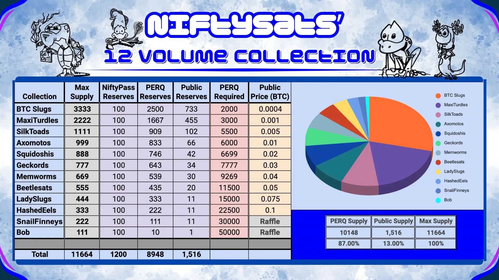

# Runestone 空投在即，意在替代 BRC20 的 Runes Protocol 孕育哪些 Alpha？| 比特原生叙事 ①

> 在过去的 2023 年，基于隔离见证、Taproot 升级这两项技术创新而诞生的 Ordinals 理论及协议，出乎意料地推动去中心化共识最强的比特币开始超越其「价值存储」的单一叙事，Ordinals Protocol、和以其为基础或受其启发的 BRC20、Runes Protocol、Atomical Protocol、DMT 数字物质理论、NAT 非任意代币、Bitmap 等理论、协议、代币标准、项目层出不穷，正在为数字化、智能化的未来构建去中心化价值网络的基石。
>
> 今日起，在前述先锋的探索实践的基础上，加密厨房正式开启「比特原生叙事」系列，和 Navigator Labs、BIT FM 等诸位同道一起推进比特币原生叙事研究，共同壮大比特原生叙事运动。

(runestone video)

3 月 9 日，一个 3.97MB 大小、迄今最大的 Ordinals 铭文 Runestone 以 8 个比特币（544,713 美元）的价格成功拍卖。其创建者、Ordinals 知名大 V Leonidas 表示，拍卖所有收益和之前通过推特在业内募捐的 2.25 个比特币一起，将用于支付 Runestone 空投计划的网络费用，一场史上最大规模的 Ordinals 空投即将开启，也让遍布全球的比特币社区对计划在比特币区块高度 840000 减半（即 2024 年 4 月下旬）上线主网的 Runes Protocol 充满热望。

# Runes Protocol 因何而生？

_https://casey.github.io/blog/runes/_

Runes Protocol 是 Ordinals Protocol 开发者 Casey Rodarmor 不满意 2023 年 3 月诞生的 BRC20 代币标准使用 Ordinals 协议创造大量「粉尘」UTXO，于去年 9 月 26 日提出了基于比特币 UTXO（未花费交易输出）模型的同质化代币（Fungible Token）协议，通过简单的元组（ID, OUTPUT, AMOUNT）和 OP_RETURN 操作来管理和转移 FT。

不同于 RGB Protocol 和 Taproot Assets Protocol 需要链下数据存储和检索基础设施，或是 BRC20 产生「粉尘」UTXO 占据比特币宝贵的区块空间的问题，Runes Protocol 设计简洁、无需额外的链下数据或者原生代币才能支持部分操作，优化了链上数据占用，提高了用户体验。

# Runes 项目抢跑，新创哪些玩法？

尽管 Runes Protocol 目前仍处于代码编程优化和版本迭代过程中，但去年 12 月 PIPE 协议、和 RuneAlpha 的 COOK 符文代币率先抢跑，而今年 1 月起，更多 Runes 项目如雨后春笋般诞生，和它们的创新玩法一起，吸引了市场越来越多的关注和资金，在比特币生态的热度位居前列。

## ① RSIC

RSIC 为 Rune Specific Inscription Circuits 缩写，一个 Ordinals 上的 NFT，总量 21,000 枚，10% 由项目方保留，90% 的 RSIC 由项目方自掏腰包空投给了持有者，花费超过 3 个比特币，其格局为社区盛赞。具体空投规则和标准并没有公布，推测主要是根据钱包持有的蓝筹 NFT 而来的。由于是空投，一些钱包并不知道自己拿到了 NFT，所以需要进行一次转移（买卖 / 转给自己都行）才算激活。激活后就开始进行「挖矿」，挖的是未来项目方在 Runes 部署的某个代币的份额。据说 RSIC 项目方和 NodeMonke 节点猴是同一位创始人，早期和 Casey 一起编写 Ordinals 协议的同事，所以得到 Ordiscan 浏览器的快速支持。

### 规则玩法：

#### 涉及元素：

- #126 （曾祖父铭文）：写着 deploying more inscriptions 的铭文（https://ordiscan.com/inscription/126 ），疑似由 Bitcoin Rocks 持有。
- RSIC 工厂（祖父铭文）：用于生产 RSIC 分发中心，当前已被打入中本聪地址（相当于项目方已经销毁该铭文，无法再用它继续生产其子铭文了），祖父铭文还用到了 Metaprotocol 元协议。
- RSIC 分发中心：一共 10 个，用于生产 RSIC，也都已打入中本聪地址。
  RSIC: Rune Specific Inscription Circuits（符文专用铭刻电路），总量 21000 个（其中项目方预留 10%）
- Rune: 项目方提到的将来会分配给持有者（即挖到的）符文代币，目前尚未定名（以下暂称 RS 代币），将于 Runes 主网上线后部署并分配。

#### 有趣设计：

- 持有已激活的 RSIC, 每个区块至少会获得 21 个 RS 代币，持有时间越长分到的代币份额越多，即使卖掉，持有期间的配额还是会记在你钱包上。
- 每个 RSIC 铭文右下角有个符号，对应不同的数字和字母，当某个区块的区块哈希值最后一位和持有的 RSIC 符号一致时，这个区块中可获得 336 个 RS 代币，而且此时右下角符号会高亮，变成黄色。
- 每个 RSIC 铭文都引用了同一个 Javascript 铭文，这个铭文会抓取最新区块的区块哈希，分析最后一位是否和 RSIC 右下角的符号一致，当一致时更改样式（变黄）。BRC333 的小猫头鹰铭文里也用到了类似的设定，递归到 javascript 铭文来实现铭文随时间变化。
- 项目方将上线看板，供查询 RS 代币配额，不用一直盯着铭文看它会不会变色。
- 一个彩蛋：白皮书里提到的 boost 逻辑，其规则将会刻在 4703400000000 这颗聪上。

#### 总结：

- 项目方精通技术，发行过程用到了父子铭文、Metaprotocol 字段、递归铭文、Javascript 铭文调用区块数据、Rune 协议的部署和分发。
- 玩法精心设计，比如空投给高价值的 NFT 持有者、用激活操作过滤沉睡钱包、加入随机设定增加关注度和话题性、在 Rune 协议上线前 3 个月发布控制节奏等。
- 不过，RSIC 也存在有很多中心化，可能将来被 FUD 的地方：空投规则、将来的代币部署、项目方预留的 10% 等等。
- 这可能是 Runes 协议未来固定总量的项目发代币再空投的玩法里，相对不那么去中心化的一种解决方案，容易被社区接受。

### 链接：

- 官网：https://runecoin.io
- 官推：@rune_coin
- 合集：https://magiceden.io/ordinals/marketplace/rsic
- 挖矿查询：http://ordiscan.com 输入钱包地址后，在 Runes 一栏中查询

## ② RSIC Boost

(boost video)

RSIC Boost 是上述 RSIC 预埋的一个彩蛋：加速工具，总量 3900 个。这一次不是空投，而是需要持有 RSIC 的钱包去铸造（需要花 170 美元以上的网络费用），即可加速 RSIC 的挖矿速度。这一举措进一步筛选出了链上活跃钱包，增加了市场博弈玩法，再次证明项目方很会搞事。

### 链接：

- 合集：https://magiceden.io/ordinals/marketplace/rsic-boost

## ③Runestone

Runestone 是继 RSIC 之后最受关注的空投项目，由 Ordinal 浏览器 Ord.io 创始人 Leonidas 主导。在过去一个多月时间里，为支付空投 gas 开销，Leonidas 一直通过推特向行业募集资金（每人捐赠 0.15 BTC × 15 人 = 2.25 BTC），目前已经募集完成，其中 RSIC 提供了 0.15 BTC 的捐赠。

Ruestone 总量为 112,383，其空投规则也相对透明，即在 826,600 区块高度时，钱包里需要持有 3 个铭文，但排除掉以 text/plain 或 application/json 开头的铭文（例如 BRC20 铭文）。目前 Runestone 公布的白名单钱包地址数达到 113,376 个。3 月 3 日消息，父铭文已经铭刻完毕；3 月 9 日，Runestone 拍卖创下 8 个比特币的记录，，规模盛前空投即将开始。

### 链接：

- 白名单查询:
  - https://runestone.lfg.cash
  - https://www.okx.com/cn/web3/toolkit/btc-airdrop
- 合集: 暂无
- 挖矿查询: 暂无

## ④Rune Mania Miner

果然，很快就有项目方给 RSIC Boost 持有者（同时也持有 RSIC）发空投，即 Rune Mania Miner（以下简称 RMM）。总量 3,800 张，团队预留 253 张，3,547 张空投给社区。跟 RSIC 一样，也需要转移一次（转给自己也行）激活挖矿，挖矿规则较为复杂。

### 规则玩法：

每个 RMM 有个 1 的初始系数，基础挖矿数量是每个区块 10,000 个符文代币。有一系列的加速算法，能增加挖矿速度系数，从而提升每个区块的挖矿数量：

1. Mining Boost (以下用 MB 代替），在铭文底部的绿色进度条，由铭文 ID 的前两个数字决定（如果有字母就跳过，一直到找到数字为止，取找到的前 2 个数字），最小的 MB 是 15，所以范围是 15-99%，公式：MB/400 = 系数加成，例如数字是 40，那么 40/400=0.1，挖矿速度系数为 1+0.1=1.1
2. Mana Boost 展示在铭文左侧的红色石头上，由铭文的最后 2 个数字决定，最小的 Mana 是 10%，因此范围是 10%-99%。只有在单地址下所有 RMM 的 Mana 值加起来超过 100% 时，Mana 的加成才会生效。假设你有一个 40% Mana 的 RMM, 可以再买几张，把 Mana 值叠加到 100% 以上，此时可以获得 0.2 的系数加成（该地址下所有的 RMM 都享受此加成）。
3. Block Boost，展示在铭文右侧的蓝色石头上，由铭文最后两个字母和当前区块高度决定。

- 静态加成：由铭文 ID 里的前两个字母决定（A=1, B=2……F=6) ，例如 ae 就是 15%，因此范围是 11%-66%。
- 动态加成：由当前的区块高度决定，每 100 个区块增长 1%。最大值 89%（在减半区块达到这个值）。
- （静态加成+动态加成）/400 = Block boost 这一项的系数加成。

以上 3 个参数之外，还有 4. Stone Boost 和 5. Runes Boost 的玩法尚未披露。Stone 是中间那个石头，Rune boost 由中间那个石头上的符文符号决定，从白皮书来看，暗示持有 2 个同符文符号或者持有 3 个同符文符号，有各自的加成。最后每个区块挖矿的数量 =10000\*（基础系数 1 + 所有的加成系数）。

在 Magic Eden 上打开任意一个 RMM, 右下角的 Attributes 里可以查看上述介绍的参数。

### 链接：

- 官推：@RuneManiaMiner
- 官网：https://runemania.com/
- 文档：https://rune-mania.gitbook.io/rmm/
- 合集：https://magiceden.io/ordinals/marketplace/rmm
- 挖矿速度系数查询器：https://www.ord.io/61927031

## ⑤ The Rune Guardians

(rune guardians video)

The Rune Guardians 玩法跟 RSIC 类似，对 Ordinals 蓝筹 NFT 持有者进行空投，项目方承担所有 gas 成本。

### 规则玩法：

The Rune Guardians 总量 1 万，分 100 个 Guardian（监护者），200 个 Sentinel（哨兵），9700 个 Keeper（守护者）。获得空投的持有者可参与瓜分总数 1000 亿的符文，在 Magic Eden
连钱包点击持有的不同等级的 The Rune Guardians 的图像，即可显示符文挖矿余额。

### 链接：

- 官推: @RuneGuardians
- 官网: http://theruneguardians.com
- 合集: https://magiceden.io/ordinals/marketplace/trg
- 挖矿查询: 暂无

## ⑥ BTC Slugs

BTC Slugs（比特币海蛞蝓）是 NiftySats 构建的手绘卡通比特币文物生物圈的第一个 NFT 子集，共有 3333 个海蛞蝓，向在头 48 小时铸造 RISC Boost 的持有者提供白名单，后剩余 2201 个以 0.0004 BTC（20 美元）价格铸造公售。

### 规则玩法：

- NiftySats 构建的比特币生物圈由头足类动物、节肢动物、两栖动物和爬行动物组成，总共有 11164 个手绘卡通 Ordinals，分 12 卷，从 BTC Slugs 开始按顺序铸造，第 1 卷 BTC Slug 总共 3333 个，随后每卷供应量都在减少。
- BTC Slugs 拥有超过 240 个独特特征，包括触角、体型、屁股羽毛、嘴巴等。它们的配件也不常见；与常见的连帽衫、烟斗和帽子不同，BTC Slugs 的装备包括独角兽漂浮物、拳击手套和 GoPro 呼吸管面罩，一些圣杯的触角上摇动着激光、红宝石和钻石。这些 BTC Slugs 稀有特性决定持有者的符文奖励。
- 符文奖励
  - 第 1 阶段：所有 BTC Slug 铸造完成并物归其主后，项目方将进行快照。届时，任何在单个钱包中持有 3 个海蛞蝓或更多的人都将收到 1000 个 BRC20 代币 $PERQ 空投。
  - 第 2 阶段：Runes Protocol 正式上线后，项目方将蚀刻自己的符文，并根据上面的稀有度图表将供应分配给持有者。NiftySats 的符文符号以与 RSIC 相同的稀有度顺序与海蛞蝓特征配对。由于是 RSIC Boost 持有者获得首批 BTC Slug，因此其符文符号顺序与 RSIC 的符文符号顺序保持切分才有意义。如果你的一只海蛞蝓具有不止一种合格特征，将获得较高的奖励分配，而较低的奖励分配将进入公共池，平均分配给所有持有 1 个或多个海蛞蝓的钱包。
- BRC20 代币 $PERQ 奖励
  - 项目方还将在比特币区块 840000 减半时进行第二次 PERQ 快照，并将每个 PERQ 分配 10 个符文给持有者。PERQ 的总供应量为 500 万，意味着空投最多有 5000 万符文（10 符文 x 500 万 perq），这相当于符文 2.1 亿供应总量的 23.8%。
  - 然而，BTC Slugs 总量为 3333 个，这意味着在任何给定时间最多有 1111 个钱包可以持有 3 个 Slugs，而在考虑到分发和整合后，最终数量可能会低于该标准。
  - 这意味着在 200 万可用储备中，最多为此次空投预留了 110 万个 $PERQ (1000 x 1111)。剩余的约 100 万储备加上任何未偿供应，将保存在该团队钱包中。
  - 100 万以上 PERQ 的预期基准，以及将保留的相关 1000 万以上的符文，以及来自任一资产的任何未分配的供应，将用于未来的市场和社区建设；项目方绝不会出售或交易任何一种资产。
- 项目方设计的 OG NiftyPass 和 $PERQ 在所有 12 卷 NFT 系列里获取白名单的数量和资格不同，详见下图。

### 链接：

- 官推: @niftysats
- 官网: https://www.niftysats.com/
- 文档：https://niftysats.gitbook.io/niftysats/
- 合集: https://magiceden.io/ordinals/marketplace/btc_slugs

# Runes 有哪些 Alpha 端倪可窥？

随着 Runes Protocol 上线主网的日期临近，有更多的 Runes 项目正在路上，就以上项目介绍可见：

- Runes Protocol 是 Ordinals 协议创始人为取代 BRC20 推出的 FT 协议，具有正统性，更加为的西方用户、海外社区所接受。
- 从设计和生态方面来看，Runes Protocol 并不平行于、而是从属于 Ordinals Protocol，以 FT 形式与 NFT 形式的铭文相互组合，其资产发行互为支撑，协议设计和生态社区具有目前市场热议的「图币互换」、「图币两象性」的特性。由于与比特币 NFT 有机结合，目前 Runes 生态能够吸引更多艺术家、有影响力的 NFT 项目和社区参与建设，正在衍生更多创新玩法。
- Runes Protocol 设计支持两种发行方式：
  - 固定总量（项目方直接铭刻所有代币后分发），是倾向于中心化的发行方式，目前 RSIC 可能成为这一玩法的龙头；
  - 公开铭刻（部署代币设定参数后 fair mint），类似 BRC20，最大区别是 BRC20 限制总量，而 Runes 限定区块高度或时间戳，但不限制总量，有效时间内打了多少，最后该代币总量就是多少。
- 上述在 Runes 4 月底正式上线主网前的抢跑项目均以空投矿机挖符文代币方式和创新的 GameFi 玩法进行项目冷启动、抢占 Runes 用户心智和市场份额。

ppqq 上述为「比特原生叙事」系列第一篇，接下来我们将陆续介绍更多基于比特币一层的原生理论、协议、标准和项目，敬请关注！

**关注 X 账号**

- 加密厨房：x.com/CryptoKitchen23
- BIT FM：x.com/bitfm2024
- 领航猿实验室：x.com/NavigatorLabs

「比特原生叙事」第一场 X Space「寻找 Runes Alpha 机会」定于 3 月 12 日北京时间晚 9 点举行，欢迎扫码关注收听！

### 欢迎加入电报群讨论交流

_https://t.me/bitfm2024_

**鸣谢：** 0xSea @_0xSea_ 和比特里里 @lilyanna_btc 的分享对本文内容的贡献
