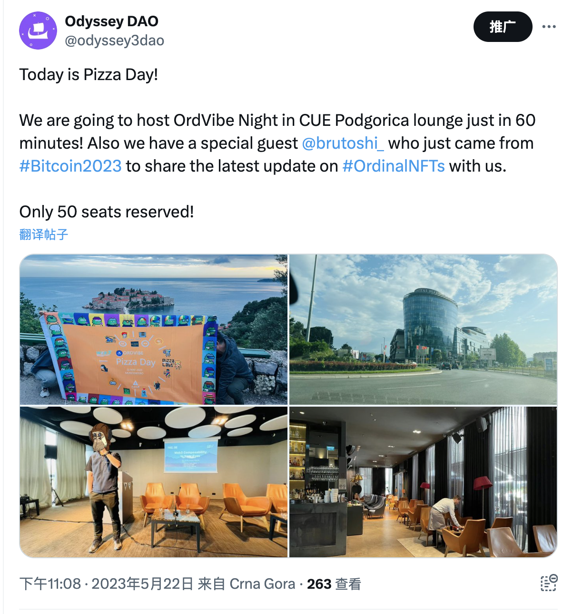

# 数字物质理论是什么？NAT/$NAT 分不清？DMT 十问帮你捋明白 | 比特原生叙事 ②

> 在过去的 2023 年，基于隔离见证、Taproot 升级这两项技术创新而诞生的 Ordinals 理论及协议，出乎意料地推动去中心化共识最强的比特币开始超越其「价值存储」的单一叙事，Ordinals Protocol、和以其为基础或受其启发的 BRC20、Runes Protocol、Atomical Protocol、DMT 数字物质理论、NAT 非任意代币、Bitmap 等理论、协议、代币标准、项目层出不穷，正在为数字化、智能化的未来构建去中心化价值网络的基石。3 月 11 日比特币破 7 万美元创下历史新高之日起，加密厨房在前述先锋的探索实践的基础上正式开启「比特原生叙事」系列，和 Navigator Labs、BIT FM 等诸位同道一起推进比特币原生叙事研究，共同壮大比特原生叙事运动。

**作者：** Rebbeca、Navigator

「数字物质理论」正在越来越多的运用到比特币生态的数字资产发行中，一个以「非任意价值」为基础的数字世界正在快速的建造中....

在往期文章《关于 $NAT 与数字物质理论 ：从「万链归一」到「万宇归一」……》中，我们深入探讨了数字物质理论，但因为缺乏参照和实例，一些概念对新手而言可能较为复杂、难以理解。因此，我们将数字物质理论中频繁涉及的概念提取出来，以问答和举例说明的形式呈现，帮助大家更好地理解和参与。

# 1. 什么是「数字物质理论（Digital Matter Theory，简称 DMT）」？

DMT 最初由一些物理学家提出，他们认为数字信息可以被视为一种类似于实体物质（如木材或金属）的数字物质，预测未来数字信息的使用量有可能会超过原子。

就像现实世界由元素构成，元素周期表为寻找现实世界新元素提供了理论依据，科学家利用元素周期表在一定区域内寻找新物质（如半导体材料、催化剂等），服务于现实世界建设。

随后，这一理论在区块链技术社区开始受到关注，并开始运用到比特币生态的数字资产的发行中。

以 DMT 为框架的数字资产，试图摆脱为数字代币分配任意价值（Arbitrary Value）的局面。例如，NFT（Non-Fungible Token）的价值通常是主观的，并没有基于任何明确或客观因素，因此它是任意被分配价值。与此相比截然不同的是，DMT 数字资产重点关注从比特币区块本身的数据中得出的非任意价值（Non-Arbitrary Value）。例如，不同的区块拥有不同的属性和数据，这也就决定了 NAT（Non-Arbitrary Token）的价值。

# 2. 什么是「非任意代币（Non-Arbitrary Token，简称 NAT）」？

如上所述，NAT 是一种基于 DMT 框架发行的新型代币协议，源自对比特币区块数据模式的识别。其代币供应量也与比特币区块链的数据绑定，这与可以任意设置供应的其他代币不同。

非任意代币更像采矿业，从区块已有元素里挖掘，而非创造者主观设定。$NAT 即是非任意代币发行协议的首个代币，公开了挖掘区块元素的协议标准。

# 3. 非任意代币与任意代币的区别是什么？

区块链的发展史就是代币发行方式的演化史，自比特币诞生 15 年来，加密领域围绕代币发行方式历经了开发新链、部署智能合约、创建发行协议标准获得铸币权等任意代币模式，由新链开发者、智能合约部署者以及协议发行方设定代币数量及解锁方式，这类代币发行方式可以统一定义为任意代币，由人控制。

非任意代币 NAT 是 15 年来代币发行方式的第一次变革与分支，基于 DMT 数字物质理论，通过索引区块原生数据获得铸币权，完美利用区块即账本的优势，将代币的发行数量及解锁机制交由区块账本这个最具共识的模式负责。

# 4. 从 DMT 里能挖掘哪些非任意资产？

将 DMT 理论具象为 BTC 区块元素表，比特币链目前已有 38 个元素，仿照化学元素周期表进行了分类整理，并结合目前已落地的基于区块元素表的各类非任意资产，向大家展示了利用区块元素表的方式。比如 $NAT 和 NATCATS 都利用了 11 号元素 bits，但在解析方式上 $NAT 直接对应 Bits 数值，NATCATS 取用 bits 字段的 “3b” 模式，下面我们将以 $NAT 和 NATCATS 详细介绍。

# 5. 什么是$NAT?

$NAT 是基于非任意代币（NAT）发行协议的首个同质化代币。你所拥有的 $NAT 的数量就取决于一个区块的 bits 的数值，一个区块有多少个 bits，就有多少个 $NAT，所以 $NAT 无法被篡改。

如上图所示，当你在区块 817,824 上铭刻了部署 $NAT 的代码，根据这个区块的 bits 信息，那么你就拥有 386,161,170 个 $NAT。

现在 $NAT 的市值达到了 4000 多万美元，但它还处于相对早期的发展阶段。$NAT 是 DMT 数字物质理论 + 非任意代币发行模式 + 区块伴生物的首个协议代币，将会是 DMT 数字物质理论建设的数字世界的通用代币。

据推算，在本轮牛市，$NAT 作为 DMT 协议首个代币和概念龙头，其市值有望达到 100 亿至 500 亿美元之间，这意味着至少还有超过 200 多倍上涨空间。

未来在 DMT 数字世界里可以建立以$NAT 为结算代币的支付体系。任何围绕 DMT 数字世界建立的生态项目均可使用这个交易支付系统，各市场建设方通过自己的服务收取 $NAT 的交易手续费。

值得注意的是，在已有的区块上，$NAT 已经被铭刻完，在新出的区块上你必须和机器人比速度，才能抢到尚未被铭刻的 $NAT 的区块进行铭文部署。

# 6. 什么是 NATCATS？

NATCATS 是基于 DMT 框架的首个 NFT 资产，开创了 NFT2.0 时代，因为其稀缺性、非任意性而受到追捧。每个 NATCAT 都有独特的特征，并且是通过比特币区块链自主生成。

_供图：@OridnalsMusashi_

NATCATS 的供应量是根据比特币区块数据的十六进制位字段中 “3b” 的出现情况来确定的， 这意味着 NATCAT 仅存在于包含模式 "3b" 的区块中（见下图）。

因此，在铸造之前，你需要检查选中的区块是否在 Bits Field Value 部分包含 “3b”，否则你将无法铸造 NATCAT。下图为一个区块编号为 829999 的稀有 NATCAT 以 1.3 BTC 的价格被售出，因为 4 个连接在一起的 9 触发了稀有特征，即一条外星鱼。

据 TheBlockRunner 介绍，DMT 框架的代币有两种：1. Tokens with patterns （有模式要求）； 2. Tokens without patterns（无模式要求）。

NATCAT 就属于需要满足特定模式的代币，只能在特定的区块上铸造，而 NAT 没有模式要求，可以在任意区块上铸造。

在 2 月项目刚上线时，一个 NATCAT 的铸造成本不过 3 美元，而现在二级市场上，一个 NATCAT 的地板价是 0.06 BTC，涨了 1400 倍。

NATCATS 的创建是为了探索通过数字物质理论进行自主创造的可能性，其核心信念是数字宇宙需要有独立于人类控制而存在的自主动态，类似于现实世界中的天气、潮汐、行星轨道那样，这些动态可以使用 Digital Matter 在区块链上创建。

# 7. 如何理解 NATS 的非任意增发机制？

NATS 中的所有非任意资产的发行量都会随着区块或模式的出现而增发，这一天然增发模式改变了现有众多代币人为设置增发机制和解锁机制的任意模式，非常符合 比特币生态的去中心化、免信任方式，非任意增发保证了后续用户有机会仅使用 GAS 去获取这一资产。

以 $NAT 代币为例，据 @GloryYeh 的分析：

$NAT 总量 = 所有区块上的比特数之和，当前约为 344 万亿（约 83.5 万个区块 x 每个区块比特数均值 4 亿）

由于比特币链上的区块每 10 分钟出 1 个块，每年约新增 5.2 万个区块，但区块上的比特 bits 在不断缩减，如下图所示，每 10 万个区块大约缩减 2.81%（预计每年约缩减 1.4%）

综上两点，$NAT 存在一定的增发，但由于每年新增区块数大致稳定且 bits 会逐年缩小，故增发比例会逐年减少，从 2024 年的增发 4.8% 到 2028 年 3.5%，这比 ETH 和 DOGE 的每年 5% 固定增发比例更合理，往前推，NAT 在 2014 年的增发约为 10%，所以 $NAT 的增长率更符合一个现实世界国家从发展中国家高速增长到发达国家慢速增长的过程，更符合经济发展规律。

按这个增发比例推算，预计到 2047 年，$NAT 的总量才与 $SHIB 的总量持平：

以 NATCATS 为例：

NATCATS 是基于拥有 “3b” 模式的区块产生，@BitoOrdileone 用示意图将比特币过去 15 年来 4 次出现这一模式的时间间隔和数量展示出来，最短的间隔周期是 440 天（1 年多），最长的间隔周期 3243 天（近 10 年），每次模式出现固定增加 2016 个，哪怕下次出现在 1 年后，NATCATS 的总量也只增加 2016 个，刚刚达到约 10K 的数量，并且随区块一个一个产生，每个用户都有机会仅使用 GAS 去抢夺这一资产，保证了后续用户的公平参与。

# 8. 为什么说 DMT 和 NAT 是矿工生态？

DMT 理论和 NAT 协议发行的资产取自于区块数据这一天然模式，与矿工挖掘每个区块获得比特币和交易手续费奖励天然契合，在 2024 年 4 月下旬挖矿奖励减半后，矿工生态急需新矿被发现及挖掘，DMT 和 NAT 正好应运而生，@mythbtc 正在制作的 https://NATpool.space/ 即将上线，将每个区块里产生的 NATS（$DMT-NAT 与 $DMT-BIT）和 UNATS（Bitmap 和 NATCATS）展示出来，并结合当时资产价格计算出矿工挖掘非任意资产的收益，目前已有矿工在挖掘相关资产。

_来源：@cbspears：BREAKING@ocean_mining MINES A BITMAP_

# 9. 如何获得 NATS 非任意资产？

提出 DMT 数字物质理论的团队正在搭建 DMT 和 NATS 的官方网站：https://mscribe.io/，你可以在官网铸造新资产或进行二级交易，那里将是发现 DMT 和 NATS 的首选。

目前 Magiceden、OrdinalsWallet 和 OKX 是进行 DMT 和 NATS 二级交易最活跃的 3 个网站。

# 10. 有哪些 DMT 生态项目值得关注？

DMT 理论和 NAT 协议目前仅诞生 5 个月，但其发展十分迅速，目前仅围绕 11 号元素 BITS，已诞生 318 种非任意资产，其中 FT 和 NFT 占比约 3:7，NFT 类资产以其总量少加之 NATCATS 的出圈，带来了 DMT 生态的大繁荣。

如果你也想参与 DMT 生态，可以通过 https://mscribe.io/NATs 获得当前 NATS 资产的排名清单，这将方便你从排名和持有者数量上进行筛选，当然你需要同时通过 X 了解相关资产信息，二级交易市场的交易量也是重要的判断指标，以以便做更好的选择。

ppqq 上述为「比特原生叙事」系列第二篇，接下来我们将陆续介绍更多基于比特币一层的原生理论、协议、标准和项目，敬请关注！

**关注 X 账号**

- 加密厨房：x.com/CryptoKitchen23
- BIT FM：x.com/bitfm2024
- 领航猿实验室：x.com/NavigatorLabs

「比特原生叙事」第二场 X Space「答问DMT、NAT、NATCAT」定于明天 3 月 13 日北京时间晚 9 点举行，欢迎扫码关注收听！

### 欢迎加入电报群讨论交流

_https://t.me/bitfm2024_

