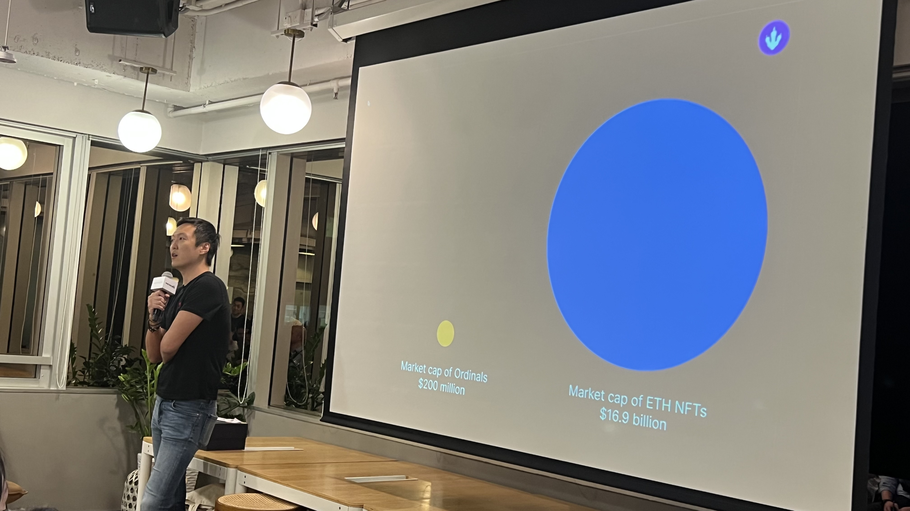
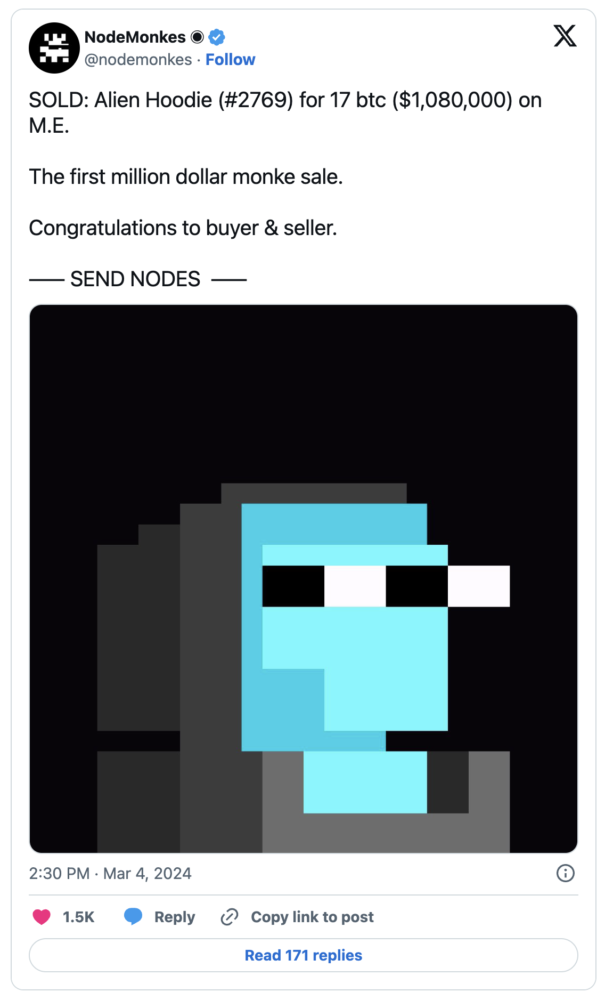
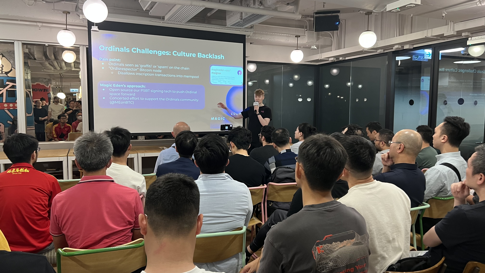

# 比特币 Ordinals 能否超越以太坊 NFT？ | 比特原生叙事 ③

> 在过去的 2023 年，基于隔离见证、Taproot 升级这两项技术创新而诞生的 Ordinals 理论及协议，出乎意料地推动去中心化共识最强的比特币开始超越其「价值存储」的单一叙事，Ordinals Protocol、和以其为基础或受其启发的 BRC20、Runes Protocol、Atomical Protocol、DMT 数字物质理论、NAT 非任意代币、Bitmap 等理论、协议、代币标准、项目层出不穷，正在为数字化、智能化的未来构建去中心化价值网络的基石。

> 3 月 11 日比特币破 7 万美元创下历史新高之日起，加密厨房在前述先锋的探索实践的基础上正式开启「比特原生叙事」系列，和 Navigator Labs、BIT FM 等诸位同道一起推进比特币原生叙事研究，共同壮大比特原生叙事运动。
>
> 「比特原生叙事」系列第三篇：Ordinals —— 一篇来自以太坊 NFT、比特币 Ordinals 亲历者的观察和感想。

**作者：** Jean

比特币 Ordinals 能否超越以太坊 NFT？

去年 4 月 14 日在香港参加由 Mempool 主办的 OrdCon 拍下这张演讲胶片时，我还不敢想上述这个问题。

11 个月之前，以太坊 NFT 当时总市值 169 亿美元，Ordinals 的是 2 亿美元，前者是后者是 84.5 倍。而据 CryptoSlam 报告，上月最后一周以太坊 NFT 和比特币 Ordinals 的总销售量几乎持平，分别为 1.774 亿美元和 1.764 亿美元 —— 虽然比特币 Ordinals 的销量统计包括了 BRC20 代币，这两者数据并不完全可比。

尽管以太坊在过去一年价格翻番，前天 11 日突破 4000 美元，但近一周，以太坊蓝筹 NFT 地板价普跌，BAYC 7 日跌幅 19%，DeGods 地板价 7 日跌幅超 40%； Pudgy Penguins、LilPudgys 、Azuki 也出现了 10%-20% 的 7 日跌幅。这样的行情已经持续了一个多月，蓝筹 NFT 地板价均出现了超 30% 的跌幅：Pudgy Penguins、BAYC 地板价均从 20 ETH 之上跌至 13 ETH 上下。

反观 Ordinals 比特币 NFT 生态，则一片兴旺繁荣。仅以 NodeMonkes 为例，3 月 4 日编号为 2769 的 NodeMonkes 在 Magic Eden 市场以 17 比特币（108 万美元）出售，成为项目发射以来金额最大，也是 Ordinals 有史以来第二高的销售。当天，也只有以太坊一枚价值 1600 万美元的 CryptoPunk 成交超过了 NodeMonkes，而后者在一天内实现了约 1170 万美元的销售额。在 2 月最后一周，NodeMonkes 成为最畅销的 Ordinals 项目，二级市场销售额达 4500 万美元。从去年 12 月 NodeMonkes 荷兰拍 0.03 BTC（约 1325 美元）到最高 0.82 BTC（约 54400 美元）地板价，27 倍涨幅也就发生在两个多月的时间内。Bitcoin Puppets、Natcats、Ordinal Maxi Biz、Bitcoin Frogs 也创下了亮眼的记录。

在 11 个月前的 OrdCon 上，主办方还请来了 Magic Eden 的市场负责人演讲介绍他们进军比特币、支持 Ordinals 交易的策略。当时我对在这家 Solana 生态最大 NFT 市场努力从 FTX 交易所破产风暴顽强求生、努力抓住 Ordinals 机遇的决心表示钦佩，也没想到如今 Magic Eden 正在重塑 NFT 市场格局：过去七天以 1.84 亿美元的交易量成为市场第一，占整体 NFT 交易的 33.35%。仅支持以太坊的 Blur 位居第二，以 1.78 亿美元的交易量占据约 32.26% 市场份额，而当年的霸主 Opensea 则已 5512 万美元 9.97%市场份额位居第三。Magic Eden 的 43% 交易量来自于 Ordinals（Tiexo 数据）。

过去一年，「加密厨房」（原「元宇宙特攻队」）一直关注传播比特币 Ordinals 生态的发展，也参与支持主办了 Ordinals 生态的活动，作为亲历者，也难以想象，Ordinals 这一赶超甚至翻转，竟然在这么短的时间内发生，到底背后的逻辑和动力是什么？怎样寻找或者参与建设 Ordinal 项目？

明天 3 月 14 日北京时间晚 9 点，「比特原生叙事」第三场 X Space 将邀请华语区早期参与 Ordinals 生态的 OG 一起来探讨「比特币 Ordinals 能否超越以太坊 NFT？」

欢迎扫码关注收听！

**关注 X 账号**

- BIT FM：x.com/bitfm2024
- 加密厨房：x.com/CryptoKitchen23
- 领航猿实验室：x.com/NavigatorLabs

### 欢迎加入电报群讨论交流

_https://t.me/bitfm2024_
