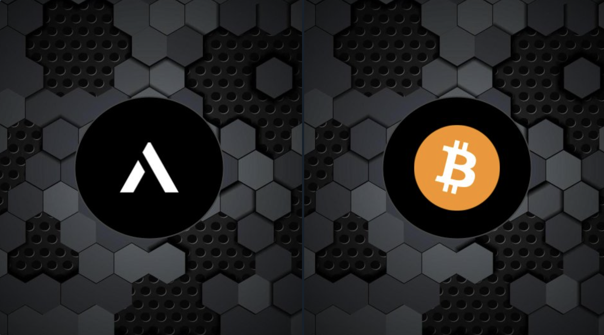
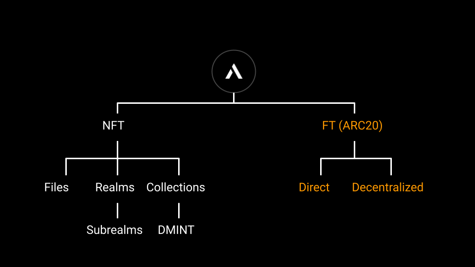
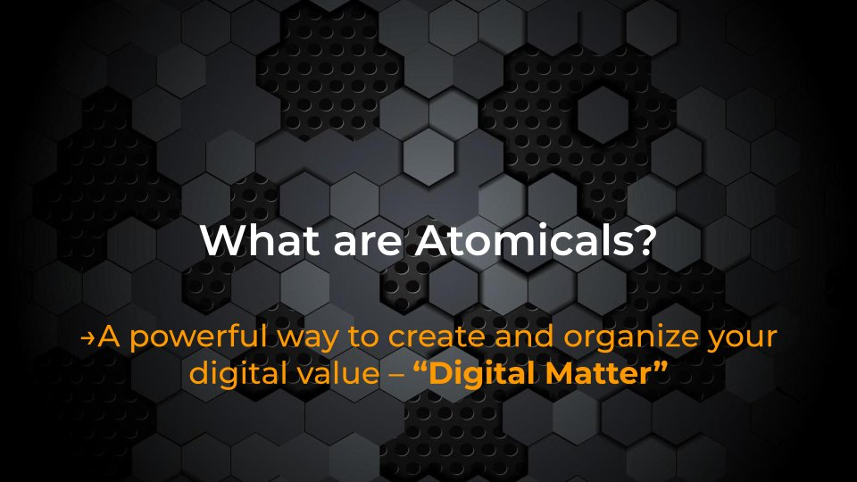
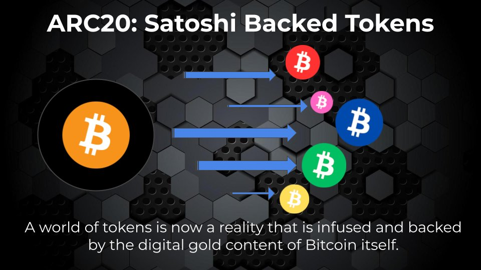

# 拨云见日，看 Atomicals Protocol 如何复兴比特币？ | 比特原生叙事 ④

> 在过去的 2023 年，基于隔离见证、Taproot 升级这两项技术创新而诞生的 Ordinals 理论及协议，出乎意料地推动去中心化共识最强的比特币开始超越其「价值存储」的单一叙事，Ordinals Protocol、和以其为基础或受其启发的 BRC20、Runes Protocol、Atomical Protocol、DMT 数字物质理论、NAT 非任意代币、Bitmap 等理论、协议、代币标准、项目层出不穷，正在为数字化、智能化的未来构建去中心化价值网络的基石。

> 3 月 11 日比特币破 7 万美元创下历史新高之日起，加密厨房在前述先锋的探索实践的基础上正式开启「比特原生叙事」系列，和 Navigator Labs、BIT FM 等诸位同道一起推进比特币原生叙事研究，共同壮大比特原生叙事运动。
>
> 「比特原生叙事」系列第四篇：Atomicals Protocol。

**作者：** 0xSea.eth

ppqq **编者按：** 3 月 5 日，OKX Web3 钱包宣布全面支持 ARC-20 资产的查看和转移，Atomicals 市场也即将开放，标志着 Atomicals Protocol 取得里程碑性的进展，吸引了市场广泛关注。不过，Atomicals 中文社区的 0xSea.eth 专门撰文消除业界对这一复兴「染色币」技术的比特币一层协议 3 个常见误解。

## 误解 ①：Atomicals Protocol 只是一个发币协议

不只是。

ARC-20 是 Atomicals 协议的代币标准，可类比 BRC-20 和即将推出的 Runes Protocol。但除了 ARC-20，Atomicals 还有其它几个重要的模块：

- Realm: 比特币上的用户身份体系，比如 +alice 就是一个 realm。每个 realm 一经注册永久拥有，无需续费。此外还有二级、三级 subrealm 的用法，能够支持链上去中心化组织等更多玩法。期待有团队在此构建基于 Bitcoin 的 Social 产品。
- AVM: 即 Atomicals Virtual Machine（Atomicals 虚拟机），这是协议作者 Arthur 当前投入第一优先级的工作。AVM 支持直接在比特币一层上实现可编程性，将会吸引更多开发者基于 AVM 做应用，尤其是在「一币一聪」的基础上，DeFi 的场景将得到释放。乐观估计，AVM 的第一个可用版本将在 4 月比特币减半之前推出。

ARC-20、Realm 和 AVM 共同构成了 Atomicals 协议的三角，而且彼此之间有很多联系。比如说未来可以使用 ARC-20 代币购买 subrealm 以加入某个组织；比如可以在 realm 个人主页里呈现一个钱包地址的 ARC-20 和 NFT 资产；比如 AVM 将更大程度释放 ARC-20 代币的流动性。

再次推荐阅读 Arthur 在 2 月 4 日写的公开信，他强调了 Atomicals 的两大核心愿景，分别是 Bitwork（PoW）和 AVM：https://twitter.com/atomicalsxyz/status/1753879073690956145

## 误解 ②：ARC-20 是铭文

不是。

支撑 Atomicals 协议的底层思想是数字物质理论（DMT，Digital Matter Theory），ARC-20 代币本质上是染过色的比特币 (sats)。一币一聪，即每一个 ARC-20 代币都有一个「聪」（satoshi）作为价值托底。在索引方面，ARC-20 直接基于比特币的 UTXO 进行记账，不依赖于链下索引，完全共享比特币网络的安全。

基于这个特性，在转移 ARC-20 代币时，可以直接转，不需要像 BRC-20 那样先铭刻一个转账铭文。这不仅为用户节省了转账成本（省一次铭刻 gas 费和时间），也避免了为比特币网络增加垃圾铭文占用空间。

也因为 1 token = 1 sat 的保底设定，所以 ARC-20 代币严格来说是不会归零的，至于说能涨多高就看叙事、共识等因素了。比如含聪比例高的「智子」（$sophon）最近随着比特币上涨 35-40%，U 本位自然也就跟着赚钱了。

可以看出，ARC-20 和 BRC-20 在账户模型、索引方式、转账等方面都有明显差异。其本质是染色币，而不是铭文。铭文 (Inscription) 是 Ordinals 体系里的专有名词，Atomicals 协议并不隶属于 Ordinals 体系，二者是平行关系。只不过行业里日常为了方便表达，大家习惯把它跟 BRC-20 混在一起称为「铭文」，而这确实混淆了他们的差异…

顺便说一句，从目前知道的信息来看，即将推出的 Runes 代币也不是铭文，结构上与 Inscription (含 BRC-20) 平级，同属于 Ordinals 协议。

## 误解 ③：ARC-20 资产容易被烧

不是。

早期确实有一些。举例来说，Atomicals 将 1,000 聪的纸钞染色标记为 1,000 枚 $atom 代币，该信息附着写在 UTXO 上。如果用户使用了一个不支持识别 ARC-20 的钱包，在转账或交互时，钱包无法识别这是 ARC-20 资产，就会误把这 1,000 枚 $atom 代币当成普通的 1,000 聪花费掉。这个过程，就会导致 UTXO 上的染色信息被「抹掉」，即 ARC-20 代币被「销毁」了，无法找回或恢复。

说 ARC-20 资产容易被烧，是因为早期支持它的钱包太少，而不是这项技术有什么问题。随着 Wizz 钱包、Unisat 钱包、OKX Web3 钱包等陆续支持，未来还会有更多钱包支持识别和保护 Atomicals 资产，这种情况将越来越少。

我知道多个烧掉 $atom 的案例，都是因为不慎使用钱包。比如 bc1p…8xd2 持有 $atom 资产，用户还用其他不支持 ARC-20 的钱包软件操作 bc1p…8xd2 去买 Ordinals NFT，那就会导致 bc1p…8xd2 里的 $atom 被当成普通聪花费掉。

就像早期的比特币一样，一些人用自己的电脑挖到了比特币，但当时一是缺乏好用的钱包软件，二是没有形成备份钱包私钥 / 助记词的习惯，都会导致 BTC 丢失。在 BTC 生态里，每个新协议的资产都使用专门的、全新创建的钱包，隔离管理，是一个好习惯。好在支持 ARC-20 的钱包越来越多，最近几个月已经很少再听到被烧毁的问题。

## 总结

如果说 Ordinals 和 BRC-20 是一个更自由松散的体系，类似 Android 系统；那 Atomicals 则更像「苹果全家桶」产品，是一个架构设计更完整的体系。如果说 BTC 是数字黄金，那么 ARC20 代币就是数字珠宝。整个 Atomicals 体系遵循中本聪思想和精神，不为比特币网络增加负担和垃圾数据，通过 CPU/GPU 的 bitwork 延续工作量证明 (PoW) 来进行资产分发。

现在，越来越多的人加入 Atomicals 生态，相信 Atomicals 协议的崛起，成为推动比特币复兴的一部分。

# 什么是 ARC-20 和 Atomicals？

> OKX 1 月初发表专文，为其用户科普 Atomicals 协议。

在比特币区块链上，除了比特币和 Ordinals 铭文之外，还有哪些应用呢？ARC-20 为比特币区块链引入了一种同质化的代币标准，其使用比特币的最小单位 satoshis 作为代币基础。这意味着每个 ARC-20 代币本质上都由一个 satoshi 支持，确保了其基准价值，并且与现有的比特币基础设施无缝集成。

与此同时，Atomicals 提供了一种独特的比特币数字资产表示方法，进一步拓展了这个创新性区块链的能力。它们为数字资产管理带来了多功能性和创新性，展示了比特币在其作为加密货币的主要用途之外的适用性。

这些发展对比特币的未来意味着什么呢？许多人认为它们为比特币的资产管理和代币革新化开辟了新的途径。

## 概述：

- ARC-20 标准：ARC-20 利用 satoshis 创建同质化代币，实现价值体现和无缝集成。
- 铸造灵活性：提供了分散和直接铸造方法，满足不同的资产创建需求。
- 编号服务：为每个 ARC-20 代币提供唯一的永久标识，提高了数字资产领域的清晰度。
- Atomicals 协议：扩大了比特币管理和创建各种数字资产的范围，展示了其适应性。
- 比特币的未来：ARC-20 和 Atomicals 为比特币在资产管理和代币化方面开辟了新的机遇。

## 什么是 ARC-20？

ARC-20 引入了一种在比特币区块链上表示同质化代币资产的全新方法。这一代币标准使得每个 satoshi（比特币的最小单位）都代表着一个代币的所有权单位，前提是一个 satoshi 永久支持每个 ARC-20 代币。

ARC-20 系统提供了安全的最低价值，为代币增添了「数字黄金」的吸引力。其出色的灵活性允许代币被分解和重新组合，类似于 Ordinals 比特币。

ARC-20 代币可以创建并发送到与 Sparrow Wallet 等钱包兼容的任何比特币地址。这项服务提供了两种不同的铸币选项，直接和去中心化，并带来独特的优势。此外，ARC-20 还提供了独特的编号服务，为代币符号提供了全球性的永久命名系统。一旦注册了编号，它就会被永久设置，避免了重复，并提高了清晰度。

ARC-20 的突破将如何影响我们对比特币和加密经济的使用呢？通过为资产管理和数字所有权提供安全的基础设施，ARC-20 是 Web3 领域的潜在改变者，将比特币的应用进行了拓展，使其远远超越了传统的金融交易。

## ARC-20 代币如何工作？

每个 ARC-20 代币都由一个 satoshi 支持，确保每个代币都具有实际价值。这种紧密的联系保证了代币的稳定价值，并为与比特币区块链的简单通信提供了基础。

ARC-20 代币的铸造过程是多功能的，提供了两种主要方法：去中心化和直接铸造。

在去中心化铸造中，通过设定特定参数（如每个铸币奖励、允许的总铸币数和起始块高度）进行初始化编号。这种方法允许对代币创建进行控制和定制。

另一方面，直接铸造涉及创建包含总代币供应量的单个输出，其中每个 satoshi 代表单个代币单位。这种方法要求创建者提交相应数量的比特币，以确保信任度并降低欺诈创建的风险。

通过将 satoshi 这一单位融入到代币标准的设计中，ARC-20 代币保持了其价值，为资产管理、代币化以及更广泛的区块链技术应用开辟了新的路径。

## ARC-20 铸造方法：去中心化还是直接铸造？

支撑 ARC-20 的两种铸造方法具有独特的优势，您可以根据需要选择。

### 去中心化铸造

- 初始化：设置代码、铸造奖励、允许的总铸造数、起始块高度和元数据。
- 自定义：允许部署者指定代币属性和元数据。
- 命令格式：使用 npm run cli init-dft 参数，如 ticker，铸造数量，count 和 height。
- 灵活性：受控的铸造过程非常适合需要逐步分发或特定开始条件的代币。

### 直接铸造

- 一步过程：创建包含整个代币供应的单个输出，每个 satoshi 代表一个单位。
- 证实：要求创建者提交等量的比特币，提高可信度并减少欺诈。
- 命令：应用 npm run cli mint-ft 的代码和总供应量参数。
- 理想用途：适用于团队或公司需要完全控制代币分发和未来使用的情况。

## ARC-20：如何开始去中心化铸币

如果您想以去中心化的方式铸造 ARC-20，铸造过程有许多阶段。

### 初始化

- 设置：首先使用唯一的代码、铸造奖励、允许的总铸造数、起始块高度和元数据。
- 命令：使用 Atomicals 命令行界面（CLI）和命令 npm run cli init-dft<tick><per_mint_amt><mint_count><start_height>metadata.json。
- 可选标志：包括--mintbitworkc=<prefix> 和--satsbyte=<number> 以进行额外的自定义。
- 元数据：将图像和描述作为元数据包含在内，以提供有关代币的额外信息。

### 铸币过程

- 执行：初始化后，使用 mint-dft 命令启动铸币过程。
- 命令格式：命令格式为 npm run cli mint-dft<tick>，带有可选标志--satsbyte=<number>。
- 起始点：铸币从指定块高度开始 start_height

点击进入[教程](https://docs.atomicals.xyz/arc20-tokens)，了解 ARC-20 的去中心化代币铸造过程。

## 深入了解 ARC-20 中的直接铸造

ARC-20 的直接铸造过程提供了一种在比特币区块链上创建代币的简单安全的方法。这种简化的方法允许在一次操作中生成所有代币的供应，使该过程更加高效和简单。

- 过程：要直接铸造 ARC-20 代币，需要创建一个包含总代币供应量的输出，每个 satoshi 单位代表一个代币。这是使用 AtomicalsCLI 命令实现的：npm run cli mint-ft<tick><total_supply>metadata.json。
- 安全性和透明度：当涉及到直接铸造时，代币供应的总量必须由创造者以比特币匹配。如果一个代币有 1 亿个单位，那么一个比特币必须存入 1BTC 等于 1 亿个 satoshi。这个系统保证了透明度，并降低了任何欺骗性活动的风险，因为创造者不能在没有正确数量的比特币支持的情况下发布代币。
- 控制和分配：这种铸造过程对于需要对代币原始分配进行授权的公司或团体特别有用。它使他们能够决定何时以及如何使用或释放代币，从而增强了对代币经济的控制。

## Ordinals 与 Atomicals：有什么区别？

Ordinals 和 Atomicals 是引入比特币区块链的两个概念，每个概念都提供比特币效用的独特功能。

### Ordinals

- 概念：Ordinals 包括将独特的、非同质化的代币（NFT）直接刻在比特币的最小单位 —— 单个 satoshi 上。这允许在比特币区块链中创建不同的数字资产。
- 功能：Ordinals 协议允许用户发送和接收带有额外数据（如文本、图像、音频或视频）的 satoshis，以创建比特币 NFT，也称为比特币 Ordinals 协议。
- 影响：这项创新为比特币开辟了新的可能性，包括创造独特的数字艺术和收藏品，显着提高了比特币的价值和用例，超越了单纯的数字货币。

### Atomicals

- Atomicals 协议的推出旨在促进在比特币上创建类似加密货币的数字资产。它引入了多项优化，旨在简化在比特币上创建数字物品的过程。
- 特点和 ARC-20 代币：Atomicals 使用 satoshi 单位，并以 UTXO（未花费的交易输出）设计为模型。使用 Atomicals 的应用程序的协议是 ARC-20，ATOM 是使用此标准生成的资产的名称。与 BRC-20 相比，Atomicals 仅在资产生成和修改期间使用 Taproot 地址，而不是用于资产转移。
- 潜力和效用：Atomicals 代币和 ARC-20 代币展示了比特币如何托管代币化资产。这使得比特币不仅仅 BTC 有用，并在去中心化金融和数字资产表示方面开辟了新的机会。

Ordinals 代币和 Atomicals 代币使用比特币区块链创建独特的数字资产，但它们的方法和功能不同。Ordinals 代币专注于通过将数据刻在 satoshis 上来创建 NFT，增强比特币在数字艺术和收藏品中的实用性。Atomicals 代币通过 ARC-20 代币提供了创建和管理同质化数字资产的框架，扩大了比特币在数字资产领域的应用范围。

## 结语

这一新发展为比特币提供了一种同质化的代币标准，使用 satoshi 的最小单位来表示代币。这确保了每个代币的价值，同时也保证了每个代币与比特币现有系统的兼容性。ARC-20 还提供了不同的铸造选项，包括去中心化和直接铸造，并引入了编号服务，以便于识别代币，从而提高了生态系统的效率。

Atomicals 提供了一种创新的比特币数字资产管理方法。它们能够创建和管理各种代币化资产，扩大比特币的应用范围。这一创新展示了比特币在去中心化金融和数字资产表示方面的适应性和潜力。

ARC-20 会在 2024 年比特币的旅程中扮演重要角色吗？让我们一同关注。

ppqq 上述为「比特原生叙事」系列第四篇，接下来我们将陆续介绍更多基于比特币一层的原生理论、协议、标准和项目，敬请关注！

明天 3 月 15 日北京时间晚 9 点，「比特原生叙事」第四场 X Space 将邀请 Atomicals 中文社区的 0xSea.eth、Wizz Wallet 的 Brutoshi 和 Trustless Labs 的 blockpunk 等 Atomicals 生态建设者一起来「解密 Atomicals Protocol」，欢迎扫码关注收听！

**关注 X 账号**

- BIT FM：x.com/bitfm2024
- 加密厨房：x.com/CryptoKitchen23
- 领航猿实验室：x.com/NavigatorLabs

### 欢迎加入电报群讨论交流

_https://t.me/bitfm2024_
