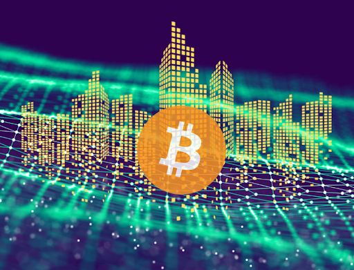
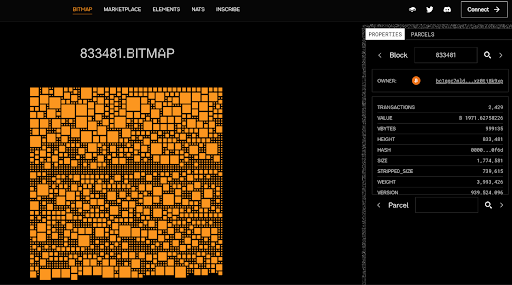
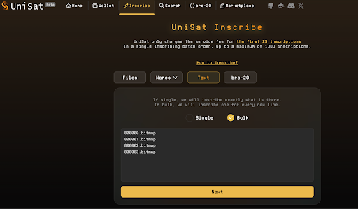
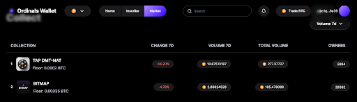

# 比特币区块还能变「土地」？「非任意」元宇宙 Bitmap 应该怎么玩？| 比特原生叙事 ⑤

> 在过去的 2023 年，基于隔离见证、Taproot 升级这两项技术创新而诞生的 Ordinals 理论及协议，出乎意料地推动去中心化共识最强的比特币开始超越其「价值存储」的单一叙事，Ordinals Protocol、和以其为基础或受其启发的 BRC20、Runes Protocol、Atomical Protocol、DMT 数字物质理论、NAT 非任意代币、Bitmap 等理论、协议、代币标准、项目层出不穷，正在为数字化、智能化的未来构建去中心化价值网络的基石。
>
> 3 月 11 日比特币破 7 万美元创下历史新高之日起，BIT FM 在前述先锋的探索实践的基础上正式开启「比特原生叙事」系列，和 Navigator Labs、加密厨房等诸位同道一起推进比特币原生叙事研究，共同壮大比特原生叙事运动。

「比特原生叙事」系列第五篇：Bitmap。

**作者：** Rebbeca、Navigator

前言：「数字物质理论」正在越来越多的运用到比特币生态的数字资产发行中，一个以「非任意价值」为基础的数字世界正在快速的建造中……

今天我们将介绍 Bitmap，比特币生态第一个非任意的元宇宙项目。

# 1. 什么是 Bitmap？

在 2022 年 12 月，Casey Rodemer 创建了 Ordinals 协议，让我们能够在比特币网络上存储数据，这是一次革命性的突破，意味着比特币已经不再仅仅是一种价值储存手段。这次升级使用户能够在比特币的最小单位 Sat（聪）上铭刻数据，从而产生了一种新的资产类别，即 Ordinal Artifact。**Bitmap 属于这一类资产，永久存储在比特币区块链上，没有人可以篡改或毁坏。**

Bitmap 的构想是由 Bitoshi Blockamoto 于 2023 年 6 月提出：将比特币的每一个区块看成虚拟世界中的一个「数字区域」（digital district），而区块内的各个交易被视为该「数字区域」里的各个「地块」（parcels）， 每笔交易的具体数据点和特征决定了「地块」的性质 —— **这意味着，每个数字区域都是独特的，「非任意」（Non-Arbitrary）的，因为它们是基于每个区块上不同的信息产生的，而不是被凭空造出来的**。

在下图中我们可以看到每一笔交易以一个 parcel 的状态来显示，无数个大大小小的 parcel 最终构成了这一块 bitmap。

它是「数字物质理论」（Digital Matter Theory，DMT）在比特币生态的一个重要应用，也是 DMT 里众多数字物质种类之一，以 NFT 形式存在。关于数字物质理论，可以参考我们之前的文章：《数字物质理论是什么？DMT 十问帮你捋明白》。

**换句话说，Bitmap 是比特币生态第一个非任意的元宇宙项目，它的运作原理是利用比特币区块链的数据来构建一个数字世界的地图，并通过将区块数据转化为虚拟世界中的数字景观，为用户提供了参与元宇宙建设的机会。**

Blockamoto 在 GitHub 的 repo 里是这样介绍他的构想的：

「Bitmap 是一个共识标准，允许任何人声明比特币区块的地理空间数字资产。 这个过程是通过第一个使用序数铭文标准将 blocknumber.bitmap 铭刻到聪上来实现的。 这个过程是公平且去中心化的，通过花费一些能源来将任意比特币区块转变为元宇宙的一部分。平台可以将这些区块数据解析到 3D 领域，并向区块所有者授予建造访问权限，从而为开源开发创造了一个新的范式。Bitmap 理论将比特币数据景观映射到空间类似物，揭示了持久元宇宙的基础。 要拥有一块持久的比特币元宇宙（称为位图），必须通过 District-theory.md 和 Parcel-theory.md 拥有有效的 Bitmap 地块铭文。」

# 2. Bitmap 上的数据为什么特别？

比特币上的区块可以被视为历史时间线，它们由实时交易详情和永久数据串组成。这些区块的数据是直接从比特币核心的实时主网数据中提取和解析的。

在之前的图中，我们可以看到每个方块都是一笔交易， 都有自己独特的非任意资源字符串。因此，开发人员们在创建任何的全栈应用程序时都可以将 Bitmap 视为基石，通过共享这样一个静态的基础级别的基石，各个应用程序间可以实现“相互操作”的机会，并具有跨界实用性。这样就允许用户在探索元宇宙的不同世界时保持对资产和身份的自主管理。

# 2. 怎样持有 Bitmap？

比特币区块链上的任何区块都可以被铭刻 Bitmap，它遵循 Ordinals 理论和协议，只有第一个在区块上铭刻的人才是这个 Bitmap 的拥有者。

**那如何进行铭刻呢？**在确认你想用到的区块之后，将区块号+.bitmap （例如选中了第 800000 个区块，就是 800000.bitmap）复制到一个提供铭文服务的平台，如 UniSat 或 OrdinalsWallet 的铭刻服务，你也可以一次铭刻多个区块（如下图），然后选择下一步，进行付款。这样铭刻就完成了。

**注意，Bitmap 只能在已开采的区块上铭刻，而目前已开采的区上写入已经被锁死，只有在新区块上蹲守机会。**比特币平均每 10 分钟就会开采出一个区块，大家可以抢在第一时间去写入自己的 Bitmap（但不推荐，以为有很多机器人也在蹲守机会），另一个简单可行的方式是在 Ordinals Wallet 这样的二级市场上进行购买。

# 4. Bitmap 和之前的元宇宙有什么区别？

Bitmap 挑战了数字领域传统所有权概念，旨在数字空间中建立社区和协作精神。它是完全去中心化的、参与者自主的，不像 Decentraland 或 Sandbox 那样的元宇宙由一个项目方主导和引领发展。

Blockamoto 只是提出了 Bitmap 的铭刻规则，并不负责分发 Bitmap，参与者们需要做的就是按照这个规则来铭刻和认领（claim）自己的 Bitmap。自去年中被提出以来，这个想法被越来越多的人接纳，以至于已开采的 80 多万个区块都已经被认领。

**Bitmap 为区块所有者提供了为元宇宙积极做贡献的机会。 通过拥有一个区块，用户可以获得一个平台，可以在自己拥有的空间上进行构建，在元宇宙中培育充满活力和社区驱动的环境。**

# 5. Bitmap 未来还有多少空间？

根据 Ordinals Wallet 的信息，目前 Bitmap 是该平台交易金额第二大的资产（如下图），过去七天交易了 2.86 个 BTC（约 208,761 美元）。自 Bitmap 出现到现在，Bitmap 在主要平台总成交额近 1500 个 BTC，目前地板价 0.0035 BTC，比去年铸造成本上涨了 100 多倍。

随着比特币生态的不断壮大，越来越多的项目加入其中，夺走了 Bitmap 的 C 位，但考虑到它在构建「非任意元宇宙」中扮演的基石地位，其未来价值不容小觑。自 2009 年比特币诞生以来，目前已开采了 830000 多个区块，这意味着差不多每 10000 人才拥有 1 个 Bitmap。如果我们将 Bitmap 视为去中心化全球元宇宙的基础，那么它们实际上是相当稀缺的。

**参考**：https://medium.com/@robenoch/a-thesis-on-the-future-of-bitmap-db3efeefc2c0

ppqq 上述为「比特原生叙事」系列第五篇，接下来我们将陆续介绍更多基于比特币一层的原生理论、协议、标准和项目，敬请关注！

明天 3 月 16 日北京时间晚 9 点，「比特原生叙事」第五场 X Space 将邀请 一起来「解密 Atomicals Protocol」，欢迎扫码关注收听！

**关注 X 账号**

- BIT FM：x.com/bitfm2024
- 加密厨房：x.com/CryptoKitchen23
- 领航猿实验室：x.com/NavigatorLabs

### 欢迎加入电报群讨论交流

_https://t.me/bitfm2024_
