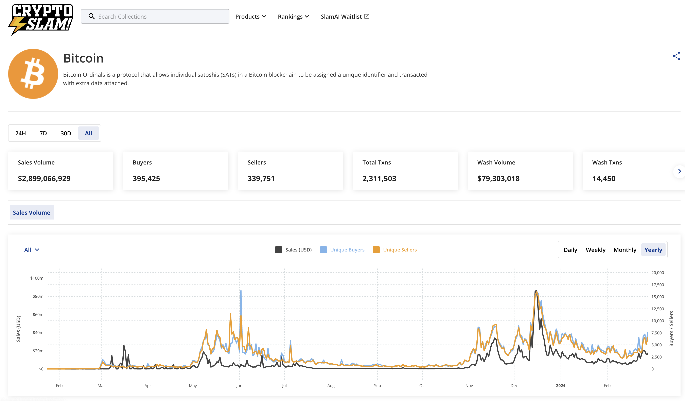

# Bitcoin，一切的奥秘从 BIT 开始| 比特原生叙事 ⑥

> 在过去的 2023 年，基于隔离见证、Taproot 升级这两项技术创新而诞生的 Ordinals 理论及协议，出乎意料地推动去中心化共识最强的比特币开始超越其「价值存储」的单一叙事，Ordinals Protocol、和以其为基础或受其启发的 BRC20、Runes Protocol、Atomical Protocol、DMT 数字物质理论、NAT 非任意代币、Bitmap 等理论、协议、代币标准、项目层出不穷，正在为数字化、智能化的未来构建去中心化价值网络的基石。
>
> 3 月 11 日比特币破 7 万美元创下历史新高之日起，BIT FM 在前述先锋的探索实践的基础上正式开启「比特原生叙事」系列，和 Navigator Labs、加密厨房等诸位同道一起推进比特币原生叙事研究，共同壮大比特原生叙事运动。

**作者：** Navigator

ppqq

- Bitcoin：全球市值最高的加密货币
- IBIT：全球最大资管公司贝莱德管理的比特币 ETF 交易代码
- ByBit：全球排名前三的 BTC 合约平台
- Bitmain：比特大陆，全球最大的矿机生产商，代表产品：蚂蚁矿机

带 BIT 的名字、币种、交易所、机构以及媒体，数不胜数，为何大家都喜欢带上 BIT 作为名称的组成部分，难道仅仅只是因为比特币的名字从 BIT 而来？或者标榜自己对比特币的敬意与热爱？或者在冥冥中延续着某种使命？

本文试图去发现背后的奥秘。

## Bitnative 比特原生叙事，带来 15 年后的万链归一

过去两个牛市，我们远离了比特币，认为它只能做价值存储，因为 10 分钟的区块确认时间，让我们把所有精力都放在以太坊等链上，数以万计的应用蓬勃兴起，价值几千亿的加密生态欣欣向荣，我们从以太坊到 Layer2，我们从币安链到 Solana，TPS 越来越高，但两个牛市中，我们重复的在 ICO、IDO、IEO、FT、NFT、DeFi、Metaverse、GameFi 的旋涡里循环往复，同样的玩法在不同的 PoS 公链上复制，同样的代码在 EVM 系里粘贴，我们陷在 COPY、FOMO 的情绪中失去了创新的方向。

而过去一年来，Ordinals 理论引发了加密圈的蝴蝶效应，其利用聪在比特币构建生态的新方法，称为数字文物，这掀起了建设比特币生态以及比特币考古热潮，首先 Builder 们考古发现了稀有聪，披萨聪以及中本聪等非常具有纪念意义的聪，进而 DMT 数字物质理论提出利用区块数据发行非任意资产的全新模式，Runes 协议利用 UTXO 发行同质化代币等，一切都让比特币 Builder 们耳目一新、醍醐灌顶，享受着发现比特币新大陆的喜悦，我们看到到了新牛市中创新的曙光，万链归一拉开序幕。

NavigatorLabs 总结过去 1 年中出现的各种协议，如 Ordinals 铭文、BRC20、Bitmap、递归铭文、BRC420、TAP、Atomicals、Runes、Taproot Asserts 以及 DMT 等，发现了一些规律及路径，并撰写了比特原生理论行动手册以及比特原生六要素导航图。

当比特原生六要素完整呈现出来时，相信每个比特币 Builder 们也找出了基于比特币的众多原生协议的制定规则与路径，社区对六要素中的聪、UTXO、Block、DATA 与 POW 分析文章已经很多，而其中作为六要素之一的 BIT 是大家目前最不了解的部分，因为 BIT 是另外 5 个元素的底层元素，底层量纲。

关于比特币的考古浪潮仍在持续中，让我们开始思考一些习以为常的问题，进而挖掘其中深意，本文就试图从多角度对 BIT 进行解析。

## BIT 是什么？

BIT，Binary Digit 简写，是二进制数字中的位，信息量的最小度量单位，每个 0 或 1 就是一个位(bit)，其中 8bit 就称为一个字节（Byte）。计算机中的 CPU 位数指的是 CPU 一次能处理的最大位数，例如 32 位计算机的 CPU 一次最多能处理 32 位数据。

虽然比特币只有 15 年的历史，但比特币的出现却是百年来信息技术发展的必然结果，比特币（Bitcoin）以 Bit 命名只是一时兴起，还是在致敬什么？这不得不从 BIT 的起源说起。

## BIT，1948 年香农在信息论首次正式使用

_图右侧为信息熵计算公式_

1948 年「信息论之父」香农（Claude Elwood Shannon ）在其划时代的信息论奠基之作《通信的数学理论》（A mathematical theory of communication）第一次正式使用 BIT 作为信息量的单位，并出现在著作的第一页，成为信息论的重要贡献之一,并提出三大定律等信息论的基础理论。

## BIT 的出现，让信息可以放进数学公式里

回溯物理学在发展遇到瓶颈时，牛顿将一些传统但又定义模糊的词汇，如力、时间、质量等重新定义，把这些词加以量化放在数学公式里，让物理学开启了一个新的时代。

如何把信息放进数学公式里？这时信息单位「比特」（Bit）被定义出来，Claude Elwood Shannon 认为，信息是和长度、重量这些物理属性一样，可以测量和规范。如今，Bit 作为衡量信息多少的单位，与公尺、千克、分钟一样，成为日常生活中的最常见的量纲之一。

用 Bit 作为量纲衡量后，人们发现信息几乎无处不在。比特 Bit 的出现在后来引领了电脑、网络、摩尔定律，和如今发达的信息产业、以及比特币与区块链。

_BIT 也可以作为信息熵的单位_

## BIT，是现代计算机处理及存储的最小单位

BIT 是衡量二进制的单位，而二进制是最简单有效的机器语言，比如阿兰·图灵制作的图灵机就是利用二级制，这是现代计算机的雏形。

_阿兰·图灵的图灵机_

在多位科学家的研究下，这些由 0101 组成的二进制符号串成为信息传输方式，处理以及存储的最小计量单位就是 BIT，但实际使用中比特这个单位还是太小了，陆续就有了 1024 bit，1024 MB 以及 1024 TB 等单位。

_中文汉字的二进制索引解码过程_

## BIT 与公钥密码学

香农曾在论文里指出，优质密码系统的设计问题本质上是寻求一个困难问题的解，使破译密码等价于解某个已知数学难题。

信息单位 BIT 的提出，让使用数学公式计算信息数据成为可能。

受此思想启发，Bailey W. Diffie、Martin E. Hellman 于 1976 年在 IEEE Transactions on Information Theory 上发表论文《诠释密码学的新方向》（New Direction of Cryptography，标志着公钥密码学的诞生，Diffie 与 Hellman 也因此在 2016 年获得图灵奖。

公钥密码学又为比特币等区块链数字资产的发展奠定了基础，公钥密码学在数字硬通货中的应用重新定义了私有财产。

## BIT 衡量了比特币，比特币发扬了 BIT

### BIT 是比特币网络的度量衡

统一度量衡，对历史比较了解的 Builder 们一定已经想到了秦国统一六国后在全国推行车同轨、书同文、行同伦、量同衡、币同形等准则，自此全国上下有了标准的度量衡，促进了经济社会的发展。

古希腊、古罗马时期的度量衡标准为现代国际度量衡发展产生了重要影响，随着全球大融合，第一个国际性度量衡标准是由法国的制造商和商人于 1790 年颁布。

BIT 这一信息的最小单位与比特币链，就像一对孪生兄弟，你中有我，我中有你。

BIT 衡量了比特币,比特币发扬了 BIT。

### BIT 规定了比特币区块内部结构大小

- **哈希值：** 对链中前序(父)区块哈希值的引用 32Bit
- **难度系数：** 本区块工作量证明算法的难度目标 4Bit
- **默克尔树：** 本区块所有交易的默克尔根的哈希 32Bit
- **区块尺寸：** 本区块所有交易的大小，最大不超过 33554432 Bit（4M）

### BITS 字段的数值决定了 PoW 矿机的计算量及挖矿成本

区块结构中的 Bits 字段表示存储难度目标的十六进制数。Bits 字段标识了**当前区块头 Hash 之后要小于等于哈希目标值**（target_hash），即 Bits 通过运算得到 target_Hash，同时 Bits 值决定了网络计算能力大约每 10 分钟生成一个区块所需的难度级别。

**Bits 字段和目标哈希值之间的关系：**

- 以高度 277316 区块为例
- Bits 值为 0x1903a30c，这个值是系数/指数格式，其十进制数值是 419668748
- 前两位十六进制数为幂：0x19
- 接下来的 6 位数为系数：0x03a30c
- 计算公式: targetHash = 系数*256^{幂-3}; 十六进制数字前面都得带 0x * \*
- target_hash=03a30c\*256^{(0x19-3)}

**根据难度的计算公式，目标哈希值确定，Bits 值越小，难度越高，需要计算力越大，挖矿成本越高。**

_BITS 数值随区块增加减少_

**我们将 15 年来第一个区块的 BITS 数值和 HASH 值做了一个统计表，发现 Bits 的数值越低，HASH 开头 0 的位数就越多。**

**采矿计算的难度取决于哈希值的开头有多少个 0，Bits 数值越低，开头 0 越多，需要算力越大**，要计算出上表的哈希值，比如连续 17 个 0 开头的哈希值，矿工先确定 Prev Hash，Merkle Hash，Timestamp，Bits，然后，不断变化 nonce（随机数）来计算哈希，直到找出连续 17 个 0 开头的哈希值。我们大致推算一下，大约需要计算 2.9 万亿亿次。

实际的难度是根据 Bits，用前文中的公式计算出来：

Difficulty = 402937298
= 0x18 0455d2
= 0x0455d2*28*(0x18-3)
= 106299667504289830835845558415962632664710558339861315584
= 0x00000000000000000455d2000000000000000000000000000000000000000000

**注意，难度值的数值越小，说明哈希值前面的 0 越多，计算的难度越大。**

写完整篇文章后，笔者有理由相信，中本聪之所以以 Bit 命名比特币，是出于对 BIT 意义的认同，对香农的敬意，对信息论的延续，对过去百年来信息发展的献礼，他让信息世界从此有了数字黄金，他要像建设现实社会一样，建立一个比特社会，而比特币链就是这个使命的基石。

至此，本文终于解开了一个最常见，却内涵深意的话题：为何叫 Bitcoin？大家不约而同的使用 BIT 作为名称，是冥冥中受到中本聪价值观传递的启发，更是对百年来信息发展的使命与传承。

同时也完美解释了为何 BIT 是比特原生六要素之一，BIT 同时也是另外 5 个元素的底层元素。

Bitcoin：一切的奥秘从 BIT 开始，让我们沿着这个发现，去赋能 BIT，用自己的微薄之力延续这份使命。

# Alpha 推荐：$DMT-BIT，具备成为比特币生态最大 MEME 币潜力?

## $DMT-BIT 发行规则及数量

- **协议：** DMT&NAT 标准
- **进度：** 25%，目前持有人数排名第二
- **形式：** 免费铸造，仅支付矿工 GAS 费（最近 GAS 低，可以逢低铸造）
- **数量：** 83 万张，约 344 万亿 $DMT-BIT，随区块增加，每开发一个区块，增加一张 $DMT-BIT,约 3.8 亿 $DMT-BIT/张

## $DMT-BIT 的 5 大 MEME 特性

1. $BIT 的名字与比特币都取自与信息单位 BIT；
2. $BIT 与比特币同名；
3. $DMT-BIT 引用 11 号元素 BITS，并与区块元素 Bits 同名；
4. $DMT-BIT 可以映射理解为区块元素 Bits 字段的代币化；
5. $DMT-BIT 的价值与 PoW 挖矿成本将产生量子纠缠。

## $DMT-BIT 的估值思路

### $DMT-BIT 的价值与 POW 挖矿成本将产生量子纠缠

$DMT-BIT 数量取自于 Bits 字段，并与 Bits 同名，$DMT-BIT 可以映射理解为 Bits 的代币化。

前述 Bits 值越小，难度值的数值越小，说明哈希值前面的 0 越多，挖矿难度就越高，需要计算力越大，对应每 Bits 的挖矿成本也越高，意味着每$DMT-BIT 的价格越高。

$DMT-BIT 的价值与 POW 挖矿成本将产生量子纠缠。

2023 年 8 月 14 日 Nature Photonics 发布量子纠缠成像图

## $DMT-BIT 的 MINT 方式

**方式一：** 在 DMT 官网 ，通过可视化或随机选择的方式 MINT，一次最多 23 张，成本较高

**链接：** https://mscribe.io/nats/dmt-bit

**方式二：** 复制下面链接中的可 MINT 文本，到拥有 MINT 功能的平台，通过文本 MINT，一次最多可以 1000 张。

**链接：** https://luminex.io/ordinals/mint?search=dmt-bit-9424802e38fc889969417cd90df4c4147209d2a83ed83798c0c4aa4391ad36e5i0

_如果你有志于赋能 BIT 或者持有 BIT，你可以通过 X 私信@NavigatorLabs 或添加微信_

# $DMT-BIT 101

## 1. 为何叫比特币和$DMT-BIT?

比特币（Bitcoin）名字源于 BIT，是中本聪出于对 BIT 意义的认同，对香农的敬意，对信息论的延续，对过去百年来信息发展的献礼；

$DMT-BIT 引用 11 号元素 BITS， $DMT-BIT 的名字同样源于 BITS，BITS 是最符合 BIT 理念及代币价值的对应区块元素，BITS 字段不止反映挖矿成本，其本身的随区块数量减少的特性，也是目前已知的 38 个区块元素里能使代币数量合理且非任意增长的最佳元素。

## 2. 为何 BIT 作为信息单位这么重要？

BIT 作为信息单位被提出后，科学家就可以以数学公式的方式解决信息的各类问题与应用，比如公钥密码学的诞生等，这是 BTC 能出现的一步步基础，比特 Bit 的出现在后来引领了电脑、网络、摩尔定律，和如今发达的信息产业、比特币与区块链。

同样的，物理学在发展遇到瓶颈时，牛顿将一些传统但又定义模糊的词汇，如力、时间、质量等重新定义，把这些词加以量化放在数学公式里，让物理学开始了一个新的时代。

## 3. Bit 与挖矿难度、PoW 和挖矿成本的关系?

挖矿难度需要根据 Bits 值，用公式计算得出，Bits 值越小，难度值的数值越小，说明哈希值前面的 0 越多，挖矿难度就越高，需要计算力越大，POW 的挖矿成本就越高。对应每 Bits 的挖矿成本也越高，$DMT-BIT可以映射理解为区块元素Bits字段的代币化，意味着每$DMT-BIT 的价格越高。

## 4. 各种 BIT 代币满天飞，为何$DMT-BIT 具备成为 Bitcoin 生态最大 MEME 币潜力?

是的，确实已经有很多项目方或社区发行了名为 BIT 或者 BITS 的代币，首先可以看出大家对于 BIT 的认可具有全球化的普遍性，其次大部分都是在以太坊等生态发行，他们会继续有自己的应用场景及市场。

而 $DMT-BIT 相较于其他同名 BIT 拥有自己的独特优势：

**发行方式的变革：** 最大的不同点在于 $DMT-BIT 的发行是在比特币主链上，并依据 DMT 数字物质理论，数量取自于同名区块字段 BITS 的数值，这是比特币区块元素表中的第 11 号元素，以非任意代币的方式发行，这与上面提到的众多、以任意方式发布的 BIT 同名代币有本质上的不同,这是 15 年来代币发行方式的第一次变革。

**更具公平性：** $DMT-BIT 随区块增加和释放的非任意性，也保证了后续加入者同样以免费铸造的方式获得，比其他 BIT 同名代币更具公平性。

**以挖矿成本作为估值模型：** 最重要的，$DMT-BIT 数量取自于 Bits 字段，与 Bits 同名，$DMT-BIT 可以映射理解为 Bits 的代币化。前述 Bits 值越小，难度值的数值越小，说明哈希值前面的 0 越多，挖矿难度就越高，需要计算力越大，对应每 Bits 的挖矿成本也越高，意味着每$DMT-BIT的价格越高，$DMT-BIT 的价值与 POW 挖矿成本将产生量子纠缠，这个估值模型是上述 BIT 同名代币没有的估值方式。

**$DMT-BIT 具备成为比特币生态最大 MEME 币的潜力。**

## 5. Bit 作为比特原生理论的六要素之一，可以用于哪些应用？

首先这取决去社区对 BIT 的共识，任何人都可以以自己的方式建设 BIT，不限于应用，从最简单的起名、持有、布道、meme 到应用，BIT 属于大家，任何人均可通过免费铸造（仅需支付矿工的 GAS 费）获得。

以本文作者的设想，Bitcoin 是价值存储，BIT 作为应用型代币，也有自己的优势，比如作为 GAS 费，应用内支付代币、质押及治理代币等，目前比特币生态内代币多以纯 MEME 代币为主，市场也需要一个跑出来的应用型代币。

## 6. 如何理解 $DMT-BIT 的非任意增发机制？

DMT&NAT 协议中，所有非任意资产 NATS 的发行量都会随着区块或模式的出现而增发，这一天然增发模式改变了现有众多代币人为设置增发机制和解锁机制的任意模式，非常符合比特币生态的去中心化、免信任方式，非任意增发保证了后续用户有机会仅使用 GAS 去获取这一资产，更公平。

以 $DMT-BIT 代币为例，$DMT-BIT 总量 = 所有区块上的比特数之和，当前约为 344 万亿（约 83.5 万个区块 x 每个区块比特数均值 4 亿）

由于比特币链上的区块每 10 分钟出 1 个块，每年约新增 5.2 万个区块，但区块上的比特 bits 在不断缩减，如下图所示，每 10 万个区块大约缩减 2.81%（预计每年约缩减 1.4%）

_引用 @GloryYeh 的数据_

综上两点，$DMT-BIT 存在一定的增发，但由于每年新增区块数大致稳定且 bits 会逐年缩小，故增发比例会逐年减少，从 2024 年的增发 4.8% 到 2028 年 3.5%，逐渐趋向于0，这比 ETH 和 DOGE 的每年 5% 固定增发比例更合理，往前推，$DMT-BIT 在 2014 年的增发约为 10%，所以 $DMT-BIT 的增长率更符合一个现实世界国家从发展中国家高速增长到发达国家慢速增长的过程，更符合经济发展规律。

_引用 @GloryYeh 的数据_

按这个增发比例推算，预计到 2047 年，$DMT-BIT 的总量才与 $SHIB 的总量持平：

_引用 @GloryYeh 的数据_

## 7. 非任意代币的优势是什么？与任意代币的区别是什么？

区块链的发展史就是代币发行方式的演化史，自比特币诞生 15 年来，加密领域围绕代币发行方式历经了开发新链、部署智能合约、创建发行协议标准获得铸币权等任意代币模式，由新链开发者、智能合约部署者以及协议发行方设定代币数量及解锁方式，这类代币发行方式可以统一定义为任意代币，由人控制。

非任意代币 NAT 是 15 年来代币发行方式的第一次变革与分支，基于 DMT 数字物质理论，通过索引区块原生数据获得铸币权，完美利用区块即账本的优势，将代币的发行数量及解锁机制交由区块账本这个最具共识的模式负责。

ppqq 上述为「比特原生叙事」系列第六篇，接下来我们将陆续介绍更多基于比特币一层的原生理论、协议、标准和项目，敬请关注！

**关注 X 账号**

- BIT FM：x.com/bitfm2024
- 加密厨房：x.com/CryptoKitchen23
- 领航猿实验室：x.com/NavigatorLabs

### 欢迎加入电报群讨论交流

_https://t.me/bitfm2024_
