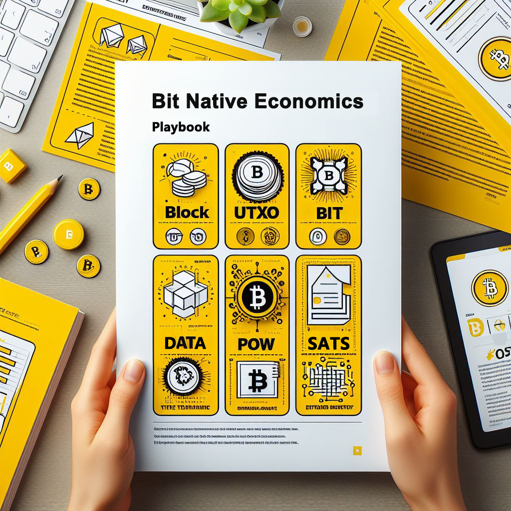
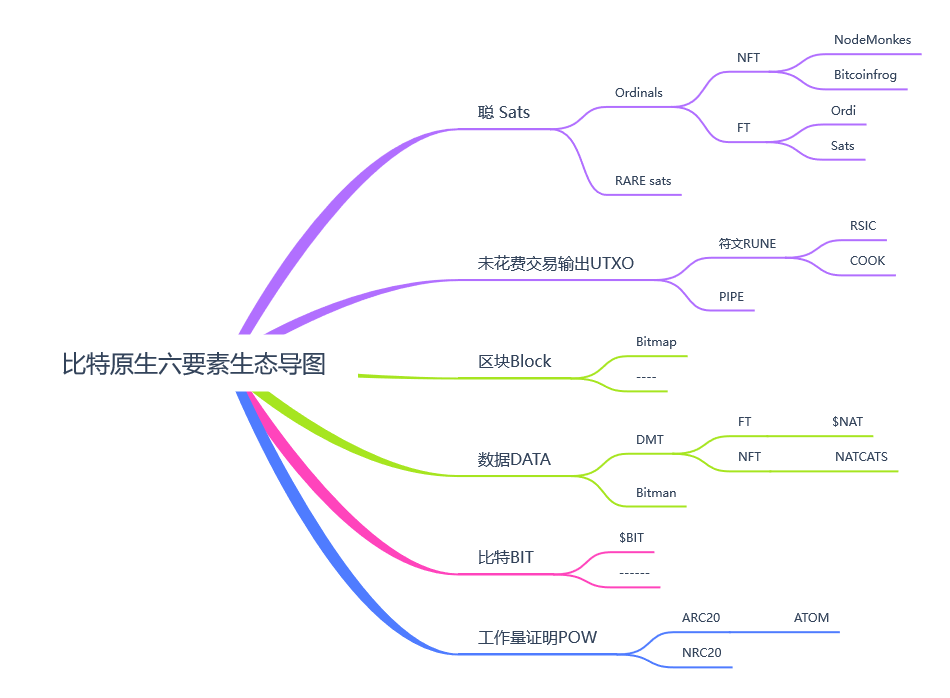
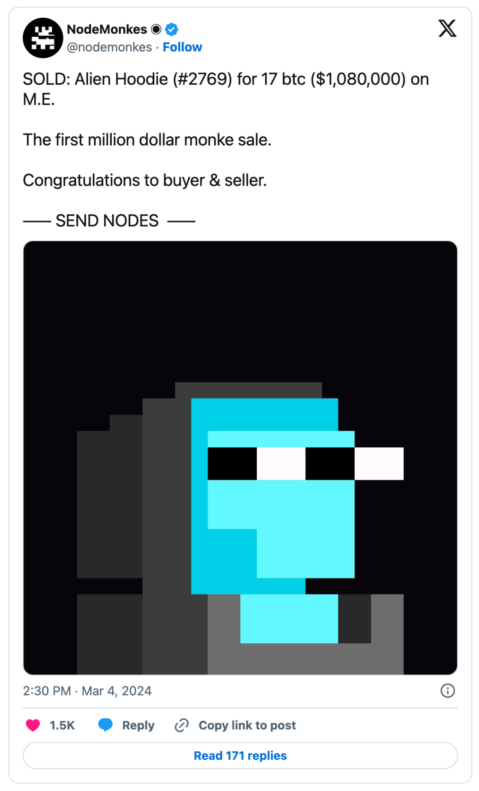
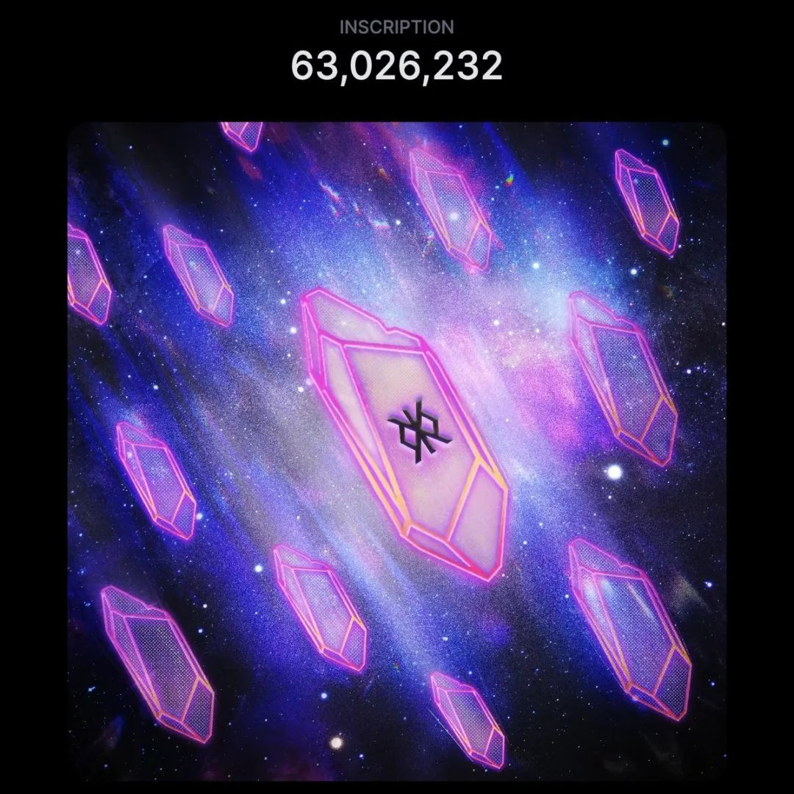
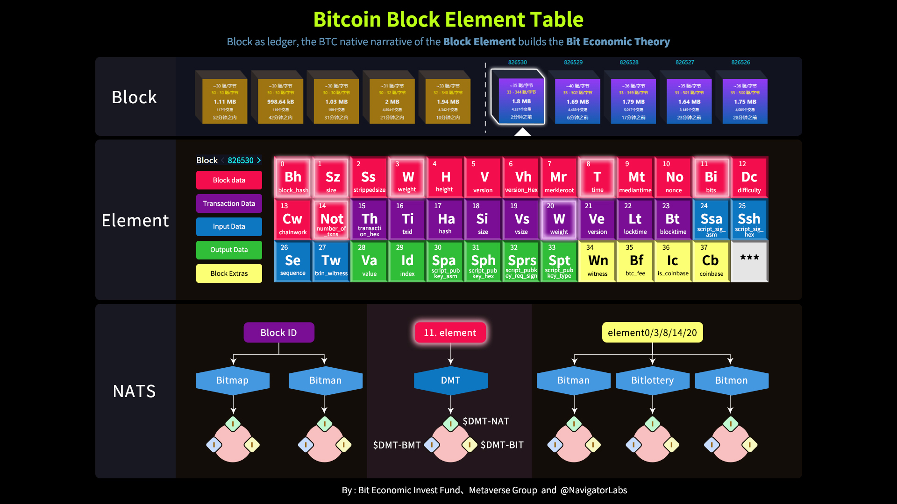
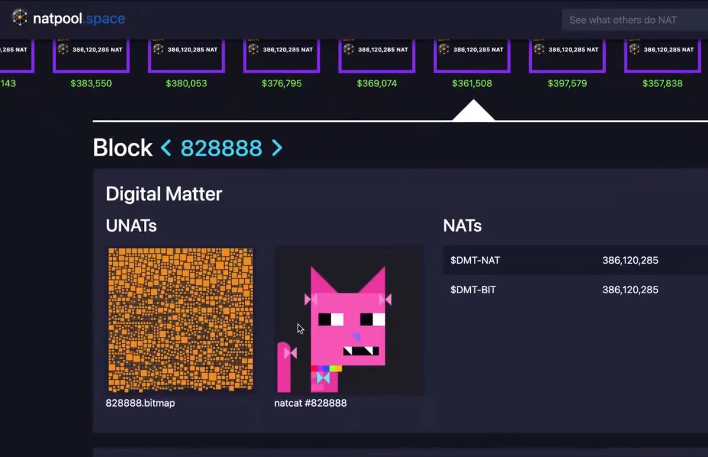
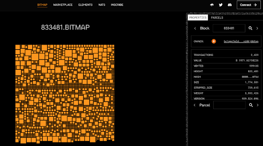
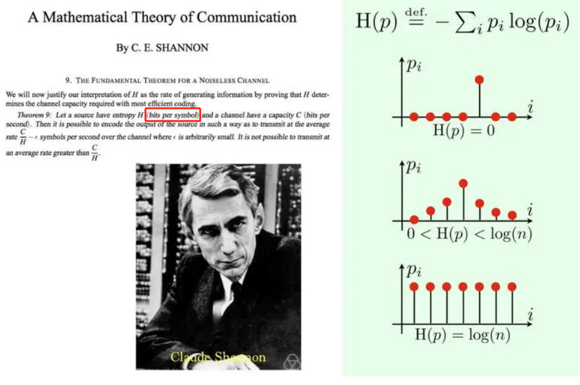
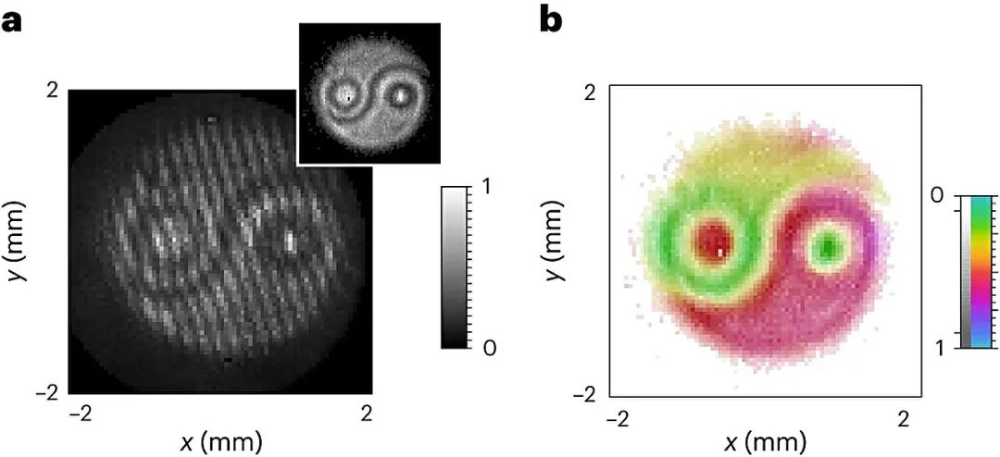
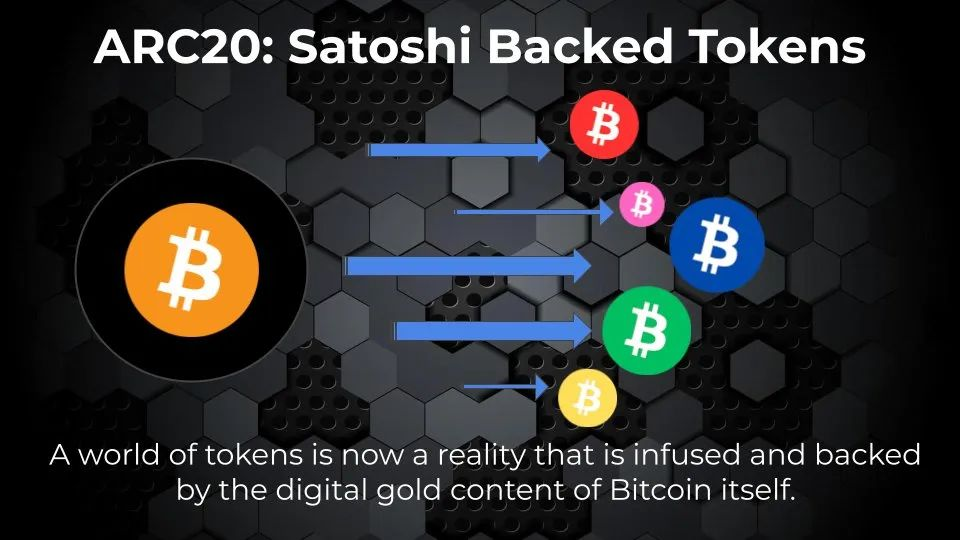

# 比特原生经济学，一文读懂本轮牛市背后的规律| 比特原生叙事 ⑦

> 在过去的 2023 年，基于隔离见证、Taproot 升级这两项技术创新而诞生的 Ordinals 理论及协议，出乎意料地推动去中心化共识最强的比特币开始超越其「价值存储」的单一叙事，Ordinals Protocol、和以其为基础或受其启发的 BRC20、Runes Protocol、Atomical Protocol、DMT 数字物质理论、NAT 非任意代币、Bitmap 等理论、协议、代币标准、项目层出不穷，正在为数字化、智能化的未来构建去中心化价值网络的基石。3 月 11 日比特币破 7 万美元创下历史新高之日起，BIT FM 在前述先锋的探索实践的基础上正式开启「比特原生叙事」系列，和 Navigator Labs、加密厨房等诸位同道一起推进比特币原生叙事研究，共同壮大比特原生叙事运动。今日发表「比特原生叙事」系列第 7 篇，为前面 6 篇比特原生六要素介绍做阶段性总结：比特原生经济学

**作者：** NavigatorLabs、加密厨房

ppqq 每一轮牛市都有新的叙事，而这一轮比特币无疑是那颗「最耀眼的星」，价格屡创新高。
ppqq
ppqq 除了比特币 ETF 的通过为传统金融机构投资持仓打开通道，以及 4 月即将到来的减半等利好带来的价格上涨外，我们还需要关注一个更大的趋势，那就是一场围绕着比特币生态的革命正在快速推进：技术的进步和创新让它开始超越「价值存储」的单一叙事，而是大幅拓展应用场景 —— Make Bitcoin More Useful and Fun Again！
ppqq
ppqq 试想过去在以太坊上实践演变的所有创新，都可以在比特币上重演一次，甚至有更多创新，这意味着比特币生态创造的可能性近乎无限。

**为帮助大家开拓梳理投资比特生态的视野和思路， NavigatorLabs 和加密厨房推出「比特原生经济学（Bit Native Economics）」这一认知框架。**

# 什么是比特原生经济？

比特币的发行量仅为 2100 万个，使其成为类似于黄金等贵金属的稀缺资源，具备价值存储的特质。另一方面，比特币网络的扩展性有限，每个区块只能处理有限数量的交易，当交易量超过可用空间时，会导致交易时间缓慢和费用高昂，使得在比特币网络上构建应用程序非常困难。

随着 2018 年「闪电网络」（Lightning Network）的上线，在比特币网络上构建应用的成本开始逐渐降低；2023 年 Ordinals 等协议的推出，使得在比特币区块链上创建 NFT 变得易如反掌...于是，比特币开始超越了其「价值存储」的单一叙事，将迎来一个日渐活跃的生态和全新的经济运作系统。

**简而言之，比特原生经济的核心是以区块（Block）、聪（Sat）等原生要素叙事为中心**，从「代码即法律（Code is Law）」转向「区块即账本（Block as Ledger）」这一方法论，强调区块链作为基本账本的作用，更符合比特币的极简主义哲学。

**目前，几乎所有的协议、标准、基建、应用和项目都围绕着比特币的 6 个原生要素展开** ——

## 1. Sats（聪）

聪（Satoshi，简称 Sat）是比特币的最小单位，1 个比特币包含 1 亿聪。

### 应用： Ordinals 和 Rare Sats

**Ordinals（序数）**是一种基于 Sats 的方法来创建数字工件资产的协议，由 Casey Rodarmor 提出。在该协议下，单个聪可以铭刻（inscribe）任意内容，创建独特的比特币原生数字工件即 NFT。

这意味着单个比特币可以创建多达 100,000,000 个 NFT。 这些 NFT 是可追踪和可转移的，直接在比特币区块链上运行，不需要依赖二层解决方案。与大多数存储在外部服务器上的 NFT 相比，这样的方式具有更高的安全性。

Ordinals 协议使比特币矿工的收入显著增加，链上费用收入显着增长，增强了对 BRC-20 资产类别和整个比特币生态系统的支持。

目前 NodeMonkes 和 Runestone 是 Ordinals 协议上最火的两个 NFT 项目，截至 3 月 20 日，所有链上 NFT 市值分别排列第四和第六。

**Rare Sats。**并非所有聪都是生而平等的，有些聪比其他聪更稀有，从而创造了稀有聪的市场。例如，比特币减半事件后开采的第一个聪被认为比同一区块中的其他聪更稀有，这些聪被归类为 Epic Sat。Rodarmor 稀有指数（Rodarmor Rarity Index）将聪分为 Common（普通）、Uncommon（非常）、Rare（稀有）、Epic（史诗）、Legendary（传奇）、Mythic（神话）。

稀有且不常见的聪非常受追捧，并且越来越成为受欢迎的收藏品。

**专业稀有聪平台：** https://sating.io/

**深度解读：** 比特币 Ordinals 能否超越以太坊 NFT？ | 比特原生叙事 ③

## 2. UTXO（Unspent Transaction Output，未花费交易输出）

UTXO 是比特币交易的基本单位，通过 UTXO 的转移实现比特币的价值转移，同时每个 UTXO 都是一个整体，不能被分割成更小的单位。比特币账户的余额并不是像传统账户那样存储在一个中央数据库中，而是通过扫描区块链并聚合所有属于该用户的所有 UTXO 来计算得出的。

可以将其想象为从钱包中支出特定的硬币，而不是通用的资金池。例如，假设 1 BTC 是一枚硬币，你想花 0.5 BTC 从 A 手里购买了一些东西，这时候你需要把一枚价值 1 BTC 硬币给 A，然后 A 再退回你一枚价值 0.5 BTC 的硬币，你无法直接从 1 BTC 里划出 0.5 BTC 给 A。

UTXO 具有多重优势：每个 UTXO 都可以追溯到其来源，从而可以对比特币区块链上的所有交易进行透明的审计跟踪；UTXO 交易不直接泄露用户的总余额，为用户提供隐私优势；使得伪造交易或花费未收到的比特币变得困难。

### 应用：Runes Protocol 和 Pipe Protocol

考虑到 BRC-20 相关代币的交易占据了 Ordinals 协议的大部分比例，产生了大量链上足迹，占据比特币的空间，Ordinals 协议作者 Casey Rodarmor 提出一个基于 UTXO 的全新协议 Runes。该协议产生的链上足迹较小，并鼓励负责任的 UTXO 管理。Runes 将在比特币第四次减半之时，也就是 4 月下旬上线主网。

Pipe Protocol，也称为第一个 UTXO Rune 协议，旨在为比特币生态引入数字资产和 NFT 的功能，同时利用 UTXO 交易的安全性和效率。

**深度解读：** Runestone 空投，意在替代 BRC20 的 Runes Protocol 孕育哪些 Alpha？| 比特原生叙事 ①

## 3. Data（数据）

数据是比特币等加密货币的基本信息单元，包括交易数据、签名数据、元数据等，通过加密算法进行验证和传输，存储在区块链中。 数据是比特币等加密货币的价值载体，也是共识机制的基础。

### 应用：数字物质理论（Digital Matter Theory，简称 DMT）

DMT 提出了一个创建新型数字资产的框架，重点关注从**比特币区块本身的数据**中得出的非任意价值（Non-Arbitrary Value）。

DMT 试图摆脱为数字代币分配任意价值（Arbitrary Value）的局面。例如，NFT 的价值通常是主观的，并没有基于任何明确或客观因素，因此它是属于被分配了任意价值。

而在 DMT 的框架下，新数字资产的价值和供应是利用**比特币区块中的固有属性和数据**模式来确定的。

DMT 的提出为区块链开辟了意义等同于智能合约的新大陆，从智能合约遵循 Code is Law（代码即法律）回归到区块元素遵循 Block as Ledger（区块即账本），回归到比特币的极简主义，让我们从全新的视角审视何为比特币原生数字物质，专属于比特币生态特性，从区块元素里发现而不是由合约任意创造。

值得关注的是，DMT 最初是由一些物理学家提出，他们认为数字信息可以被视为一种类似于实体物质（如木材或金属）的数字物质，预测未来数字信息的使用量有可能会超过原子。就像现实世界由元素构成，元素周期表为寻找现实世界新元素提供了理论依据，科学家利用元素周期表在一定区域内寻找新物质(如半导体材料、催化剂等)，服务于现实世界建设。区块链技术社区推动了 DMT 在比特生态里被接受和持续发展。

基于 DMT 的还有非任意代币（Non-Arbitrary Token，简称 NAT）发行机制，以及在 NAT 发行协议下的首个代币$NAT。

**深度解读：** 数字物质理论是什么？NAT、$NAT 傻傻分不清？DMT 十问帮你捋明白 | 比特原生叙事 ②

## 4. Block（区块）

区块是支撑比特币的去中心化和分布式账本系统的基本组成部分，它们通过确保以透明和不可变的方式验证和记录所有交易，帮助维护网络的完整性和安全性。

由于每个区块都包含大量信息，包括时间戳、交易详细信息和唯一标识符等，因此对区块上数据的利用正在成为数字资产探索的趋势，比如利用不同的数据类型可以创建非任意的 FT（Fungible Token）、NFT（Non-Foungible Token）等资产类型。

### 应用：Bitmap

Bitmap 由 Bitoshi Blockamoto 提出，是在 DMT 框架下，利用比特币区块创建一种新型数字资产的特定概念。

一个区块不再只是交易的集合，而可以被看成虚拟世界中的一个「数字区域」（Digital District）。区块内的各个交易被视为该「数字区域」里的各个「地块」（parcels）， 每笔交易的具体数据点和特征决定了「地块」的性质。

持有 Bitmap 就是持有这个数字世界土地的凭证，类似于现实世界的房产证，是 DMT 众多数字物质种类之一，并以 NFT 形式存在。如果非要类比解释，你可以把 Bitmap 理解为 Decentraland 里的土地，$NAT 可以理解为 MANA（参考我们之前的文章：关于 $NAT 与数字物质理论：从「万链归一」到「万宇归一」）.

**深度解读：** 比特币区块还能变「土地」？「非任意」元宇宙 Bitmap 应该怎么玩？| 比特原生叙事 ⑤

## 5. Bit（比特）

比特是计算机可以处理和存储的最小数据单位， 状态由单个二进制值表示，通常为 0 或 1，它是是区块链等数字技术的核心元素。比特币（Bitcoin）的名字就是取自比特（Bit）。

分析上面比特原生六要素思维导图，与 Sats、UTXO、Block、DATA 与 POW 等并列的 BIT 是另外 5 个元素的底层元素，底层量纲。

BIT 于香农在 1948 年发表的信息论《通信的数学理论》一书中被提出，并作为信息的最小单位，引入到数据公式中，并提出三大定律等信息论的基础理论。

比特 Bit 的出现在后来引领了公钥密码学、电脑、网络、摩尔定律，和如今发达的信息产业、比特币与区块链。

### 应用：$DMT-BIT 具备成为 Bitcoin 生态最大 MEME 币潜力

$DMT-BIT 是基于 DMT 与 NAT 协议发行的非任意资产，数量取自于区块元素表的 11 号元素 BITS，BITS 字段的数值决定了 PoW 矿机的计算量及挖矿成本，$DMT-BIT 可以映射理解为区块元素 Bits 字段的代币化，$DMT-BIT 的价值与 POW 挖矿成本将产生量子纠缠。

**深度解读：** 比特币：一切的奥秘从 BIT 开始 | 比特原生叙事 ⑥

## 6. PoW（Proof of Work，即工作量证明）

PoW 是比特币首次引入并广泛采用的共识机制，通过计算机的计算能力解决复杂的数学难题，以获得新的数字货币奖励。手机、电脑都可以参与 PoW，这使得其准入门槛较低，普及度较高。

应用：Atomicals Protocol
Atomicals 协议建立在比特币网络之上，有助于创建、转移和增强数字资产，例如原生数字 NFT、游戏 NFT、数字身份、域名等。 该协议的一个关键方面是引入了 ARC-20 代币，这是一种可互换的代币。

Atomicals 协议推出的代币标准 ARC-20 提供去中心化的铸币方式，允许社区参与代币创建过程，即利用 PoW 机制来计算并获得 ARC20 代币的铸币权。

**深度解读：** 拨云见日，看 Atomicals Protocol 如何复兴比特币？ | 比特原生叙事 ④

# 为什么要关注比特生态？

Bitget 在 2023 年 12 月的分析报告中预测，如果比特币生态系统继续扩张，需求的升级可能会使其价格突破之前的峰值。在此背景下，比特币在牛市中可能会达 10 万美元的估值。

根据 Cryptoslam.io 3 月 20 日发布的数据， 过去 7 天的 NFT 销售额达到 327,969,100 美元，较前 7 天的销售额下降 7.56%。 在分析的 21 个不同区块链的 NFT 销售额中，比特币位居第一，销售额达 1.3091 亿美元，增长 25.97%。位居第二的以太坊同期销售额为 9724 万美元，下降 30.30%。BRC-20 作为未归类的 Ordinals 成为当周收入最高的 NFT 系列，销售额达 70,073,053 美元， 紧随其后的是 Nodemonkes 系列，交易额达到 15,542,910 美元，增长 4.65%。

比特币生态正在蓬勃发展的迹象已非常明确，而这背后推动力是比特币原生资产发行的不断创新和演变。而「比特原生经济」的提出，正是为了给大家梳理比特币原生资产的发行规律，对未来投资至关重要。

ppqq 「比特原生叙事」系列将陆续介绍更多基于比特币一层的原生理论、协议、标准和项目，敬请关注！

**关注 X 账号**

- BIT FM：x.com/bitfm2024
- 加密厨房：x.com/CryptoKitchen23
- 领航猿实验室：x.com/NavigatorLabs

### 欢迎加入电报群讨论交流

_https://t.me/bitfm2024_
