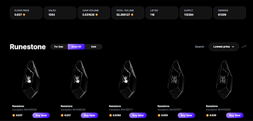

# Ordinals 协议作者密集发推，Runes 协议可能提前上线？| 比特原生动态 ①

**作者：** Rebbeca Ren

Ordinals Protocol 作者 Casey Rodarmor 最近动作频频，先是昨天（3 月 27 日）密集发推介绍 Runes Protocol 的开发进度，今天又公布了协议文档细节。

# 前情回顾

以下是给对于 Casey 和 Runes 协议不太了解的小伙伴一份前期回顾：

去年搅起一池春水、让比特币生态百花齐放的 Ordinals Protocol（序数协议）是 Casey 在 2022 年 12 月推出的，该协议根据每个聪（比特币的最小单位）的开采顺序为其分配一个序列号，例如，第一个被铸造出来的聪就被分配为第一个序列号。这使得每个聪都拥有独一无二的序列号，并且能够在交易中被跟踪。用户可以通过 Ordinals 协议将额外的数据（如图像、视频、文本等）附加到聪上，从而使其成为独特的数字资产，就像 NFT 那样。

去年 3 月 Domo 基于 Ordinals 协议开发的的同质化代币（Fungible Token）标准 BRC-20 占据 Ordinals 主流，让比特币铭文出圈，却让 Casey 感到担忧：因为 BRC-20 数量激增，会创造大量「粉尘」UTXO（未花费交易输出），进而占据大量的宝贵的比特币区块链空间，堵塞网络并增加转账费用。

于是，2023 年 9 月，Casey 提出开发 Runes Protocol 作为 BRC-20 的替代方案，并计划在四月下旬比特币减半之时上线。Runes Protocol 是一个基于比特币 UTXO 的同质化代币协议，通过简单的元组（ID, OUTPUT, AMOUNT）和 OP_RETURN 操作来管理和转移 FT 的方案。

不同于 RGB Protocol 和 Taproot Assets Protocol 需要链下数据存储和检索基础设施，或是 BRC-20 产生「粉尘」UTXO 占据比特币区块空间的问题，Runes Protocol 设计简洁、无需额外的链下数据或者原生代币才能支持部分操作，优化了链上数据占用，提高了用户体验。

# 最新进展

我们回到正题，Casey 在介绍 Runes Protocol 开发进度和公布文档时提到了哪些重点？

### Runes（符文）

是允许比特币交易 etch（蚀刻）、mint（铸造）和 transfer（转移）比特币原生数字商品。

虽然每个铭文都是独一无二的，但符文的每个单位都是相同的。 它们是可互换的代币，适合多种用途。

### Runestone（符石）

在这里，Runestone（符石）并不是指 3 月 14 日空投、火爆比特币社区的符文第一 Meme 项目，而是符文协议消息的名称，存储在比特币交易输出中。

一个符石输出的脚本公钥以`OP_RETURN`开头，后跟`OP_13`，然后是零个或多个数据推送。这些数据推送被连接起来并解码成一系列 128 位整数，最后解析成一个符石。

一个交易最多可以有一个符石。一个符石可以刻录一个新的符文，铸造一个现有的符文，并将符文从交易的输入转移到其输出。

一个交易输出可以持有任意数量的符文。符文通过 ID 来识别，ID 由刻录符文的区块和刻录交易在该区块中的索引组成（出处：@ordijingle）

### Centoaph（纪念碑）

如果符石畸形，它会被标记为 Centoaph（纪念碑）。在英文里 Centoaph 通常指为埋葬在其他地方的某人建造的纪念碑，尤其是纪念在战争中死去的人的纪念碑。

如果一个符石（Runestone）被标记为 Cenotaph，它的特殊之处在于所有输入的符文都会被销毁，并且刻在纪念碑上的符文供应量被设置为 0，不可再铸造。

有许多因素可能导致一个符石被标记为纪念碑，比如 OP_RETURN 数据不合规范、无法识别的字段等。

这种机制的目的是为了让未来的符文协议升级能够顺利进行，防止未升级的节点被欺骗，认为自己拥有实际上并不存在的符文。

### Etch（蚀刻）

符文是通过蚀刻（刻录）而形成的。蚀刻会创建符文并设置其属性。一旦设置，这些属性就是不可变的，甚至对其蚀刻者也是如此。

### Name（名称）

名称由字母 A 到 Z 组成，长度为 1 到 28 个字符。 例如 UNCOMMONGODS 是一个符文名称。

名称可能包含间隔符（以项目符号表示），以提高可读性。UNCOMMONGOODS 可能会被蚀刻为 UNCOMMON•GOODS。

名称的唯一性不依赖于间隔符。 因此，符文可能不会被蚀刻为与现有符文相同的字母序列，即使它具有不同的间隔物。

### Divisibility（可分割性）

符文的可分性是指它可以被划分成原子单位的精细程度。可整除性表示为符文数量中小数点后允许的位数。整除性为 0 的符文不能被分割。整除度为 1 的符文可以分为十个子单元，整除度为 2 的符文可以分为一百个，以此类推。

### Symbol（符号）

符文的货币符号是单个 Unicode 代码点，例如 $、⧉ 或 🧿，显示在该符文的数量之后。

整除性为 2 且符号 🧿 的符文的 101 个原子单位将呈现为 1.01 🧿。

如果符文没有符号，则应使用通用货币符号 ▣ ，也称为圣甲虫。

### Premine（预挖掘）

符文的蚀刻者（刻录者）可以选择性的为自己分配蚀刻（刻录）的符文单位。 这种分配称为预挖掘。

### Terms（条款）

符文可以拥有开放式铸造权，允许任何人为自己创建并分配该符文的单元。开放式铸造权需遵守在蚀刻（刻录）时设定的条款。

只要满足所有铸造条款，铸造权就是开放的，一旦有任何条款不满足，就会关闭。例如，铸造权可能会限制起始高度、结束高度和上限，在起始高度和结束高度之间或达到上限之前(以先发生者为准)保持开放状态。

### Cap（上限）

符文可被铸造的次数就是它的上限。一旦达到上限，铸造权将关闭。

### Amount（数量）

每次铸造交易都会产生固定数量的新符文单元。

### Start Height（起始高度）

铸造权从给定起始高度的区块开始生效。

### End Height（结束高度）

在给定结束高度的区块及之后，符文将不能被铸造。

### Start Offset（起始偏移）

铸造权从等于蚀刻（刻录）所在区块高度加上起始偏移量的区块开始生效。

### End Offset（结束偏移）

从等于雕刻所在区块高度加上结束偏移量的区块开始，符文将不能被铸造。

### Minting（铸造）

当符文的铸造权处于开放状态时，任何人都可以创建铸造交易，根据铸造条款产生固定数量的新符文单元。

### Transferring（转移）

当交易输入包含符文，或通过预挖或铸造产生新符文时，这些符文将转移到该交易的输出。交易的符石可以改变输入符文转移到输出的方式。

### Edicts（法令）

符石可以包含任意数量的法令。法令包含一个符文 ID、数额和输出编号。法令按顺序处理，将未分配的符文分配给输出。

### Pointer（指针）

处理完所有法令后,剩余的未分配符文将转移到交易的第一个非 OP_RETURN 输出。符石可以选择包含一个指针，指定一个替代的默认输出。

### Burning（燃烧）

可以通过将符文转移到带有法令或指针的 OP_RETURN 输出来烧毁符文。

## 其他几个关键点：

Runes Protocol 使用的是分层架构，每一层负责解析来自下层的数据并将其向上传递。

每个新开采的区块都会发生一个更新过程，以更新跟踪符文和相关数据的索引状态。

Casey 称 Runes Protocol 的开发工作已经接近尾声，希望能够在本周末之前发布它。

**在今年 2 月，Casey 在 HellMoneyPod 节目中详细介绍了 Runes Protocol，除了此次推文和文档中提到的重点之外，他还提到以下内容：**

- 为了防止热门且简短的符文名称在初期被快速占用，协议在最初 4 个月要求符文名称长度至少为 13 个字符。之后每隔 4 个月，最小长度要求就减少 1 个字符。
- 符文发行采用 Commit-Reveal 机制，避免矿工提前获知名称并抢先行动。
- 符文代币的单位可以是传统货币单位，也可以是任意 Unicode 表情符号，使得代币更有趣和个性化。
- 为了让每个人都有公平的参与机会，避免第一批符文被 VC 或项目方抢先占用，Casey 将前 10 个符文（0-9）硬编码为开放铸造的状态（出处：@Jasmine9m88）。

Runes Protocol 设计支持两种发行方式：

1. 固定总量，即项目方直接铭刻所有代币后分发，是更倾向于中心化的发行方式（目前 RSIC 可能成为这一玩法的龙头）。
2. 公开铭刻，即部署代币设定参数后 fair mint，类似 BRC-20，最大区别是 BRC-20 限制总量，而 Runes 限定区块高度或时间戳，但不限制总量，有效时间内打了多少，最后该代币总量就是多少。

在前文里，我们认为：

从设计和生态方面来看，Runes Protocol 并不平行于、而是从属于 Ordinals Protocol，以 FT 形式与 NFT 形式的铭文相互组合，其资产发行互为支撑，协议设计和生态社区具有目前市场热议的“图币互换”、“图币两象性”的特性。

由于与比特币 NFT 有机结合，目前 Runes 生态能够吸引更多艺术家、有影响力的 NFT 项目和社区参与建设，正在衍生更多创新玩法。

Runes Protocol 虽未正式上线，但不少打着 Runes 旗号的项目已经抢跑，吸引了市场越来越多的关注和资金，在比特币生态的热度位居前列。例如，由 Ordinal 浏览器 Ord.io 创始人 Leonidas 主导的 Runestone（符石）项目，向 113,376 个符合要求的钱包空投了 Runestone，目前单个 Runestone 的地板价都达到了 0.037BTC（$2568.03），市值超过了 200 万美元（注意，这里的 Runestone 和前面 Casey 提到的 Runetone 是两个不同的概念）。

Casey 对即将上线 Runes Protocol 充满信心，在 X（原 Twitter）上放了狠话，戏称如果上线一个月市值达不到 10 亿美元，他就当场切腹自尽。那么，Runes Protocol 到底会不会辜负 Casey？它会不会成为比特币原生资产发行新模式的领跑者? Let's wait and see。

### Runes 协议文档链接

- https://docs.ordinals.com/runes.html
- https://docs.ordinals.com/runes/specification.html

ppqq ⏰ 3 月 28 日周四今晚 8 点半，Runes 中文社区邀请比特币生态 OG 一起聊聊「如何布局 Runes 符文赛道」。

🎙️ 嘉宾：

- 比特里里 @lilyanna_btc 比特币生态研究者
- OxSea.eth @_0xSea_ Sea Talk 播客主理人
- jeanchen.sats @cryptojean27 CryptoKitchen 主厨
- Mix @MixWeb3 Runes 中文社区发起人

🔬 主持：Jasmine @Jasmine9m88 Runes 中文社区核心贡献者

**关注 X 账号**

- BIT FM：x.com/bitfm2024
- 加密厨房：x.com/CryptoKitchen23
- 领航猿实验室：x.com/NavigatorLabs

### 欢迎加入电报群讨论交流

_https://t.me/bitfm2024_
