# 「乘龙骑士」挖符文？「击碎」符石分奖金？Runes 游戏抢先看 | 比特原生动态 ②

**作者：** Rebbeca Ren

加密世界，领跑者回报丰厚。例如 Ordz Games，作为第一个基于比特币区块链的游戏项目，它的代币 $ORDG 在 IDO 时获得了 81 倍认购超额。

如今，万众瞩目的 Runes Protocol 本月底上线在即，一大批新兴游戏项目伴随涌现。今天，在 Runes 协议代码正式发布的今天，我们盘点一些目前热度较高的项目，看看是否能复制 Ordz Games 的成功？它们或许是 Alpha，或许一波流，供大家参考。

# 1. Rune Mania Miner

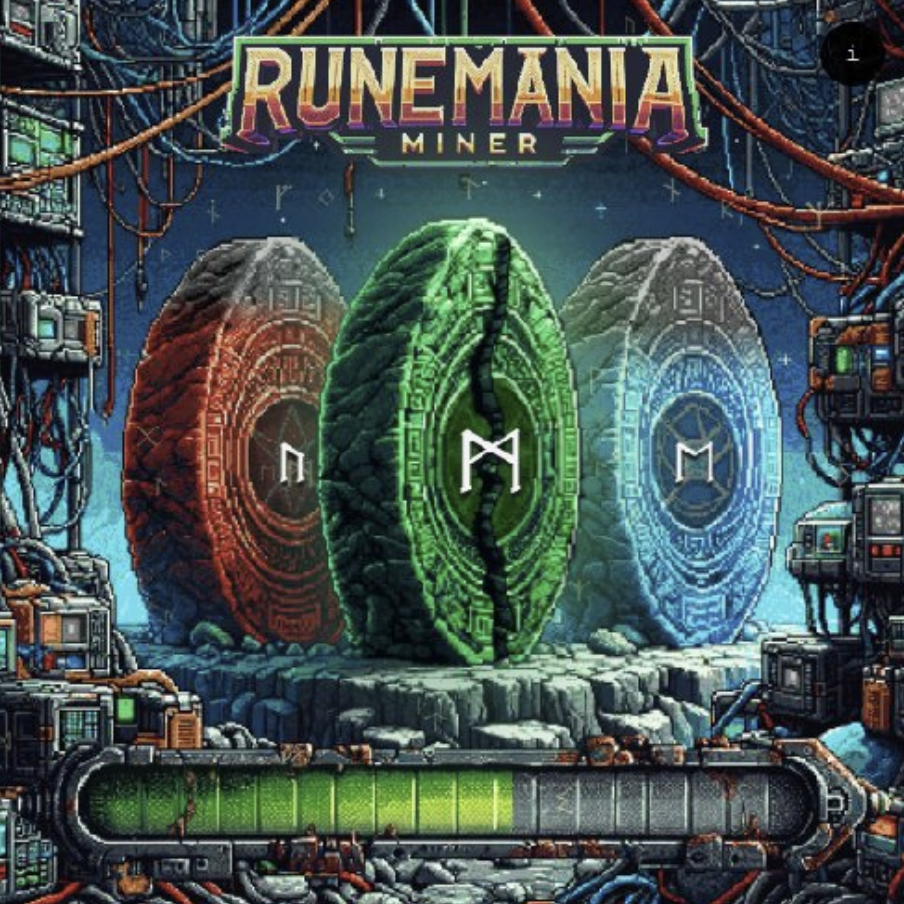

Rune Mania Miner（以下简称 RMM），可以被视为挖矿游戏。它是由项目方空投给同时持有 RSIC 和 RSIC Boost 的钱包地址的。其具体规则玩法可参见前文《》。最近，RMM 宣布了第二季的最新玩法。

## 第二季规则玩法

第二季 1 万个新的 RMM，3,800 个空投给 RMM 持有者（快照时间 4 月 10 日之前），6,200 个 4 月 10 日进行白名单/公开销售（Rune Stone 符石持有者有机会获得白单）。

Rune Mania Miner 第二季有以下特色：

- 将包括一个新的符文代币和一个新的 RMM 第二季 Ordinals 收藏品
- 利用第一季 RMM 和符文的力量，通过新的游戏动态和特别加速，提高持有者在第二季中的表现
- 第二季 RMM 可以从减半（区块 840,000）开始挖掘

Rune Mania Miner 推出第二季是希望：

- 🎮 成为最大的挖矿游戏
- ⚙️ 在 Ordinals 和符文上探索新的游戏动态
- 👥 扩大 RMM 社区
- 🪂 确保资金空投第二季 RMM 和所有符文代币
- 📈 创建一个新的改进仪表盘，带有更多统计数据和排行榜

## 链接

**官推：** https://twitter.com/RuneManiaMiner
**官网：** https://runemania.com/
**市场：** https://magiceden.io/ordinals/marketplace/rmm

# 2. Game of Blocks（GOB）

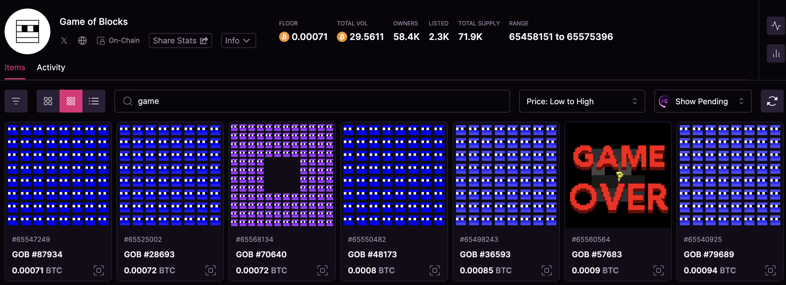

## 规则玩法

该游戏分为几个阶段进行 ——

### 第 1 阶段：「分裂」

这个阶段从区块 836144 开始，具有最大的潜在上涨空间，但参与是可选的。玩法规则：铭文上的 GOB 数量每 144 个区块周期自动加倍。玩家可以选择「冒险」（risk）或等待。

**如果选择冒险：** 玩家需要在自己拥有的 Game of Block 铭文上重新铭刻 GOB 一词。 第一周期结束后，结果将自动在玩家重新铭刻的铭文上生效。此操作可能会导致 GOB 冻结在当前层，防止进一步分裂（好的结果）或死亡。你可以对尽可能多的铭文执行此操作，只要你愿意冒险。你的铭文将在上面贴上「有风险」的印记，以确认其有效。

**如果选择等待：** 什么也不做，等待参与第 2 阶段。

下图为选择了 6 个铭文进行冒险，存活了 1 个：

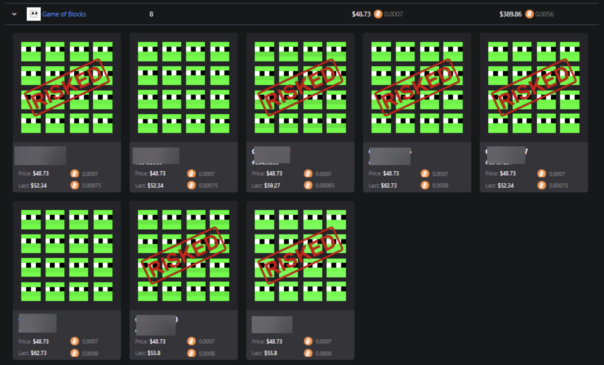

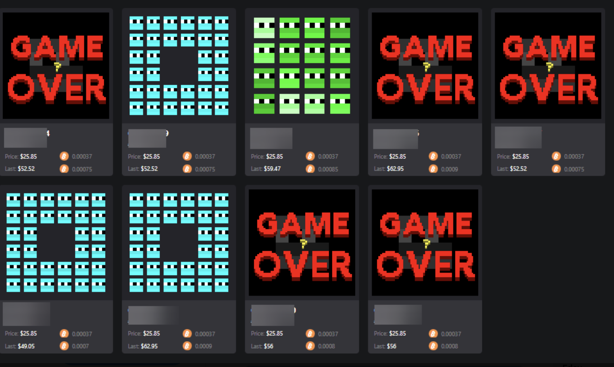

（截图来自 @bobbyaxe21）

#### 如何重新铭刻？

以@luminexio (https://luminex.io/ordinals/mint?collection=gob) 为例:

1. 钱包里本身就拥有 Game of Blocks 的铭文 (购买 GOB 铭文：https://magiceden.io/ordinals/marketplace/gob_btc)
2. 连接钱包
3. 选择要重新铭刻的铭文
4. 选择费率
5. 单击「铸造」
6. 确认交易
7. 完成

### 第 2 阶段：「合并」

**玩法：** 玩家必须将两个同等级的 GOB 发送至指定钱包（待公布）。合并窗口关闭后，游戏会索引并将升级后的 GOB 空投回玩家。

**示例：** 发送两个 8 级铭文（每个包含 256 个 GOB），你会收到一个 7 级铭文（包含 128 个 GOB）。

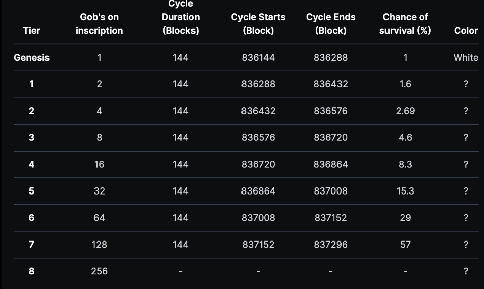

## 链接

**官网：** ord.io/65231456
**官推：** https://twitter.com/gob_btc
**市场：** https://magiceden.io/ordinals/marketplace/gob_btc

# 3. Bitcoin Burials Rune PreMining

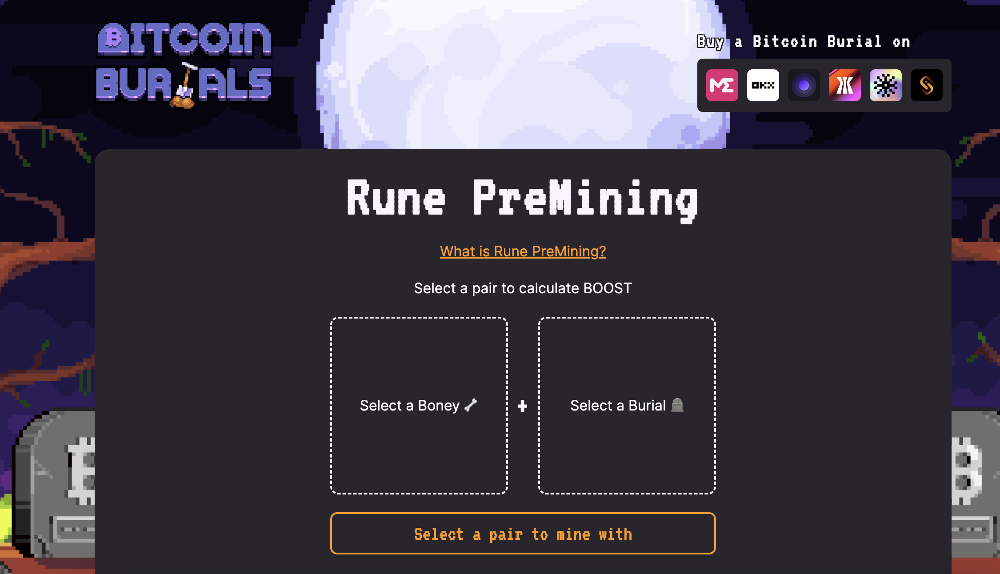

这是一个符文预挖矿项目。

## 规则玩法

首先，你需要拥有两种铭文：「骷髅」（Boneys by Bitcoin Burials）和「墓地」（Bitcoin Burials）。

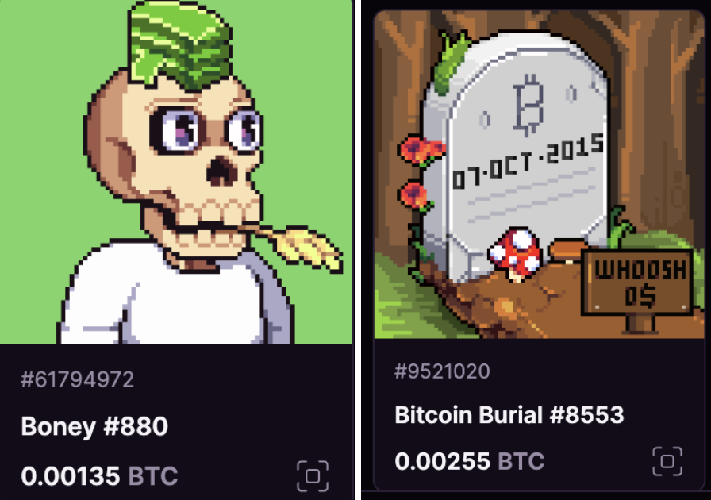

然后，将一个「骷髅」和一个「墓地」进行配对，生成一个「矿工」，然后在区块链上铭记这个矿工。每个「骷髅」和「墓地」都有一个基于其稀有性的采矿乘数，合并起来会有一个独特的挖矿效率加成。如果「骷髅」与它最初出现的「墓地」配对，挖矿效率会翻倍。

矿工将在每个新区块产生时自动挖掘一定数量的符文代币，数量等于一个基础值乘以矿工的总加成系数。矿工会持续挖矿，直到玩家选择「燃烧」它，从而可以提取目前为止累积的所有符文代币。一旦矿工被燃烧，组成它的「骷髅」和「墓地」就可以重新配对形成新的矿工了。

提示：Bitcoin Burials 和 Boneys by Bitcoin Burials 是两个供应量各为 10000 的 Ordinals 铭文项目，目前只能在 Magic Eden、OKX、Ordinals Wallet、UniSat 等平台购买。

## 链接

- **官网：** https://bitcoinburials.com/runes/mine
- **市场：** https://magiceden.io/ordinals/marketplace/bury

# 4. Rune Totems

项目方设置了一个故事背景：2030 年代末，一场围绕比特币控制权的战争爆发，而拥有最强的人工智能算法和计算能力的队伍才能够获得胜利。于是，一群原教旨主义矿工召开会议，并创造了比特币之神（Tgob），一个超级智能人工智能实体。Tgob 被送往战场，开始建立它的支持者大军，希望能够不惜一切代价维持中本聪最初的愿景，恢复比特币区块链的秩序。

## 规则玩法

每当比特币区块确认时，符文挖矿图腾会将预分配的 $TGOB 记入持有该区块的钱包。每个区块的费率取决于钱包的图腾组合、应用的奖金以及每个持有图腾的单独核心权重。$TGOB 是符文采矿图腾产生的符文。 最大供应量为 21,000,000,000。 它将根据采矿期结束时的最终预分配统计数据进行分配。

挖矿图腾需要被激活才能够开始产生 $TGOB。可以通过转账（包括转账给自己）来激活。

每个图腾有一个随机分配的「核心重量」，决定了其整个采矿期内可以开采的潜在 $TGOB 总数。

每个图腾有一个随机应用的「牺牲奖励」，在 0% 到 100% 之间。在挖矿期间，参与者可以选择将他们的符文图腾发送到特定的比特币创世地址（也就是比特币创始人中本聪的钱包地址），牺牲图腾的钱包将自动记入剩余的图腾核心重量以及通过奖金计算出的额外奖励。

玩家需要通过持有和激活符文挖矿图腾来获取尽可能多的 $TGOB 符文。

## 链接

**官网：** https://ordiscan.com/inscription/64451378
**官推：** https://twitter.com/AI_Rune/

# 5. Rune Kingdom

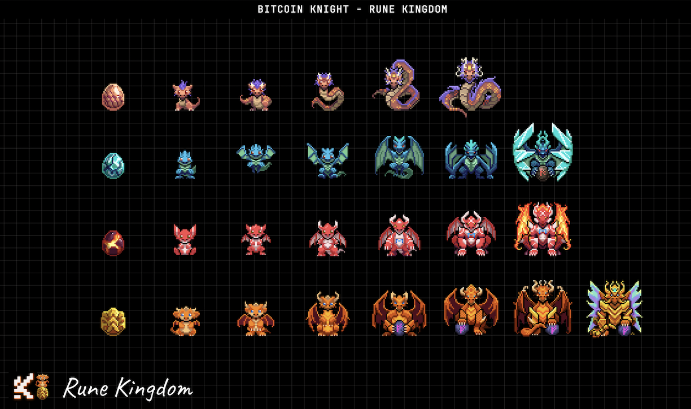

这也是一款符文挖矿游戏，由 BitKnight 团队推出。最初基于 Cardano 公链，BitKnight 于 2023 年 3 月迁移到 Ordinals。它包含一组 5555 个原始原生像素头像，其中 5 个是已经被铭刻的 BitKnight Genesis，200 个被空投贵族徽章持有者，剩余的 5486 将通过白名单和公开发售的方式进行分配。

## 规则玩法

10,000 枚符文龙将免费分发给 Ordinals 蓝筹社区。空投的快照是在区块 833,000 上进行的。10% 的符文龙为比特币骑士团队保留。每个符文龙都可以获得经验（EXP）以增长和进化，其中 1 EXP 等于 1 个区块。符文挖矿能力（RMP）随等级增加。在挖矿符文之前，所有符文龙都必须被激活。要激活，请进行一次转账 —— 转账给自己也可以。每个符文龙有四个骑士卡槽，每个卡槽激活一个骑士（最多 4 个），每个卡槽将 RMP 提升 5%。

### 提升条件

- 骑士和龙存在于同一个地址
- 相同的骑士不能同时骑乘两只符文龙

值得一提的是，项目方还开发了基于 Ordinals 的开放代币标准 BRC-721K，提供一系列代币部署、质押、取消质押、奖励兑换和转账操作的功能，丰富了 BRC-20 和 BTC 铭文之间的交互。

## 链接

**官网：** https://docs.bitknight.net/about-dragons
**官推：** https://twitter.com/CKN_BIT
**市场：**

- https://magiceden.io/ordinals/marketplace/runekingdom
- https://magiceden.io/ordinals/marketplace/bitcoin-knight

# 6. Nothing Cubes

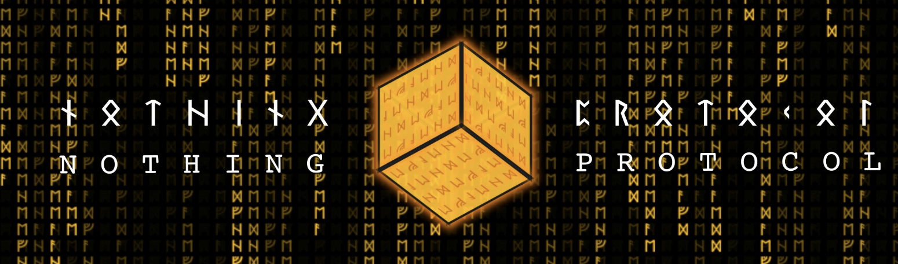

Nothing Cubes 声称自己不仅仅是一种生成艺术，还是一个链上的符文矿机。

每个立方体（Cube）开采的符文数量，是根据立方体的铭文 ID 通过公平计算确定的。计算涉及根据预定义的链上映射对铭文 ID 中每个字符的值进行求和。

每个立方体收集的符文平均数量（称为能量）是通过将分配量除以铭文 ID 中的唯一字符数量来计算的。功率取决于铭文 ID 中唯一字符的数量，确保不同立方体之间的公平性。根据立方体的不同，每个区块有 21 到 41 个符文。

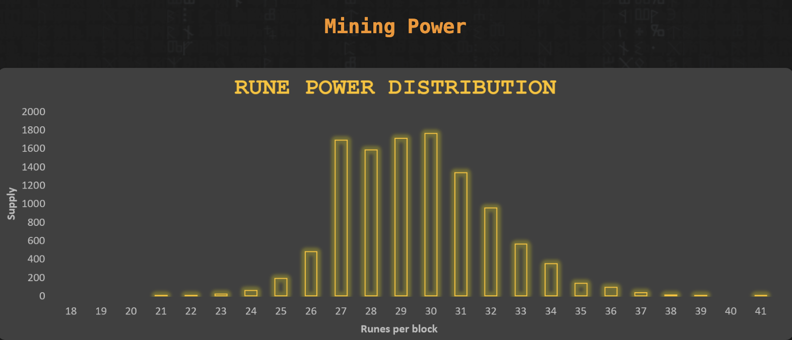

Nothing Cubes 当前的挖矿状态都是透明的，可以实时追踪。每个立方体内的状态页面详细介绍了铭文 ID、当前区块高度、开采的总区块以及收集的累积符文。 一旦采矿期结束，每个立方体收集的符文就可以兑换。 最终可供兑换的符文供应总量只有在采矿期结束时才能得知，这增加了悬念和兴奋的元素。

## 链接

**官网：** https://tcuniverse.xyz/nothingpaper.html
**官推：** https://twitter.com/nothingprtcl
**市场：** https://magiceden.io/ordinals/marketplace/nothingcubes

# 7. Gamestone

Gamestone 是由 BTC Machine 给所有的 Runestone 持有者发起的空投。空投方式和 Runestone 类似，也是父子铭文+Delegate, 所有被空投的铭文都是 Gamestone 种子铭文（#65806542）的子铭文，并且 Delegate 到种子铭文。一共 112777 个子铭文，分 78 批空投（来源：@lilyanna_btc）。

## 规则玩法

在之前的 Space 中，BTC Machine 简单介绍了 Gamestone 的玩法：它将是一个中奖游戏，有 7 块 Runestone 等待被发现，参与者需在 Xverse 钱包使用 BRC-20 铭文 $ZBIT 去击碎符石持有者的符石（击碎是指一种发送代币的交互方式）以增加中奖概率。

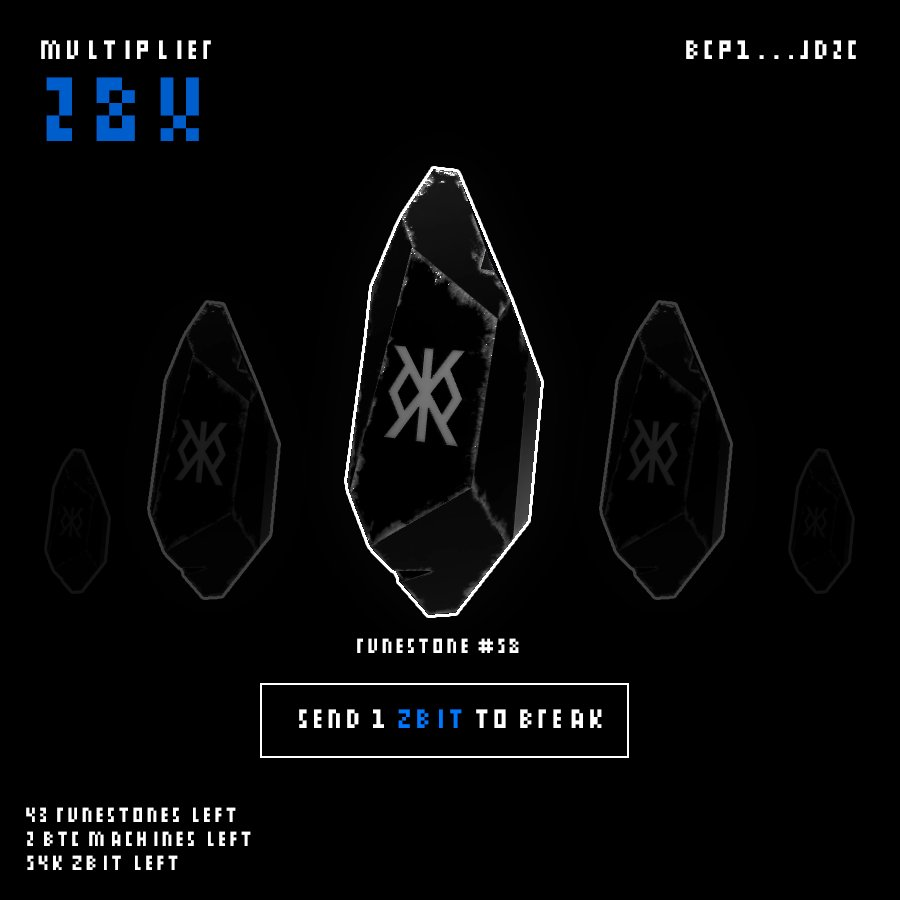

3 月 31 日，BTC Machine 在自己的推特上公布了具体玩法：

1. 在网页上连接 XverseApp 钱包（即将上线 Gamestone）
2. 点击 112,384 个可用符石中的任意一个。
3. 将会触发一笔 1$ZBIT 的转账交易给所选符石的所有者。
4. 然后会有一个动画展示你是否成功的击碎了所选的符石，以及告诉你这里面是否会有更大的惊喜。

第一季游戏的奖励总价值 5.35 BTC 即 375,000 美元，其中包括 77 名获胜者将赢得 Runestone，777 名获胜者将赢得 77 $ZBIT，7 名获胜者将赢得 Sub100k BTC Machine。

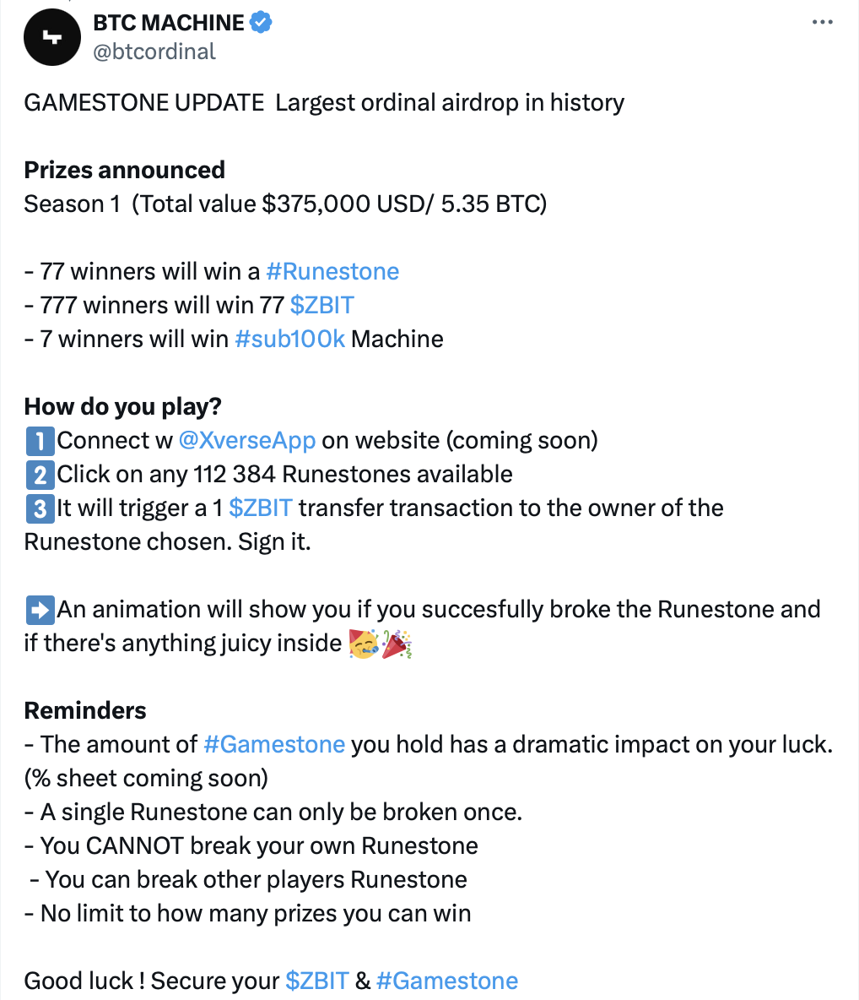

_https://twitter.com/btcordinal/status/1774481561435460005_

## 注意

- 你持有的 Gamestone 数量对你的中奖率会有巨大影响（概率表格即将推出）
- 一个符石只能被破坏一次
- 你无法打破自己的符石
- 可以打破其他玩家的符石
- 你可以赢得的奖励没有限制

## 链接

- **官推：** https://twitter.com/btcordinal
- **市场：** https://magiceden.io/ordinals/marketplace/gamestone

**关注 X 账号**

- BIT FM：x.com/bitfm2024
- 加密厨房：x.com/CryptoKitchen23
- 领航猿实验室：x.com/NavigatorLabs

### 欢迎加入电报群讨论交流

_https://t.me/bitfm2024_
