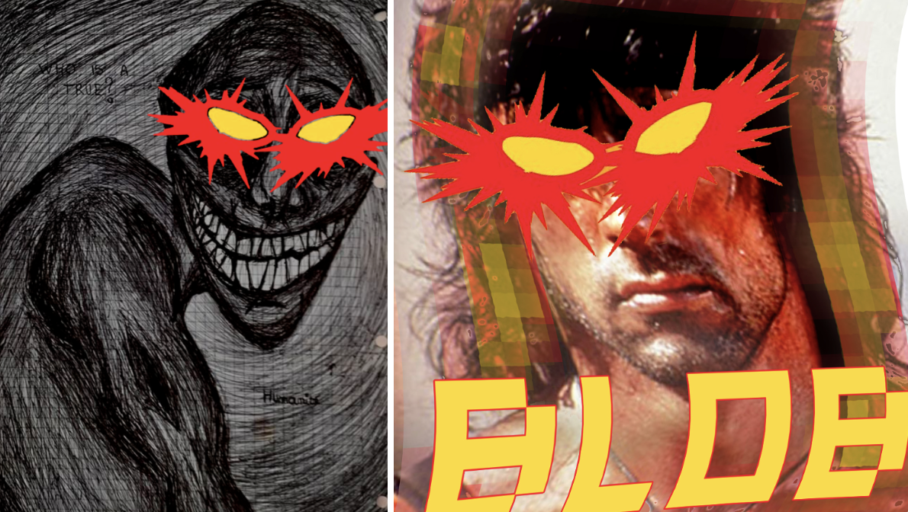
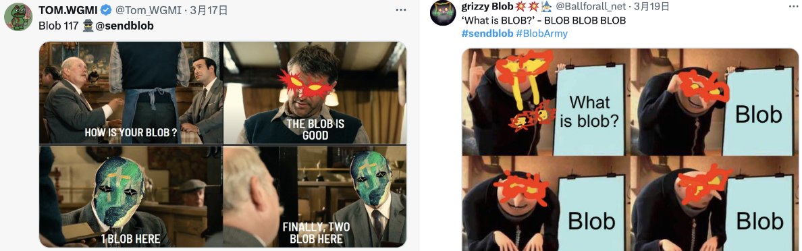
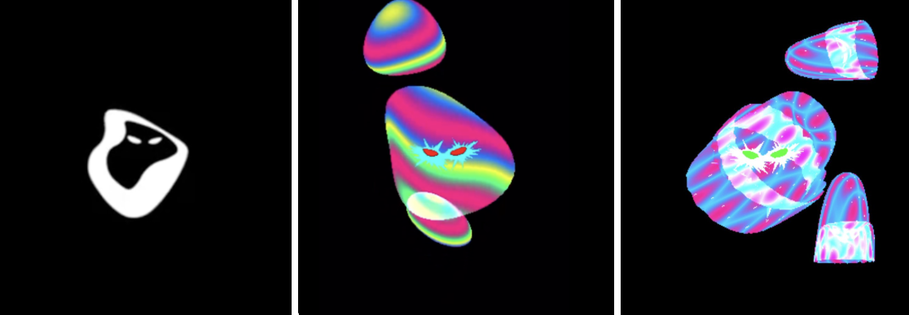
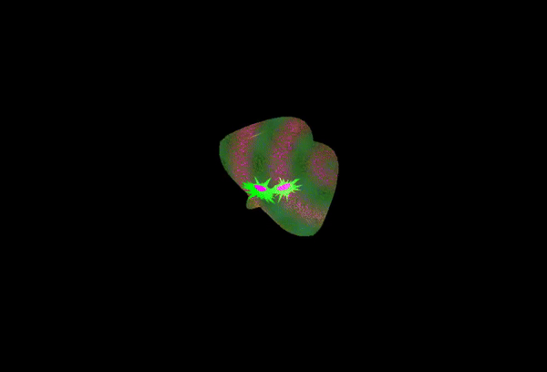

# BlobArmy「攻陷」推特，Ordinals OG 发起的 BLOB 有什么过人之处？ | 比特原生动态 ③

**作者：** Rebbeca Ren

如果你是一个活跃的推特用户，那么这几天你的时间线或许被大量包含 💥💥 的图片所「霸屏」过。

比如这样 ——

再比如这样 ——

这些「怪诞不经」的图片通常会附带着 #SendBlob 或者 #BlobArmy 之类简短的文字，仿佛一股神秘力量在传播，但对外人而言，这究竟是什么东西，根本无从得知。

其实这就是近期最受关注的比特币 NFT 项目 BLOB，即 Bitcoiners Love Bitcoiners 的缩写 —— 而在计算机领域， BLOB 代表的是 Binary Large Object，即二进制大型对象。

秉承着打造一个以科学家、艺术家、数字朋克，开发者社区领袖以及无私的贡献者为主，兼备编码和艺术特质朋克社区的理念，Ordinals」社区的两位元老 @Elocremarc 和 @nurorealm 创立了 BLOB 项目，并把它设立为免费铭刻（free mint）。

_不同状态的 BLOB_

为了能够拉拢来中文区最优秀的生态参与者加入 BLOB，项目方在早期的白名单分配中更倾向于选择 Ordinals OG、艺术家、开发者、OG 藏家等，并鼓励大家制作 BLOB 艺术作品在推特上传播 —— 这就是你的时间线被「攻陷」的原因，传播范围之广，着实令人瞩目。

目前白名单已经出炉，一些朋友已经收到了 BLOB 的空投，未收到的朋友可以密切关注，等待公开铭刻（只需要支付 gas fee）的机会。

## 关于 BLOB 的细节

文件类型与大小：该铭文是一个 HTML 文件，具有 'text/html;charset=utf-8' 的 MIME 类型，文件大小为 1.04 KB。

创建时间与区块信息：该铭文创建于 2024 年 4 月 3 日，5:37 PM UTC，位于区块 837,573 中。

所有权与交易信息：铭文的所有者通过一个特定的比特币地址（bc1pu...hzdxs）标识 @Elocremarc。此外，创建该铭文的交易 ID 为 7be92...6685b，创建费用为 26,849 聪（约为$18.21）。

Sat 编号与名称：该铭文的 Sat 编号为 1749358685368819，Sat 名称为 blobnwtbook，并且其创建区块为 559,486，创建年份为 2019。

## 关于 BLOB 具备的一些特征（Traits）

- art: 创建一个模拟风吹效果的动画，通过改变顶点位置来模拟表面在风中波动的效果。
- taffy: 生成能量流动效果，通过动态改变顶点位置来模拟能量在表面流动的视觉效果。
- twist: 产生扭曲效果，通过计算与动态球心的距离来对顶点位置进行扭曲，创建更复杂的动态变形效果。
- compression: 类似于 twist，但是用于产生压缩效果。
- dance: 通过动态调整球体半径和顶点位置来模拟球体合并和分离的效果，创建一种动态的舞蹈效果。
- electric: 生成电击效果，通过添加随机抖动和脉冲效果来模拟电流流过表面的视觉效果。
- knead: 创建一种类似于揉捏或波动的效果，通过周期性地改变顶点位置来实现。
- live: 结合基本的波动运动和动态生成的「刺」效果，模拟一个生动的、动态变化的表面。
- mystery: 生成一个包含随机噪声和颜色渐变的神秘图案。
- cultural: 通过混合不同的颜色和模式来模拟特定文化主题的视觉效果。
- social: 创建一个模拟社交场合中光泽和动态波纹效果的视觉效果。
- environmental: 生成一个模拟自然环境，如森林和草地的视觉效果。
- spiritual: 通过动态图案和颜色渐变来创建一种精神或神秘的氛围。
- emotion: 生成一个模拟情感波动的视觉效果，通过颜色和动态图案来表达不同的情绪。
- mental: 创建一个模拟思维活动或心理状态的视觉效果，通过复杂的图案和颜色变化来实现（来源：@ordijingle）。

除了由 Ordinals OG 发起，引发社区热议这些「先天优势」之外，BLOB 背后的创新技术和互动艺术也非常值得关注。

每一个 BLOB 都有独特的动态特性，而不是静态的图片。这是通过将 HTML、CSS 和 JavaScript 直接嵌入到区块链铭文中实现的。BLOB 的核心在于实时获取和处理区块链数据，它使用递归端点动态检索铭文 ID、元数据等信息，让这些艺术品栩栩如生。

_图为 BLOB 跟着鼠标指示进行互动_

交互性是 BLOB 的关键所在。通过复杂的脚本，BLOB 艺术品可以对观众的参与做出反应，不断变化和发展，这不仅是一种观赏型的艺术,更是一种全新的互动体验。（来源：@sv3nsei）

在比特币生态中，NFT 项目层出不穷，令人目不暇接。突然间，BLOB 带着一股「怪诞」感横空出世，但惊喜的是，经过深入研究，你会发现它背后蕴藏着独特的技术创新，或许足以让它成为今年最引人瞩目的项目之一。

**关注 X 账号**

- BIT FM：x.com/bitfm2024
- 加密厨房：x.com/CryptoKitchen23
- 领航猿实验室：x.com/NavigatorLabs

### 欢迎加入电报群讨论交流

_https://t.me/bitfm2024_
