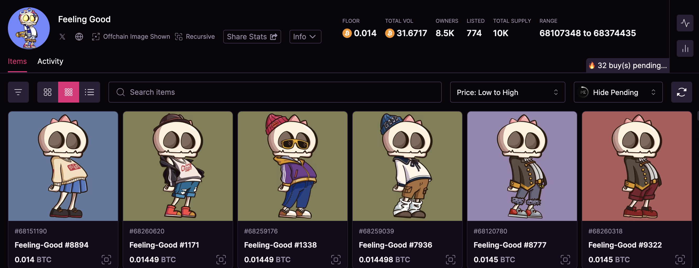
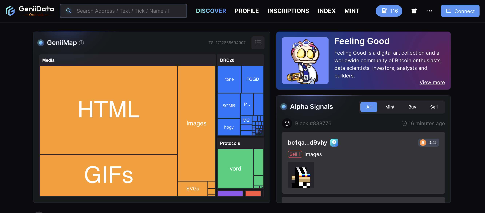
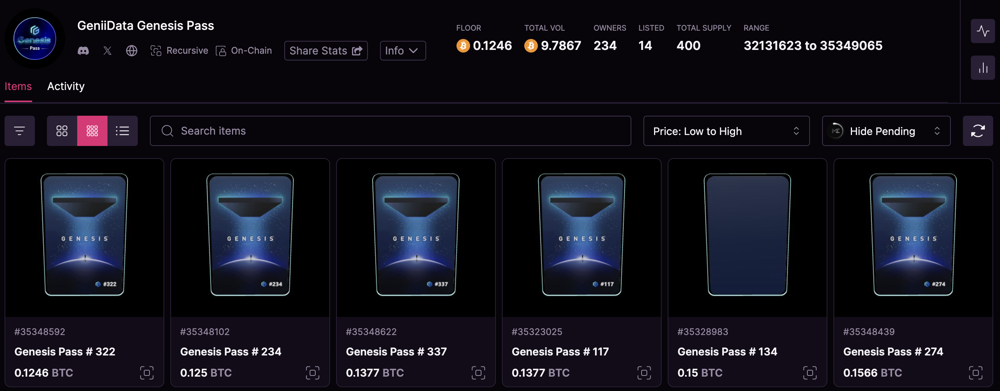
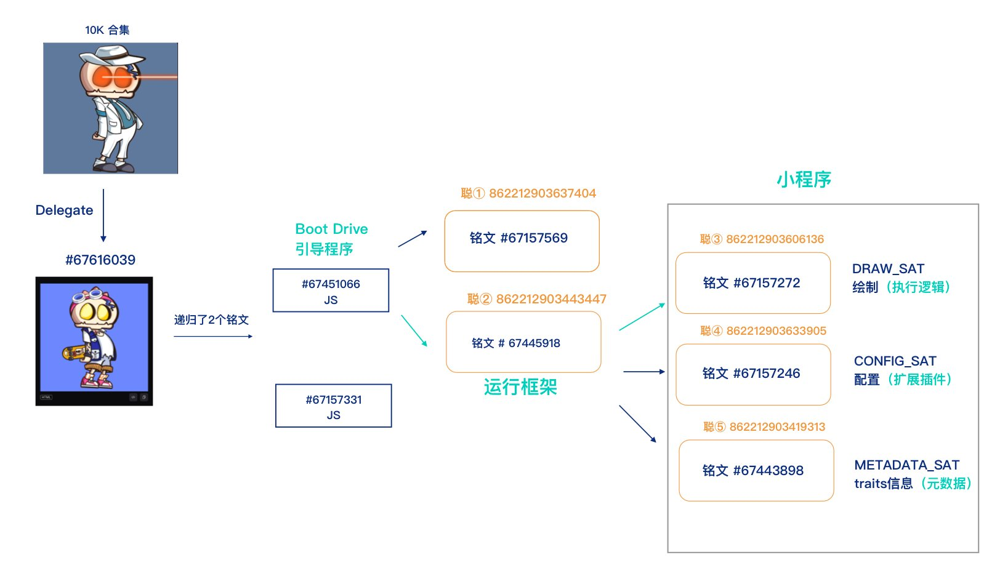

# 比特币减半在即，你 Feeling Good 了吗？ | 比特原生动态 ④

**作者：** Rebbeca Ren

随着比特币减半临近，预计之后的 gas 费用将会上涨，这将增加无论是进行 Airdrop（空投）、Mint（铸造）还是 Inscribe（铭刻）的成本。

为了应对这种变化，许多项目方都在努力争取在 4 月 20 日比特币减半之前抓住机会，密集推出各种「福利」活动，以吸引更多的关注和支持，为他们未来的计划奠定基础。

先是 BlobArmy「攻占」Twitter 时间线，现在又有蓝筹项目 Feeling Good「大格局」拉拢人心。

**Feeling Good 免费公开铸造（Public Mint），目前地板价达到 0.014 BTC**

Feeling Good 是由 GeniiData 最近推出的一款限量 10000 件的 Ordinals 铭文系列,旨在向比特币先驱者的韧性和成就致敬，以及和那些为比特币和 Ordinals 的发展做出贡献的人们一同分享喜悦。

项目发行分为三个阶段，前两个阶段是向 Genesis Pass 的持有者分别进行空投和开放白名单，第三阶段开放给所有人公开铸造。

4 月 10 日，公共铸造阶段倒计时达到 00:00:00 的一瞬间，网站即因超出预期的巨大流量而崩溃，反映出大家对项目的极高关注度和参与热情。

正当许多个人玩家认为自己无法与大玩家竞争，可能失去参与公开铸造的机会时，项目方宣布：为确保社区成员能公平参与，决定暂时关闭网页并暂停公开铸造，20 分钟后恢复。

这一措施最大限度地确保了个人玩家的利益，为 Feeling Good 赢得了广泛的赞誉和好感。网页恢复后，大家只需支付 gas 费用，即可进行铸造。目前，Feeling Good 的地板价站在了 0.014 BTC。

**为什么说 Feeling Good 是蓝筹项目？**

这不得不说起它背后的项目方 GeniiData，想必对于熟悉 Ordinals 生态的各位来说，并不陌生。

GeniiData 是一个集实时追踪加密货币交易、市场情绪分析等为一体的平台，它更是专门为铭文交易者和爱好者提供了一整套工具和服务：

1. 寻找铭文里的 Alpha：通过实时分析和跟踪与特定代币相关的指标，例如铸币活动、进展情况、铸币排名、持有人变化等，为用户提供寻找 Alpha 的建议。

2. 投资组合跟踪器：跟踪用户的持仓、监控绩效，并根据实时数据做出明智的决策，帮助用户高效地管理加密投资组合。

3. 铭文搜索引擎：GeniiData 的超全的搜索引擎使用户能够发现和探索与不同代币相关的铭文，极大的简化研究特定项目和寻找相关信息的流程。

4. Inscribe（铭刻）和 Mint（铸造）：GeniiData 也支持铸造各种类型的铭文，包括 TEXT、BRC20、ORC20 TICK 等。

通过扎实产品技术和稳定的服务，GeniiData 已经积累了相当多的忠实用户。

为了回馈早期用户，GeniiData 在 2023 年 10 月推出了一个供应量仅为 400 个的铭文系列 Genesis Pass。这是一个经历了长期时间验证的项目，价格稳健增长，目前地板价维持在 0.1246 BTC。

**虽然画风和呈现方式看似简洁，但 Feeling Good 背后并不简单**

Feeling Good 区别于其他铭文项目的一个独特之处在于，它支持头像与全身视图之间的相互转换，提供了更丰富的视觉体验。如下图所示，用户可以通过点击右上角的图标，轻松切换头像和全身视图。

根据比特币生态科普博主比特里里（@lilyanna_btc）的分析，Feeling Good 集成了至少 6 种技术，分别是递归铭文、Delegate、Sat Endpoint、JavaScript、Metadata、和 Reinscribe。

不同的外观和装扮是通过 Delegate 叠加递归铭文，并调用 Sat Endpoint，利用每个铭文的 Metadata 信息来展现的。

这个项目涉及的 10,000 个铭文首先通过 Delegate 技术指向同一个铭文（#67616039），这个铭文进一步递归链接到两个铭文，分别为#6745157331 和作为引导程序的#67451066（见下图）。

_来源：@lilyanna_btc_

作为引导程序的 #67451066 铭文通过 Sat Endpoint 调用了编号为 86221290344347 的聪。这个聪在其下实现了完整的执行逻辑、扩展插件和元数据模块，从而构成一个运行框架，功能类似于一个小程序。这表明每个 Feeling Good 小人背后都有一套复杂的代码逻辑。

更为引人注目的是，项目方还埋藏了一个彩蛋，给这个过程中用到的 5 个聪留出了能升级到 v2、v3 甚至更多版本的空间。

鉴于项目方的精心设计和技术深度，比特里里认为，Feeling Good 并不逊色于之前呼声颇高的 Blob 项目。

**GeniiData 会更加「宠爱」Feeling Good**

尽管目前看来 GeniiData 社区并不擅长制造 FOMO 氛围，但它一直保持着一大批忠实且长期的支持者。

一位同时持有 Feeling Good 和 Genesis Pass 的用户在推特上分享说：「自从 2023 年 Genesis Pass 推出后，我就开始关注 GeniiData，从那时起，我几乎每天都在使用它。我对这个平台非常有信心，并将坚定不移地支持下去，因为我相信团队在过去几个月所展现出的一切。随着符文协议的即将推出，我相信 GeniiData 将发挥重要作用，并保证持有者们将继续受益。」

在和 Ordinal Revolution 录制节目时，GeniiData 的营销负责人 Adiv Aarons 也做出了承诺：「对于 Genesis Pass 持有者，我们后续做了很多事情，比如梅林质押、空投和白名单，我们从来没有落下社区，现在，我们也会给予 Feeling Good 的持有者特别的关注。」

源自 GeniiData 的背景、在公开铭刻时引起的热议，以及分析师的正面评价，使得 Feeling Good 像是一位天生具备「银汤匙」的孩子，不仅能给大家带来足够多的想象空间，也能提供足够多的稳定性和踏实感 —— 这一切都足以让持有者简简单单的「Feeling Good」。

**关注 X 账号**

- BIT FM：x.com/bitfm2024
- 加密厨房：x.com/CryptoKitchen23
- 领航猿实验室：x.com/NavigatorLabs

### 欢迎加入电报群讨论交流

_https://t.me/bitfm2024_
