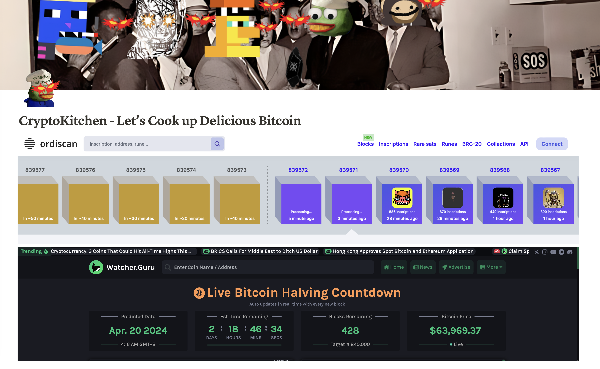
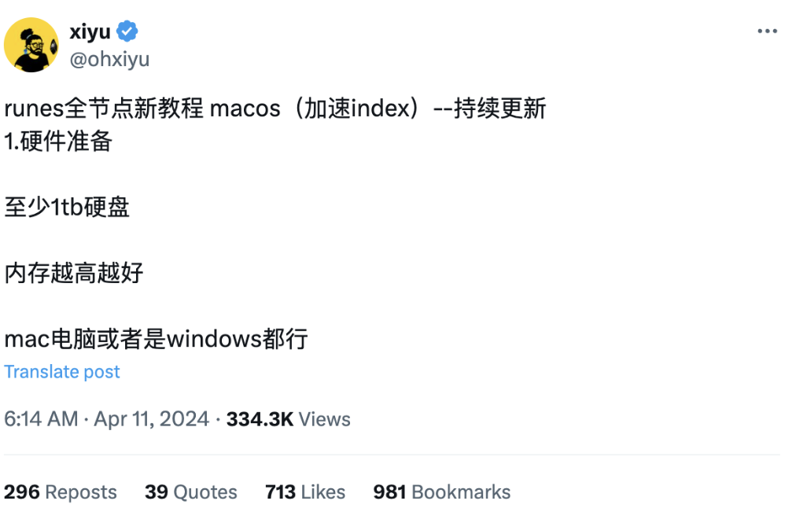

# 首个符文代币 3 天后开打，自己搞全节点还是靠平台代打？ | 比特原生动态 ⑤

**作者：** Rebbeca Ren

> 三天后，2024 年 4 月 20 日北京时间本周六上午 4 点左右，比特币历史上第四次减半。

这次比特币减半吸引最多人关注和参与的就是 Runes 协议主网上线，开打第一个符文代币。作为比特币建设者、投资者、爱好者，抑或 Fomo 者，你是自己部署全节点还是靠平台代打？

随着比特币第四次减半的临近，业内目光开始聚焦于同步启动的「符文协议」（Runes Protocol）——这个由 Ordinals Protocol 创始人 Casey Rodarmor 开发的同质化通证协议，旨在提供一种比 BRC-20 更加节省比特币链上空间、更负责任的代币发行方式。

在最近的推特时间线上，你或许看到了许多 KOL 发布了手把手教大家「布局全节点」的技术攻略，以迎接符文协议的到来。

**那么为什么要布局全节点呢？这就要说回符文代币的创造和发行机制。**

「蚀刻（Etch）」是创造符文代币的首要步骤，这一过程涉及到设定符文代币的基本特性和管理规则，如可分割性和铸造条件等。

在蚀刻的过程中，项目方可以选择是否进行「预挖（Premine）」，也就是在符文代币公开流通前，先将一部分代币预先分配给项目的创始人或发起者。这么做主要是为了提供项目启动资金、奖励开发者，或者为社区活动及其他特定的分发预留代币。

蚀刻完成之后，就进入到「铸造（Mint）」阶段，即生成新代币的过程。根据在蚀刻阶段设定的条件，铸造可以是公开或封闭的：

1. 公开铸造（Open Minting）：任何符合预设条件的人都可以创建新代币，这确保了社区成员能够积极参与到符文生态系统的发展中。
2. 封闭铸造（Closed Minting）：只有在满足特定的预设条件（例如达到一定的数量或过了特定的时间）之后，才能进行新代币的铸造。一旦这些条件不再满足，铸造过程将停止，从而限制了代币的总供应量。

为了避免第一个符文被 VC 或项目方抢走或预挖，Casey 决定将前 10 个符文（Rune 0 - Rune 9）硬编码至符文协议中，并且只支持公开铸造，让大家都能公地参与。

其中，名为 UNCOMMON•GOODS 的 0 号符文将在这次比特币减半时自动开始铸造，区块高度为 840000，允许任何人在未来四年内随时铸造。由于这是符文协议下的第一个代币，所以期待值很高，大家都想第一时间参与到公开铸造中，但这也会造成上线当天「代打（token minting）」平台或者代打工具的流量过载，崩溃宕机，所以搭建全节点是最稳妥的方式。

**那么怎样搭建全节点？**

运行自己的比特币核心（Bitcoin Core），避免依赖第三方服务。从 bitcoin.org 下载适合你操作系统的比特币核心软件，并安装在 SSD 硬盘上。

安装 Ord 和 Runes 客户端。

在设置好比特币核心、Ord 和 Runes 客户端之后，就可以开始在测试网上用命令行练习蚀刻和铸造符文了。

想要了解更多详细信息，例如安装和运行全节点的详细教程，可以参考 @ohxiyu（https://x.com/ohxiyu/status/1778365892130373729 ）和 @web3annie（https://x.com/web3annie/status/1779457207916224891）推文，或者你也可以自行搜索相关内容。

如果你担心安装全节点的难度过大，也有更简单的参与方式——使用代打平台。这里有一些小技巧：

① 准备多种钱包：由于不同的代打平台可能支持不同类型的钱包，建议准备几种常用的钱包，如 Unisat Wallet、OKX Wallet、Xverse Wallet 等。这样可以根据需要随时切换到不同平台。

② 合理管理 UTXO：对每个钱包里的 UTXO 进行分拆，增加 UTXO 数量。如果钱包里的 UTXO 数量过少，即使金额再大，能并行发起的交易数量也非常有限。

但单个 UTXO 金额也不能太低。比如，单个 UTXO 在十几刀或者几十刀左右时，钱包会拼凑 UTXO 进行支付时，这将增加你的网络费成本。尤其考虑到比特币减半后 Gas Fee 会飙升，因此不建议使用太多零碎的 UTXO 来凑单。

每个地址建议保持至少 3 个以上的 UTXO，每个 UTXO 的金额最好不要少于 500 美元，以优化交易成本和效率。（出处: @lilyanna_btc）

以下是目前支持符文代打的平台：

1. OKX Web3
2. Unisat Wallet
3. Luminex（https://luminex.io/）
4. GeniiData（https://geniidata.com/ordinals/inscribe/text?ref=M9LTHP）
5. UniCross（https://unicross.xyz/index）
6. Rune Alpha（https://runealpha.xyz/etch）

Let’s Fxxking Go!

# 比特币减半倒计时只剩 3 天，你准备好迎接符文了吗？

ppqq 推特关注 Runes 中文社区 @RunesCC、BIT FM @bitfm2024，我们将在比特币减半之前 2 小时开启马拉松式 Space 直播，邀请比特币生态的建设者、OG 和 KOL 实时分享打符文盛况，传递最新市场消息，带来技术数据解读。

Let's #Rune 🔥🔥🔥

**关注 X 账号**

- BIT FM：x.com/bitfm2024
- 加密厨房：x.com/CryptoKitchen23
- 领航猿实验室：x.com/NavigatorLabs

### 欢迎加入电报群讨论交流

_https://t.me/bitfm2024_
