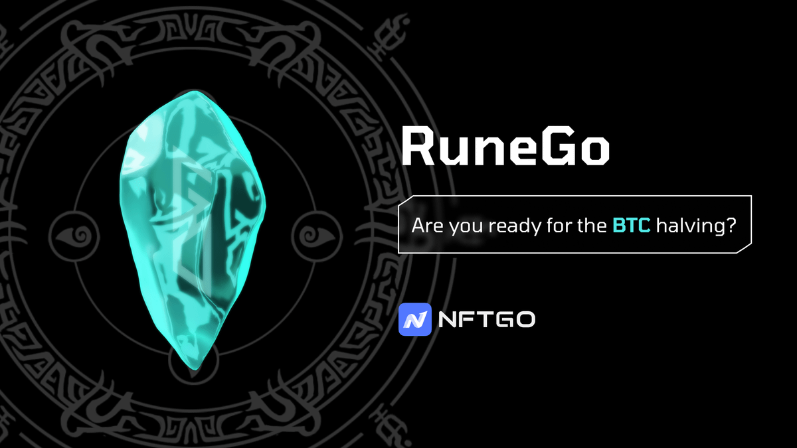
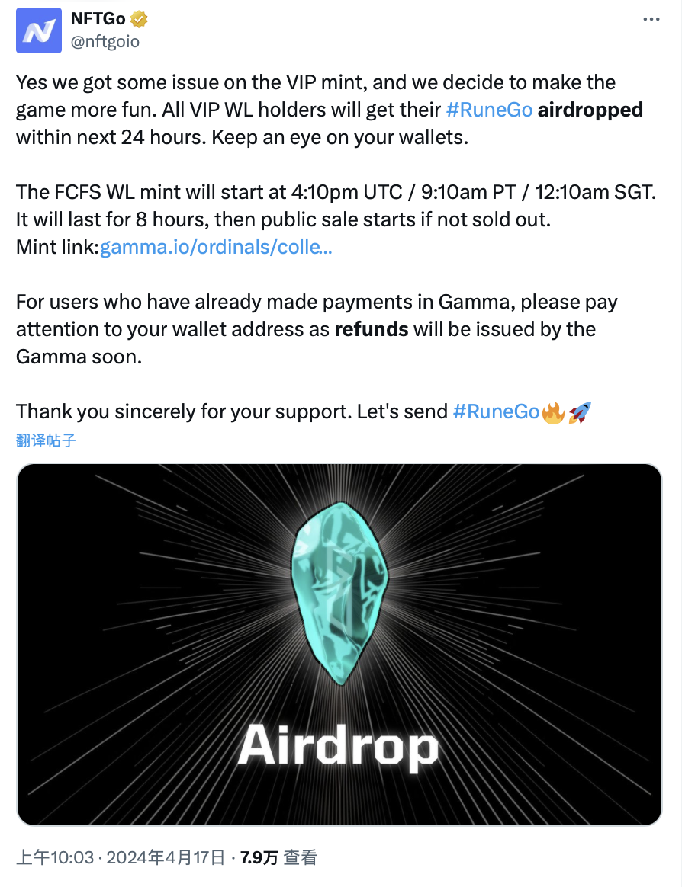
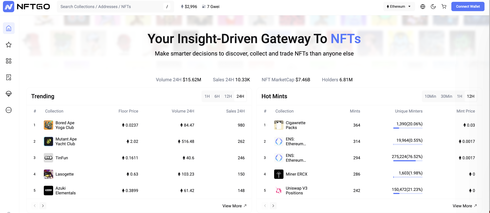
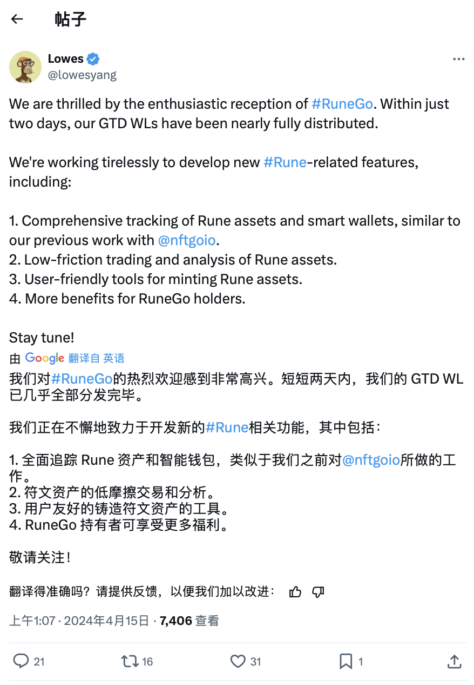
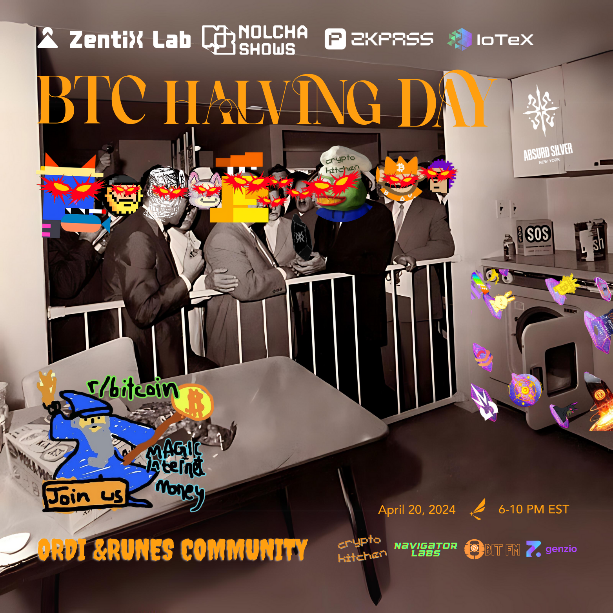

# NFTGo 用空投弥补 Gamma 平台失误，好感度拉满！还有哪家支持符文？ | 比特原生动态 ⑥

**作者：** Rebbeca Ren

在 Runes Protocol（符文协议）即将上线的关键时刻，各大 Ordinals、其他 NFT 平台争相推出相关项目，试图获得更多的关注和社区的支持。

在各方绞尽脑汁、无所不用其极的博出位之时，RuneGo 却通过一次「走心」的危机管理，将挫折转化为机遇，用真诚赢得了社区的广泛好评。

4 月 17 日昨天北京时间下午 3 点，RuneGo 的 VIP 白名单铸造在 Gamma.io 平台启动，获得白单的参与者满怀期待地开始铸造。不幸的是，不少人在支付了铸造费用后发现所有的铸造尝试都以失败告终，几乎无一幸免。

虽然查找问题发现是 Gamma.io 平台技术故障导致，但让已支付费用的铸造者们陷入了钱和铭文两空的焦虑之中。

发行 RuneGo 的项目方 NFTGo 了解社区这一顾虑，迅速在 Twitter 上公布了这一情况，努力安抚参与者们，并立刻联系位于纽约的 Gamma.io 来解决问题。

由于时差此时纽约正处于子夜凌晨，Gamma 并不能立马修复故障，NFTGo 决定启动 Plan B 安抚第一批进行铸造的参与者 —— 改变之前锁单铸造方式，直接将 RuneGo 空投给 VIP 白单持有者，并对所有支付了费用未成功的参与者退还铸造费用。

尽管当时比特币网络手续费已飙升至 120 聪，NFTGo 仍然不惜花费高达 60000 u 的费用来完成这一空投退款操作，直接把好感度拉满，社区伸大拇指直呼「大格局」。

北京时间 18 日 0:10 进入第二轮幸运白名单铸造时，NFTGo 和 Gamma.io 已经解决发射平台技术故障，剩余的 7000 个 RuneGo 在短短 8 分钟内被迅速铸造完毕，大家用行动表示对项目方的支持。

**现在来了解一下 NFTGo**

据其自我介绍，NFTGo 是一家专业且用户友好的 NFT 数据聚合器，提供了全方位的服务，包括 NFT 交易和资产实时数据的追踪与分析，助力用户深入了解市场动态并优化投资决策，致力于成为 NFT 领域的彭博终端。

随着符文协议即将上线，NFTGo 也将上线一系列相关产品，包括一套符文资产和智能钱包的全面管理工具，低摩擦交易和资产铸造的服务。而此次铸造的 RuneGo，就是为了庆祝符文相关服务上线而推出的。

NFTGo 的创始人 Lowes Yang 在 Twitter 上向 RuneGo 持有者承诺提供更多的福利，使得 RuneGo 成为了一张极具价值的「入场券」，为参与者打开了解锁新机遇的大门。

除了 NFTGo 还有哪些平台支持符文呢？我们为大家整理了一下：

## 钱包

**Xverse Wallet**：主流比特币钱包之一。 Xverse Wallet 基于 Stacks (STX)平台开发且由比特币提供安全保障，可以交易 FT 和 NFT、访问 DeFi 以及其他去中心化应用。Xverse Wallet 已经宣布支持符文协议，用户可以轻松与基于符文的应用程序和资产互动。

🔗 https://www.xverse.app/

**Unisat Wallet**：在 BRC-20 市场独占鳌头的主流比特币钱包之一，和 Xverse Wallet 的功能类似。Unisat Wallet 目前正准备启动一个测试网以促进这符文资产的支持。

🔗 https://unisat.io/

**OKX Wallet**：中心化交易所中最早重注投入 Ordinals 生态的 OKX 开发的 Web3 钱包也已经宣布支持符文协议，将其纳入支持各种代币标准的举措中，这会极大的拓展符文的实用性和接受度。

🔗 https://www.okx.com/zh-hans/web3/rewritethesystem

## 工具

**RuneAlpha**：去年 12 月 5 日第一个抢发符文概念铭文 COOK 的平台，其开发的区块浏览器和一体化应用程序，专注于提供符文蚀刻工具和加速功能，助力用户更快速高效地参与符文生态。

🔗 https://runealpha.xyz/

**Ord.io**：最老牌的铭文浏览器，其创始人就是为社区空投 Ordinals 第一 meme 符石 Runestone 的 Leonidas。其允许用户以独特的方式探索、浏览铭文并对其进行投票。最近刚完成的种子轮融资筹集了 200 万美元，并打算利用新资金扩大对符文协议的支持。

🔗 https://www.ord.io/

**GeniiData**：作为一个综合性的铭文平台，GeniiData 引入了面向符文的交易处理更新，通过提供跟踪和投资组合管理功能来支持符文生态系统。最近刚发行了 Feeling Good。

🔗 https://geniidata.com/ordinals/home?ref=S1F8GG

**Luminex**：主流比特币 NFT Launchpad。Luminex 推出了符文蚀刻工具，专注于提供拆分 UTXO 和加速服务，这对于打符文活动尤为重要。

🔗 https://luminex.io/

**SatoSea 和 UniCross**: 这两个平台都是主流的铭文铸造平台，也将要提供符文蚀刻工具和加速功能，UniCross 还特别在 Layer2 上推出了跨链 BTC 铭文铸造平台。

🔗 https://satosea.xyz/en/hot_mints
🔗 https://unicross.xyz/

## 交易市场

**Magic Eden**：上轮牛市 Solana 公链第一大 NFT 交易市场，在 2022 年熊市并未随 FTX 破产、Solana 崩溃而倒闭，而是艰苦自救，成为最早支持投身 Ordinals 的主流 NFT 交易市场，如今同时支持 Solana、Ordinals 和以太坊 NFT，交易额远超上轮龙头 Opensea。作为顶流交易平台的 Magic Eden 将其支持扩展到了符文协议。平台列出了多个与符文相关的集合，并允许用户进行铸造、交易和跟踪。

🔗https://magiceden.io/

Let's #Rune 🔥🔥🔥

# 比特币减半，纽约庆祝之夜

ppqq就在比特币减半的 4 月 20 日美国东部时间晚 6 点，在 SOHO 区核心的画廊，加密厨房 CryptoKitchen、将与ZentiX Labs、Nolcha Shows、zkPass、IoTeX、BIT FM、NavigatorLabs一起举办比特币减半庆祝之夜聚会。

**日程**

- 18:30 - 19:00 IoTeX 产品主管 Aaron Basi 发表主题演讲：DePIN 在比特币时代的崛起
- 19:00 - 19:30 小组讨论：比特币减半后，Ordinals 和 Runes 生态的发展前景
- 19:30 - 21:30 pm 艺术品展示、交流和减半庆祝活动开始！

身在纽约的朋友，欢迎报名：https://lu.ma/BTCHalvingNYC

**关注 X 账号**

- BIT FM：x.com/bitfm2024
- 加密厨房：x.com/CryptoKitchen23
- 领航猿实验室：x.com/NavigatorLabs

### 欢迎加入电报群讨论交流

_https://t.me/bitfm2024_
