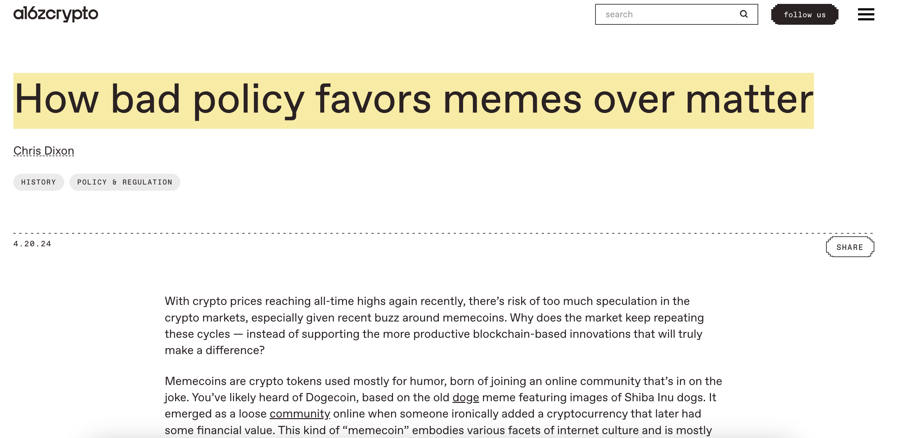
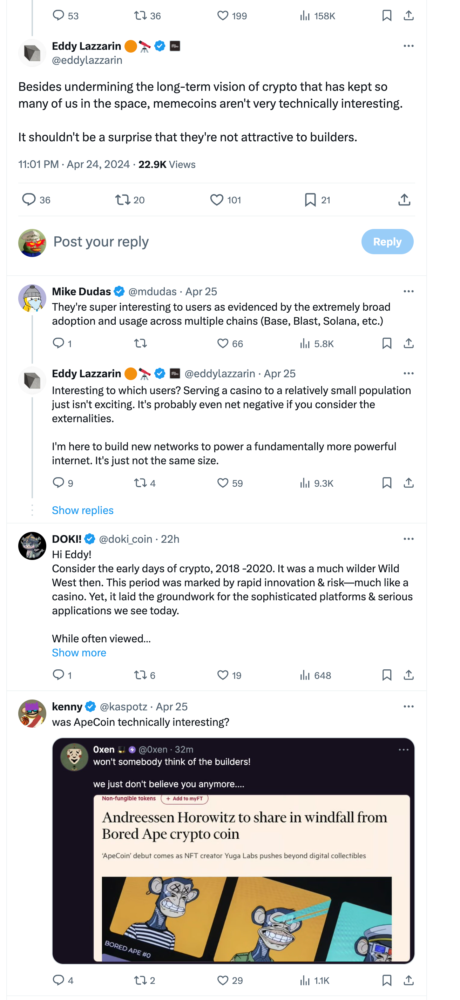
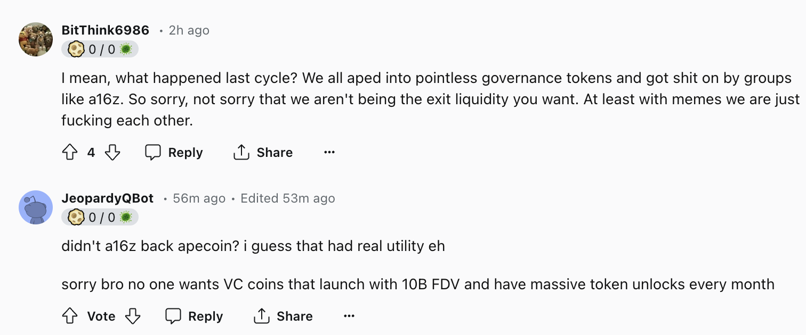
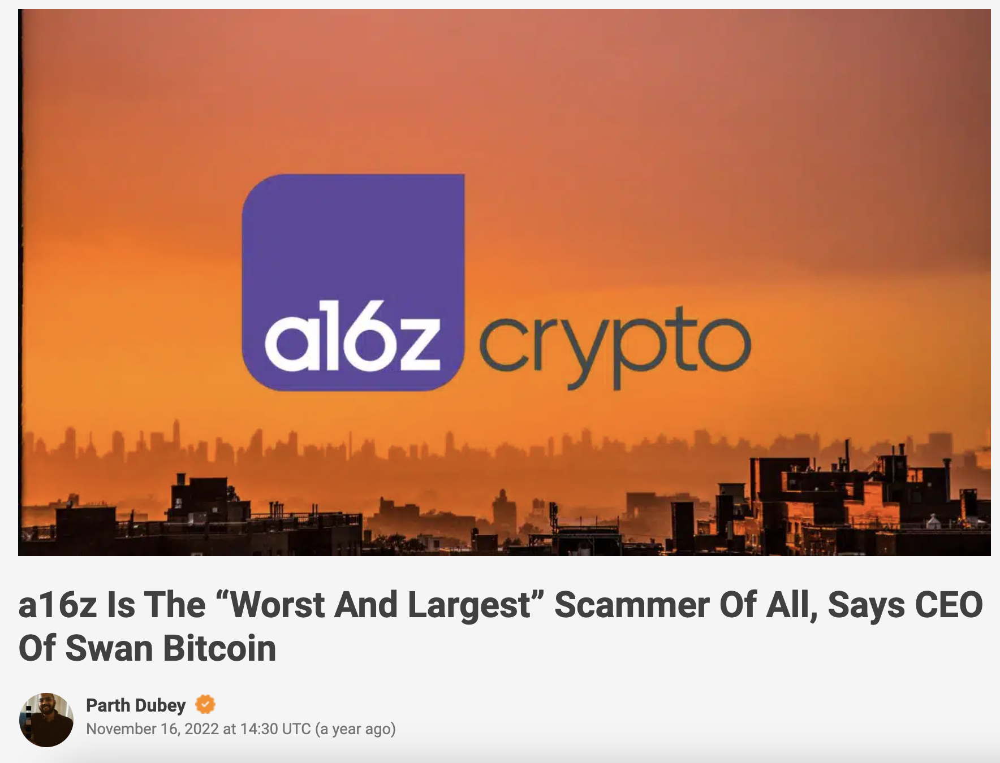
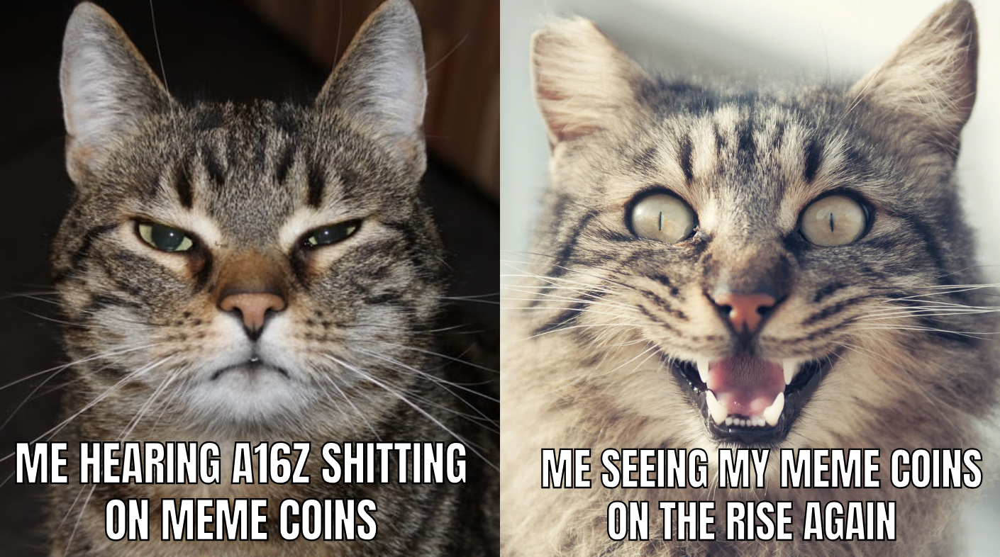
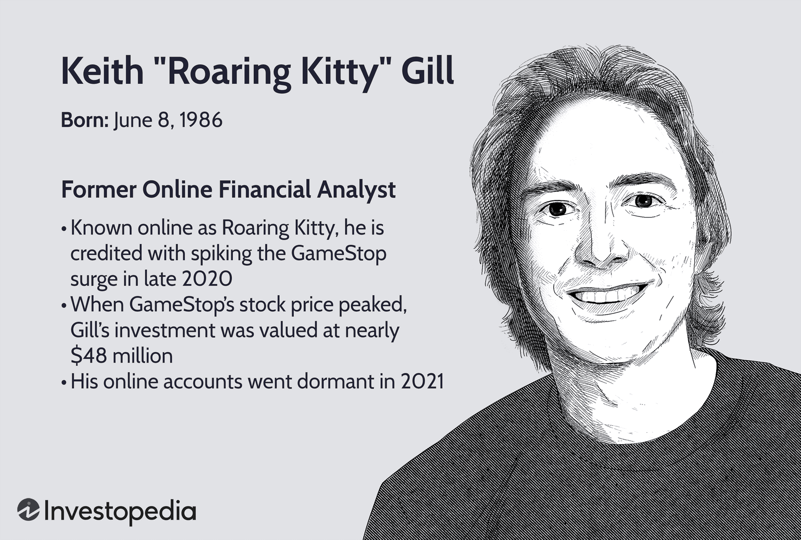
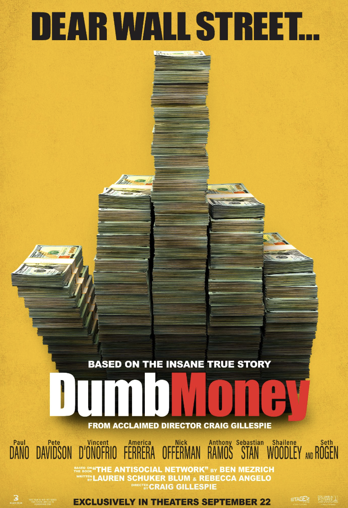
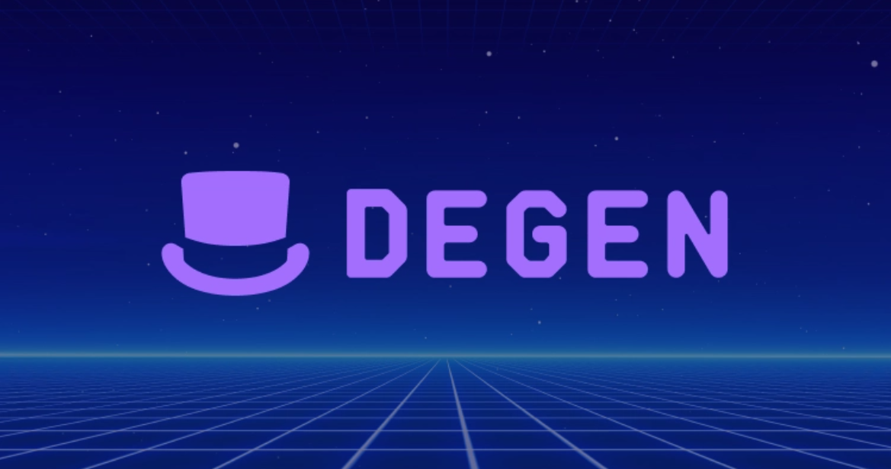

# A16Z 怒批 Meme Coin，散户笑顶级 VC「屁股决定脑袋」

**作者：** Rebbeca Ren（BIT FM 纽约主理人）

- 从一文不值的「笑话」到市值前十，DOGE 花了 10 年的时间。
- 从「DOGE 的拙劣模仿者」到市值前二十，SHIB 只花了 3 年的时间。
- 再后来，新玩家们，无论是 PEPE，BONK，WIF，BOME 还是其他，都用了更短的时间跻身十亿俱乐部。

很疯狂对不对？更有意思的是，这一轮行情走到现在，违反常识的现象发生了：回撤的时候，主流模因币（Meme Coin）们反而比主流价值币更抗跌。

恍惚之间，价值币好像成了毫无用处的模因币，而模因币突然就被赋予了价值。

模因币用了 10 年的时间，让人们走完了「质疑 —— 理解 —— 拥抱」的过程，而这 10 年期间，人们也积累了足够多的对权威的幻灭，对精英 VC 们精心包装鼓吹的牌局的失望。

**最近来自 A16Z 的管理合伙人、首席技术官对模因币的贬斥，更是把这种失望的情绪推向高潮。**

_https://a16zcrypto.com/posts/article/memecoins-tokens-regulation-policy/_

当 4 月 20 日 A16Z 合伙人 Chris Dixon 撰文批评美国证券交易委员会（SEC）对价值币实施了过于严格的监管，而对模因币监管不力，导致模因币价格飙升，而传统价值币表现平平，并且直言模因币简直是一个赌场（Casino）时，当 25 日 A16Z 首席技术官 Eddy Lazzarin 在推特抨击模因币毫无技术创新、破坏让很多建设者留在加密领域的长期愿景时，引发了大量散户的讽刺和抨击。

_https://twitter.com/eddylazzarin/status/1783149288471617661_

「还记得上一轮发生了什么吗？我们被 A16Z 坑惨了」。

「没有人想要买 VC 投的项目，上市时完全稀释估值就高达 100 亿美元，每个月还要解锁超大量的币」。

早在 2022 年，Swan Bitcoin 的首席执行官 Cory Klippsten 就将 A16Z 称为加密世界中「最糟糕、最大」的骗子。Swan Bitcoin 是一家致力于帮助客户在加密货币领域节省价值的金融服务公司，Cory Klippsten 也是最早指出 Luna、Celsius Network 以及 FTX 漏洞的人之一。

他批评 A16Z 利用其作为著名投资机构的声誉和影响力，对一些项目进行盲目的吹捧，这种行为最终导致了个人投资者的利益受损。
拿 A16Z 所投资的 CHIA 为例。这是由 BitTorrent 的创始人 Bram Cohen 发起，致力于解决采矿中巨大能源消耗问题的一个项目。然而，在 ICO 之前，CHIA 已被 A16Z 等投资人过度炒作，开盘即巅峰，随后便持续走低。

类似地，由 DFINITY 开发的 Internet Computer（ICP）在得到 A16Z、Multicoin Capital 和 Polychain Capital 等知名投资机构的大力支持下，上市便冲至 400 美元高点，但之后价格一路暴跌至 13 美元。

这种剧烈的价格波动虽然部分源于市场环境的变化和项目本身发展的不确定性，但真正让散户面临巨大风险的，却是机构投资者吹嘘的虚高初始估值。这也让人们意识到所谓「去中心化」承诺，不过是一个「泡沫」，一碰就碎。

尽管中本聪希望通过比特币创建一个完全去中心化的金融系统，但时至今日，加密世界仍然是一场被资本主导的金融游戏。所以，人们对 VC、对精英、对传统的金融运作方式有多失望，就对更去中心化的、更有趣的、充满草莽气息的模因币有多追捧。

**「金融虚无主义」推波助澜模因币。**

「金融虚无主义」这一概念最初由金融分析师 Dimitri Kofinas 提出，与民粹主义思潮有内在联系，反映了美国普通民众特别是年轻一代对现有金融体制的不满和失望。

这一代年轻人目睹了房价和生活成本的急剧上涨，而自己的收入增长却远远跟不上通胀的步伐。愈加沉重的学生贷款和买房梦想的逐渐破灭，使他们对于未来能否实现财务独立和过上体面生活充满了怀疑。

经济压力加剧了他们对于整个体制的不公正感受。面对这种情况，许多人选择走向更加极端的财务行为，比如投机和 Gamble 等非传统手段，以尝试摆脱财务困境。这种行为最终催生了「金融虚无主义」这一思潮在年轻人中的广泛流行，成为他们表达不满和寻求改变的一种方式。

模因币的设计巧妙地利用了这种心理，通常具有极低的单位价格，给投资者一种虚假的「富裕感」。例如，SHIB 币的单价仅为 0.00002583 美元，仅需 10 美元就可以购买数十万枚。这种低价币的上市市值通常较低，给低成本的参与者留下了广阔的想象空间，即使出现亏损，由于投入成本较低，损失的感受也较为容易接受。

本质上，选择模因币的人与那些对民主党失望而转投特朗普的人在行为上并无太大区别，都是民粹主义情绪的一种体现。

这样的剧情并不是第一次上演，还记得三年前的「散户 vs 华尔街」的逼空大战吗？

2021 年，美国股市因为政府宽松的货币政策，而迎来了史无前例的充盈的流动性，大量散户也涌入进来，在 Reddit、Discord、YouTube 还有推特上疯狂的讨论股票，交流投资策略。

名不见经传的草根金融分析师 Keith Gill 很快凭借其专业的数据分析以及直率的言论在 Reddit 的「WallStreetBets」频道揽获了一大帮信徒。

在发现对冲基金正在大量做空 GameStop 股票时， Keith 看到了「挤压」这些空头头寸的机会，号召大家一起做多，来迫使卖空者以更高的价格回购股票，从而导致对冲基金遭受巨额损失。

对于很多出生在 80，90 年代的美国人来说，GameStop 就是承载着大家最美好的童年回忆的地方，在这里能买到最新的视频游戏和游戏硬件，交易二手物品，以及和结识同好者。

华尔街精英们的做空惹恼了大家。长期以来针对华尔街精英的努力得到了发泄，在 Reddit 论坛上充斥着对华尔街精英的声讨：凭什么他们导致了 2008 年的金融危机，让很多人失去工作，失去房产，流落街头，但最终还是有政府兜底，到头来还是不用负任何责任还能继续赚得盆满钵满，而普通人的日子却越来越艰难。

这激起了背负高昂学贷的大学生，艰难营生的单亲妈妈，买不起房在工作后依然居住在父母家地下室的卢瑟....的共鸣，一呼百应，纷纷加入扎空大战，拼命买入 GameStop 股票和看涨期权。

最终，持有大量 GameStop 空头头寸的梅尔文资本（Melvin Capital）受到重创，在 2021 年 1 月损失了约 53% 的价值，一度站在流动性枯竭的边缘，最终靠另外两家著名对冲基金 Citadel 和 Point72 的 27.5 亿美元紧急注资，才续上命。

这是一次可以记入史册的「Dumb Money（笨钱）」 vs 「Smart Money（聪明钱）」之战，让在金融领域持有绝对话语权的精英们意识到因为强大共识而凝结在一起的「笨钱」的力量。

**模因币也是表达文化身份的新方式。**

不同的模因币社区通过构建自己的符号、语言、习俗等亚文化元素，营造了一种「部落」般的群体认同感。例如：

DOGE 是由美国程序员 Billy Markus 和澳大利亚营销专家 Jackson Palmer，基于当时风靡互联网的一张柴犬图片而创建的，它的社区以和气、幽默和乐观的氛围为主。

PEPE 的灵感来自一只备受争议的网路青蛙形象，常在 4chan 等亚文化平台上流传。其社区文化透着一股挑衅主流价值的嘲讽味道，毒舌而不失幽默感。

MFERCOIN 来源于知名的 NFT 项目 mfers，该项目以其独特的手绘艺术风格和无厘头幽默获得关注。其社区由一群对艺术和幽默有深刻理解的持有者组成，氛围热情、充满创造力且略带叛逆。

NOGS 是由 Nouns DAO 推出的模因币。Nouns DAO 以其分散的所有权和社区驱动的治理模式为核心，致力于将每日拍卖的收益用于资助社区成员投票决定的创意项目，社区氛围强调协作、创新和目标导向。

(左为 mfers，右为 Nouns)

不同的社区通过各自独特的文化氛围吸引着不同类型的人群。模因币的兴起特别引起了精通互联网的一代人的共鸣，它们不仅已经成为年轻人表达文化身份的新方式，而且使他们能够享受将幽默和日常模因转化为潜在盈利资产的颠覆性乐趣。

从这个角度来看，模因币在某种程度上彻底改变了金融投资的传统模式，重新定义了文化参与和经济活动之间的界限。人们不仅对这种文化的幽默感表达出欣赏，更被其中隐藏的盈利机会所吸引。

**始于模因，但成长于价值。**

在各种模因币满天飞的当下，如何让注意力更多的停留下来，成功的关键。一些聪明的模因币开始拓展应用场景，摆脱自己「毫无价值」的形象，让叙事变得更长期，例如：

Telegram 交易机器人 BONKbot 源自 Solana 在 2022 年空头给用户的模因币$BONK。BONKbot的开发者利用交易的部分费用来购买和烧毁$BONK，从而在经济上与代币持有者保持一致。

SHIB 推出了以太坊二层解决方案 Shibarium，使用交易费来燃烧 SHIB 代币，充当 SHIB 的代币池，激活了现有的持有者社区，克服了新第二层的冷启动问题。在此之前，SHIB 还推出了去中心化交易所 ShibaSwap。

模因币 DEGEN 起源于社交媒体 Warpcast 的 Degen 频道，并作为该平台上的打赏币而被推广开来，随后，DAO 基础设施服务商 Syndicate 宣布利用 Arbitrum Orbit 和 AnyTrust 的技术，将 Degen 作为系统原生代币，推出了基于 Base 的 L3，即 Degen Chain。

在 Variant Venture 创始人 Li Jin 看来，模因币并非毫无价值。在 4 月 20 日上周六 A16Z  Chris Dixon 发文怒喷模因币那天，Variant Venture在其纽约办公室举办「模因币黑客松」， Li Jin 和 Base 链负责人 Jesse Pollak 用以上案例讨论模因币或许是一种高效的 GTM(市场进入)策略：与模因币结合，项目会在起步时就拥有活跃的参与社区，降低了从零开始累积用户的成本；通过合理的代币经济设计，则可与社区利益捆绑，形成利益共同体；而模因币天生具备的病毒式传播潜质，同样有利于快速扩大产品影响力。

在注意力经济的今天，当下不少模因币项目都在努力借助创新应用场景来突破单一文化符号的局限，创造价值，制造长久的注意力。

模因币的未来走向和市场表现无疑将继续受到加密货币领域的密切关注，我们也期待看到更多的玩法和新的可能性。

当然，在模因币被越来越多的人拥抱的当下，也希望投资者能够保持审慎，理性分析每一个机会与潜在风险，并且始终坚持 DYOR 的原则。毕竟，在这个快速变化的市场中，长期生存和稳健成长才是赢得未来的关键。
