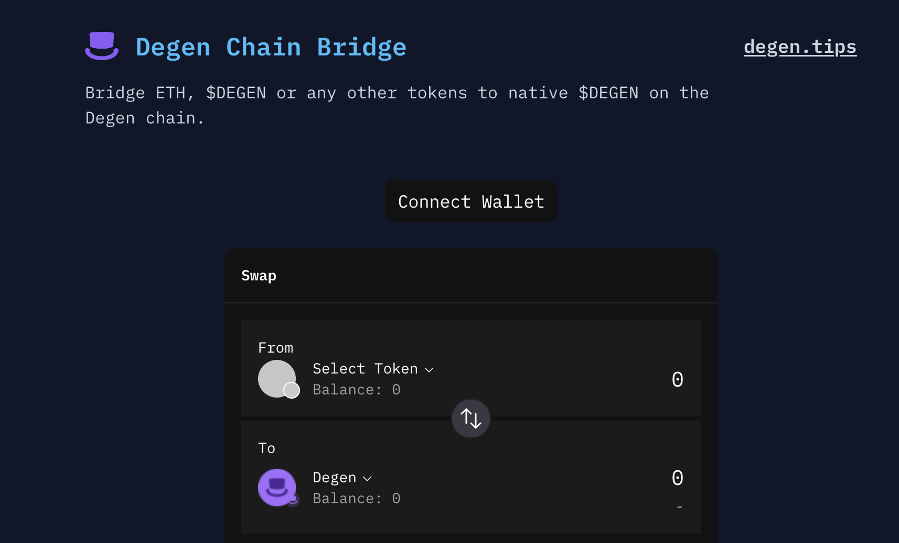
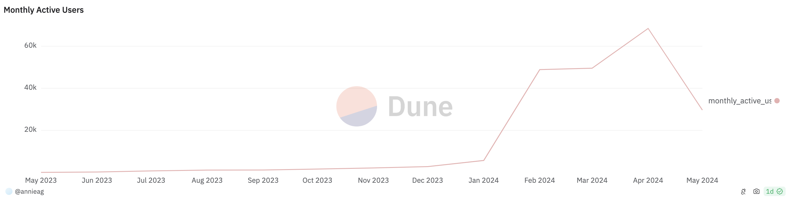
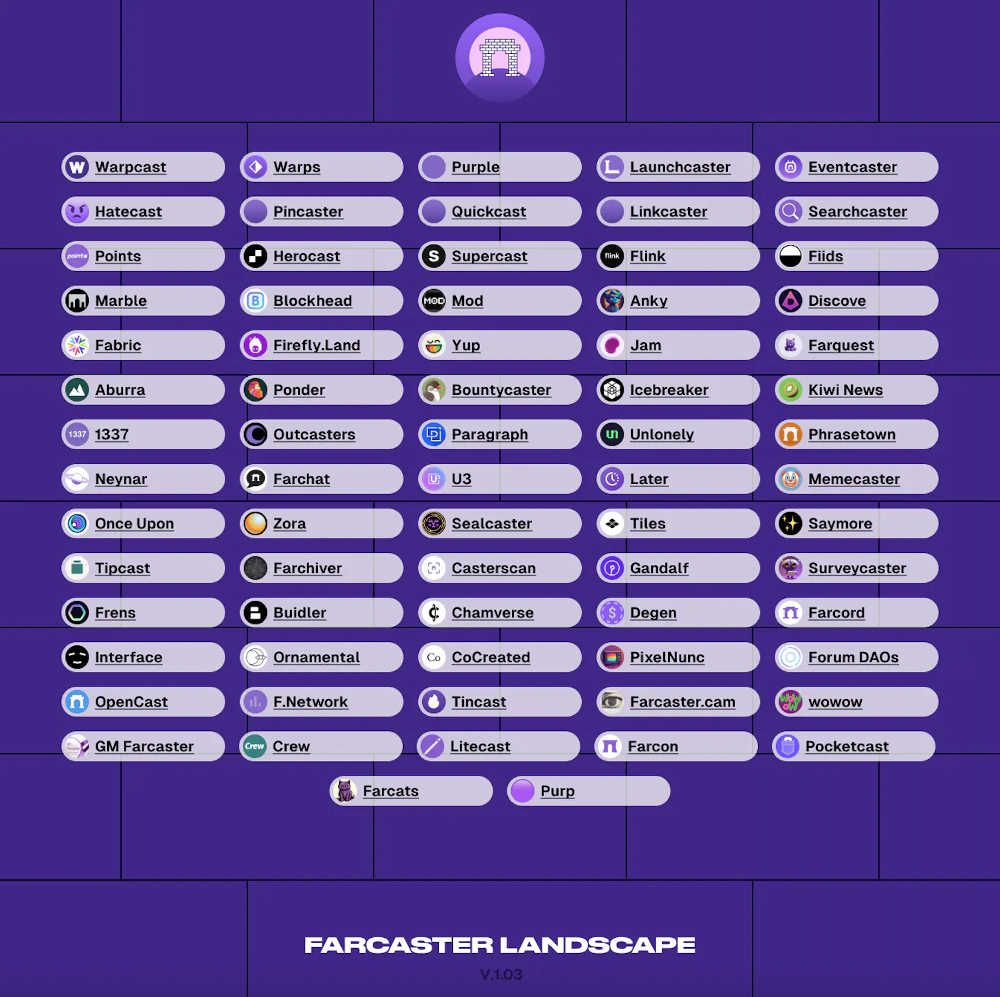
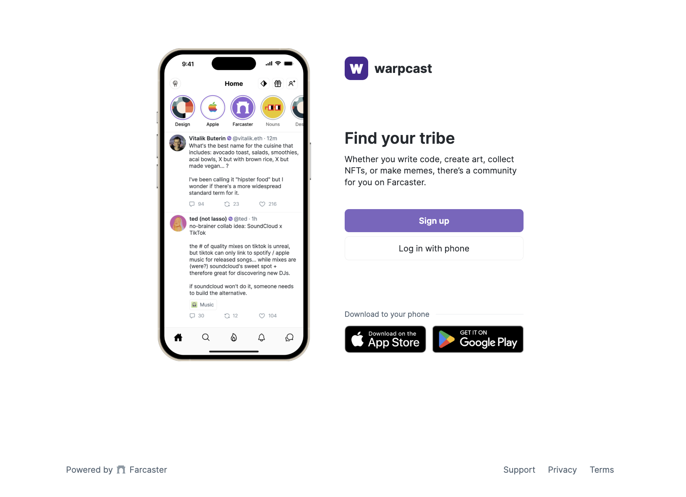
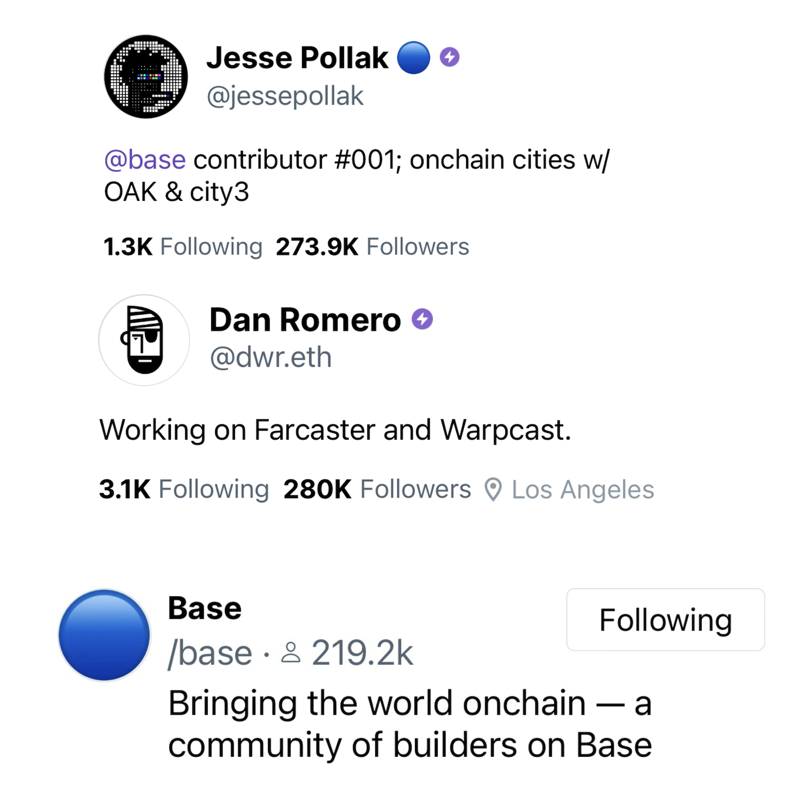
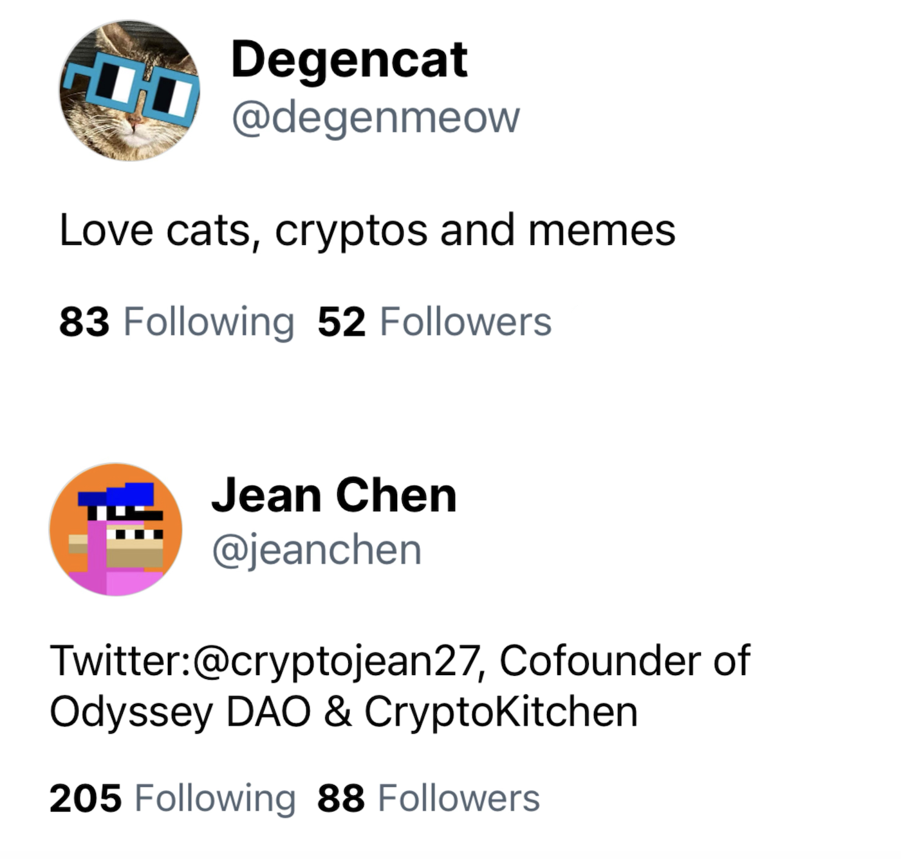
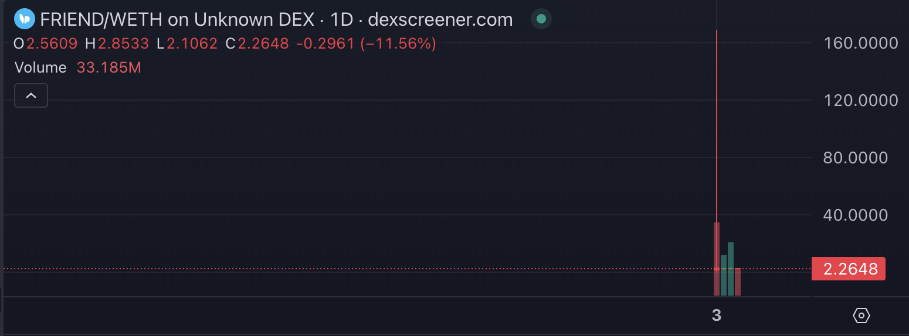
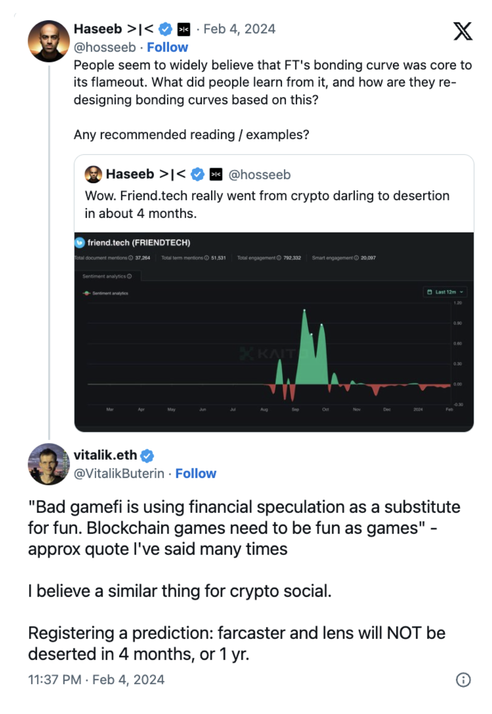

# 孕育了加密届「拼多多」，连 V 神也力推的 Farcaster 应该怎么玩？

> Mirror 和 Paragraph 团队都来 Farcaster 上建设了，你还在犹豫什么？

**作者：** Rebbeca Ren（加密厨房 Crypto Kitchen 纽约主厨）

根据 L2BEAT 的数据，Degen Chain 的每秒交易量（TPS）在 4 月 18 日增长了 62%，达到 35.7 TPS，创下了以太坊生态系统的最高记录。

有趣的是，虽然录得了创纪录的 TPS，但 Degen Chain 上的每笔交易的平均价值仅为 0.27 美元，远低于以太坊的 1867 美元和 Base Chain 的 170 美元。另一边，$DEGEN 代币的完全稀释市值（FDV）也从最初的 100 多万美元成长到截止今天的 7.5 亿美元左右。

这样的表现让人想起了拼多多：用足够低的商品价格和更简单的购物体验，服务了更多「囊中羞涩」或者说是更注重性价比的消费者，吸引了更多从来没用过电商平台的新用户，从而实现了规模经济，市值一路从 2018 年的 200 亿美元上涨至如今的 1900 亿美元。

Degen Chain 有没有潜力在加密货币届复制拼多多的成功还有待观察，但孕育它的 Farcaster 绝对值得大家给予更多的关注。

## 什么是 Farcaster？

简而言之，Farcaster 由两名 Coinbase 早期员工推出的基于以太坊和 Optimism 主网的协议，用于构建去中心化的社交应用。尽管对于一些人来说 Farcaster 可能还有些陌生，但在过去的几个月，它已经成为美国加密圈最热门的话题之一。

Warpcast 是 Farcaster 协议团队推出的第一个客户端应用，也是目前该协议下最大的应用程序，在四月份月活用户（MAUs）增长至 6 万 8。Warpcast 与 Farcaster 协议和数据紧密集成：所有 Warpcast 帐户都有一个 Farcaster ID，并将其生成的内容存储在 Farcaster 中心。

_来源：Dune_

Warpcast 像是一个 Twitter 和 Reddit 的集合体，既能发帖也能加入感兴趣的频道参与讨论，还支持小程序（Frames）的接入，执行铸造 NFT、申领代币和进行交易等活动。

模因币$DEGEN就诞生于Warpcast平台中充满活力的Degen社区。最初被空投给该社区的用户，现在已成为Warpcast上最主流的打赏代币。Warpcast用户还被给予每天8个$DEGEN 币的额度，用来鼓励内容创作者以及增加用户之间互动的积极性。

随着持有者数量的增加，$DEGEN 团队顺势推出了以太坊第三层网络（L3）Degen Chain，用于发行模因币，这也为模因币们指出了一条从「无用例」到「有用例」，从「无价值」到「有价值」的逆袭之路。

除了 Warpcast，Farcaster 协议下还有超多用例：

与此同时，它的生态还在继续扩大。5 月 2 日，基于以太坊的去中心化博客协议 Mirror 宣布与曾经的竞争对手 Paragraph 合并。合并后的实体将由 Paragraph 创始人 Colin Armstrong 领导，并运行在 Farcaster 协议上。

Mirror 团队将继续作为一家独立公司运营，并计划推出基于 Farcaster 协议且集社交和加密资产交易为一体的平台「Kiosk」。

## 怎么使用 Warpcast？

1. 与被垃圾信息、广告充斥着时间线的 Twitter 不一样，Warpcast 设置了较高的准入门槛。要想使用 Warpcast，每位新用户需要支付 5 美元的费用。如果通过朋友的邀请链接进入，那么只需要 3 美元。这笔费用主要用于数据存储和垃圾信息过滤，确保了平台的干净和数据安全。
2. 购买 Warp。在 App Store 下载 Warpcast 应用后，你可以购买应用内货币 Warp。这些货币将用于开展一些特定的操作，例如创建自己的频道。创建一个频道的费用是 2500 Warps，相当于 25 美元/年。如果没有这些需求，则无需购买 Warp。
3. 发布内容和交互：一旦你成为用户，就可以自由发布内容，并与其他用户互动。如果需要更多的发帖量或存储空间，需要支付额外的费用。同时，还有一些频道要求用户再支付一定数量的 Warp 才能发帖和留言。
4. 邀请好友：Warpcast 也鼓励用户通过邀请朋友来扩展社区。每邀请一位新用户，你都可以获得 50 Warp 的奖励，这些可以用来支付平台上的服务费用。

通过这些步骤，你不仅能够享受一个没有广告干扰的社交体验，还能确保你所在的社区保持高质量和高活跃度。Warpcast 通过这种独特的机制，为用户提供了一个更纯粹、更专注的交流空间。

Warpcast 并不要求你必须拥有加密货币钱包才能够注册使用，但如果想使用打赏等高级功能，你需要把钱包与 Warpcast 账号进行绑定。

## 新手可以关注哪些人和频道？

Vitalik Buterin（@vitalik.eth），V 神当然是关注榜的第一位。

Dan Romero（@dwr.eth）和 Varun Srinivasan（@v），Farcaster 的两位联合创始人

Jesse Pollak（@jessepollak），Coinbase 推出的 L2 Base Chain 的创建者，也是 Farcaster 上关注度第二高的帐户。 Base 是 Farcaster 上的主要频道之一，拥有超过 219000 名关注者。

Li Jin（@li），前 a16z 合伙人，现 Variant 资本的创始人，经手过 MagicEden、 Mirror、 Phantom 等项目。

孕育了$DEGEN 和 Degen Chain 的 Degen 频道（/degen），拥有 78300 名关注者。

由 Dan 和 Varun 主持的 Farcaster 频道（/farcaster），拥有 192000 名关注者。
如果你喜欢中文社区，可以关注狐朋狗友频道（/hpgybtc），拥有 800 多名关注者。

你也可以关注加密厨房的两位 Chef，生活在纽约地区的我（@Degenmeow）和在上海的 Jean（@jeanchen）。我们会不定期分享一些加密货币的看法、猫咪日常、meme 图或者举办活动之类的内容。

## V 神看好 Farcaster、Friend.tech 又掀风浪，SocialFi 的热度再次被点燃？

5 月 3 日，去年夏天风头无两的 Web 3.0 社交平台 Friend.tech 向其用户空投了$FRIEND 代币，推出后不久就飙升至 167 美元的高位，对Farcaster龙头模因币$DEGEN 的价格造成了不少的冲击。

一时间关于 SocialFi 热潮是否回来了的讨论四起。事实上，将社交网络与去中心化金融相结合的 SocialFi 对于加密货币的大规模采用非常重要：

例如，它使用起来更简单，天然的社交属性可以吸引更多的用户加入和了解加密货币；使用代币化来奖励用户的贡献，激励对加密货币的参与和投资；利用基于区块链的治理工具加强社区建设，营造协作和透明的环境等。

虽然 SocialFi 领域的尝试频繁，但大多是昙花一现，怎样把用户留住依旧是实现长期成功的关键。

一直被冠以「投机」名号的 Friend.tech 去年在达到狂热高点几个月后，平台活动急剧下滑，至今未能恢复。最近的空投代币虽然引发了一时的关注，但因为流动性不足和抛售狂潮，币价很快从 167 美元暴跌至 2 美元左右。

V 神此前也批评了 Friend.tech，认为其用金融投机取代真正的社交互动的方式是失败的原因。他认为，与 GameFi 类似，SocialFi 也应该重在「趣味性」而非「投机性」。

与此同时，Farcaster 平台上的用户参与度、内容质量、打赏机制以及通过小程序（Frames）提供的各种游戏和铸造 NFT 的体验给 V 神留下了深刻印象。他对 Farcaster 持乐观态度，预测该平台短期内不会被市场淘汰，并强调真正有趣的内容和社区建设的重要性。
