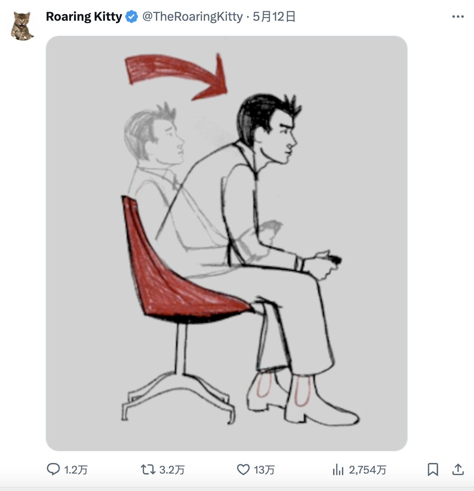
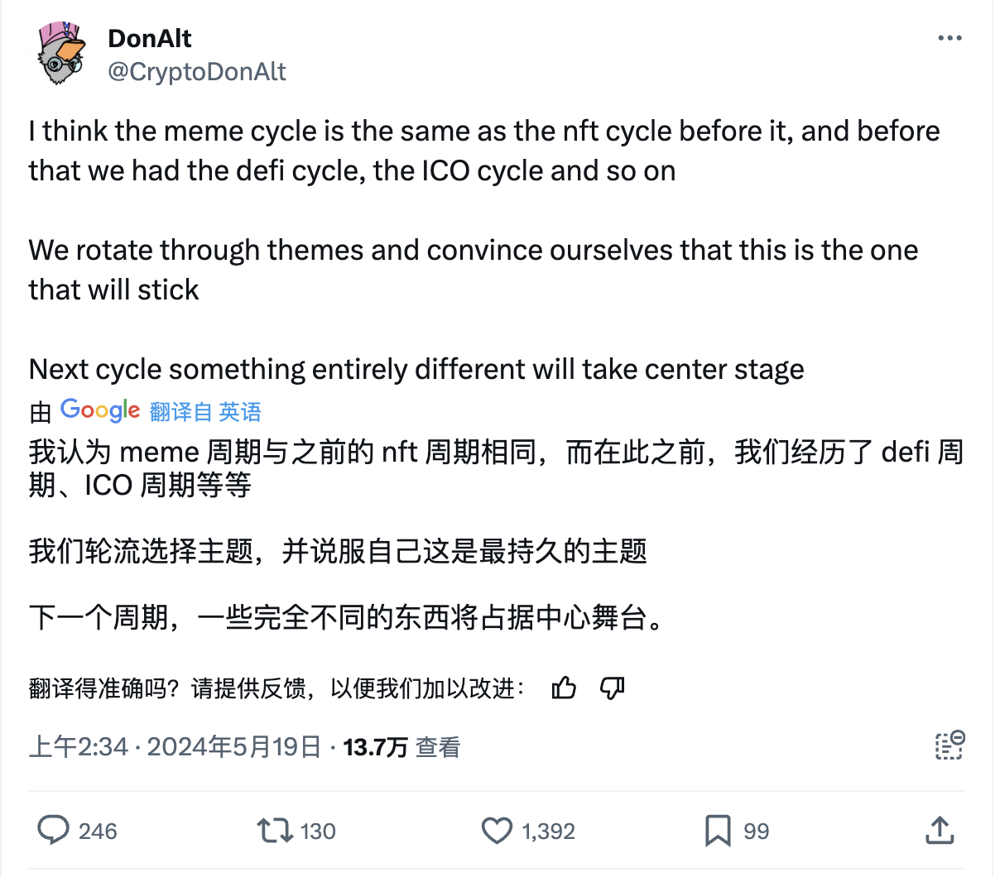
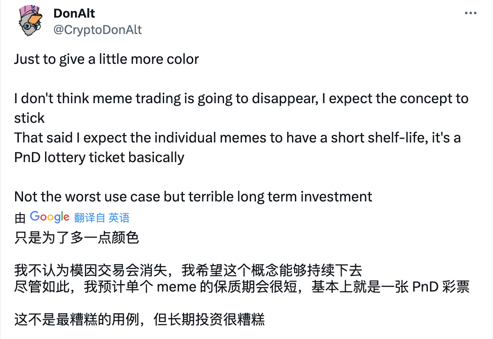
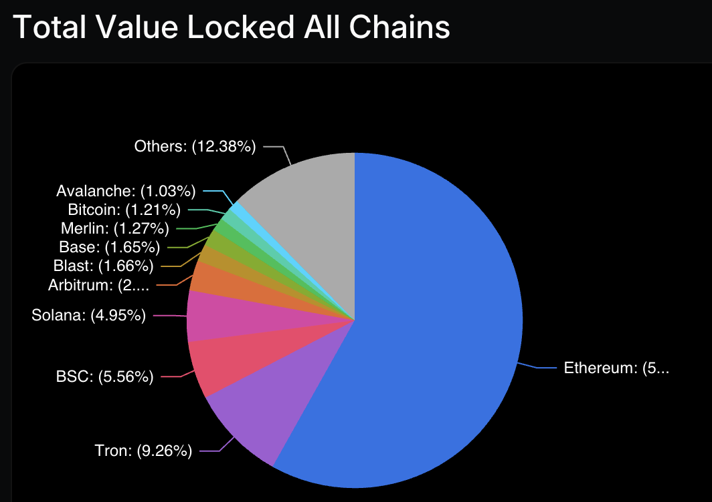
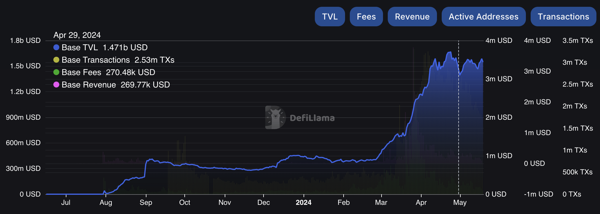
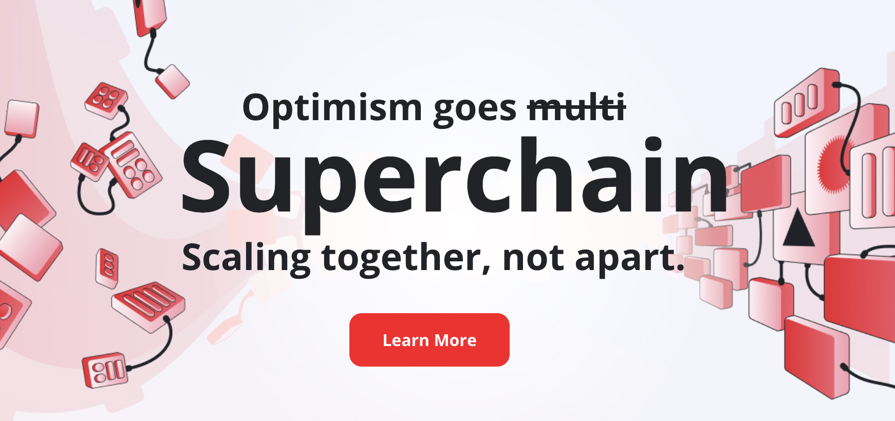
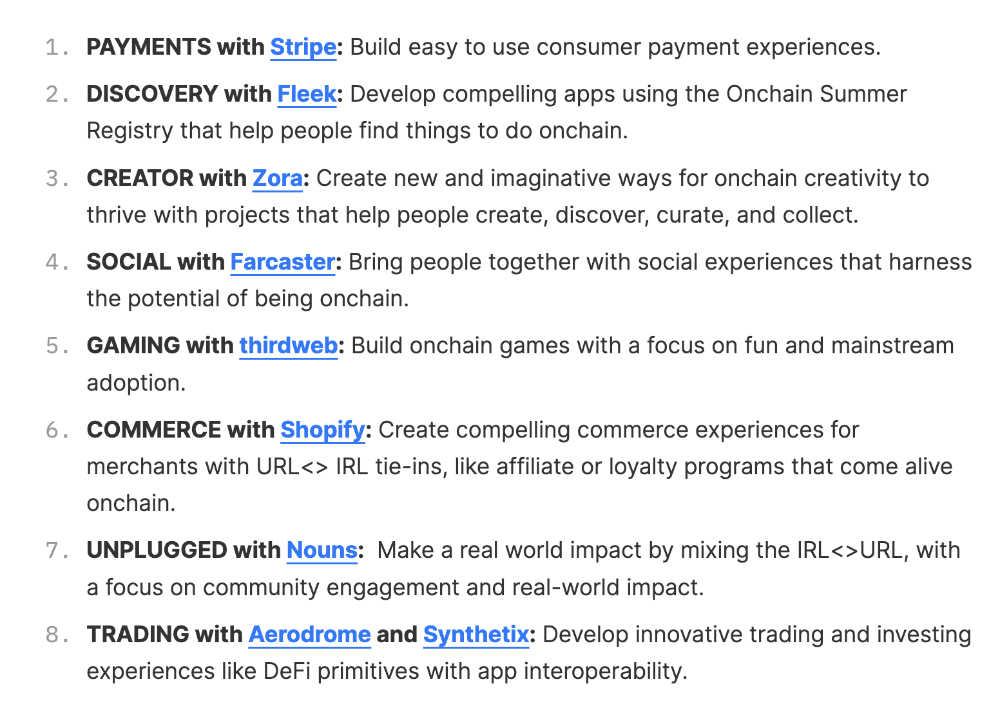
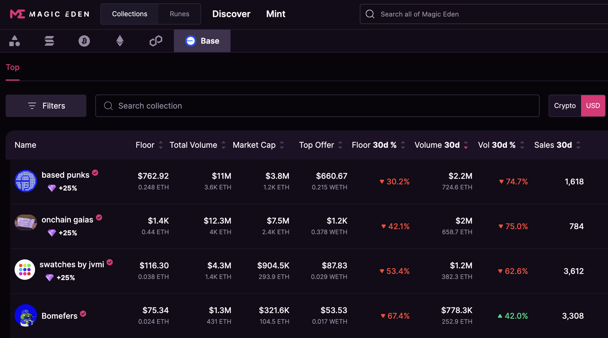

# 法拉第未来带崩模因币，现在是关注新模因链之王 Base 的时候吗？

> 始于模因，但作为 Coinbase 亲儿子的 Base 链在后面还有更多叙事。

**作者：** Rebbeca Ren（加密厨房 Crypto Kitchen 纽约主厨）

最近美股和加密货币又开始疯狂联动了。

过去的一周，先是上一轮 WallStreetBets（WSB）轧空对冲基金的两个主战场—GameStop 和 AMC —— 迎来了股价飙升；紧接着悲伤蛙 $Pepe 再创新高；随后在退市边缘徘徊的法拉第未来被暴拉 20 倍。

这股暴涨势力是由 WSB 的核心人物 Roaring Kitty 推动的。在 2021 年美股的「轧空大战」之后，GameStop 和 AMC 成为了散户们心中的模因王，而 Roaring Kitty 也功成身退再未更新过任何社交媒体，沉寂了三年之久。

5 月 12 日，他的推特账户重新活跃起来，一个截取了电影里金刚狼复活片段的帖子更是把气氛点燃，于是大家奔走相告：那个男人又回来了！WSB 大军重新集结在模因股票的战场，并且带动了模因币们的上涨。

遗憾的是，这股力量并没有持续太久，GameStop、AMC 和法拉第未来很快由涨转跌，周六，$Wif 的闪崩也带垮了 $Pepe 等模因币。

一直和 $Wif 背后推手 Ansem 针锋相对的知名加密货币交易员 DonAlt 很是得意，因为他早就看不惯 Ansem 对模因币的吹捧，觉得这泡沫已经太大肯定会惨烈地破掉。

「模因就是一个周期，这跟之前的 NFT 周期、DeFi 周期、ICO 周期没什么区别。我们不停地追逐新主题并说服自己这是一个会长久存在的主题，但下一个周期，总会有完全不同的东西站在 C 位，」他说到。

不过 DonAlt 也承认，尽管模因币大多和彩票一样寿命短暂，不能作为长期投资，但它们还会继续存在下去。

确实，这已经是模因币和模因股的第二轮联动了。在上一轮牛市，充盈的流动性让 $Doge 和 $Shib 跟随着 Gamestop 和 AMC 狂飙，暴富神话在社交媒体上随时可见。

**既然模因已经成为这一轮的共识，那还有哪些潜在机会？**

在之前的文章《A16Z 怒批 Meme Coin，散户笑顶级 VC「屁股决定脑袋」》中，我们从散户对 VC 背书的低流通、高 FDV 项目的抵触，金融虚无主义的抬头，以及模因文化等角度阐述了为什么模因币成为了这一轮最大的共识。

Solana 上乱飞的模因币更是创造了一个又一个「暴富」神话，吸引了大部分注意力。

**但如果你像我一样，因为对 Solana 社区氛围不感冒而错过了机会，那么或许可以把更多的精力放在还在发展初期的 Base 链上。**

根据 Dune Analytics 的数据显示，自 2024 年 4 月 1 日起，加密市场上新代币的数量急剧增加，其中以太坊上的 372,000 个新代币中不少都是模因币，它们大部分在以太坊二层的 Base 链上进行发行。

看到现在一蹶不振的以太坊生态，大家可能会说，「切，看看 L1 的 gas fee 都低成什么样了，完全没人玩，更何况 L2？」

先别急着否定，一个生态被 FUD 最狠的时候，也是机会最多的时候。趁着行情低迷，可以多了解一下 Base 链，提前做好埋伏，说不定就爆发了呢？

相较于其他 L2，Base 链有着厉害的血统 —— 看着它的名字你或许会联想到 Coinbase。对，它正是由美国最大的合规交易所 Coinbase 利用开源的 OP Stack 的技术在 2023 年推出的 L2 方案。

在欧洲和加拿大也开展业务的 Coinbase 已经积累了超过 1 亿的用户基础，托管了 1,710 亿美元的资产 —— 这种庞大的用户和资金基础，为 Base 链提供了一个其他 L2 方案难以比拟的起点。

此外，通过将业务模型从中心化交易所向更加多元化的区块链生态系统扩展，Coinbase 希望建立一个能让全球用户加入的加密经济平台，而 Base 链就被视作这个平台的重要入口，是不是想象空间更大了？

有了亲妈 Coinbase 的帮扶，Base 链主网正式上线不到一年，总锁仓价值（TVL）就站稳了全球第六的位置（最近被 Blast 超越了一点）。前面分别是以太坊、Solana、Tron、BSC 和 Arbitrum，**考虑到 Base 自己并没有发币，这个 TVL 的含金量非常高（见下图）**。

在这里补充一句，Base 链应该也不会发币，因为母公司 Coinbase 已经在纳斯达克发行过股票了。

根据 DeFiLlama 的数据，得益于模因币热潮，今年年初到 4 月份，Base 链上的 TVL 已经增长了 6 倍（如下图）。

**现在的 Base 相当于早期的 Solana，但叙事更宏大。**

在 4 月 9 日的一条推文中，Base 链的负责人 Jesse Pollak 指出，Base 的每秒交易数（TPS）达到了峰值，约为 300-400。这个数字被知名交易员 Wazz 评价与 Solana 相当，因为尽管 Solana 宣称其 TPS 为 1000，但实际上有 60% 的交易是失败的，这意味着其实际有效的 TPS 也就接近 400。

低至几美分的每笔交易成本，高吞吐能力，甚至相似的模因币策略，都使得人们不得不把 Base 和 Solana 做比较。

但是 Base 链的野心远不止于模因币。它更是旨在引领 10 亿人踏入加密世界大门的Superchain（超级链）的重要环节。

Superchain 的概念引入了一个全新的区块链框架。开发者不再需要针对单一的区块链技术栈进行开发和优化，而是可以利用 Superchain 提供的统一接口，使其应用具备跨链操作能力。

这种可互操作性意味着应用可以利用不同链的独特优势，例如利用某些链的高交易速度或低成本处理大量小额交易，同时又能保证数据的安全和不变性。这种灵活性和扩展性为 DApp 开发者提供了巨大的潜力，使得他们能够设计出更复杂、功能更全面的应用程序。

在庞大的 Superchain 生态中，OP Stack 技术（也就是 Base 所采用的）扮演着基础且关键的角色。这套由 Optimism 团队开发的技术框架，专为以太坊 L2 解决方案而设计，通过将大量的处理工作转移到更高效的第二层，显著提升了交易吞吐量并大幅降低了交易成本。

这使得 OP Stack 特别适合需要频繁交易的应用（如 DeFi 和在线游戏），因为其低廉的交易费用使得小额交易也变得经济实惠。而且，OP Stack 通过其独特的欺诈证明机制确保了整个网络的安全性，让用户在享受快速交易的同时，也能获得必要的安全保障。

OP Stack 还因其丰富的开发工具和标准化接口而受到开发者社区的青睐，使得构建和部署 L2 应用变得简单便捷。这种开发友好的环境吸引了众多项目方，使得 Superchain 的生态日益丰富。

目前，Superchain 下的主流应用场景包括建立在 Base 链上的两个 SocialFi 平台，Farcaster 和 Friend.tech，以及 Zora 这样的 NFT 铸造交易平台。

在 2024 年 3 月，Farcaster 的日活跃用户（DAU）数量从 5,000 跃升至超过 30,000，包括 Vitalik 在内的众多币圈重量级人物也经常活跃在这个社交平台上；截至 2024 年 2 月 14 日，Zora 拥有 68,000 名日活跃用户。这些平台不仅提升了用户的互动体验，也推动了生态系统的经济活力。

随着越来越多的项目加入使用 OP Stack，我们可以预见，Superchain 将会成为一个充满活力、技术先进并广受欢迎的加密经济体。

而 Coinbase 的强大品牌影响力和庞大的用户基础提供了强有力的支持，使 Base 链成为新用户进入 Superchain 以及加密世界的理想门户。

那么早了解和早参与 Base 链，意味着你可以成为 OG 得到更多红利。

如果你是开发者，那现在更是进入 Base 搞建设的好时机，因为它的第二季的开发者大赛 Onchain Summer （https://base.mirror.xyz/iYQH5yxgH976gUmrYfoeyVpe5SJtiR8r2t10Psr1_-U）正在进行中，一共设有八个赛道（如下图），涵盖社交、游戏、支付等，共计 200 ETH 的奖金。

为了帮助大家更好的了解 Base 生态，我们总结了一些经验：

多花时间在 Farcaster/Warpcast 上的 Base 频道和 Degen 频道（参考我们之前的文章：孕育了加密「拼多多」，连 V 神也力推的 Farcaster 应该怎么玩？）

关注 Base 链创始人 Jesse Pollak 的推特和 Farcaster 账号，Base 链消费者生态负责人 Bobby Thakkar（@BobbyThakkar）的推特，Base 的官方推特和 Farcaster，以及 Base Insider（@insider_base）的推特。

进入 MagicEden 的 Base NFT 系列，研究和关注市值较大、流动性较好、社区活跃的 NFT 项目，或者关注新上线项目——例如，based punks 和 onchain gaias 是头部老项目，Boomfers 是近期一个比较火的新项目。不过，目前 Base 上的 NFT 造富效果不够明显，交易热度和流动性也都一般。

还有一些从以太坊迁移过来的社区也值得关注，比如之前 Mfer 系列 NFT 的创作者在 Base 链上发了模因币 $mfercoin；Nouns 社区也在 Base 链上发了模因币$nogs，以及新的 NFT 系列 Yellow Collective 和 Gnars 等。

最后的最后，如果这篇文章能够点燃你对 Base 链的兴趣，那就让我们一起迎接这个「链上夏天」吧！
