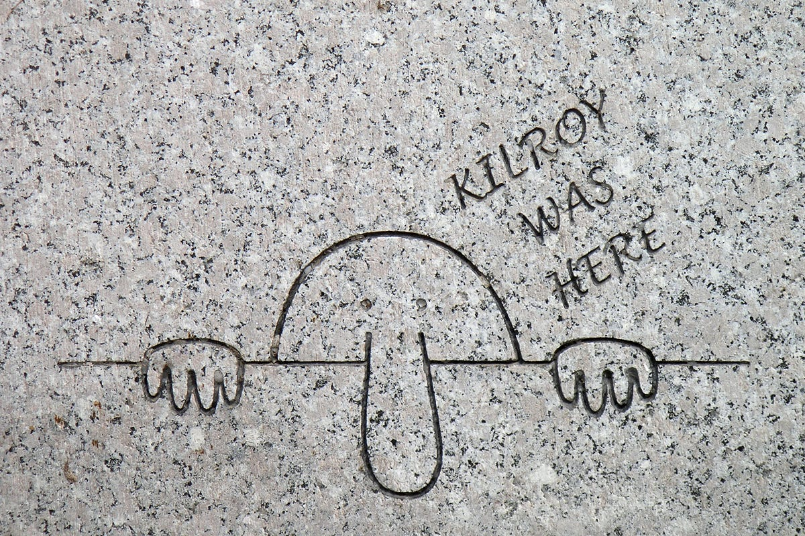
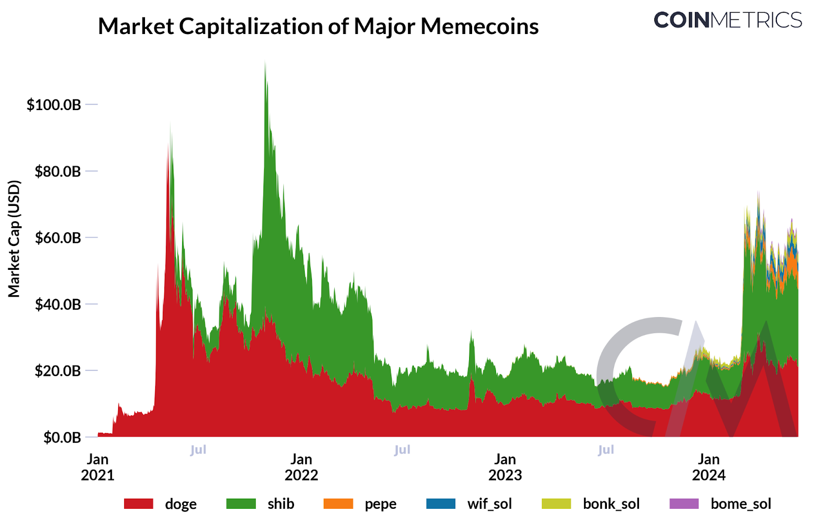
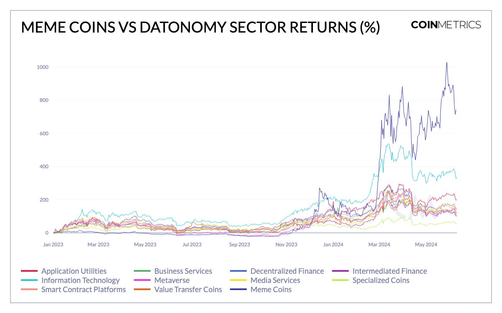
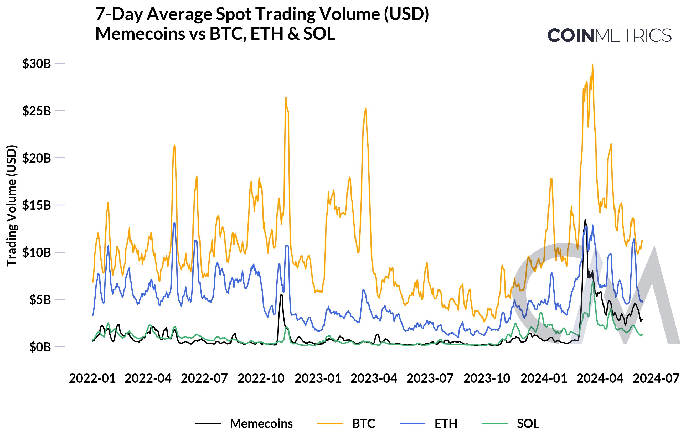
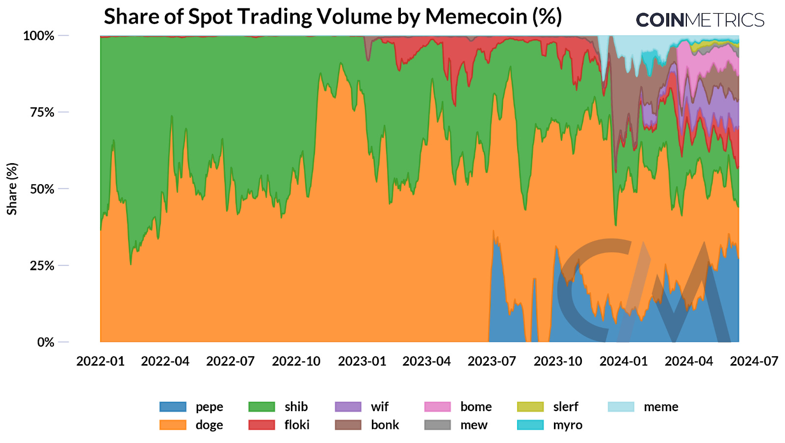
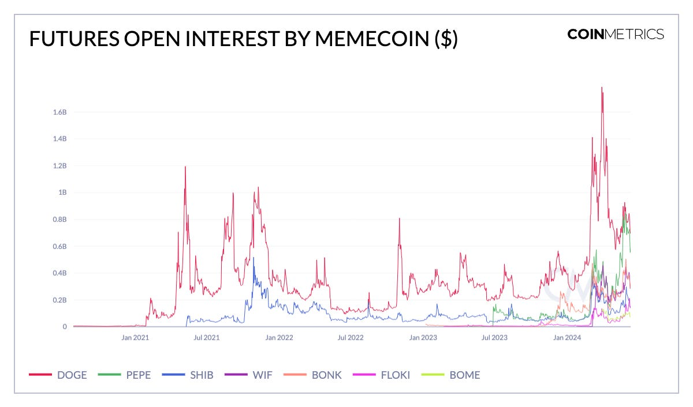
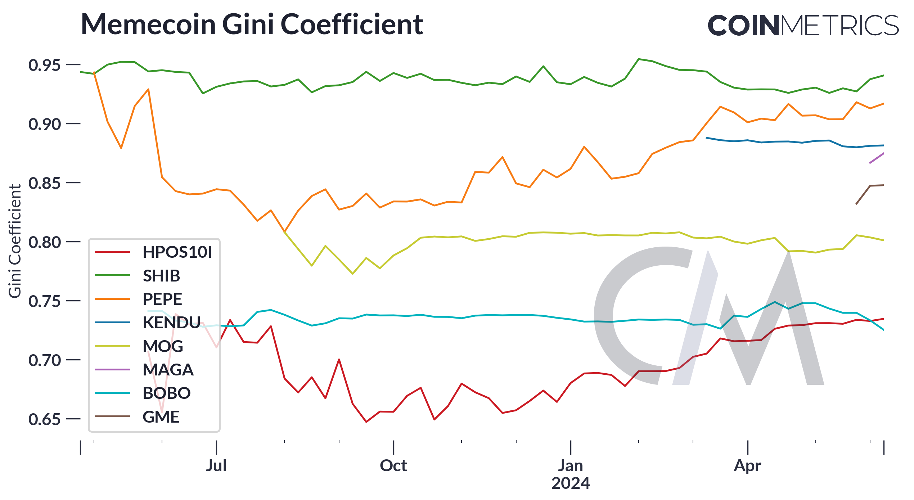

# 模因币狂热 | Coin Metrics 报告

> 解析模因币活动的激增及塑造该领域的市场趋势

**作者：** Tanay Ved、Matías Andrade

## 要点

- 当前，模因币的总市值为 600 亿美元，并且在以太坊、索拉纳等一层网络和 Base 等二层网络上不断增长。
- 3 月，模因币在交易所的现货交易量（7 日平均）达到 130 亿美元，超过了以太坊（ETH）和索拉纳（SOL）等主要蓝筹加密资产。
- 模因币的资产高度集中在少数持有者手中，带来了潜在的市场操纵和流动性问题的风险。

## 引言

模因（Meme）是人类文化的重要组成部分，多年来通过各种媒介进行转变和适应。[模因](https://www.oxfordreference.com/display/10.1093/acref/9780195120905.001.0001/acref-9780195120905-e-187)一词由英国进化论学者理查德·道金斯在其 1976 年的经典著作《自私的基因》中首次提出，他将模因描述为文化传递的单位，包括「曲调、思想和口号」，并强调其与生物进化中的基因相似。

模因的传播在历史上有了显著的发展，受到社会、文化和技术变化的影响。在古代，民间故事和宗教符号是早期形式的模因，通过口头或手稿传播。在二战期间，涂鸦模因「基尔罗伊到此一游」变得流行，象征着美国士兵的存在。在数字时代，模因以病毒视频和图像宏的形式找到了新的载体，如「狗狗币」，通过互联网和社交媒体平台迅速传播，让文化理念比以往任何时候都更广泛地传播。

_维基百科：https://en.wikipedia.org/wiki/Kilroy_was_here_

最近，模因现象进一步扩展，如模因股票，以 GameStop 在 Reddit 的/r/wallstreetbets 等在线论坛上的集体努力导致价值剧增为例。同样，狗狗币和 Pepe 等模因币在加密资产世界中也获得了巨大的关注，利用区块链和链上社区创造数字价值形式。模因是人类本性的一部分，反映了我们通过共享理念寻求联系和归属感的渴望。

在本周的 Coin Metrics 网络状态报告中，我们旨在为以太坊和索拉纳等网络上的模因币活动激增提供一些背景，突出模因币板块驱动的关键市场趋势。

## 模因币概览

自 2013 年狗狗币诞生以来，模因币板块有了巨大的扩展，截至 2024 年 6 月，总市值达到 600 亿美元。该领域的特点是代表熟悉的动物、角色和最近的政治人物的加密资产，通过幽默元素吸引注意力并推动社区参与。它们的增长主要源于高度投机性，主要由市场情绪推动，而不是内在价值。

_来源：Coin Metrics Network Data Pro & Coin Metrics Labs_

（注：索拉纳模因币和其他 SPL 代币将作为索拉纳网络数据的扩展部分很快发布）

目前最有价值的模因币包括作为独立工作量证明区块链运行的狗狗币（DOGE），以及像柴犬币（SHIB）和 Pepe（PEPE）这样的 ERC-20 代币，在 2021 年市值超过 1000 亿美元。最近，索拉纳已成为模因币的热点，几个索拉纳程序库（SPL）代币由于低交易费用、不断增长的生态系统和通过平台如 pump.fun 的便捷代币创建而被部署，推动了 dogwifhat（WIF）和 Jeo Boden（BODEN）等模因币的崛起。

_来源：Coin Metrics datonomy™ & Coin Metrics Labs_

模因币板块相对于加密资产生态系统的其他领域表现显著，如 Coin Metrics 的 datonomy™ 分类所涵盖的那样。模因币相对于主要蓝筹加密资产表现出色，还超过了在去中心化计算和人工智能（AI）应用交汇处发展的信息技术领域。

这一点在 2023 年 10 月至 2024 年期间尤为明显，截至 6 月，模因币平均回报率达到 740%。这也推动了模因币指数的增长，如 [GMCI 模因指数](https://www.gmci.co/indices/gmci-meme)，反映了对量化该领域表现的努力。尽管与市场周期的投机阶段有关，这一表现反映了该领域在散户和机构投资者中心智份额的最近增长。

## 模因币市场活动

模因币板块日益受到关注，进一步推动了数字资产市场的活动。尽管交易量通常与整个市场同步移动，但在 3 月，模因币在中心化交易所的现货交易量（7 日平均）达到 130 亿美元，甚至超过了以太坊（ETH）和索拉纳（SOL）等主要资产。去中心化交易所（DEXs）在模因币生态系统中也起着关键作用，为池创建和资产交易提供了必要的基础设施，促进了广泛用户的流动性和可访问性。

_来源：Coin Metrics Market Data Feed_

从相对交易量的角度来看，较老的模因币如 DOGE 和 SHIB 的影响力似乎在减弱，而 PEPE 和一组新的索拉纳模因币则获得了人气，共同代表了超过 50% 的交易量。这反映了投资者对较新模因币的偏好，源于不断增长的社区、区块链生态系统和更高回报的潜力。尽管如此，现有模因币的流动性和更长的记录仍然是潜在投资者的重要考虑因素。

_来源：Coin Metrics Market Data Feed_

同样，高期货未平仓合约突显了其显著的市场存在，并表明了高度的投机交易活动。DOGE 的未平仓合约最近达到创纪录的 18 亿美元，而 PEPE 的未平仓合约在 5 月飙升近 50%，达到 8.5 亿美元。未平仓合约总额超过 30 亿美元，表明价格波动增加，显示投资者逐步利用期货头寸对冲对模因币的风险。跟踪未平仓合约仍然是了解投机资本流动的基本工具，特别是在波动性工具中，可能表明市场兴趣的变化或清算的先兆。

_来源：Coin Metrics Market Data Feed_

## 模因币用户增长及风险

模因币的市场存在和用户增长是同步上升的，但需要注意该领域的风险。基尼系数是衡量人口收入或财富分配的一种指标，范围从 0（完全平等）到 1（最大不平等）。在模因币的背景下，基尼系数可用于评估不同地址间代币持有量的分配。

高集中度的代币持有量增加了市场操纵的风险。大持有者，通常被称为「巨鲸」，可以通过一次性买卖大量代币显著影响代币价格，造成波动。此外，如果少数地址持有大部分代币，可能导致流动性问题，这些问题可能因由少数实体控制的地址在去中心化交易所提供流动性而加剧。

_来源：Coin Metrics Network Data Pro & CM Labs_

这些模因币的高基尼系数（约 0.8）突显了代币持有量的显著集中。这种集中带来了各种风险，包括潜在的市场操纵、流动性问题和投资者警惕，这些在评估这些代币时都应谨慎考虑。在考虑对模因币板块的任何投资之前，了解这些动态对于评估这些数字资产的稳定性和潜在风险至关重要。

## 结论

模因币板块在加密货币市场中表现出显著的增长和影响力，由于模因的病毒特性及其易于传播，模因币在区块链上找到了坚实的立足点。自现货 ETF 推出以来，该领域与比特币一起表现强劲，突显了其在散户和机构投资者中的吸引力。然而，约 0.8 的高基尼系数表明代币持有量显著集中，带来了市场操纵和流动性问题的风险，以及大多数投资者难以忍受的波动性。随着该领域的不断发展，了解这些动态对于评估模因币的发展和潜在风险至关重要。
