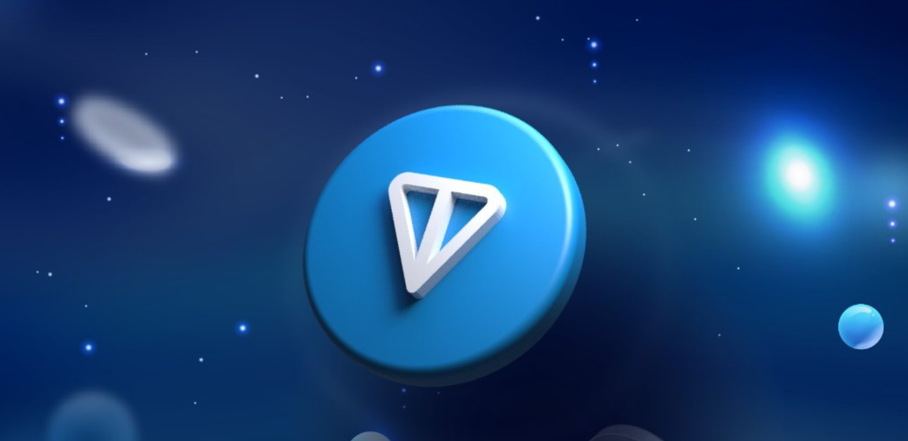
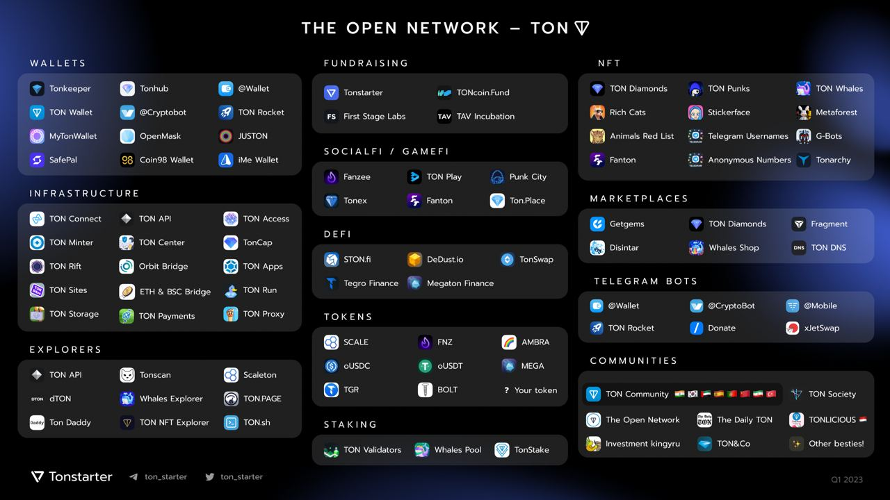
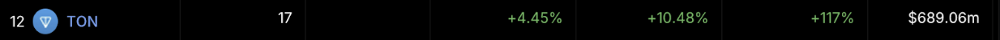
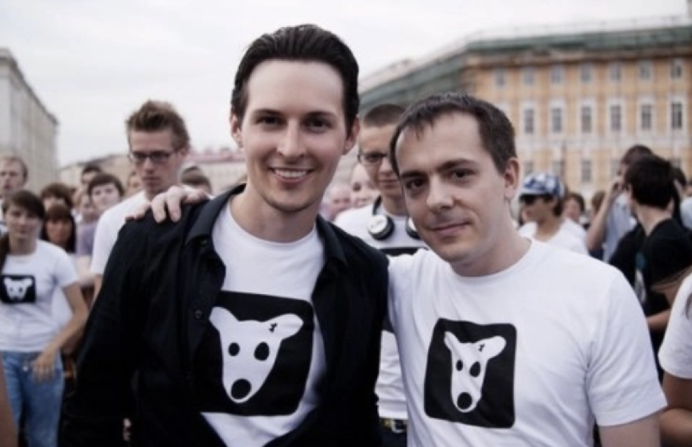
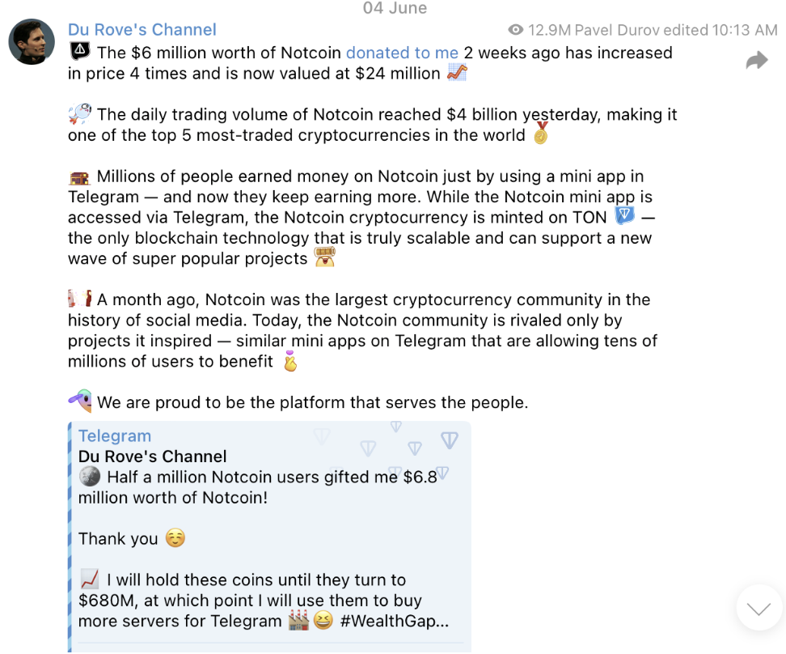
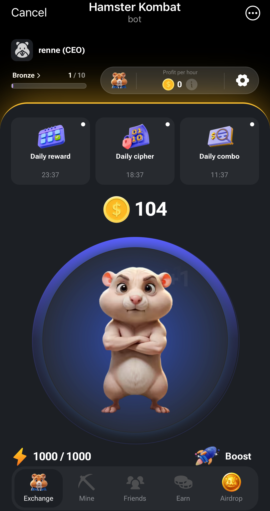
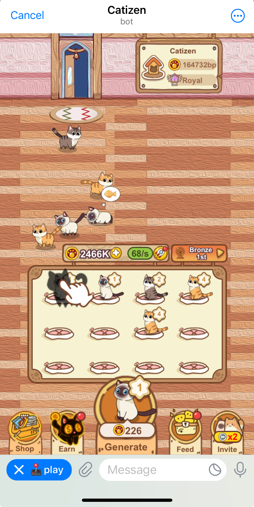
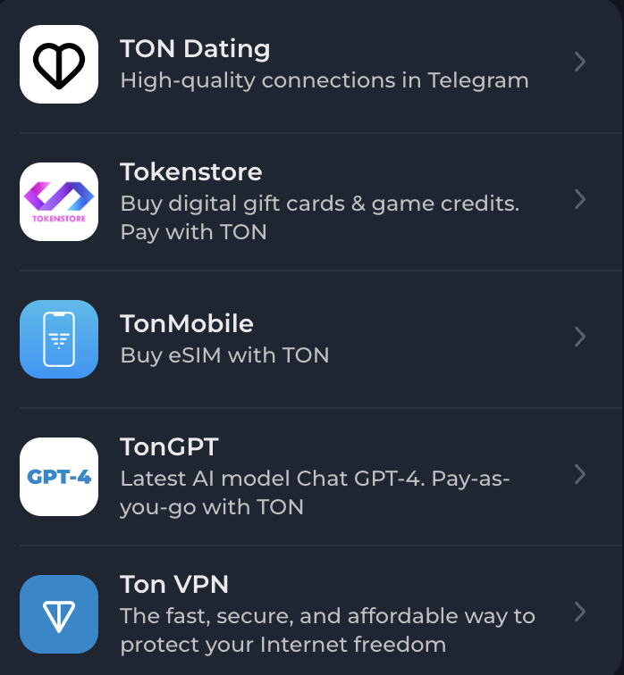

# 「土味」游戏频出圈，TON 为何能在「羊市」中一枝独秀？| Thought for Today

> 蛰伏了 2 年的 TON 终于被更多人看到了价值。

**作者：** Rebbeca Ren（加密厨房 Crypto Kitchen 纽约主厨）

最近几周，加密货币似乎和大 A 步入了相同的境地，那就是 ——「技术性羊市」

「羊市」概念最初由美国「共同基金之父」纽伯格提出，是指市场的走向不明确，既非牛市也非熊市，大部分股票涨跌幅度在 10％ 上下，这样的市场非常难操作，因为不仅你不知道投资什么标的好，也难以寻找新投资标的，大家都在观望，等待市场的形态走出来。

回顾这几周加密市场的表现是不是和大 A 高度相似？

但值得庆幸的是，在这样的羊市里，TON 链上的原生代币 Toncoin ($TON)，以及模因币 Notcoin（$NOT）的表现亮眼，激发了大家寻找新投资标的的热情。

这些天，我也在做功课更全面的了解 TON 链，顺手梳理了一些内容分享给大家。开始之前，先来一张 TON 生态的全景图镇一下场子。

## 什么是 TON 链？

The Open Network (TON) 是一个去中心化的第一层区块链平台，以其超快的交易速度、低廉的费用、易用的应用程序和环保性而著称。

它基于权益证明（PoS）的共识机制，并采用了独特的多层链架构，包括以下几个关键组成部分：

- 主链（Masterchain）作为整个网络的核心，管理全局信息，负责协议变更、验证者选举和工作链配置，确保整个系统的一致性和安全性。
- 工作链（Workchains）是多个独立运行的区块链，每个工作链可以处理自己的交易，并可针对不同应用和用例进行定制。
- 分片（Sharding）技术将区块链状态分割成更小的片段，每组节点只需存储和验证部分数据，理论上可以实现每秒数百万次交易处理能力。
- 超立方体路由（Hypercube Routing）用于在分片结构中高效传递消息，确保跨分片通信的效率。

这种多层架构的设计使得 TON 能够实现高度可扩展性，支持异步智能合约调用，允许不同工作链之间的互操作性，在保持高吞吐量的同时维持低交易费用。总的来说，TON 的多层链架构通过主链、工作链和动态分片的组合，创造了一个高度可扩展、高效且灵活的区块链网络，能够满足各种复杂应用场景的需求。

Toncoin（$TON），作为 TON 的原生代币，承担着交易费用支付、网络治理、验证者质押以及作为交易介质的多重角色。它是网络运营的核心，涉及从支付交易费用到参与网络发展提案投票的各个方面。

此外，TON 还通过与社交软件 Telegram 的深度整合，为用户提供了包括去中心化金融（DeFi）、安全数据存储和易于理解的域名服务（DNS）等多种服务。

**TON 链的关键数据：**

1. $TON 最初发行了 50 亿枚代币，并设定无上限的供应量策略，以每年约 0.6% 的速率逐年增发。这种策略有助于维持网络的活跃度和发展需求。
2. 目前 $TON 的流通量约为 24.6 亿枚，占初始供应量的大约 49%，这说明大量代币仍处于非流通状态。
3. 截至 6 月 27 日为，$TON 的市场总值约为 192 亿美元，而其完全稀释后估值（FDV）为 398 亿美元。
4. 根据 Defillma 的数据，TON 上的 TVL 在过去的 1 个月增长了 117%，达到了 6.89 亿美元，在所有公链中排第 12。

相比于 Solana 公链的原生代币 $SOL，$TON 的市值并不显得过高。然而，相对较低的流通率意味着大量代币仍被锁定，这在短中期可能限制了市场的供应，驱动币价上涨，但从长期来看，可能会面临较大的抛压。

## Telegram 是什么？

Telegram 是由出生于俄罗斯的两兄弟 Pavel Durov 和 Nikolai Durov 于 2013 年创立的加密通讯应用，支持端到端加密并不审查内容。为避免单一政府的影响，其服务器分布在全球多个国家，因而被视为最「自由」的社交软件之一。

_Pavel Durov（左）和 Nikolai Durov（右）_

截至 2023 年，Telegram 的月活跃用户已达到 7 亿，预计到 2024 年底将达到 10 亿用户。用户每天在 Telegram 上发送超过 150 亿条消息。普通 Android 用户每月在 Telegram 上花费约 2.9 小时。

在财务上，Telegram 通过其 Premium 服务开始创造收入。该服务提供对加入更多频道和访问高级表情包等高级功能的使用，在 2023 年产生了 4500 万美元收入。

它在加密社区中非常受欢迎。许多项目方首选在 Telegram 上开通聊天群以打造社区，此外，Telegram 还提供许多 bot 服务，例如实时跟踪股价/币价的涨跌、巨鲸的买入/卖出等，大大提高了个人投资者的信息获取效率。

## TON 与 Telegram 复杂但密切的关系

**起源: ** TON 最初由 Telegram 创始人两兄弟于 2018 年设计，并命名为 Telegram Open Network，旨在支撑数十亿并发用户，以满足 Telegram 庞大用户群体的需求。

**分离：** 2020 年，由于与美国证券交易委员会（SEC）的法律纠纷，Telegram 不得不停止了 TON 项目的开发，并退还了投资者的资金。

**社区接管：** 尽管 Telegram 放弃了项目，但社区成员接手并继续开发，随后将其更名为 The Open Network，并于 2021 年中后期正式完成主网上线。

**现状与集成：** 虽然 TON 现在与 Telegram 没有官方层面的联系，但它仍深度集成到 Telegram 中，并从这款社交软件的庞大用户基础中受益。例如，Telegram 用户可以通过内置的钱包机器人使用 TON 进行加密货币交易和支付；开发者可以在 TON 链上构建游戏和其他应用程序，并将它们以小程序的形式集成到 Telegram 中等等。

这种关系使得 TON 能够利用 Telegram 的技术支持和用户群体，在加密货币和区块链领域进行创新，并极大的加速了加密技术大规模采用（Mass Adoption）的进程。回顾区块链技术的发展历程，从早期的 ICO 到上一轮爆火的元宇宙，从来没有一个项目能够达到真正的 Mass Adoption。

另一方面，美国社交媒体巨头 Facebook 虽然也曾在 Telegram 之前尝试推出自己的加密货币项目 Libra，但遭到监管机构的严厉打击，导致 Libra 最终流产。相比之下，Telegram 成功地绕开了监管的重重障碍，让 TON 成为了第一个能够实现 Mass Adoption 的区块链。

正因如此，$TON 的价格也插上了想象的翅膀。它在过去的一年（截至 6 月 27 日）上涨了 458.4%，在过去的 30 天上涨了 20% 左右；而 BTC 在过去的一年也不过上涨了 100%，在过去的 30 天更是跌了 10%左右。

Pavel Durov 也多次力挺 TON 生态。最近的一次公开站台，就是在 6 月 4 日，他在自己的 Telegram 频道发帖称，Notcoin 的日交易量达到 40 亿美元，成为全球交易量最大的 5 种加密货币之一，他手里的 $NOT 价格上涨了 4 倍，现在价值 2400 万美元。而这一切距离他从 Notcoin 社区手里收到$NOT 不过两周而已。

_Pavel Durov 的帖子_

「我手里的 Notcoin 涨到 6.8 亿美元之前，我是不会卖的，」Pavel Durov 公开许诺到，可以说是毫不掩盖的在为 Notcoin 站台了。

Notcoin 是一款可以通过 Telegram 应用访问的游戏。玩法非常简单：用户进入游戏后需要不断点击屏幕上出现的金币，每次点击都会获得一定量的 $NOT。然而，点击次数受到能量条的限制，能量条会随着每次点击而消耗，并在时间推移中逐渐恢复。为了提高硬币获取率并减少每次点击消耗的能量，玩家可以激活「增强道具」或购买升级道具。

简而言之，这就是一款简单到不能更简单的 tap-to-earn（点击赚钱）游戏，微信小程序里一抓一大把。

不过我想 Pavel Durov 并不是单纯的从资产获利的角度来支持该项目，公开「唱多」背后是对更大愿景的追求：

Notcoin 社区的用户已经超过 50 万，其在 Telegram 上的 tap-to-earn 游戏吸引了 3500 万玩家，这不仅有效地扩大了 Web3 的受众，也让 Notcoin 从一个简单的游戏内代币迅速成长为一种具有实际价值的加密货币 —— 这样的成功案例势必会吸引来更多的开发者、项目方、社区以及用户进入到 TON 链生态进行建设。

## 除了 Notcoin，TON 链上还有哪些出圈游戏？

Catizen 是一款以猫咪为主题的合成小游戏，其核心玩法十分简单。在游戏中，玩家经营着一家猫咪宠物店，顾客在撸猫后会支付金币作为报酬，这些金币可用来购买新的猫咪。两只相同等级的猫咪可以合成为一个新品种的猫咪，其等级也会比原来的高一级。玩家的任务就是合成更高等级的猫咪，并赚取更多的金币。

截至 6 月 17 日，Catizen 宣布自己的总用户基数已突破 2000 万大关，日活跃用户约为 250 万，链上用户达到 115 万。

最近大热的游戏非 Hamster Kombat（仓鼠大战）莫属。6 月 24 日，Hamster Kombat 在 X 平台上宣布其玩家基数已达 2 亿，同时该项目的 X 和 YouTube 账号订阅人数分别为 980 万和 2870 万。从用户规模来看，这款今年 3 月上线的小游戏无疑成为了继 Notcoin 之后最受关注的现象级项目。

据深潮报道，Hamster Kombat 在伊朗风靡一时，成为街头巷尾都在玩的游戏。这不禁让人联想到疫情期间的 Axie Infinity，它因能为失业和无业人员提供可观的收益而在菲律宾备受追捧。

显然，以 play-to-earn（玩赚）为特色的链游在经济条件较差的国家更受欢迎。虽然单个用户的价值较低，但考虑到全球大部分人口都生活在发展中或落后国家，链游无疑是一个有力的渠道，将大量新用户引入加密世界。

目前，TON 上的小游戏都是以 bot 的形式接入到 Telegram 中（类似于基于微信小程序的游戏），它们大多较为简陋，玩法和内容深度有限。尽管这些「土味」游戏在短时间内可能会吸引大量用户并迅速爆火，但维持热度将成为一个难题。

## DeFi、钱包、约会软件、甚至 AI 助手，TON 上应有尽有

除了游戏之外，TON 在 DeFi 板块也有显著发展，有去中心化交易所 Ston.fi、DeDust、Megaton Finance、TON Swap，以及发射平台 Tonstarter 等。

钱包板块也提供多种选择，包括 Telegram 中的集成钱包 Wallet；非托管钱包 Tonkeeper，可作为移动应用程序和浏览器扩展使用；以及类似以太坊 MetaMask 的 TON 浏览器扩展钱包 OpenMask 等。

DeFi 项目和钱包的多样性代表了公链的活跃度和资金量，夯实了 TON 生态的快速崛起的基础。

更好玩的是，你还能在 TON 上约会、购买礼品卡和电话卡、开通 VPN，甚至使用 TonGPT（类似于 OpenAI 超强人工智能助手 ChatGPT 的服务）等等。

不过我认为小游戏是 TON 真正能与 Telegram 功能实现更好结合的发展方向。这一想法在最近旁听 TON 基金会的一场 Space 讨论后得到了确认。TON 的内容经理 Viktor 的说法非常打动我：在 Solana 上，你需要有钱购买 SOL 才能开始交易，但在 TON 上，你可以两手空空的开始，因为你可以通过 play-to-earn 模式赚钱。

此外，作为一个相当成熟的社交软件，Telegram 的交互体验对许多不够 tech-savvy （精通技术）和 crypto-savvy （精通加密货币）的用户也非常友好。例如，设置内置 Wallet 的步骤非常简单快捷。一位嘉宾甚至开玩笑说，这简单到可以让所有人都进入加密世界，甚至是 80 岁的老年人。

最后我想分享一个有趣的故事，希望能帮大家在寻找 alpha 的路上少走弯路。

我的一位亲密好友在 2021 年底 $TON 刚上交易所时就果断入手了，但它的价格一直趴在地上没什么变化。期间，TON 基金会还被一些 KOL 口诛笔伐，冠上了「不作为」的大帽子。我也跟风调侃朋友，说 $TON 不就是 QQ 币吗？QQ 币哪有升值的道理？

还好他没被我的 FUD 吓到，反而坚定持有，理由很简单：作为一个铁杆 Telegram 用户，他相信一个拥有庞大用户基础且经过时间考验的社交软件建立的公链，价值迟早会被大家发现。

最终，市场证明了 $TON 不是 QQ 币。TON 基金会通过不断改进和扩展生态系统，吸引了越来越多的用户和开发者，整个社区也变得更加活跃。

**参考资料：**

- Ton（The Open Network），Telegram 设计的完全去中心化 Layer1 区块链：https://medium.com/@HIBTGlobal/ton-the-open-network-telegram%E8%AE%BE%E8%AE%A1%E7%9A%84%E5%AE%8C%E5%85%A8%E5%8E%BB%E4%B8%AD%E5%BF%83%E5%8C%96layer1%E5%8C%BA%E5%9D%97%E9%93%BE-cef6c2e4535b
- Telegram Revenue and Usage Statistics (2024)：https://www.businessofapps.com/data/telegram-statistics/#:~:text=Telegram%20generated%20$45%20million%20in%202023%2C%20primarily,monthly%20active%20users%20%C2%B7%20Telegram%20is%20the
- Notcoin 官网：https://notcoin.website/
- TON in-depth analysis: Telegram is building a Web3 super application ecosystem：https://www.coinlive.com/news/ton-in-depth-analysis-telegram-is-building-a-web3-super-application
