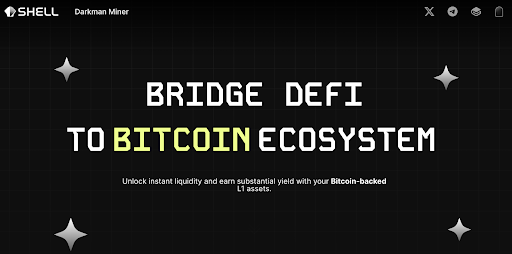
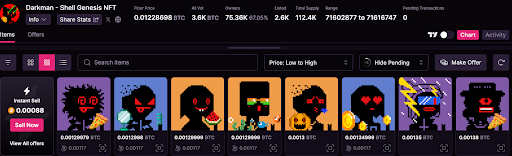
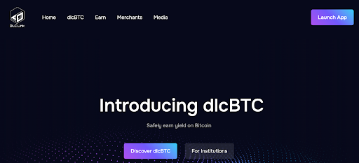
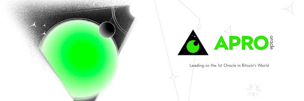
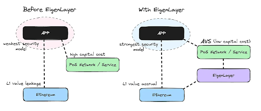
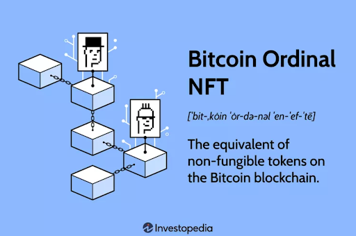
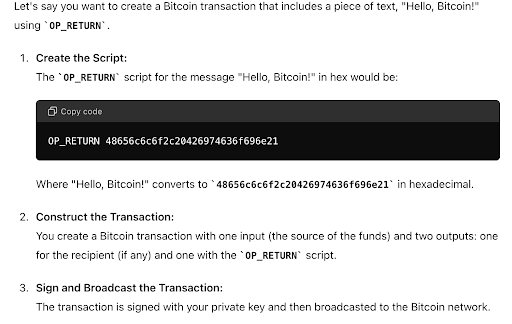
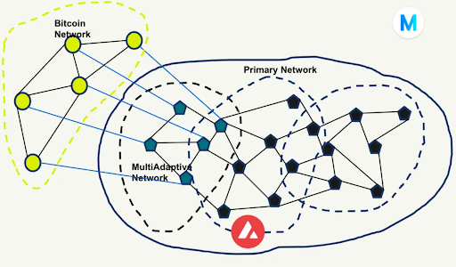
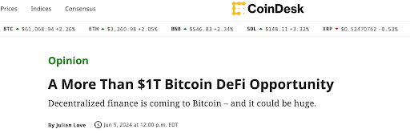

# Babylon 融资 7000 万美元，比特币 DeFi 夏天要来了？| Thought for Today

> CoinDesk 对比特币 DeFi 生态系统的未来做出了极为乐观的预测，认为在未来 5 到 10 年内，比特币 DeFi 生态系统有望创造超过 1 万亿美元的价值。

**作者：** Rebbeca Ren（加密厨房 Crypto Kitchen 纽约主厨）

关于这个夏天的猜想众多，其中最具话题性的便是 SocialFi Summer 和 OnChain Summer，而随着比特币质押协议 Babylon 宣布完成 7000 万美元融资，关于 BitcoinFi Summer 的讨论愈加热烈。

尽管加密厨房公众号最近更新有点慢，但我们并没有闲着，而是与比特币生态中的基础设施建设者们进行了深入交流。他们来自世界各地，有东方的，也有西方的，有从比特币生态起步的资深玩家，也有从其他公链转来的新锐力量。

无一例外地，Paradigm 对 Babylon 的巨额注资带来了显著的联动效应，注入了市场信心 —— 这些建设者们认为这次融资不仅预示着未来围绕 Babylon 的基础设施建设将迎来繁荣，更标志着 BitcoinFi 赛道的前景相当可观。

长期以来，以太坊一直主导着 DeFi 市场，凭借其强大的智能合约功能和灵活性，吸引了大量开发者和项目。相比之下，比特币由于其基础层设计过于简洁，缺乏完整的智能合约编程能力，以及极慢的交易速度，主要被用于价值存储 —— 这与中本聪在白皮书中将其定义为「点对点的电子现金系统」的初衷似乎有些偏离。

然而，在这轮周期里，比特币开始展现出新的潜力。除了 BTC ETF 获批吸引大型资产管理公司的资金流入，Ordinals 协议的出圈效应更是吸引了大量个人投资者 —— 有些来自以太坊生态，有些则是全新的加密市场参与者。

比特币资产的火爆让建设者们看到了围绕比特币打造资产的可行性和可靠性，而他们或将帮助比特币不再局限于价值存储，回归「点对点的电子现金系统」，并成为去中心化金融，或者更大一点，成为 dApp 的重要组成部分。

那么接下来，我们为大家盘点一下最近交流的项目和一些感受。

## Shell Finance

Shell Finance 是一个构建在比特币 Layer 1 上的无需信任的借贷和稳定币协议，旨在解决比特币网络上去中心化金融的需求。

在业务模式上，它类似于 MakerDAO，用户可以在平台内质押资产，借入合成资产 $bitUSD，而 Shell Finance 充当借贷过程中的中介。这种模式能够满足广泛用户的 $bitUSD 借贷需求，实现 UTXO 模型中从个人到资金池的高效流动性。

在发展路径上，Shell Finance 借鉴了 AAVE 的方式，期待通过构建以用户需求为核心的，自下而上的社区来打开市场。与仅支持有限资产种类的主流去中心化借贷平台 Compound 相比，AAVE 支持多样化的抵押资产，增加了资产利用的灵活性和多样性，因此 AAVE 的社区基础较好，能够服务更多用户。

Shell Finance 也希望通过支持多种比特币资产，包括 Ordinals NFT、BRC-20、ARC-20 和 Runes，触及更多用户，不仅限于比特币持有者。

与其他比特币稳定币项目不同，Shell Finance 的所有功能和合约都在比特币的 Layer 1 上运行。创始人 Tim Hsieh 表示，这主要出于两点考量：

1. Layer 1 的架构使得协议本身具备高度安全性和去中心化特性，减少了潜在的风险和攻击面。
2. Layer 1 上拥有数千万枚 BTC 和最活跃、最 OG、最关键的玩家，使 Shell Finance 能够接触到最广泛的市场和最大的流动性。

技术层面上，Shell Finance 使用了一种称为谨慎日志合约（Discreet Log Contract, DLC）的特殊技术，使其贷款系统安全且自动化。

DLC 这项技术由闪电网络共同创造者 Tadge Dryja 提出，旨在比特币区块链上实现更复杂的金融合约，同时保持隐私和安全性。DLC 通过加密技术确保合约细节在执行前保持私密，只有在特定条件满足时才公开相关信息。

在 DLC 技术的帮助下，借贷过程大致如下：

1. 用户可以通过质押 $ORDI，借出一定数量的 $bitUSD。
2. 预言机监视 $ORDI 的市场价值，如果其价值低于设定阈值，预言机会发出卖出信号，清算 $ORDI 用于偿还 $bitUSD 贷款。

整个过程中，$ORDI 不需要转交给借款对象，而是放入一个类似「智能保险箱」的地方，这个「保险箱」能够自动处理包括清算在内的相关操作，确保一切安全、公平。

今年 6 月，Shell Finance 发行了自己的 Ordinals NFT —— Darkman，供应 5000 张，并采取 free mint 的方式。Tim 告诉我们，NFT 的发行能够帮助 Shell Finance 找到早期和核心用户，且持有 NFT 的用户相当于该协议的会员，可以享受借贷服务的折扣。

创业之前，Tim 一直在传统金融行业工作，深知传统金融的运作方式和支付结算中的痛点。这些经验使得 Tim 在刚进入加密世界时，选择了 BCH（比特币现金）作为提高比特币 TPS（每秒交易数）和实现快速支付的解决方案。然而，这次创业并不理想。

随着技术的发展，BCH 通过增大区块大小来提高 TPS 的方式暴露出许多问题，例如可扩展性有限、无法解决根本问题、导致中心化趋势和安全性降低，且缺乏社区支持。相比之下，闪电网络和 Roll-up 技术等提供了更优的可扩展性方案，使其显得过时。

2023 年，Ordinals 和 BRC-20 代币 Sats 的爆火，让 Tim 意识到人们对比特币链上资产的强大共识。他说：「Sats 被 mint 了 2100 万次，这就像一个社会实验，取得了超乎预料的结果，意味着这里存在机会，可以围绕这些人做服务。」这正是他创立 Shell Finance 的初衷。
与 Shell Finance 聊完之后，我们又巧遇了另一家在使用 DLC 技术的公司——

## DLC.Link

DLC.Link 总部位于纽约，由连续创业者 Aki Balogh 创立。Aki 在 2013 年于波士顿与合伙人共同创立了 AI 驱动的营销公司 MarketMuse，并成功筹集了 1000 万美元。2023 年，凭借对比特币的热爱和对高度去中心化及高安全性的追求，Aki 开始了新的创业旅程，顺理成章地投入到比特币生态的建设中。

这次，Aki 和团队的目标是推出一种更安全的 BTC 包装方式让用户参与跨链 DeFi 交易，即 dlcBTC，从而取代 wBTC（Wrapped Bitcoin）。

wBTC 是一种基于以太坊的 ERC-20 代币，它代表比特币在以太坊网络上的价值，使得比特币能够参与以太坊上的 DeFi 应用。在 wBTC 生态系统中，BitGo 担任「托管人」的角色，负责存储加密资产。当用户将比特币转换为 wBTC 时，比特币被存入 BitGo 的托管钱包中，BitGo 确保每个 wBTC 都有 1:1 的比特币作为背书。

BitGo 于 2013 年成立于硅谷，是第一家专门用于存储数字资产的合格托管人。它保护了约 20% 的链上比特币交易（按价值计算），并在其平台内支持 700 多种数字资产。
尽管 BitGo 是一家知名且合规的加密货币托管服务提供商，但这种中心化的托管模式仍存在信任风险。如果它遭受攻击或出现安全漏洞，用户可能会面临丢失托管比特币的风险。

因此，Aki 团队希望可以让用户实现对比特币的自我托管（不需要任何第三方）来参与 DeFi。

dlcBTC 正是基于 DLC 技术，让用户可以将比特币锁定在多重签名合约中，保持对资产的完全控制。即使系统遭到黑客攻击，被锁定的比特币也只能转回原始存款人，无法被盗取。

另一方面，dlcBTC 支持多链。目前，用户可以在以太坊和 Arbitrum 生态系统中使用 dlcBTC，未来 DLC.Link 还划进一步扩展到 Solana 等更多区块链。

## 预言机（Oracle）如何在比特币 DeFi 中发挥作用？

作为加密货币个人交易者或持有者，我们在日常生活中可能看不到预言机的存在，但它们在每笔交易中扮演着关键角色。

DeFi 依靠智能合约来运转，因为智能合约能够提供自动化、无需中介、透明、高效、低成本和灵活的金融操作。由于智能合约本身无法直接访问链外数据，因此需要预言机作为桥梁，从外部数据源获取数据并将其传输到区块链上，使智能合约能够基于这些外部数据进行决策和执行。

我们反复提到比特币区块链本身不支持智能合约，那么预言机要如何发挥作用？

这就需要依靠 Layer 2 解决方案 —— 它建立在比特币区块链之上，以增强其可扩展性、速度和功能，而无需改变基础层。通过将部分交易处理转移到次级层，Layer 2 解决了比特币交易时间慢和费用高的局限性。

APRO Oracle 就是一个建立在比特币 Layer 2 上的预言机系统，旨在通过链下计算与链上验证相结合的方式，构建一个安全可信的计算平台，扩展数据访问和计算能力，为 DeFi 应用提供定制化的计算逻辑服务。

它的预言机系统由两层网络组成：

① OCMP 网络（off chain message protocol）：即预言机网络本身，由网络节点组成。第一层的节点相互监控，一旦出现大规模异常，可以向后备层报告，由后备层的节点进行判断。

例如，一个 DeFi 平台需要实时的市场价格数据来决定借贷利率。OCMP 网络的预言机节点可以从多个交易所获取当前价格数据，并通过共识机制验证这些数据的准确性。最终，经过验证的数据会传输到区块链上的智能合约中，自动调整借贷利率。

② Eigenlayer 网络作为后备层。

这意味着预言机可以通过 EigenLayer 获得更高级别的安全保障。具体就 APRO Oracle 而言，如果它的第一层 OCMP 网络有争议，Eigenlayer 会验证和裁决。EigenLayer 的社会共识机制旨在补充以太坊的客观共识机制，而不是替代它。它主要用于处理那些需要人为判断的特殊情况.

这种双层结构增加了安全性，减少了节点被贿赂或攻击的风险。

APRO Oracle 告诉我们，它是第一个专门为比特币生态系统设计的去中心化预言机，在支持 Merlin 和 Bitlayer 等第 2 层项目方面发挥了重要作用。

## 利用 Ordinals 为比特币 DeFi 构建数据可用性（DA）层

在 DeFi 生态里，数据可用性（DA）层通过将部分数据存储和处理转移到链下，显著提高了区块链的交易吞吐量，降低了交易成本。

例如，在区块链网络上，每笔交易都需要支付矿工费用。当网络繁忙时，交易费用会急剧上升。但如果用户通过 DA 层提交大批量交易数据，只需支付一小部分主链费用，从而实现更低成本的交易和操作。

DA 层负责确保数据的完整性和可用性，使得关键的交易记录和操作始终可访问且安全。尽管一些区块链主链不支持复杂的智能合约功能，DA 层可以处理复杂的计算和逻辑操作，为 DeFi 应用提供支持。

在比特币区块链上构建 DA 层通常有几种主流的方式：

① 利用 OP_Return Outputs

OP_Return 是一种比特币脚本操作码，用于在交易中存储任意数据。每个 OP_Return 输出最多可以存储 80 个字节的数据。虽然容量有限，但它在数据可用性方面提供了一个简单直接的方法。

_ChatGPT 展示什么是 OP_Return_

- 优点：数据存储在比特币区块链上，确保数据的不可篡改和高安全性；任何节点或用户都可以轻松访问和读取存储的数据，无需额外的基础设施。
- 缺点：每个 OP_Return 输出只能存储 80 个字节的数据，对于需要存储大量数据的应用来说，这是一个很大的限制；频繁使用 OP_Return 存储数据会增加区块链的大小，使得节点需要存储更多的数据，从而增加了节点的负担。

② 在侧链上构建

侧链是与比特币主链互操作的独立区块链，它允许在不影响主链性能和安全性的情况下进行更多的实验和创新。

- 优点：侧链通常可以处理和存储更多的数据，提供更大的数据可用性容量；可以根据特定应用的需求进行定制，提供更多功能和灵活性。
- 缺点：构建和维护侧链需要额外的开发和运营资源，包括节点、共识机制和安全协议；侧链的安全性依赖于其自身的共识机制和节点网络，需要确保侧链的安全性不低于主链，否则可能带来风险。

比较知名的侧链方案有 Liquid、RSK (Rootstock) 和 Stacks。

③ Layer 2 解决方案

- 优点：Layer 2 解决方案可以显著提高交易处理速度和吞吐量，解决比特币主链的扩展性问题；通过将大部分交易处理移到链下，Layer 2 减少了主链的负担，使得区块链更轻量和高效。
- 缺点：Layer 2 解决方案的设计和实现通常较为复杂，需要额外的协议和技术栈；一些 Layer 2 解决方案可能会引入一定程度的集中化，尤其是在结算和数据可用性方面。
  比较知名的 Layer2 解决方案有 BitLayer、BitVM、Merlin Chain 和 Botanix 等

近期和我们进行交流的 MultiAdaptive 采用了一种独特的方法——通过利用比特币协议中的 Ordinals 来发布数据。

这个过程允许用户将唯一数据刻在比特币最小单位 satoshis 上，使得每一笔交易都可以包含特定的数据内容。用户首先将类似 NFT 的 Ordinal 交易发送到 MultiAdaptive 节点进行验证，这些节点负责链下的数据可用性支持，确保数据的完整性和合法性。

经过验证的数据随后被发送到比特币网络进行存储和广播，比特币网络在这个过程中充当了「见证人」的角色。

通过利用比特币这一最安全和去中心化的区块链，MultiAdaptive 能够确保数据的不可篡改性和长期存储。这种方法避免了在链之间架桥的复杂性，简化了系统架构，减少了潜在的安全风险。

此外，MultiAdaptive 节点提供的链下数据可用性支持，使得数据的验证和处理速度得到了提升，同时仍然依靠比特币进行最终的存储和见证，确保了数据的高可用性和可靠性。

但是使用比特币网络进行数据存储和广播可能会产生较高的交易费用，特别是在网络拥堵时，这一成本问题需要谨慎处理。

MultiAdaptive 最初是以太坊的数据可用性网络，在看到比特币 DeFi 生态的发展之后，很快添加了对比特币区块链的支持。

## 最后

CoinDesk 在《超过 1 万亿美元的比特币 DeFi 机会》一文中指出，比特币 DeFi 生态的价值创造由三个关键需求驱动：

1. 将比特币区块链作为其他代币化资产的基础层的偏好
2. 对比特币资产更高生产力的需求
3. 对能够反映出比特币去中心化原则的金融系统的需求

Ordinals 协议的兴起正是第一个需求的体现。自 2023 年 1 月在比特币主网上线以来，Ordinals 在不到六个月的时间内其总价值从不到 1 亿美元增长到超过 15 亿美元，展示了比特币作为代币化资产基础层的巨大潜力。

最大的机会在于第二个需求：通过收益工具和去中心化金融系统提升比特币资产的生产力。相比以太坊、Solana 等其他区块链，比特币上的可替代代币（FT）价值仍然处于初级阶段。

然而，随着侧链、第二层（Layer 2）和其他新兴技术的发展，比特币的功能性正在显著提升。在 2024 年第一季度，比特币生态系统中锁定的总价值（TVL）从 4.92 亿美元飙升至超过 29 亿美元，增长了六倍多，这显示了比特币 DeFi 潜力的巨大扩展——支付、借贷、去中心化交易所（DEX）、游戏金融（GameFi）和社交金融（SocialFi）等众多应用场景都在建设当中。

CoinDesk 对比特币 DeFi 生态系统的未来做出了极为乐观的预测，认为在未来 5 到 10 年内，比特币 DeFi 生态系统有望创造超过 1 万亿美元的价值。

## 最后的最后

Shell Finance 的 Tim 在和加密厨房对话时曾经提到：

ppqq「比特币在不同的发展阶段展现了不同的趋势——从最初的‘点对点的数字现金’，到后来的‘数字黄金’，甚至未来还会回归初心，因为历史总是不断轮回。然而，这些称谓的变化并不是最重要的。关键在于我们在每个阶段所采取的行动、行业的风向和需求。当前的比特币减半周期的核心点在于，我们需要在这个阶段找到一个新的增长点来维持整个比特币网络的安全，围绕比特币构建去中心化金融（DeFi）生态系统，可能是一个可行的路径。」

比特币的安全性和去中心化特性为 DeFi 提供了一个坚实的基础，而各种相关技术的进步，使得在比特币网络上实现更复杂的金融应用成为可能。

通过将 DeFi 引入比特币生态系统，我们不仅能够提高比特币的生产力，还能扩展其应用场景，实现更快的支付、借贷、去中心化交易所（DEX）、游戏金融（GameFi）和社交金融（SocialFi）等多种功能。

这不仅符合现阶段行业发展的风向，也是实现比特币价值最大化的关键。通过不断的技术创新和生态系统扩展，或许比特币有望引领加密货币和去中心化金融的潮流，和以太坊分庭抗礼。

ppqq这是加密厨房关于比特币基础设施的首篇文章。接下来，我们将每周与各项目方保持沟通，持续输出文章或播客内容。此外，我们还将在 7 月 25 至 27 日的纳什维尔比特币大会上为大家带来最新的一手信息，敬请期待。
