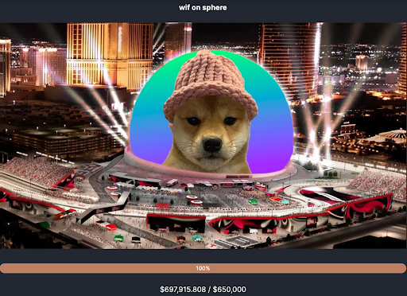
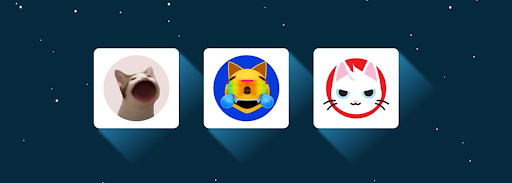
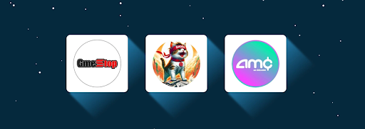

# 川普又双叒叕引爆模因币热潮？读完最新报告或许就懂了 | Thought for Today

> 振臂高呼一声 Fight，模因币千军万马来相见！

**译者：** Rebbeca Ren（加密厨房 Crypto Kitchen 纽约主厨）

在过去的几周里，市场经历了一定规模的回调，模因币（Meme Coin）的热度也随之下降。然而，随着唐纳德·川普在宾夕法尼亚州竞选集会上高喊 Fight，市场开始加速反弹，模因币的热度再次燃爆。

以太坊和 Solana 上迅速出现了名为 $FIGHT 的代币，目前市值分别达到了 4700 万美元和 860 万美元。尤其是被称为 PvP 链之王的 Solana，推出了一系列川普相关的模因币，包括 $EAR（代表川普受伤的耳朵）、$TRUMPE（实在想蹭热度但又不知道用什么名字好）等等，应有尽有。在比特币生态里，符文 FIGHT•FIGHT•FIGHT 上线不久就飙涨了十倍。

尽管许多朋友表示在参与模因币 PvP 过程中赚过钱，但很快又亏了回去，这种玩法仍吸引了源源不断的新参与者。在大家对链上创新感到麻木的时候，模因币文化如同兴奋剂——以没有上限的想象空间和低门槛的简易性，直接刺激人们的肾上腺素。

即使有些朋友不参与模因币的炒作，但作为这轮行情的一个叙事主题，了解它也是非常必要的。毕竟，许多风险投资公司已经开始投入模因币项目，投研机构也纷纷推出模因币报告。

Coingecko 就在 7 月 17 日发布了名为 What Are Meme Coins and Types of Meme Coins 的报告，对模因币进行了详细的分类，认为它是引入新人、为加密货币和区块链技术构建有趣用例的一个机会。为了方便大家阅读，我们对原文进行了翻译，以下为全文：

# 一. 模因币的种类

最受欢迎的模因币类型是以狗为主题的代币，如 DOGE、WIF 和 SHIB。其他受欢迎的类型包括以猫、企鹅、树懒等动物为主题的代币。PEPE 最初是漫画书中的一个角色，但后来发展成一个以 Pepe 为主题的类别。还有一些模因币与现实世界相关，包括政治人物、名人，甚至华尔街赌徒。

本文要点：模因币是围绕漫画人物、事件或动物创建的有趣项目，由社区推广。模因币的核心理念是通过社区活动推动资产价值上涨，借助项目品牌中的搞笑梗来实现。由于模因币专注于乐趣和社区，而不是复杂的技术功能，因此进入门槛较低，吸引力广泛。模因币已成为加密领域的主要资产类别；模因币数量超过任何其他类别。 一些受欢迎的模因币类型包括：狗、猫、政治、名人、男孩俱乐部和 Pepe 相关的模因币。

根据 CoinGecko 的数据，模因币的市值超过 540 亿美元，分布在平台跟踪的 1000 多种模因币中。随着 Layer 2 技术带来的更低交易费用以及 Solana 的并行化等发展，加上如 pump.fun 等代币创建平台的出现，模因币数量激增，许多模因币未被 CoinGecko 跟踪（但可以在 GeckoTerminal 上找到）。

# 二. 什么是模因币？

模因币是以模因为品牌的代币，通常是附有幽默文本的图片，可以适应各种情况。与专注于实用性、致力于实现去中心化、安全性和创建替代金融系统的传统加密货币如比特币和以太坊不同，模因币只想带来乐趣。

模因币的价值来自其社区的力量，以原始梗为主题。例如，dogwifhat；他们的 X 页面上的几乎每张图片都展示了戴着不同帽子的吉娃娃狗。

为了进一步提高项目的知名度，模因币还会进行夸张的营销活动，例如青蛙模因币 Apu Apustaja 在纽约曼哈顿的 13 个广告牌上出现，其中一个在时代广场。

dogwifhat 还计划点亮拉斯维加斯的 Sphere —— 资金已经筹集，但日期尚未确定。
模因币的主要优势是进入门槛低，尤其是通过公平发布事件启动的模因币。它们易于理解，因为它们不涉及任何高级基本面。任何人都可以购买模因币，加入社区并参与宣传活动。

模因币可以根据其主要主题进行分类。一些值得注意的模因币类别包括：**狗主题、猫主题、男孩俱乐部、政治主题、名人主题、华尔街赌徒、Pepe 相关以及其他动物。**

# 三. 狗主题（Dog-Themed）模因币

狗是世界上最受欢迎的宠物之一，狗主题的模因币在加密货币领域非常成功。从 Dogecoin 开始，狗主题的模因币遍布几乎所有区块链网络。狗的梗在模因币趋势中是最强的之一，知名人物如埃隆·马斯克的狗也成为模因币的灵感来源。最受欢迎的狗品种是柴犬，市值前五的模因币中有四个以柴犬为标志。

狗主题模因币在模因币类别中占据主导地位，其市值超过 380 亿美元，占模因币总市值的三分之二。

一些受欢迎的狗主题模因币包括：

Dogecoin (DOGE) 是作为传统加密货币的有趣替代品而创建的，以 Doge 梗为灵感和标志。Dogecoin 是最早的模因币之一，由 Jackson Palmer 和 Billy Markus 于 2013 年推出，目的是创建一种易于挖掘的币。从那时起，它已成长为一个市值数十亿美元的模因币项目。Dogecoin 的市值约为 180 亿美元，是市值前十的加密项目之一。

Shiba Inu (SHIB) 是第二大模因币项目，市值超过 110 亿美元。Shiba Inu 由 Ryoshi 于 2020 年创建，作为 Dogecoin 的竞争对手，并故意提供 1 千万亿的初始供应量。与 Dogecoin 不同，Shiba Inu 作为 ERC-20 代币发行，与更大的以太坊生态系统兼容。Shiba Inu 还推出了自己的 Layer 2 —— Shibarium，自 2023 年 8 月推出以来，记录了超过 4.17 亿笔交易。

dogwifhat (WIF) 是围绕一只戴着无檐小便帽的柴犬病毒图像创建的模因币。dogwifhat 社区因筹集超过 65 万美元以点亮拉斯维加斯的 Sphere 而闻名。dogwifhat 在 Solana 区块链上推出，是网络上最大的模因币，也是第四大模因币，市值超过 22 亿美元。

Bonk (BONK) 灵感来自一只被棒子「敲打」头部的柴犬梗。它是 Solana 网络上的第二大模因币，市值超过 19 亿美元。像 Shiba Inu 和 FLOKI 一样，Bonk 不仅仅是一个模因币项目，还推出了一个 Telegram 交易机器人（BONKbot）在 Solana 上。

FLOKI 灵感来自埃隆·马斯克的狗 —— 一只名叫 Floki 的柴犬。FLOKI 最初是一个没有明确用途的模因币，但后来发展成为一个包含 DeFi、NFT 和元宇宙的 web3 项目。FLOKI 是一个多链代币，在以太坊和 BNB 链上运行，是 ERC-20 和 BEP-20 兼容的，使其易于在两条链之间桥接。它是第六大模因币，市值约为 18 亿美元。

# 四. 猫主题（Cat-Themed）模因币

像狗一样，猫是世界上最常见的宠物之一，有许多与猫有关的梗。模因币项目利用这些梗为其代币品牌，围绕这些猫梗的搞笑主题建立社区。在狗主题模因币爆发之后，以猫为主题的模因币也变得越来越普遍。虽然狗是模因币空间中最受欢迎的动物，但猫也激发了一些非常成功的模因币项目。根据 CoinGecko 的数据，猫主题模因币的市值超过 28 亿美元，日交易量超过 4.23 亿美元。

一些值得注意的猫主题模因币包括：

Popcat (POPCAT) 是市值最大也是 Solana 网络上最大的猫主题模因币。它的市值超过 8 亿美元。POPCAT 于 2023 年 12 月 12 日推出，起源于 2020 年病毒传播的猫咪 Oatmeal，它张大嘴巴，嘴巴被编辑成一个大的「O」形。该项目以包含猫咪图像的梗为生。

Mog Coin (MOG) 声称代表自信和持续增长。它是市值第二大的猫主题模因币。MOG 使用 Joycat 表情符号作为其品牌的一部分，声称该表情符号捕捉了社区的价值观。Mog 于 2023 年在以太坊区块链上通过公平发布推出。目前市值超过 7.9 亿美元。

Cat in a Dogs World (MEW) 是市值第三大的猫主题模因币，市值超过 3.7 亿美元。MEW 的理念是在一个被狗主题模因币过度主导的空间中成长为一个强大的猫主题模因币。MEW 于 2024 年 3 月 26 日在 Solana 网络上推出。

# 五. 男孩俱乐部（The Boy's Club）主题模因币

美国漫画家 Matt Furie 创建了 Pepe the Frog 角色及其室友，作为他 2005 年受欢迎的漫画书《男孩俱乐部》的一部分。由于 Pepe 在 4Chan 留言板上的突破，它成为互联网社区的病毒图像。该书在加密空间中的受欢迎程度持续存在，模因币社区创建了以该书角色为品牌的代币。

根据 GeckoTerminal 的数据，该类别的模因币累计 FDV 为 73.6 亿美元，日交易量超过 7250 万美元。这主要来自 PEPE 和 BRETT，这两个目前最受欢迎的男孩俱乐部角色。还有多个男孩俱乐部角色的迭代作为模因币，因此以下列表并不详尽。我们列出了市场价值最高的代币。

Pepe (PEPE) 来自 Matt Furie 书籍的爆款角色不仅是互联网热点，也是模因币热点。PEPE 于 2023 年 4 月 14 日在以太坊区块链上推出。它主要以漫画角色的图像为品牌。Pepe 是市值第三大的模因币，市值超过 52 亿美元。目前有多个 Pepe 变体，其中一些也成长为重要的市值。

Brett (BRETT) 模因币社区称其为 Base 链的吉祥物。Brett 于 2024 年 3 月 8 日在 Base 网络上推出。目前市值超过 14 亿美元。Brett 是 Matt Furie 书籍中的角色，被认为是 Pepe 最好的朋友。模因币项目以角色的图像和他与 Pepe 的关系为主题，已成为一个成功的梗项目。2024 年第二季度，BRETT 以超过 99%的涨幅名列季度涨幅榜首。

ANDY ETH (ANDY) 于 2024 年 3 月 9 日在以太坊网络上推出，加入了使用流行漫画书图像的模因币项目名单。Andy 部分受益于 Pepe 的成功，也受益于社区的活动。目前市值超过 1.55 亿美元。

Landwolf (WOLF) 于 2024 年 6 月在 Solana 网络上推出。它以《男孩俱乐部》漫画书中的另一个角色为特色。目前市值超过 9100 万美元。如同其他男孩俱乐部代币一样，还有其他共享相同名称和代码的代币。

# 六. 政治（Politics-Themed）主题模因币

一些政治人物成为主流梗的主题。在加密空间中，这些人物也被用作模因币项目的主题。这些项目通过模仿这些政治人物来驱动社区参与和社区模因币的营销。前美国总统唐纳德·川普在该类别中占据主导地位，前五名代币中有四个以他为特色。

根据 CoinGecko 的数据，政治主题代币（PolitiFi）市值超过 9.87 亿美元，日交易量超过 5.72 亿美元。

一些值得注意的政治主题模因币包括：

MAGA (TRUMP) 灵感来自川普的「让美国再次伟大」口号。像其他政治主题代币一样，它的价值受公众情绪和有关川普的新闻的影响。例如，在 2024 年 7 月 13 日的暗杀未遂事件之后，与川普相关的代币价值激增。MAGA 还支持某些慈善事业，如退伍军人事业和反人口贩卖。目前市值超过 3.55 亿美元。

Donald Tremp (TREMP) 围绕前美国总统唐纳德·川普的粗略绘图图像建立。它依赖于政治偶像名字的拼写错误和用粗略绘图图像制作的漫画展示的某些事件的梗。Tremp 于 2024 年 2 月 28 日在 Solana 网络上推出，目前市值超过 5400 万美元。

Jeo Boden (BODEN) 于 2024 年 3 月 3 日在 Solana 网络上推出，适合与 Tremp 相同的类别。这两个梗都是政治偶像的粗略绘图图像。目前美国总统乔·拜登是 BODEN 模因币的主题。Boden 目前市值超过 2500 万美元。不过，BODEN 似乎目前处于下降趋势，反映了公众对总统的意见，根据路透社的调查，57%的美国人不赞成这位现任总统。

# 七. 名人（Celebrity-Themed）主题模因币

名人是来自不同领域的知名人物，如体育、音乐、时尚或社交媒体影响者。就像政治主题模因币一样，名人模因币利用这些人物的知名度及其现实生活活动来创建模因币品牌。这些类别的模因币受益于使用这些名人为其营销活动的一部分。

名人代币可以由名人自己推出和推广，也可以在没有名人直接参与的情况下创建。该类别的模因币控制市值超过 4300 万美元，日交易量超过 2000 万美元。

一些值得注意的名人主题模因币包括：

Mother Iggy (MOTHER) 由澳大利亚说唱歌手 Iggy Azalea 创建，她还积极推广该项目，并建立了社区。MOTHER 以说唱歌手的图像为基础的变体梗为生。MOTHER 在 Solana 网络上运行。它的市值约为 3200 万美元。

Caitlyn Jenner (JENNER) 在 Solana 和以太坊网络上分别有两个版本的 JENNER 代币。根据团队提供的信息，Solana 版本并未由 Caitlyn Jenner 正式推出，但以太坊版本则得到了这位美国名人和前运动员的官方认可。撰写本文时，以太坊上的 JENNER 市值约为 190 万美元。

Davido (DAVIDO) 由尼日利亚 Afrobeats 音乐家 Davido 创建。Davido 于 2024 年 5 月 29 日由艺术家推出，发布当天市值超过 1000 万美元。根据 Gecko Terminal 的数据，目前交易市值刚刚超过 10 万美元。

# 八. Wall Street Bets 主题模因币

Wall Street Bets 是 Reddit 上的知名子论坛，该社区也是著名的 GME（GameStop）轧空华尔街对冲基金事件背后的推动力。该子论坛已成为社区主导价格发展理念的标志，与模因币社区的理念相呼应。

同样，加密货币社区创建了与主要股票相同代码的股票模仿。其目的是在区块链上复制 2021 年的事件——仅通过社区行动创造价值。该类别的模因币通过对股票本身或与华尔街和卖空故事相关事件的漫画展示获得成功。

Wall Street Bets 主题模因币累计市值超过 5200 万美元，日交易量约为 2400 万美元。请注意，有多个代币和代码引用了华尔街赌徒的相同图标，下面列出的仅用于说明模因币类别。

一些值得注意的华尔街赌徒主题模因币包括：

GME 模因币于 2024 年 1 月 28 日在 Solana 区块链上创建。其目的是仅通过社区的力量创造价值。GME 采用了「我们爱这枚硬币」的口号，这是基思·吉尔首次使用的短语的复数形式，其受欢迎程度来自原始的 GameStop 故事和社区成员通过营销表现出的支持。撰写本文时，GME 的市值几乎为 4500 万美元。

Roaring Kitty (KITTY) 参考了基思·吉尔在 GameStop 故事中的社交媒体昵称。该模因币以 YouTuber 的标志性猫咪照片和包含该照片的梗为品牌。KITTY 在 Solana 区块链上运行，撰写本文时市值超过 370 万美元。请注意，该代币与基思·吉尔没有关联。

AMC 模因币于 2024 年 1 月 28 日在 Solana 网络上推出。就像 GME 一样，其理念是「激怒华尔街和每一个大牌对冲基金经理」。AMC 还从 2021 年卖空故事中汲取主题和品牌，当时 AMC 是另一只梗股。撰写本文时，市值超过 180 万美元。

# 九. Pepe 相关模因币

继 Pepe 成功之后，许多模因币跳上了围绕这一漫画角色的趋势，导致数百种变体。这些类别的项目受益于角色的病毒性传播和 Pepe 的受欢迎程度，后者已成长为市值最高的模因币之一。

一些值得注意的项目包括：

Book of Meme (BOME) 由一个在社交媒体平台 X 上使用化名 Dark Farms 的艺术家于 2024 年 3 月 14 日在 Solana 网络上创建。BOME 以 Pepe 角色的图形变体为项目的主要品牌。撰写本文时，BOME 的市值超过 6.29 亿美元。

Pepecoin (PEPECOIN) 在 Pepe 之后不久于 2024 年 4 月 28 日在以太坊区块链上推出。Pepecoin 以 Pepe 角色品牌和运行在 PepeOS 上的应用程序生态系统为特色，包括 AI 交易引擎和钱包到钱包的消息服务。撰写本文时，市值几乎为 3.94 亿美元。

Apu Apustaja (APU) 于 2024 年 6 月 4 日在以太坊区块链上创建。目前市值超过 1.89 亿美元。该项目的图像是 Pepe 角色的变体，社区解释为 Pepe 的年轻、更谦逊和天真的版本。社区还支付了在纽约市的广告牌和公交站广告。

PeiPei (PEIPEI) 于 2024 年 6 月 4 日在以太坊区块链上推出，展示了中国版本的 Pepe 角色的梗。撰写本文时，Peipei 的市值超过 1.26 亿美元。

# 十. 其他动物模因币

狗、猫和漫画青蛙主导了模因币空间。然而，其他动物也被模因币社区采用。一些这些项目取得了显著成功。

一些以其他动物为主题的值得注意的模因币包括：

Slerf (SLERF) 于 2024 年 3 月 24 日在 Solana 区块链上进行预售后推出。撰写本文时，市值超过 1.08 亿美元。Slerf 以树懒为梗动物，旨在建立社区并在过程中创造乐趣。

COQ INU (COQ) 是 Avalanche 网络上最大模因币项目之一（按市值计）。它于 2024 年 12 月 7 日创建，目前市值超过 1.15 亿美元。Coq Inu 以公鸡为品牌动物。

Peng (PENG) 于 2024 年 3 月 7 日在 Solana 区块链上推出。它展示了一只带有「Pepe 青蛙」风格的企鹅的漫画图像。撰写本文时，Peng 的市值超过 2600 万美元。

# 十一. 结论

尽管模因币以极端的波动性和不确定性而闻名，但由于其低进入门槛，它们仍为加密货币和区块链技术构建了一个有趣的用例。模因币项目是引入新人的重要机会，因为用户在购买模因币之前不一定需要了解加密货币空间。再加上公平发布，每个人在发布时都有平等的机会获取代币，任何人都可以获取并押注模因币，通过自我托管解决方案进行交易。

去中心化解决方案如 DEXs 和如 Pump.fun 等代币创建平台提高了创建和开发市场的便捷性，促进了模因币的发展并导致了最近的激增。每一个成功的模因币，新的社区崛起，不仅推广项目，还推广相关的去中心化解决方案。

然而，低监管和快速波动的价值是投资者在购买模因币时需要考虑的关键点。因此，对于价格波动，采用风险管理策略和意识到安全风险非常重要。还要注意，本篇文章仅关注模因币，仅供信息参考，不应被视为财务或投资建议。所介绍的项目并不意味着被认可。

**原文链接：** https://www.coingecko.com/learn/types-of-meme-coins-crypto
