# 尽管市场低迷，但加密厨房从纳什维尔归来看到不少积极信号 | Thought for Today

> 在美国纳什维尔比特币大会，加密厨房与参会者、投资人、创业者和当地居民亲密接触交流，获得了直观一手的观察和感受，今天分享给大家！

**作者：** Rebbeca Ren（加密厨房 Crypto Kitchen 纽约主厨）

自 7 月 21 日到现在，加密厨房有段时间没更新了。

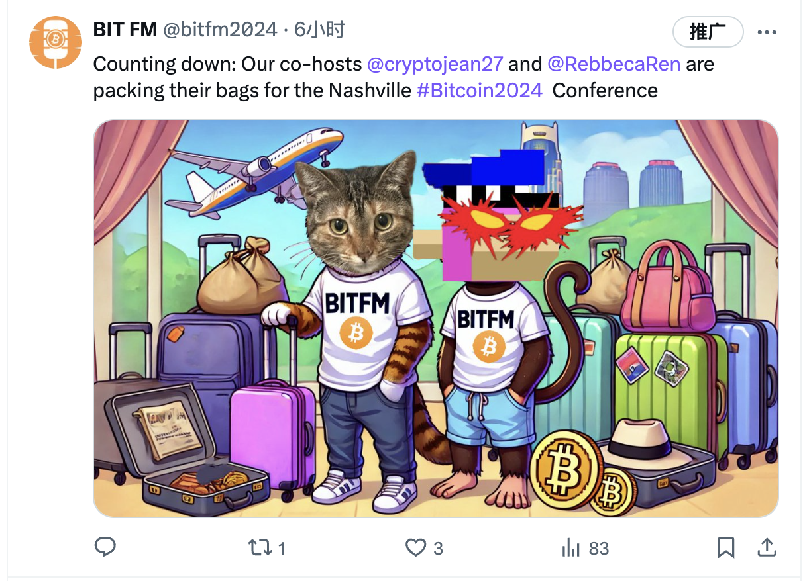

主要因为我和主厨 Jean 分别从纽约和上海奔赴美国纳什维尔，在 2024 比特币大会主会场和各种周边活动奔波，外加举办加密厨房在纳什维尔的活动，在大会最后两天我不幸地重感冒了（可能是空调开太猛），而 Jean 呢，马不停蹄的跑去加拿大探亲（兼游牧办公）了。所以，非常抱歉没能及时给大家分享这次大会的感受。

从比特币大会开幕的 7 月 25 日那天到最近，相信大家就像坐过山车一样，在不到两周的时间里，体验了大起大落的快乐和悲伤，仿佛人生走过了好几年。

其实在纳什维尔的那几天，通过和比特币大会参会者、各种项目方、投资人、创业者和当地居民的密切交流，还是收获了许多积极的能量，所以觉得非常有必要在这个「至暗时刻」，把我们的见闻分享出来，给厨房的朋友们打打气。

为了高度还原当时的经历和感受，我决定以时间线（也就是流水账）的方式来进行展示。

当然啦，对我们在纳什维尔的经历不太感兴趣的朋友，也不要退出页面，可以直接下滑到文章的最后直接看大总结，或者直接看我们剪的活动回顾短片 😄

(video)

# 第一天：7 月 23 日（周二）

在和加密厨房的 Chief Meme Officer 花生酱告别之后，我提着行李去纽瓦克机场搭乘飞往纳什维尔的航班。说实话，打心底里有些羡慕 CMO，没什么正经事做，整天卖萌就够了。

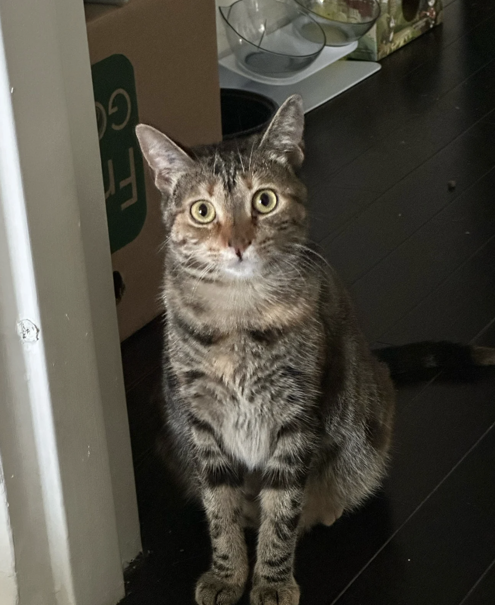

在纽约登机的时候，发现不少小伙伴都是去参加比特币大会的，有散户，有加密项目的联合创始人，也有交易所的员工 —— 不得不感叹还得是世界金融中心，参与加密金融创新的人自然就多。

经过 2 个小时左右的飞行，抵达了纳什维尔机场。

很独特的一点是，在这样一个美国中部小城的机场里，竟然随处可见日语标识。后来我上网搜寻了一下，发现日企早就在田纳西布局制造业了 —— 这里有汽车制造商日产 Nissan 的第一座美国组装厂，电子产品制造公司日本电装 Denso 的四家工厂，还有一些围绕着汽车配件的产业等等。这意味着日本和田纳西的往来比较密切，所以为了方便日本旅客，日语标识非常显眼。

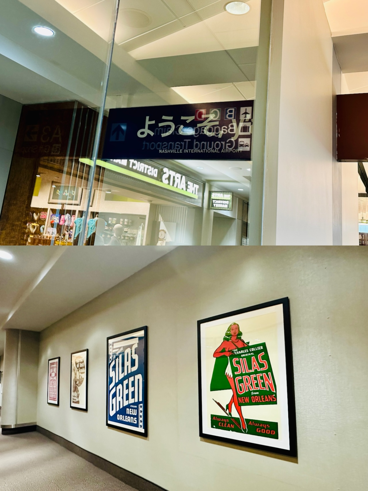

在机场坐上了一辆 Uber，司机大姐是一位在纳什维尔生活了十几年的佛罗里达人。她说我们是她接待的第三波要来参加比特币大会的客人，之前的两波客人已经给她普及了很多加密货币知识。

她说，「我以前最这些东西一无所知，经过他们一讲，我好像知道了点什么。」

我问她既然已经掌握了点基础知识，会买加密货币吗？她笑笑说，「暂时不了，我还是更喜欢稳健的投资，听说加密货币波动很大，如果真要买，可能会考虑买点比特币，但我还不知道，也还不确定。」

谈话间我们就到了 Airbnb 所在的位置，位于市中心的北部，属于一个正在开发中的社区，有一些割裂感。周围要么就是新建的漂亮联排别墅，要么就是有些破旧阴暗的独立屋。

快下车的时候，司机大姐叮嘱道「这个社区以前不太好，但现在正在 gentrified（中产阶级化），你可以看到这些新房售价都很贵的，接近百万美元。但是这块儿还没有彻底的变好，建议你们太晚的时候尽量别在外面走动。」

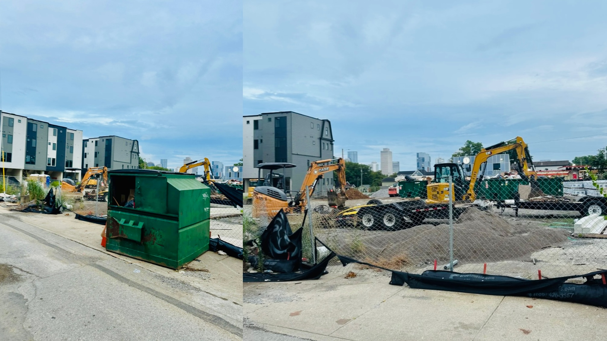

于是我们趁着天还亮着，赶紧把晚饭和生活物资给解决了，再也不出 Airbnb 半步。

深夜，我们的主厨 Jean 终于也从上海赶到了纳什维尔。他在纳什维尔第一次叫车也有令人惊讶的发现 ——

「抵达纳什维尔已是零点时分，用新下载的 Lyft 临时叫了个车，车很快就到，司机是个年轻小伙子，很主动的帮我把行李拎上后备箱，热情的问我 Are you Chinese？我说是啊，他说他是乌兹别克人，我惊讶的发现他是我有生以来见到的第一个乌兹别克人。司机英语不好，两人只能通过翻译软件进行交谈，他居然坦白自己是一年前从墨西哥走线进入美国的，一下子让我对今年美国大选极为关注的非法移民问题有了亲身体会 —— 非移居然来到了田纳西这个美国中西部州，我很好奇他怎么会来纳什维尔、怎么开上网约车的，可能是翻译软件词不达意，到了目的地我都没搞懂他的答案。」

# 第二天：7 月 24 日（周三）

前一天大家赶路比较累，就睡到自然醒，逛了逛附近的 Farmer’s Market 解决午饭。

下午是重头戏，Pizza Ninja、Stacks、Gamma 等项目方赞助的 Inscribing Nashville 活动在城市的另一端开幕！

现场人还是挺多的，差不多有个 200-300 人的样子，一小半在听会，一大半在会场外 social。

Ordinals 和 Runes 协议作者，也是大家最喜欢的 Casey Rodarmor 也来了。不过在大会上，Casey 没有为 Ordinals 的下一步发展指明方向，而是和艺术家朋友聊了聊她的 NFT 项目。

在场外和大家交流了一下，量子猫、巫师、木偶和 Blob 是持有人数比较多的比特币 NFT。

正和别人说话的时候，还有一个白人大哥隔着几米的距离看到我们手中的明信片，就大呼，「我也有 Blob！我喜欢 Blob！」后来一聊，这位从北卡罗来纳州开车过来参加聚会的朋友是个 OG，头部的那几个 NFT 他都有。不得不说老外还是很喜欢小图片的 😄

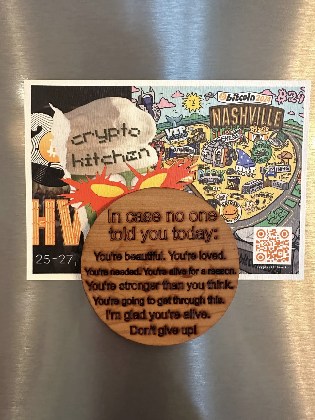

还有一点我觉得比较有意思的是，除了 BTC 资产，大家讨论最多的就是 Solana。现场至少有两个项目方正在做把 Runes 桥接到 Solana 上的事情，还有项目方在考虑把 BTC 资产桥接到 Solana，因为这是目前最能吸引新人入场，流动性最好的地方。

当然这都还不能证明 Solana 到底有多火。更火的是，有个参会的哥们把车牌都换成了这几个字母 ——

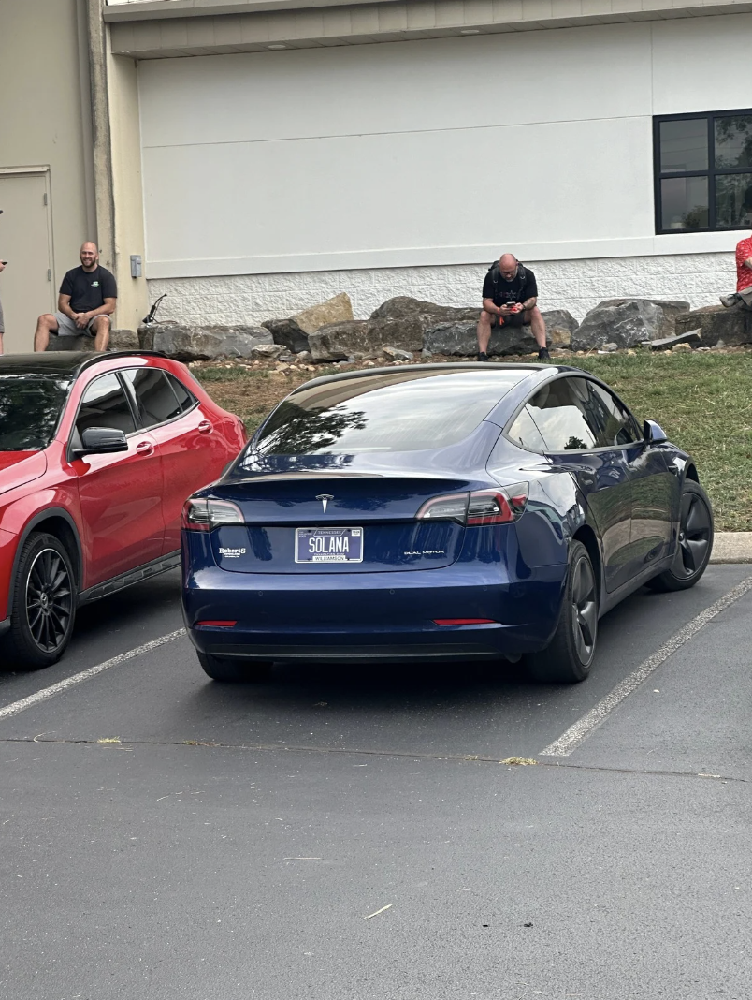

# 第三天：7 月 25 日（周四）

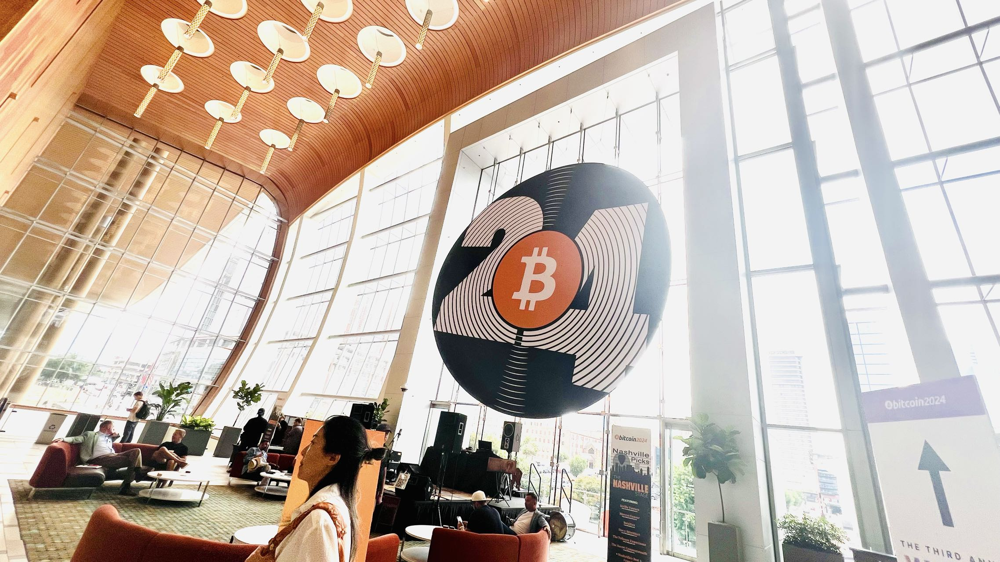

大会开幕第一天，但仅对购买了 Whale（鲸鱼）和 Industry（行业）票的 VIP 开放，我和 Jean 购买的是 Festival 普通门票，无法入场，但可以现场注册登记。

领取会场手环后我们在会场里外转了转，遇到了一些新老朋友。

其中有总部位于纽约的 DLC.Link，他们利用 DLC（谨慎日志合约）技术，使用户能够自我托管 BTC 并参与 DeFi，比起由中心化机构托管的 wBTC 更安全可靠。

我们还遇到了致力于比特币稳定币的 Shell Finance，能够集成 RGB 协议和闪电网络的基础设施提供商 BiHelix，让用户能够利用 AI Agent 搭建自己游戏产品的 FindTruman，以及将铭文资产桥接到其他链上的 Inscription Alliance 等项目。

大家都在这里热火朝天的交流，分享信息，获取潜在用户以及吸引潜在投资人。

会场里还有一个比特币儿童营，小朋友可以在里面做游戏、编程或者学习比特币知识 —— 真的是教育要从娃娃抓起 😄

转了一圈会场熟悉了场地之后，我们马不停蹄满城参加周边活动，其中最为特别一场是当天傍晚举行的「与 Blake Benthall 对话：丝绸之路 2.0 之后的新生」小型聚会，将纽约时报刚报道的传奇故事带到了我们眼前：台上身穿短袖绿衬衣的男子 Blake 是前 SpaceX 程序员，后来成为丝绸之路网站的运营者，结果被穿黑 T 恤的前 FBI 特工逮捕，之后成为线人，协助追捕其他加密罪犯，之后因为找不到工作成为初创公司 Fathom(x)的创始人，而当初逮捕他的 Vincent D'Agostino 则成为他的投资人和搭档。

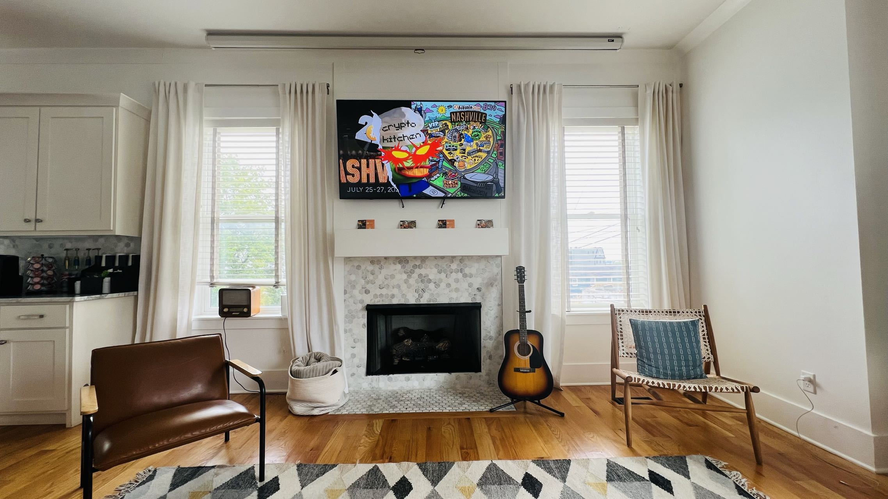

原本计划于周四下午举办的加密厨房 Kitchen Debate 活动因携带物料的小伙伴航班延误而被迫取消。尽管在 Luma 上关闭了报名，仍有不少朋友通过推特表示希望参加。因此，我们决定即便没有物料，也要重新启动这一活动。

于是，晚上我们在 Airbnb 接待了大家，活动从晚上 8 点持续到 11 点，人们陆续到来和离开。参与者背景多元，包括东西方的 VC、创业者、码农、对加密货币感兴趣的生物医药研究员以及探索将加密技术融入电商的跨境卖家等。

大家在轻松的氛围中喝喝酒聊聊天，这种随性的氛围超出了我们的预期。

# 第四天：7 月 26 日（周五）

今天是大会对所有参会者开放的第一天。

在会场附近一家生意火爆的咖啡店里吃早餐时，由于找不到空桌，我们询问了旁边有两个空位的人是否可以共享桌子。

得到肯定回应后，我们随意聊了起来。这位朋友发现我们都是加密同道，他随即从包里拿出一个 Trump Pepe 的面具戴上，并兴奋地分享这是他们在 Solana 链上发行的新 NFT 项目。他还提到，自己之前曾经参与过名为 $Troll 的模因币项目，与中国社区有着紧密的联系。

因趣斯汀，像这样来大会做推广宣发的模因币项目看来不少。

早餐后，我和 Jean 进入音乐城中心会场外的展区游荡，随机和展台上的项目方聊聊天。

展区的三分之一空间被矿机厂商占据，三分之一空间则被比特币 Layer2、DeFi、稳定币和各类软硬件钱包项目填满。参观者对 Ordinals NFT 和各种软硬件钱包表现出更大的兴趣，这些展位的人流量也更大。

大家熟知的 Bitlayer 和 BOB 都设有展位，尽管如 Stacks、Merlin Chain、Nervos Network（CKB）、Zulu Network 等一些 Layer2 项目未设立展台，但我们在随后的周边活动和交流中依然有机会接触到他们，此外，还有一些规模更小的参与者就不一一提名了。

据 FindTruman 联合创始人 Lyon 说，他去年去迈阿密参加比特币大会没看到什么比特币 Layer2 项目，今年在展会亲眼目睹比特币二层项目的繁荣和日益激烈的竞争，尤其考虑到目前比特币链上 TVL 不过 5.87 亿美元（DeFiLlama 8 月 7 日数据）。在这样一个熊市环境下，如此众多二层项目争夺有限的流动性，项目方面临的挑战无疑是巨大的。

Ordinals 艺术展格外显眼，占据了剩余三分之一的展区，其中巫师系列尤为受欢迎。

创作这个变身麦当劳叔叔的中本聪的 MrHANSEL 非常 OG，最早用 Counterparty 协议制作了 Rare Pepe 的数字藏品卡。

逛完展区后，我和主厨 Jean 一同前往主会场「中本聪舞台」，观摩今天的主题演讲。等候入场的队伍很长，从主会场门口逶迤至宽广的展区。排队的时候，Jean 领了一件 T 恤，正面写 FREE ROSS VOTE TRUMP —— 这是比特币社区呼吁美国政府尽早释放已经服刑超过十年的丝绸之路网站创始人罗斯·乌布里希特（Ross Ulbricht）的志愿者行动，目前已经有 60 万人在请愿书上签名，川普也在各种场合包括这次比特币大会现场表示如当选会给予减刑特赦。第二天，当 Jean 身穿这件 T 恤入场时，立即被田纳西州当地媒体摄影记者拉着拍了张照片。

# 第五天：7 月 27 日（周六）

今年比特币大会备受全球瞩目的重头戏来了：下午 2 点，前美国总统唐纳德·川普将现身主会场，进行预定 20 分钟的主旨演讲。

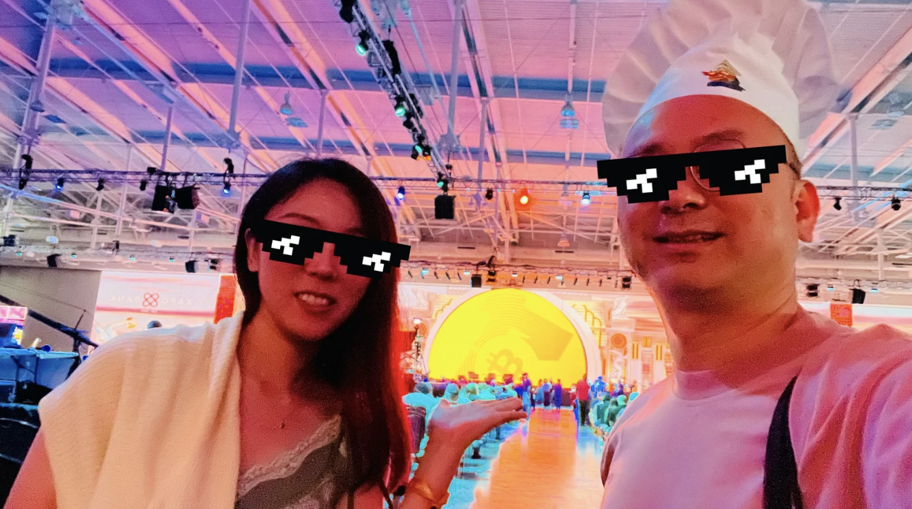

为了获得主会场中本聪舞台一个座位，我们特地早起，上午 10 点就开始排队进场，因为先到先得，到晚了主会场全满就被拒绝入场。考虑到川总前两周竞选集会上险些遇刺身亡，大会特设两道分别由当地警方和美国特勤局的安检，除了手机和钱包，其他任何东西都无法带入场，为此我损失了一个小运动包和一个水杯 😂（川总赔我！）

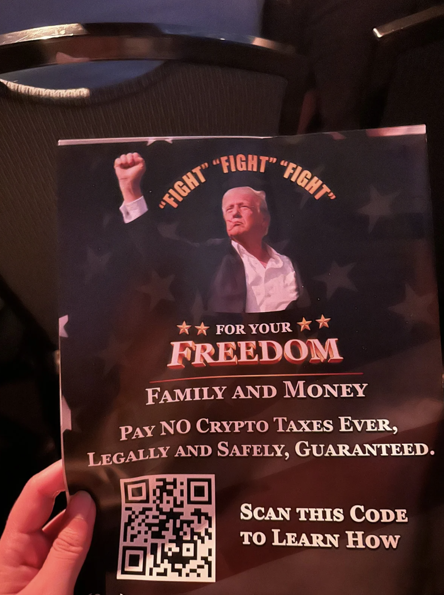

川总人还没来，座位上的各种来自第三方的宣传单小广告都就位了，不得不佩服他这流量圣体的光环。

比预定时间推迟了一个多小时，直到 3 点川总才现身舞台，而讲话内容大家在网上第一时间都已看到，这里不再赘述，全程演讲视频 👇🏻

(video)

总结起来就是一句话，「要确保加密革命发生在美国，要确保美国引领加密革命，如果美国不做，那某国就要做了。」 —— 至于哪个国家，请大家自行脑补。

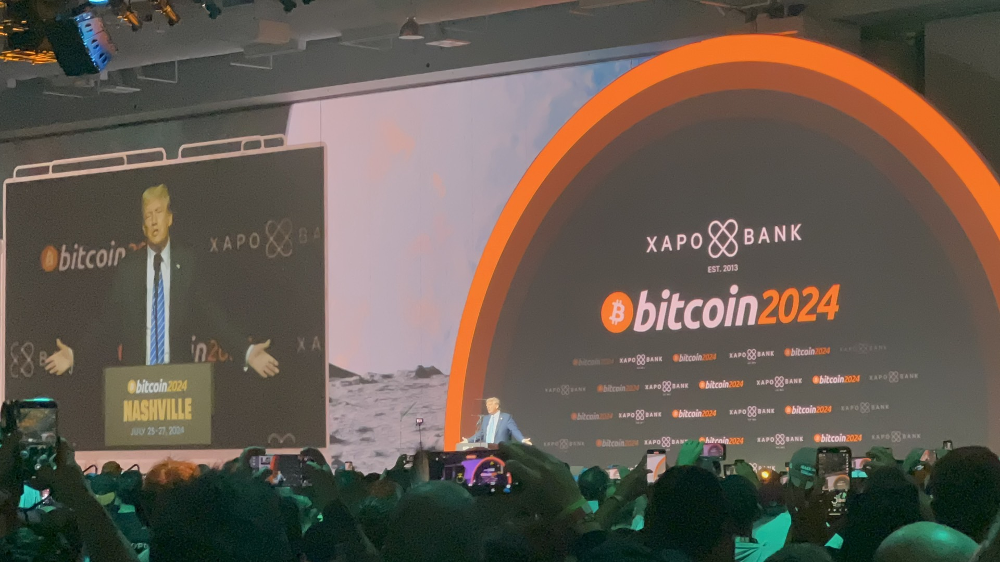

_远远的拍一张川总_

川总精准把握了 Bitcoiner 的喜好，他的一句「如果我当总统，（美国政府）将不会卖出任何一枚比特币」，将现场气氛推向高潮。

旁边从佛罗里达赶来参会的交易员大叔问我觉得川普讲的怎么样，我说从现场反馈来看，非常的 bullish！他笑而不语，一脸不置可否的表情，果然见过了大风大浪的 OG 觉得这都不算什么 —— 确实，并不是比特币需要美国总统，而是美国总统、议员、政客需要比特币。

因为场内人太多，手机信号和 WiFi 信号都非常差，川总讲话结束时候，出会场一看前两天一直拉盘上涨的比特币跌了不少，显然利好在会前已经被精明的交易者被 price in 了不少。

这场演讲更像是川总的粉丝见面会，我们看到很多年纪在六七十甚至八十岁，还有坐着轮椅进来的观众，这些人大体上更符合共和党支持者的画像 —— 这并不是刻板印象，在随机聊天的过程中，我们也发现他们基本都是川总支持者。

这些年长的观众虽然被称为 boomer，但他们也持有或交易加密货币，这一点颇为酷炫。在纳什维尔的几天里，我们遇到了不少这样的加密货币持有者。

比如，25 日我们遇到了一位开特斯拉 Model 3 的白人大叔。得知我们将参加比特币大会，他自然而然地和我们聊起了比特币。他是特斯拉和川总的粉丝，也是加密货币的交易者。他告诉我们自己从 2010 年开始买入比特币，并且至今几乎未曾卖出 —— 他显然是一个隐形的富豪。

(video)

他还紧跟市场动态，了解到现在 meme coin 很火，而以太坊的热度不如以前。当被问及还投资什么加密货币时，他查看了一下自己的 Robinhood，表示他现在只做狗狗币的短线交易，从不碰以太坊。

当 Jean 问他是否会参加在他家门口举办的比特币大会时，他带着一种人生赢家的微笑说，「不会，我开着我的特斯拉拉客和你们聊天就很好。」他身上散发出的轻松自在，是早期持有者特有的氛围。

另一位开奔驰 GLC 的白人大叔，也是土生土长的纳什维尔居民。当 Jean 问到他是否是 Republican（共和党人）时，他直接回答：「我是 Trumpcan（川粉）」，并开始热烈地夸赞川总。

他告诉我们，自己也是比特币的早期买家，但由于几年前生活中遇到的困难，不得不卖掉了一些比特币。他的语气中带有一些沉重，我们没有继续追问。

写到这里，你是否感觉纳什维尔似乎人人都持有比特币？

我们的 Airbnb 房东也是一位比特币持有者，并且为自己的非盈利机构设立了一个「比特币金库」。晚上，当房东得知我们明天将离开时，他从几十英里外赶回来，带来了他精心挑选的花茶，并与我们聊了两个小时。

他是加州人，毕业于加州大学伯克利分校，近二十年前搬到纳什维尔，非常热爱这里。

2012 年，他偶然参加了一个关于比特币的 meetup 后，决定购买一些比特币。「我发现那个房间里的人都比我聪明，他们认为这个东西有前途，我就觉得也应该买点」他说。而那个房间里有一位就是被比特币开发者奉为圣经的《精通比特币》的作者 Andreas M. Antonopoulos。

尽管他在一次市场波动中卖掉了那批比特币，但他后来重塑了对比特币的信念，再次买入，并一直持有，甚至为了资助自己的非盈利机构而设立了前面提到的比特币金库。

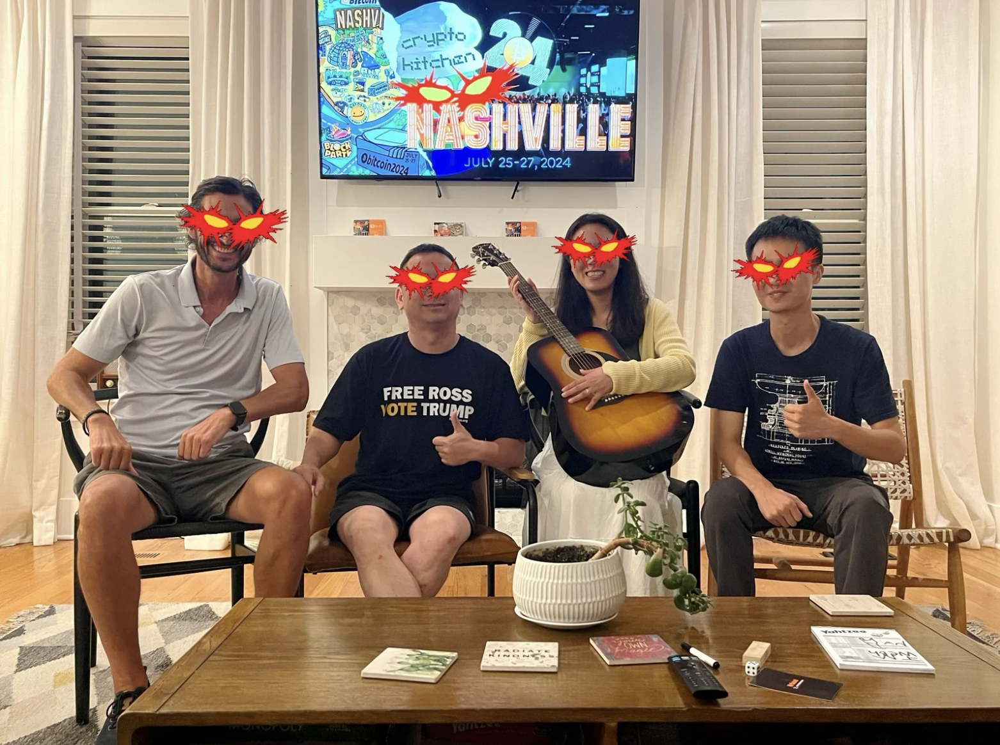

最后，晒上加密厨房在那斯维尔最后一晚部分成员和房东的合影。

# 第六天：7 月 28 日（周日）

今天就是和朋友们告别，在纳什维尔街头四处逛逛。

_贴满了狗狗币的 Cybertruck_

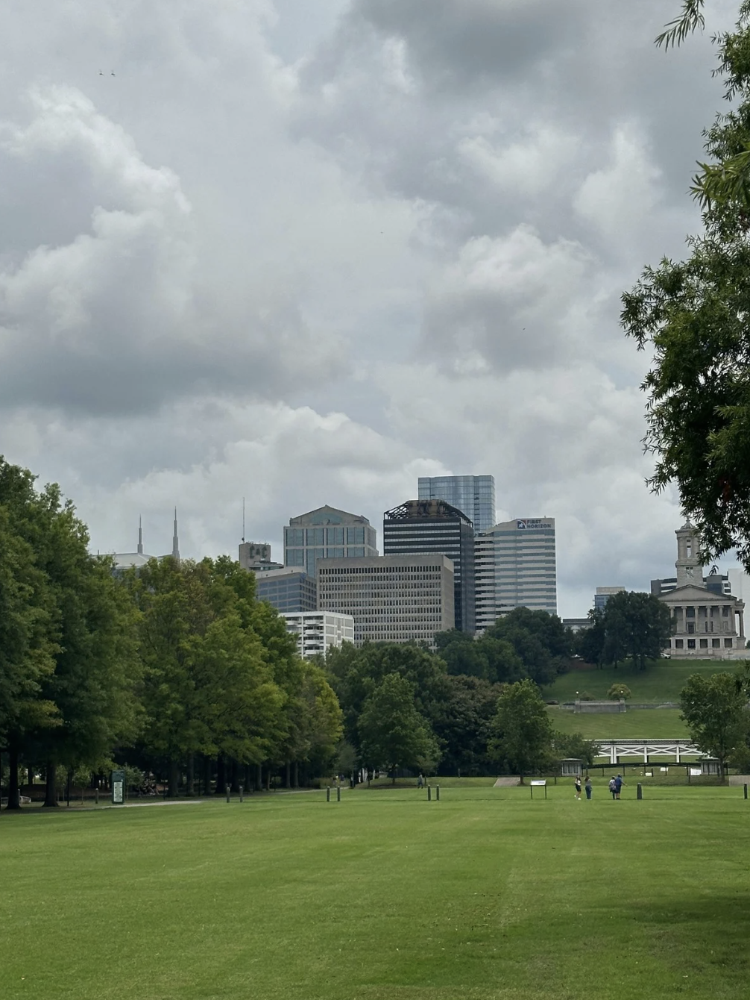

_纳什维尔市政厅附近_

_热闹的 Broadway 大街，就像北京后海酒吧一条街，从早躁到晚_

_纳什维尔特有的大篷车，旅客必坐，上车后啤酒音乐嗨起来，边嗨边绕市中心转一圈_

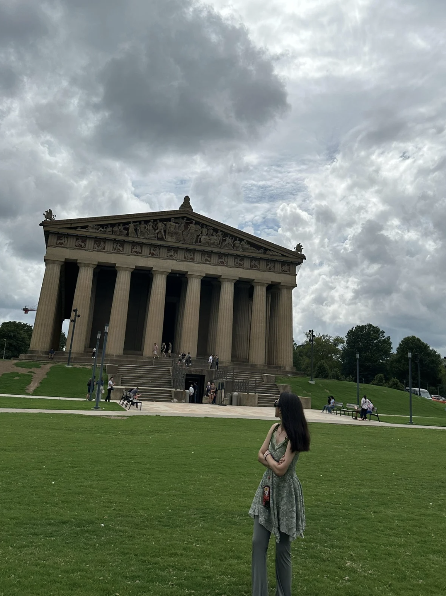

_纳什维尔帕特农神庙——对古希腊帕特农神庙的完整 1:1 复制_

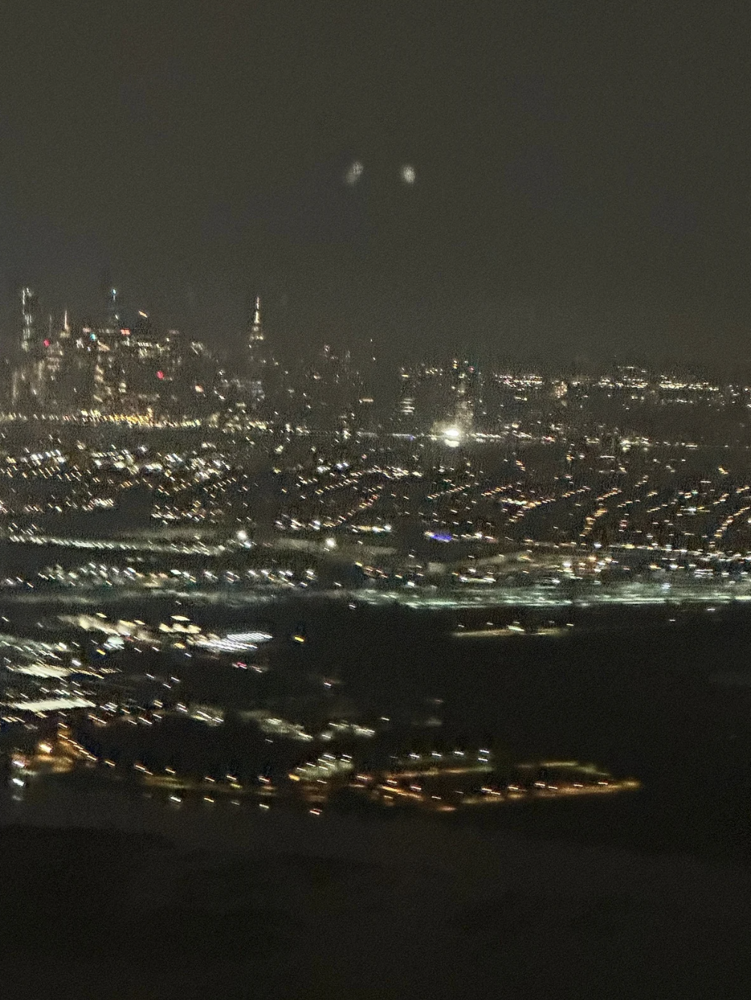

_快降落纽瓦克机场时的曼哈顿夜景，我手抖了_

最后，回到纽约家中，发现 6 天 5 夜没见面，加密厨房 CMO 花生酱已经有点儿忘记我了，看到我进门汇报工作一脸懵逼状态，真是贵人多忘事啊。

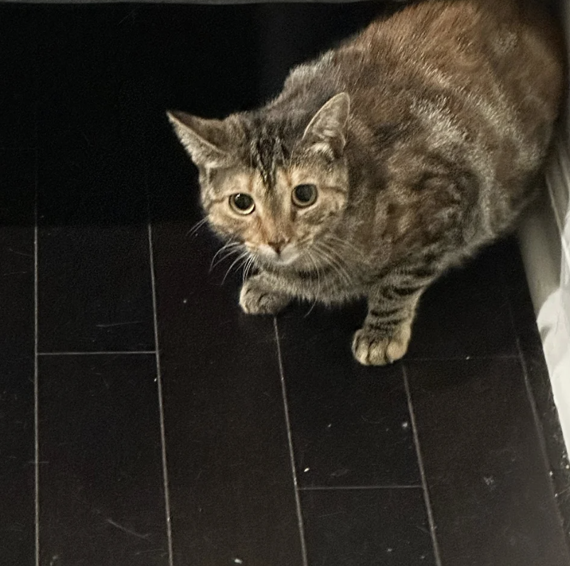

最后，一些我参加纳什维尔比特币大会的复盘总结：

1.这是 Bitcoin Magzine 比特币杂志第一次在自己的总部纳什维尔举办比特币大会。不仅官方，还有参加过之前会议的朋友都表示这也是规模最大，参与度最高的一次比特币大会。随着比特币 ETF 通过，比特币成为国家战略资产储备，奏响了主会场讨论的最强音。

2.在美国，比特币生态和 Solana 生态是目前关注度最高的，几乎无人提起以太坊。一些参加完 7 月初在比利时布鲁塞尔举行的 ETHCC 的朋友们也纷纷表示，这次的比特币大会非常有活力，比毫无新鲜事的 ETHCC 有趣多了。

3.Layer2 是兵家必争之地，西方有 Lightning Network、Stacks、Rootstock 等口碑和技术不错的老项目，东方有新晋势力 Bitlayer、Merlin 等。尽管现在市场有些熊，流动性也没有得到释放，但鉴于在比特币上做资产（如 Ordinals, BRC-20, ARC-20, Runes 等）发行的路径已经走通的差不多了，那么打造 Layer2 来提升资产交易速度频率和资产价值，来推行更多的 DeFi 功能必定是一条可以走下去的路。

4.比特币信仰者的群体比我们预期的要更加多元化。以往在纽约，我们接触到的主要是科技界人士持有比特币，但在这次纳什维尔之行中，我们发现来自各行各业的人都认同比特币可以抗击通胀，并视其为可能的货币未来，因此选择成为持有者。
