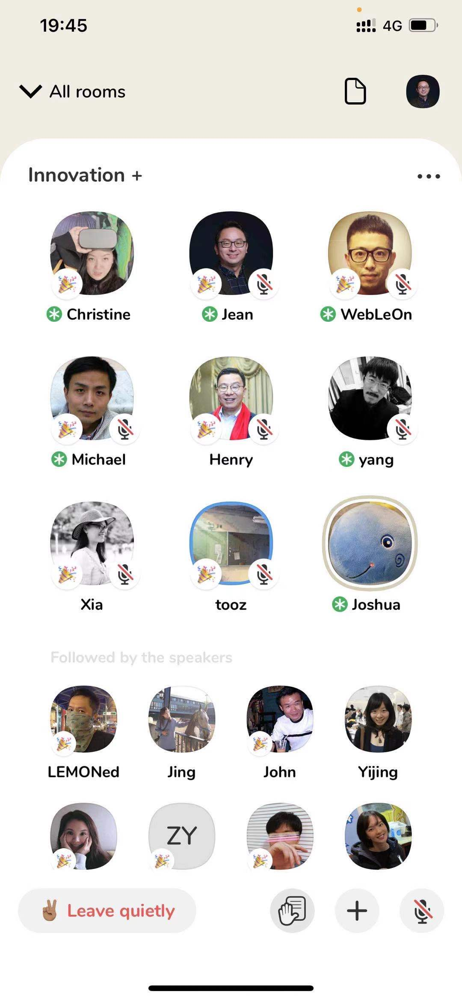
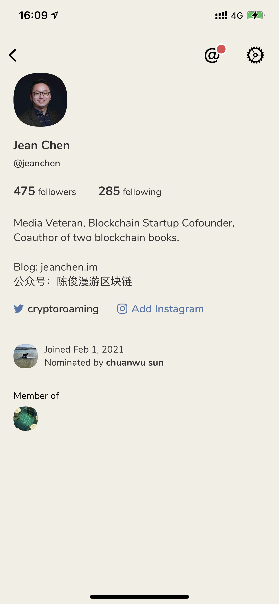

# 互联网 loser 的一份 Clubhouse 体验周报

**作者：** 陈俊

> Clubhouse 2 月 1 日注册到今天，正好一个礼拜，可以写一篇我的产品体验周报了。

就我个人体会而言，Clubhouse 绝对是十年来最火爆的社交软件。自[伊隆·马斯克 2 月 1 日下午两点驻场带货](https://mp.weixin.qq.com/s/zz67HuLDL9QZlfBGVYcYKQ)之后，微信群和朋友圈顿时刷屏晒图求码。我也是当晚在一个群里求得邀请码施施然踱进 Clubhouse，发现 2005 年至 2008 年 Web 2.0 兴起时结识的互联网老友们(当年国内最早写 Blog 以文会友的互联网从业者与爱好者，简称 cnblogger)几乎都在——而上一回如此规模、全民总动员级别的互联网产品观光行动还是发生在十年前 2011 年春节时推出的微信。除了互联网老人，似乎整个币圈的大佬、KOL 和投资人也涌了进来，大家各自纷纷开房(Room)叽叽喳喳的聊了起来……

当时我就在想，会不会房间转来转去，永远就是互联网产品和 DeFi 炒币的话题？结果并非如此。几天以来，随着我关注的人和主题增加，政治、历史、科技、音乐、体育、娱乐、两性、八卦等各种主题的房间自动浮现在主屏时间线上，看房间标题和有哪些认识的人在里面，自然就会点击进入，听一听都是谁在讲、讲啥东西，如果觉得发言的人讲得不错，点开头像看 ta 的简介，然后决定是否点击关注，觉得想发言，可以点击右下角的举手符号，等房间主持人翻你牌子，当然也有你认识的主持人会主动拉你上台当 speaker。逛听 Clubhouse，如果你只是听众，就像收听节目(过去是广播电台，现在是播客——也是 Web 2.0 兴起的产品)，如果你举手或被邀请给了麦，就像线上加入茶馆唠嗑，整个过程非常自然随意。

其实，连开房间聊天都很随意。前天下午 5 Miles 创始人卢亮开了个房间“谈谈 Clubhouse 的算法吧”，把 Clubhouse 底层技术供应商声网的联合创始人 Tony Wang 拉了进来，结果变成了 Tony 个人专场长达两个多小时的 AMA——而主持人卢亮有事先走一步了；昨天傍晚媒介 360 创始人钱峻刚注册使用 Clubhouse，尝试性的开了个房间“Innovation+”，她拉我聊了没两句，就来了一百多位听众。当我刚介绍完新读的[《不做 Clubhouse 了，把它“创业开源”吧》](https://mp.weixin.qq.com/s/IDxDJQ8JZmA9FFGldQunoQ)的内容要点，不知谁就把文章作者 Joshua 拉进房间，一场围绕 Clubhouse 产品和创业的 Q&A 立马展开……

说实话，当时我有点吃惊：试想你线下或线上 zoom 办个论坛讲座，从主题设计到嘉宾邀请，再快也得花一天半宿吧，而在 Clubhouse 连半小时都不用。当然，许多人指出这是 Clubhouse 通过 iPhone 用户专有、限额邀请、名人带货、疫情封城等一系列天时地利人和因素导致的中高端(或者说中老年)用户蜂拥而入、人人开麦的热潮，甚至有“兄弟我当年在硅谷什么大佬没见过吃过”的某媒体老湿挖苦眼下涌进 Clubhouse 的中国用户基本上是“同温层”抱团的互联网 loser——尽管他吐槽后也在昨晚悄悄加入了 loser 的队伍。

撇开上述第一时间贴标签秀优越感、匆忙将新事物嵌入已有认知框架从而妨碍成长进步的心态和思维，我认为 Clubhouse 目前紧紧抓住我们的是它聚焦于”实时语音聊天“这一功能，什么录音转发、语音之外的表情留言私信功能统统都没有，让每个进入房间的用户都沉浸在言说和聆听之中。仔细想想语音这一沟通手段、传播媒介，它让言者无心(内容生产门槛远低于文字视频)、听者有意(收听时不用全程全神贯注，可以边听边干不费脑的事，常有偶得)，而且相比于视频图片，语音是最难矫饰且留有思索回味空间的媒介，因此通过声音，你更有可能了解和展现更真实的思想和情感。Clubhouse 聚焦于实时语音聊天以及将内容兴趣至于社交关系之上(据 Joshua 分析，Clubhouse 的社交网络增长曲线将比传统社交网络更陡峭)的产品设计，让用户不断探索发现有意思的内容和人，尝试各种玩法——开房唱歌的、直播影视剧演唱会的，甚至静默不许开麦的……让你时刻都有 serendipity(机缘巧合)和全球村(global village)的收获和新鲜。

至于国内互联网大厂的拷贝、Clubhouse 的被墙，目前 Clubhouse 中国用户认为这是早晚的事，因此格外珍惜目前的机会。而这正是区块链技术支持的去中心化应用能够帮助传统中心化应用克服的痛点——这一非常值得探索实践的课题，将来慢慢分享。

The last but most important thing，就是如果你身边有能够倾诉交流分享的活人，切勿过度沉迷于 Clubhouse 的虚拟聊天——东西再好，过则不宜。

_欢迎上 Clubhouse 关注交流_

**推荐阅读**

- [Clubhouse: a16z“自媒体帝国”崛起的关键一战](https://mp.weixin.qq.com/s/LDIresR0KqNg1G0OHRzQ_w)
- [Clubhouse 上手教程](https://mp.weixin.qq.com/s/zHKZ8IGfX-A1VjOSohsk2w)
- [Clubhouse / RTC / 直播 / 场](https://mp.weixin.qq.com/s/yb2_-davR3dBKeKOn3_JSA)
- [clubhouse 的云上硅谷](https://mp.weixin.qq.com/s/VM9Rrt5idr5QPTMFwo3mdg)
- [“我用 72 小时复刻了一个 ClubHouse”](https://mp.weixin.qq.com/s/mUGGkxdTIngLzd9zX96AeA)
- [不做 Clubhouse 了，把它“创业开源”吧](https://mp.weixin.qq.com/s/IDxDJQ8JZmA9FFGldQunoQ)
