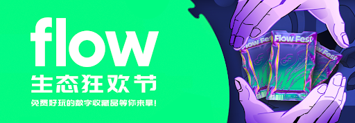
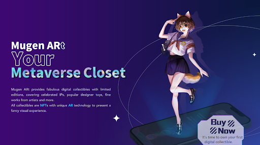
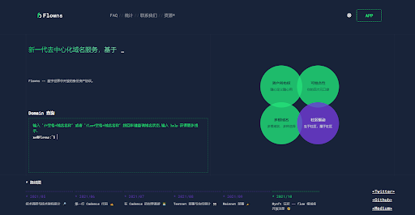
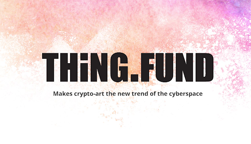
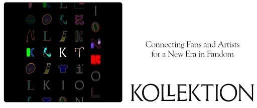
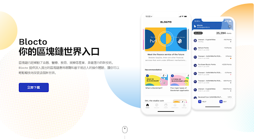

# 「Flow 生态狂欢节」精彩项目抢先看（二）| 2021 上海元宇宙文化周推广

> Flow 由 2017 年和 2020 年分别打造 CryptoKitties 和 NBA Top Shot 两款爆款应用，力推 NFT 出圈的 Dapper Labs 开发，正在打造孵化专注于支持 NFT 的公链生态。
>
> 日前，Flow 与元宇宙特攻队达成合作，双方相互参与、支持并推广各自主办的「Flow Fest 生态狂欢节」和「上海元宇宙文化周」（Shanghai Metaverse Week）活动。
>
> 今天，为大家介绍第二批参与 Flow 生态狂欢节的生态项目。

**By Shanghai Metaverse Week**

为了让全球用户更好地了解基于 Flow 的前沿技术，身临其境地感受数字生活的魅力，从 10 月 15 日起，Flow 官方策划了为期 1 个半月的 Flow Fest 虚拟生态狂欢节，从收藏品到游戏，从音乐到艺术到体育等，以及一系列的福利活动，让全球用户真正地参与到 Flow 生态中来。

## 关于「Flow 生态狂欢节」

「Flow 生态狂欢节」期间，将有 20+ Flow 生态项目陆续发布上线，项目覆盖艺术、游戏、音乐、体育等各文娱产业类型，用户可以在此期间购买自己心仪的数字收藏品，感受来自元宇宙的独特数字魅力。同时，这些项目在神秘礼盒的预热活动中也为大家准备了免费好玩的盲盒礼品空投，全球限量 30000 份，参与方式详见《「Flow 生态狂欢节」上线，免费好玩的数字收藏品等你来拿》。

究竟有哪些项目参与了「Flow 生态狂欢节」？上海元宇宙文化周抢先带大家一探究竟。

## 1. Mugen ARt

**简介：** Mugen ARt 提供美妙绝伦的限量版数字收藏品，包括著名 IP、流行的设计师玩具、各类艺术家的精美作品。所有的收藏品都是 NFT，采用独特的 AR 技术，呈现出一种有趣的视觉体验。Mugen ARt 的增强现实功能让你的收藏品在现实世界展现成为可能。在你喜欢的地方移动、旋转和与它们互动，并拍摄照片。在这些神奇的时刻，它们不再是数字收藏品或 NFT，而是你的朋友

> 项目官网：www.mugenart.io
>
> Twitter: @MugenARt_Closet
>
> Discord: discord.gg/dubF6XfFEw

**小编说：** Mugen ARt 在未来某处可以使用。它是收藏品激活更多功能的舞台，也是收藏家有更多联系的地方。简而言之，这是我们拥抱可能性的地方。

## 2. Flowns

**简介：** Flowns 是建立在 Flow 链上的新一代去中心化域名服务，是一个基于 Cadence 智能合约语言的资源型域名服务。Flow 中的资源模型使 Flowns 服务具有灵活性和可扩展性，基于域名 NFT 资产，我们可以产生更多的使用场景。

> 项目官网：www.flowns.org
>
> Twitter: @flownsorg

**小编说：** Flowns 不仅仅是一个域名服务，也是开放数字身份/资产的协议。

## 3. MyNFT

**简介：** Mynft 是一个基于 Flow 的 NFT 平台，旨在连接东西方市场，为用户提供优质的 NFT 和社交体验。Mynft 中的 NFT 是在 Flow 链上发行的，并应用 Arweave 来实现元数据的永久存储，可以确保 NFT 的稀缺性、真实性和不朽性。Mynft 可以支持大容量和多种格式，提供不同的方式选择，如限价、拍卖、神秘盒等多种方式。Mynft 用户可以投资、收藏、评论、喜欢、奖励和分享他们喜欢的 NFT。

> 项目官网：mynft.io
>
> Twitter：@Mynft2021
>
> Discord：discord.com/invite/25WjpTDGFY

**小编说：** 在 Mynft 平台，创作者可以自由选择 NFT 的销售方式以及设定价格。NFT 可以以图片、视频、音频等多种文件格式发行，最大容量为 500 MB。发行在 Mynft 上的 NFT 元数据将会存储在 Arweave 上，满足创作者、消费者对于 NFT 数据永久存储的需求。

## 4. THiNG.FUND

**简介：** THiNG.FUND 建基于传统世界与加密世界的交汇之处。它诞生于加密世界，同时，聚集了艺术学术和流通领域的顶级专家。THiNG.FUND 服务于探索这个新领域的艺术家，为艺术家提供全方位的孵化，共同成长。

> 项目官网：thing.fund
>
> Twitter：@thing_fund
>
> Discord link: discord.gg/NaCNA8BHy5

**小编说：** THiNG.FUND 精选富有艺术造诣与思想深度的艺术家，为其提供投资、学术、技术和市场支持，并在艺术家生涯的早期参与到孵化过程中。THiNG.FUND 拥有深厚且权威的艺术资源网络，为每一位加密艺术创作、运作和投资的参与者提供更优的价值扩张渠道。

## 5. Voxel Knight

**简介：** 由社区创建的第一个好莱坞式的体素宇宙。一个具有可扩展的平行世界的体素宇宙，充满了惊人的景观和结构，生活着成千上万的生动的人物，他们有自己的故事。
为 4 种不同的人群角色而设计——

- 游客：只需在体素世界中徘徊，沉浸式地体验人物的故事。游客可以是任何对体素风格创作感兴趣的人。
- 创造者：提供数字资产并构建场景。他们可以将自己的作品卖给收藏者。
- 收藏者：数字资产的投资者，他们可以购买现有的资产或场景作为投资，所以他们可以把它们借给电影制片人，以便从商业广告或票房收入中获得利润分成。
- 电影制作人：通过在体素世界中的拍摄，创造故事、剧本和制作叙事性视频系列。他们可以通过嵌入商业广告，或通过票房收入获得利润。

> 项目官网：www.voxelknight.com
>
> Twitter：@voxel_knight
>
> Discord: discord.gg/kYnC8Y7jpV

**小编说：** Voxel Knight 是一个具有可扩展的平行世界的体素宇宙，充满了惊人的景观和结构，有成千上万的生动的人物。

## 6. KLKTN

**简介：** KLKTN 与世界上最有创意的艺术家合作 —— 那些真正感动你的人，那些你真正喜爱的人。我们一起探索创意和技术的交叉点，丰富联系，重新想象关系，扩大影响。

> 项目官网：klktn.com
>
> Twitter：@KLKTNofficial

**小编说：** KLKTN 由一群业内人士建立，并得到有影响力的投资者的支持。合作伙伴包括音乐和娱乐、数字品牌和战略、金融科技和区块链领域的国际重量级人物。与世界各地最具创新精神的艺术家合作。

## 7. Blocto

**简介：** Blocto 是新一代的加密货钱包，通过用户友好的界面你无忧无虑地探索加密世界。Blocto 提供了一个直观的上手体验，包括无钥匙账户管理和统一的跨链费用支付，因此用户可以在注册后 1 分钟内与 dApps 轻松互动。通过 Blocto，dApps 可以为其用户提供近乎原生的体验。

> 项目官网：blocto.portto.io
> ：
> Twitter: @BloctoApp
>
> Discord: discord.com/invite/H34KZqF

**小编说：** Blocto 是一个支持多链的智能合约钱包，以智能合约管理的方式简化用户操作，对没有区块链使用经验的新用户更加友好（尤其是面向圈外的 NFT 玩家）。用户仅需使用邮箱登录即可获取钱包地址，并畅玩各种 DApp，期间产生的 Gas 费用可以统一使用「点数」支付，点数可以通过系统赠送、应用商店内购的方式获得。目前 Blocto 支持以太坊、Flow、BSC、Tron、Solana 五条公链（也是第一个支持 Flow 的钱包），近期将陆续支持 Avalanche、Polygon 及 Palm.io。

> 想了解更多 Flow Fest 项目讯息，请加入 Flow Fans Discord 中文群：**https://discord.gg/tcwwMsgFA3**

## 现在，来抽取 Flow Fest 神秘礼盒！

我们在以下 3 个渠道发放 Flow 礼品兑换码（可重复参与）。为了避免错过领奖，请及时加入官方 Discord（discord.gg/XQZ4H8ugCU）。

1. 加入 Discord，进入 #nft-airdrop 频道，点击抽奖符号参与抽奖，总计 5 个；
2. 访问文化周官网（m7e.sh），可在 Highlights、MOCA Exhibition 板块发送弹幕，弹幕发的有趣有机会作为幸运观众被抽取中奖，总计 5 个；
3. 关注并转发元宇宙特攻队推特（@NFT4Metaverse），有机会被抽取中奖 5 个。

_网址：**https://m7e.sh/**_

### 2021 上海元宇宙文化周日程更新

- 9 月 15 日至 10 月 28 日：NFT 空投与申领 @文化周官网
- 9 月 29 日至 11 月 21 日：「分身宇宙」展览 @苏州寒山美术馆
- 10 月 21 日：MOCA 展开幕虚拟酒会 @Somnium Space
- 10 月 22 日至 28 日：MOCA 展「自我的觉醒」 @元宇宙/官网/上海 M50
- 10 月 22 日：开幕论坛「探寻元宇宙身份」@上海外滩创意家俱乐部
- 10 月 23 日至 24 日：超次元虚拟化身实时互动体验 @上海 M50 创+空间
- 10 月 23 日上午： Harmony 聚会「当上海在元宇宙与硅谷邂逅」 @上海 M50 创+空间
- 10 月 23 日下午：数字交互体验派对「When Message Dreams」 @上海 M50 创意园 17-108
- 10 月 23 日晚： Polygon 生态元宇宙之夜 @上海 M50 创+空间
- 10 月 24 日上午：UTU.ONE 聚会「DAO 可道，非常 DAO」 @上海 M50 创+空间
- 10 月 24 日下午：Dataverse 聚会「来赢取你的 NFT …… 贴纸吧!」 @上海 M50 创+空间
- 10 月 26 日：MOCA 展聚会 @Decentraland
- 10 月 27 日：元宇宙化身虚拟圆桌 @MAY
- 10 月 28 日：闭幕派对 @CryptoVoxels
