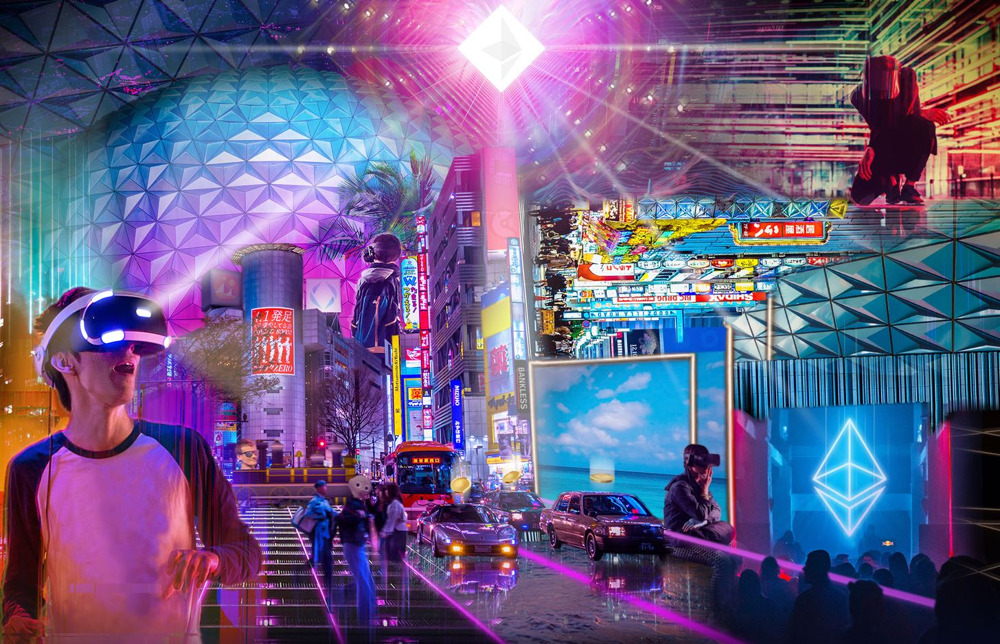

# How Blockchain Enables The Metaverse

**Author:** Andrew Steinwold

The metaverse is coming.

What is the metaverse? It's hard to define, kind of like trying to explain the internet.

In its simplest form, the metaverse is a virtual environment where people live, work, and play. Zoom is part of the metaverse. So are games, like Minecraft and Fortnite.

You could even say that Facebook is part of the metaverse. But a true metaverse, a [Ready Player One-style](https://www.youtube.com/watch?v=cSp1dM2Vj48) reality, is only possible with blockchain technology. Before explaining how blockchain enables the metaverse, let's look at three growing trends:

1. Screen time
2. Increased technology immersion
3. Video gaming

These trends are all contributing to and accelerating the emergence of the metaverse.

## Screen Time

It won’t be long before the majority of people start spending most of their time in virtual environments. Hell, if you are reading this you probably already spend the majority of your waking hours looking at a screen.

A [recent study](https://www.independent.co.uk/life-style/fashion/news/screen-time-average-lifetime-years-phone-laptop-tv-a9508751.html) found that the average adult in the United Kingdom spends a total of 34 years staring at screens (TV, computer, phones, etc.), and in the US the number is supposedly 44 years. Although the [US study](https://people.com/human-interest/average-us-adult-screens-study/) was paid for by an eye company, I suspect the data is not too far off.

And the time we spend on screens is not slowing down, it’s accelerating.

## Technological Immersion

People are not only spending more time staring at screens, but also interacting with technology in increasingly immersive ways. If we zoom out and view the ways we have historically interacted with technology, we can clearly see this trend.

- **1830s - Telegraph**: The telegraph required trained professionals to decode messages that were written down and passed to the recipient.
- **1920s - Telephones**: Telephones introduced audio communication, but was confined to a landline.
- **1980s - Mobile phones**: Mobile phones allowed people to communicate with audio devices anywhere.
- **1990s - Internet** (email): Email allowed instant and free written communication.
- **1995 - Instant messaging** (AIM, WhatsApp, WeChat, etc.): Instant messaging enabled even more accessible instant and free written communication.
- **2010 - Video calls** (FaceTime, Zoom, etc): Video calls allowed audio and visual communication.
- **2020 - Virtual reality**: Virtual reality transports users to any fictional or real location, where people can communicate with audio and 3D visuals.

As you can see, as technology improves so does its level of immersion.

All of our senses are gradually being activated as we march towards total immersion. Telephones first brought us audio, then video calls brought us visuals. Soon we will have haptic suits for touch and perhaps even taste and smell!

## Video Gaming

Speaking of screen time and immersive technology, gaming is huge.

There are 2.7 billion gamers worldwide and the gaming market is estimated to be around [$160 billion](https://www.reuters.com/article/esports-business-gaming-revenues/report-gaming-revenue-to-top-159b-in-2020-idUSFLM8jkJMl) dollars. To put this into perspective, if gamers and the gaming market were a country, it would easily be the most populous country with a GDP to rival the wealthy country of Qatar. This growth is not slowing down either. By 2023, the gaming market is expected to bring in a striking ~[$200 billion](https://www.reuters.com/article/esports-business-gaming-revenues/report-gaming-revenue-to-top-159b-in-2020-idUSFLM8jkJMl) dollars.

Gaming is not only huge, but also evolving into more than just “game play.” Today, games can enable social experiences, creativity, and learning. When you throw blockchain into the mix, you enable the integration of digital value — games can allow users to earn a living (more on this later).

Combining the three trends: increased screen time, immersive technology, and video gaming, the emergence of the metaverse becomes a question of “when” and not “if.”

## Blockchain Is The Key To The Metaverse

What key piece of infrastructure, or “law,” would you need to feel confident spending the majority of your time in a virtual environment?

The answer is likely different for everyone, but for me the answer is property rights. I want to know that the items and things I acquire inside a virtual environment are not going to be taken away from me. Property rights are the basis of all (successful) economic systems, and it is a no brainer that they should exist in virtual economies.

What else does the metaverse need?

### Digital Scarcity

If people could copy and paste everything inside the metaverse, then property rights wouldn't really matter!

It’s essential that digital scarcity exists inside of the metaverse. Nobody wants to work hard in a game or virtual world only to have their value diminished by too much copy and pasting ([sound familiar?](https://cointelegraph.com/news/us-printed-more-money-in-one-month-than-in-two-centuries)). Luckily, we’re covered because blockchains enable digital scarcity.

### Interoperability

When I was growing up, I could never play video games with friends who had PS2s because I had an Xbox. A real metaverse allows assets and people from one game or environment to enter into a different game or environment. Blockchains, like Ethereum, allow complete interoperability. For example, one could take NFT art from an independent artist and bring it into a new virtual world created by a startup.

### Programmability

When I buy a good today, it stays static. My white t-shirt cannot be upgraded to flash rainbow colors. But programmable assets allow any and all assets to become upgradeable. This means you’ll have more utility for the items you own. A digital t-shirt could be brought into a game and changed into a suit of armor.

Programmability also allows for rapid iteration and experimentation, which is essential for the metaverse. Today, if rent is too high in physical cities, people cannot simply bring prices down by quickly building more units. There is an arduous process filled with red tape and government approvals that can take years to complete.

The metaverse, on the other hand, allows unlimited optionality as it’s programmable. One virtual world might have a height limit and expensive prices, but someone could just build another virtual world with zero height limit and cheap land. The programmable, expansive nature of the environment gives users the freedom to do whatever they please.

### Easy Monetization

Imagine if we could only transact in the metaverse Monday-Friday during bank business hours.

Or imagine if sending a payment in the metaverse took 3-5 business days _(just like a bank wire)_. That would be a terrible experience. Guess what I am going to say next? Blockchain solves this! Public blockchains (like Ethereum) are global, uncensorable, 24/7 financial systems — exactly what a metaverse needs to thrive.

### Permissionless Innovation

Epic Games, the creators of Fortnite, [are suing Apple](https://www.theverge.com/2020/8/13/21367963/epic-fortnite-legal-complaint-apple-ios-app-store-removal-injunctive-relief) because Apple removed their game from the app store.

Epic Games wanted to reduce the 30% app store fee so it could offer items to its users at cheaper prices. This is just one example of a gatekeeper stopping a company from doing something that benefits its users. The open-source nature of blockchains means that stuff like this isn’t possible. If a company puts up barriers, then anyone can build around it. Blockchains enable a world of permissionless innovation that’s required for a metaverse to fully evolve.

## NFTs - The “Stuff” In The Metaverse

Non-fungible tokens (NFTs) are unique blockchain-based assets. For the first time ever, users can truly own goods in virtual worlds and games. It's hard to explain just how powerful digital ownership is, but in my opinion, it enables the vision of the metaverse.

Let's look at some NFT categories within the metaverse and how blockchains impact them.

### Collectibles

**Digital collectibles: ** Digitizing collectibles and putting them on a blockchain gives assets access to the distribution and market size of the internet. Anyone, anywhere in the world can start collecting and trading digital collectibles.

**Physical collectibles: ** Creating NFT certificates that represent physical collectibles is going to unlock billions of dollars of value. High-end watches, Pokémon cards, baseball cards, and all other collectibles can now have digital certificates on the blockchain that are connected to their physical counterparts.

### Games assets

Gamers can now earn money directly from a game by simply acquiring and selling NFTs. This has only ever been possible with gold farming in popular MMOs like World of Warcraft and Runescape, which is not exactly a fun activity.

NFTs allow users to actually play the game, acquire rare items, and sell those items for real money. This paradigm shift will allow people to play games as full-time jobs.

### Virtual worlds

Blockchain-based virtual worlds are the closest thing to a metaverse right now. These platforms are social networks, gaming platforms, e-commerce platforms, and creative platforms, all rolled into one.

These worlds allow users to do and build whatever they would like. This optionality and ownership is what the metaverse is all about. Do what you want and own what you want.

### Crypto art

Digitizing art and putting it on a blockchain will be recognized as one of the most important developments in art history. Without blockchains, people cannot own, trade, sell, or even really value digital artwork.

The legendary art auction house Sothebys uses ten factors to value art, and blockchains enable three of the most important ones:

1. **Rarity:** Collectors can look at the blockchain and see exactly how many assets exist.
2. **Authenticity:** Collectors can look at the blockchain and inspect an artist’s contract address to ensure artwork is authentic and made by a specific artist. Forgeries are not possible if you inspect the blockchain.
3. **Historical Importance**: Collectors can see exactly who owned a piece of art, when they owned it, and even how much they spent on it.

## NFTs Unlock the Metaverse

There is a whole host of other assets and [use cases that NFTs](https://newsletter.banklesshq.com/p/the-bull-case-for-nfts-jake-burkhman) will be used for within the metaverse, such as:

- Clothing
- Memes
- Intellectual Property _(podcasts, videos, blogs, etc.)_
- Ticketing
- Property titles
- Contracts _(legal, insurance, etc.)_
- Identity

And so much more...

The metaverse is just getting started.

Without blockchains, the metaverse would simply not be possible. But now we have the technology. And it’s going to completely unlock unbelievable worlds that we’ve only dreamed of.
