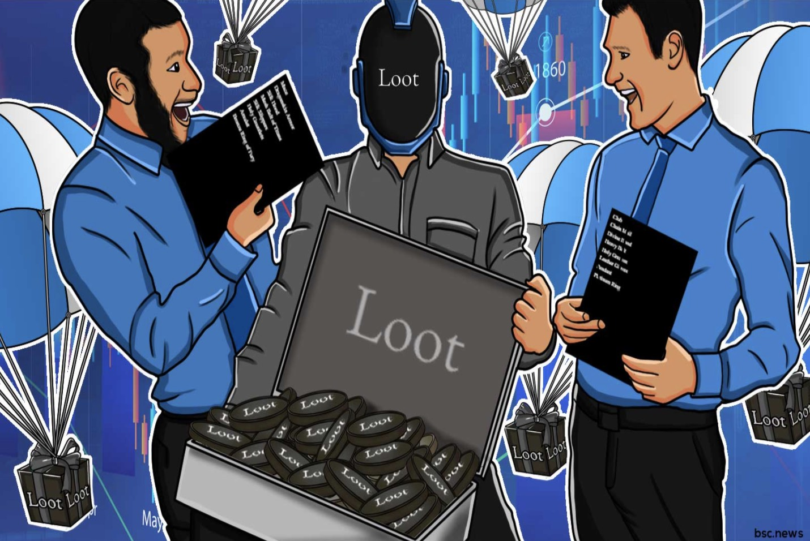
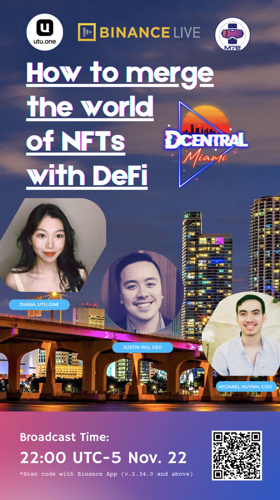

# 作为 Loot 拥有者，在哪里绘制你的旅程？ | Thought for Today

> 作为人人可拥有、分享和治理的下一代互联网，元宇宙的建成离不开 DAO（去中心化自治组织）。
>
> DAO 的风口正在降临。眼下，关于 DAO 的讯息林林总总、目不暇接，相关的讨论和探索才刚刚开始。今天，「元宇宙特攻队」分享一篇来自 UTU 的 Diana Dai 英语文章，抛砖引玉。

**英文原稿**

## As an Owner of Loot, Where to Map Your Journey?

**By Diana Dai**

NFTs have gained notable popularity. Tons of people are pursuing to become an owner of social NFTs and see these limited edition NFTs as gold to preserve or boost the value. While the truth is that having a social NFT in the pocket cannot secure you to share a piece of the pie.

It's just a beginning if you truly expect to see the value of it. Where should you go after this NFT fever?

Owning a Loot bag but ignoring its philosophy is like winning a battle but losing a war. The essence of social NFTs, including Loot and Crypto Punks, is futuristic gaming infrastructure stored on the blockchain. With all the fundamental elements in hand, it's time to discuss how to build NFT Lego.

When selecting product components, one of the determinants is the size and synergy of the community. To secure a prosperous Loot future, holders are constantly looking for a place to implement a fully community-based operation. As one of the enthusiasts, I explored and lurked in Loot Community Discord and Loot Talk, an official forum owned by Loot, for a couple of days. If you are comfortable being an outsider browsing and overseeing what's happening in the community, it might be fine for you to jump on and off from each forum constantly. But once you decide to get your hands dirty, it won't take long to find yourself lost in the massive info and posts and get stuck to find the synergy to promote Loot in the right direction.

Browsing from one tag to another, updates including poor related advertisements and promotions come to you every second; it's not hard to be dragged from one topic to another quickly. You may join a topic on Discord, then follow the link to the formal Loot Talk for detailed discussions. According to the current guidelines, to follow up with a proposal on Loot Forum, you have to wait for up to 3 days to see the final version of the proposal to fulfill the sufficient engagement and finalize the community feedback. Then, head to Snapshot, waiting for the moderation team to raise the proposal.

Basic decentralized decision-making starts to process. But the discussions here are scattered and disorganized.

Owners must operate multi-platforms and forums to join the discussions. Space of conversations and actions are separated and lack consistency. The Loot community and the bordering crypto worlds seem to be independent of each other. A prototype of a decentralized autonomous community is just rising, problems above have seriously disrupted the efficiency of decision-making and slowed down the execution speed. Meanwhile, people holding NFTs from multi-platforms may have to learn and push themselves to be familiar with guidelines over and over. Much complicated and fragmented work raised the community's entry barriers, leading to an incidental and considerable loss of the underlying community value.

NFTs have taken into phase II, where the infrastructure has been in place to build a generational land. However, traditional communication tools are missing to catch up with the paradigm shift from thinking in funnels to an interoperable game economy shaped in a pyramid. In the futuristic metaverse, economies from different games are now interoperable. Players or traders are playing the market more than any game.

Web 3.0 freed games from virtual walls. And game developers have embraced the new paradigm where crypto items are valued by others as well. The attention makes derivatives on top of Loot be something that can raise waves among the public. To attract, hold and manage the attention of your crypto assets, a clear and smooth bottom-up decision-making process is under urgent need. It's critical timing to see anyone who can make a quick reaction to the Web 3.0 decentralization movement. To fulfill the demand, a competent community server must be capable of ensuring that public opinion is fully informed and efficiently implemented, rather than a scattered, directionless process that allows various voices to disrupt the view.

The traditional community mechanism is lagging far behind the development of Web 3.0. It cannot meet the demand for subsequent metaverse construction or further plans based on NFT phase II. The viral social network and the momentum of actions have been overloaded for the current platform.

To bring ample decentralized imaginations alive, owners are looking for a platform they can land on to formulate and implement development strategies. When the metaverse reaches the real world, game players will be joint developers as well. What will an ideal DAC look like? Think about a platform built on blockchain technology where actions are recorded on-chain to be traceable and reliable.

We expect to see the owner's identity verified as an entry ticket to ensure the integrity from the source and consistency of operation since owning the assets. More than a forum or voting mechanism, a tool that meets the above demand should provide in-app or in-DAC trade and keep interoperable to the mass market. To grow the size and engagement of your community, the platform needs to be functional to give a smooth experience where discussions, proposals, and community tasks are in one place.

A community is an ecosystem asking for sustainable and decentralized interoperation, where convincing custodians, roundly elected from the community, should be in place to maintain an overall running. Then, additional expansions will be further developed as the community grows. An ideal DAC (decentralized autonomous community) should allow members to lend and stake social NFTs with auto-generated and accumulated staking rewards.

Social NFTs like Loot have long-lasting potential and creative depth awaiting us to explore. It's a seed with hard shells around it. When the product path is clarified, we expect owners to design their token economy and breakthrough all the restraints.

**中文翻译**

## 作为 Loot 拥有者，在哪里绘制你的旅程？

NFT 已经备受追捧。很多人都在追求成为社交 NFT 的拥有者，并将这些限量版 NFT 视为保值或升值的黄金。而事实是，口袋里有一个社交 NFT 并不能保证你能分到一杯羹。

如果你真正期望看到它的价值，这只是一个开始。在这股 NFT 热潮之后，你应该去哪里？

拥有一个 Loot 包，却忽视了它的理念，就像赢得一场战斗，却输掉了一场战争。包括 Loot 和 CryptoPunks 在内的社交 NFT 的本质是存储在区块链上的未来游戏基础设施。在掌握了所有基本要素后，现在是讨论如何建造 NFT 乐高的时候了。

在选择产品组件时，决定因素之一是社区的规模和协同作用。为了确保 Loot 未来的繁荣，持有人不断寻找一个地方来实现完全基于社区的运作。作为爱好者之一，我在 Loot 社区 Discord 和 Loot Talk（Loot 拥有的一个官方论坛）中探索和潜伏了几天。如果你对作为局外人浏览社区内发生的事情感到舒服，那么你从每个论坛上不断地跳来跳去可能没问题。但是，一旦你决定动手，不用多久就会发现自己迷失在大量的信息和帖子中，并被卡住，无法找到促进 Loot 在正确方向上发展的协同作用。

从一个标签浏览到另一个标签，每秒钟都有更新，包括毫不相干的广告和促销活动；从一个话题迅速被拖到另一个话题并不难。你可以在 Discord 上加入一个话题，然后按照链接到正式的 Loot Talk 进行详细讨论。根据目前的指引，要在 Loot 论坛上跟进一个提案，你必须等待长达 3 天的时间，才能看到提案的最终版本，以实现足够的参与，并最终确定社区反馈。然后，前往 Snapshot，等待审核小组提出提案。

基本的去中心化决策的进程开始了。但这里的讨论是分散的、无序的。

拥有者必须操作多个平台和论坛来加入讨论。对话和行动的空间是分离的，缺乏一致性。Loot 社区和接壤的加密世界似乎是相互独立的。一个去中心化的自治社区的雏形刚刚兴起，上述问题已经严重扰乱了决策的效率，减缓了执行速度。同时，持有多平台的 NFT 的人可能不得不反复学习和推动自己熟悉各种规则。许多复杂而零散的工作提高了社区的进入门槛，导致社区基本价值相当大的附带性损失。

NFT 已经进入第二阶段，基础设施已经到位，可以建立新一代的家园。然而，传统的通信工具还没有跟上从漏斗思维到金字塔形状的可互操作游戏经济的范式转变。在未来的元宇宙中，来自不同游戏的经济体系是可以互通的。玩家或交易者在市场上玩的游戏比任何游戏都多。

Web 3.0 将游戏从虚拟的围墙中解放出来。游戏开发者已经接受了新的模式，即加密物品也被其他人所重视。这种关注使得 Loot 之上的衍生品成为可以在公众中引起波澜的东西。为了吸引、保持和管理你的加密资产的注意力，迫切需要一个清晰和顺利的自下而上的决策过程。看到谁能对 Web 3.0 去中心化运动做出快速反应，这是很关键的时机。为了满足需求，一个有能力的社区服务者必须有能力确保公众意见得到充分了解和有效实施，而不是一个分散的、没有方向的过程，让各种声音扰乱视线。

传统的社区机制已经远远落后于 Web 3.0 的发展。它不能满足后续元宇宙建设的需求，也不能满足基于 NFT 第二阶段的进一步计划。对于目前的平台来说，病毒式的社交网络和行动的势头已经超负荷了。

为了让去中心化的想象生龙活虎来，拥有者们正在寻找一个可以登陆的平台，以制定和实施发展战略。当 元宇宙抵达现实世界时，游戏玩家也将成为联合开发者。一个理想的 DAC 将是什么样子的？想想看，一个建立在区块链技术上的平台，所有行为被记录在链上，可追溯且可靠。

我们期望看到所有者的身份被验证为入场券，以确保从源头上的完整性和拥有资产后的操作一致性。比起论坛或投票机制，一个满足上述需求的工具应该提供应用内或 DAC 内的交易，并保持与大众市场的互通性。为了扩大社区的规模和参与度，平台需要具有功能性，给人以流畅的体验，让讨论、建议和社区任务都在一个地方。

一个社区是一个生态系统，要求可持续的和去中心化的互操作，在这里应该有令人信服的监护人，从社区中轮流选出，以维持整体运行。然后，随着社区的发展，额外的扩展将被进一步开发。一个理想的 DAC（去中心化自治社区）应该允许成员借出和抵押社交 NFT，并自动生成和积累抵押奖励。

像 Loot 这样的社交 NFT 有长久的潜力和创造性的深度等待我们去探索。它是一颗种子，周围有坚硬的外壳。当产品路径明确后，我们期望拥有者能设计他们的通证经济，并突破所有的限制。

北京时间明天上午 11 点，「元宇宙特攻队」特邀主持人 Diana 将为你带来一场直播访谈，将采访全球最大的 NFT 暨 DeFi 的活动 DCENTRAL Miami 主办方。访谈全程英文，活动预告原文如下：

The world’s largest Art Exhibition Art Basel is going to be held in Miami on Dec 1st-4th. Tons of satellites will happen around those days.

One of the most popular events related to NTF and DeFi is DCENTRAL Miami held by DCentral.

By then, I will be a speaker in the DAO panel. You can meet me in person in Miami then.

Today, we will have a talk with the CEO and COO of DCentral. Come and meet Justin Wu and Michael Huynh. Justin is a Twitter influencer, as well as founder of DCentralcon and Swing_xyz. He is building his decentralized communities that every one of you are welcomed to.

We will discuss DeFi, GameFi, and NFT. Come and meet us……

欢迎点击 https://www.m7e.io/live 通过 B 站、YouTube、币安直播观看访谈。
