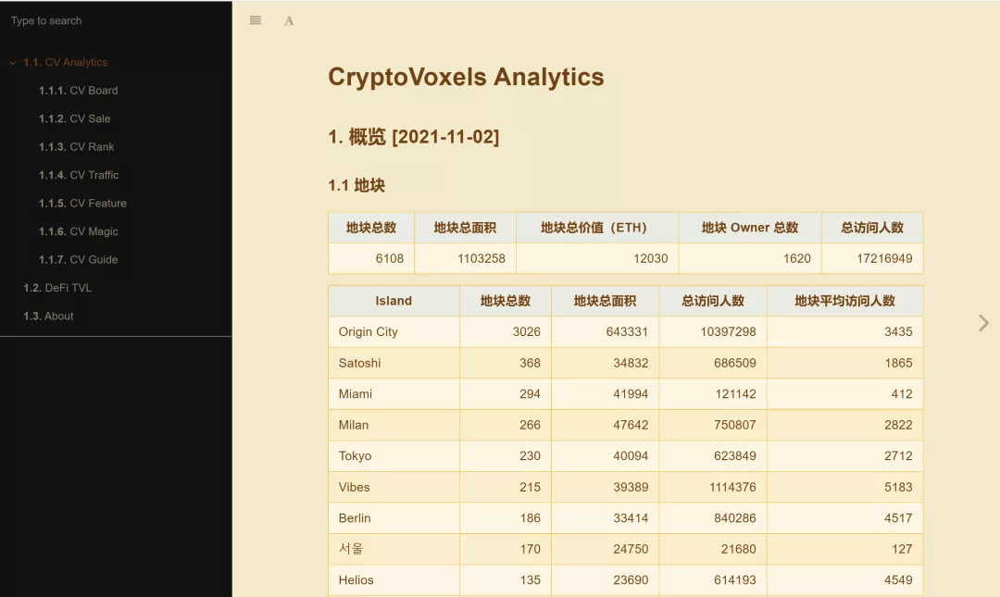

# 元宇宙商业模式遐想 | Thought for Today

> 眼下，「元宇宙」的热度，自不待言。关于「元宇宙」的商业模式，也有人展开了遐想。今天，「元宇宙特攻队」分享一篇来自 MetaCat 的 DawnXue 的投稿，抛砖引玉。

**By DawnXue from MetaCat**

为什么元宇宙最近如此备受青睐呢？

从技术方面来看，区块链技术实现了数字资产的所有权化；从互联网的发展历程来看，3D 化、多维化是大势所趋，从最开始的文字短信、图片、到现在的短视频、直播，互联网内容体验在往越来越鲜活的方向发展。元宇宙则是综合了上述两个特点，既拥有了区块链的技术支撑，也和互联网发展的保持趋势一致。同时，元宇宙平台如 Cryptovoxels 本身就是由特殊的 NFT 组成的，因为这种 NFT 好像一个个大的容器，可以承载容纳更多的小 NFT 在其中，而这是其他 NFT 所不可比拟的。

_Photo by <a href="https://unsplash.com/@grakozy?utm_source=unsplash&utm_medium=referral&utm_content=creditCopyText">Greg Rakozy</a> on <a href="https://unsplash.com/s/photos/universe?utm_source=unsplash&utm_medium=referral&utm_content=creditCopyText">Unsplash</a>_

那么，元宇宙会有哪些商业模式呢？让我们来畅想一下吧！

## 1. 销售艺术品 NFT

画廊（Gallery）是目前元宇宙数量最多、发展较成熟的一种商业模式。通过对国内现状的观察以及和国外玩家交流，笔者发现无论国内外，可能缘于 NFT 和艺术先天的关联性。早期进入元宇宙的相当一部分是艺术家以及相关群体，如中国社区艺术家刘嘉颖的赤金馆、艺术家宋婷的熊猫馆、BCA Gallery，韩国社区火热的 dogesoundclub。这些群体催生了元宇宙中最早目前也最流行的画廊商业模式。

## 2. 体素商店（Vox Shop）

元宇宙和现实世界所使用的材质不同，比如基于以太坊的虚拟世界 Crptocvoxels 主要是体素（Voxel）构成的，建筑和可穿戴服饰装备（Wearable)均是以体素为主形成。玩家为了装扮元宇宙场馆或者为了展示自己的虚拟形象，免不了需要 Vox ——相当于现实世界的砖木或布料，这也催生了以 Vox Walk 为首的一批 Vox 商家，这也是非常具有元宇宙特色的商业模式。

## 3. 元宇宙建造

目前有越来越多的个人和机构在 Cyptovoxels、Decentraland、Sandbox 等虚拟世界投资购置虚拟土地。有的地主有多个地块，但是缺乏设计建造的精力和能力；有的地主是机构，愿意聘请更专业的团队建造品牌总部等。上述需求催生了元宇宙建设机构的诞生，如国内的 MetaEstate、国外的 Voxel Architects。

Cryptovoxels 平台 Origin City 岛心累计访问量最高的 Spaceage，Stoneage，Glassage，Welcome 四大建筑均出自 Voxel Architects，MetaEstate 也建造了元气星空 MetaChi HQ、Creation 时尚馆、豪林居饭店等多个精致的元宇宙场馆。

## 4. 广告

有流量的地方就可以有广告。MVB（metaverse-billboards）是一家致力于在元宇宙中开展广告宣传的服务商，其早早就在 Cyptovoxels 中布局了 140 多个地块共 250 多个广告牌，服务价格为每周 1ETH。

上图中蓝色坐标均为 MVB 所持有的地块。当然，个人也可以赚取宣传费，如 AILY Gallery，为艺术家在场馆中布置为期数天的一次性展览。另外，元宇宙内容导航 teleport.land，地主可以与其合作增加曝光。

## 5. 地产租赁

对于房地产行业，有买卖就会有租赁，元宇宙房地产也是同理。CV Analytics 的数据统计显示, 有很多地主持有多个地块。我们也了解到，有的地主买地不是为了快速卖掉，而是建造为了长期投资。那么这些地主如果愿意把地块租赁给有建造经营的想法和能力的玩家，何尝不是有价值的资源交换呢？

## 6. 沉浸式体验

沉浸就是让人专注在当前氛围（设计者营造）下而忘记真实世界的体验。去一趟北京环球影城，你觉得是肉身去体验，但是几乎每个主题里都有一个沉浸式体验项目，你可在跟着哈利·波特在高空飞翔，跟着变形金刚穿梭于高楼大厦，跟着小黄人上蹿下跳，但是实质上可能只是座椅多加了左右摇摆失重等功能，结果是这种沉浸式项目的用户体验评价是远高于单纯的过山车项目。有的商场也有了类似的沉浸式体验项目，一次收费可以高达百元人民币。元宇宙天然适合沉浸式游乐项目，元宇宙场馆的设计者们也可以打造此类项目，游客付费买门票进入，在 3D 设备的帮助下获得身临其境的体验。

## 7. 游戏

游戏由于本身的虚拟属性，更容易植入元宇宙空间。比如，Sanbox 是一个社区驱动的区块链游戏平台，创作者们可以在区块链上将体素资产和游戏装备 NFT 化。当然，游戏也可以是其他某个元宇宙平台中创作的一部分。这种链上游戏，由于场地等体素资产和游戏装备的 NFT 化，玩家获取了投资 NFT 和游戏游玩的双重收益和体验。

## 8. 销售服饰

从服饰角度看，线下商场到淘宝界面，再到直播平台主播试穿卖衣服，电商也在往越来越立体的方面发展。但是主播毕竟不是消费者，所以是不是可以有个 3D 扫描仪，将自己真实的身高等数据扫描出来，形成 1:1 的元宇宙虚拟化身，去试穿里面同样 1:1 化身的衣服呢？

## 9. KTV

KTV 本来就是一种社交方式，消费者愿意付出金钱去 K 歌社交，但是线下 KTV 更局限于地点，相隔千里之外的人不可能专门赴约参加一场 K 歌。元宇宙居民遍布世界各地，而 K 歌本就适合植入线上，不久以后，不知道你是否愿意付费参与一场元宇宙线上 K 歌呢？

## 10. 数据服务商

互联网离不开数据，元宇宙也是。项目方想了解地块的地主、流量等数据、买家想及时了解在售地块的信息、卖家想了解市场待价而沽、玩家想了解哪儿最好玩最热门等等，这一切都离不开数据的支持。专业的数据服务商势必是未来一个非常重要的角色。

在不久的将来，可能会涌现出一批新的职业或产品，如元宇宙建筑师、场馆设计师、元宇宙建造培训方、元宇宙游乐项目规划师、元宇宙场馆运营方、3D 扫描仪等。想必又会催生上述罗列之外的其他商业模式。

所以未来的元宇宙会是什么？一个融合社交、广告的立体微博，一个可以纵享沉浸体验项目的游乐园，一个可以直接试穿的立体淘宝、一个可以跨国 K 歌的唱吧……

当然，正如谷歌、Facebook、腾讯、阿里巴巴都不可能被单独叫做互联网一样，各家打造的多个元宇宙平台的互联互通、各个角色的共同参与，才能形成真正的元宇宙。

_注：笔者认为链上元宇宙才是真正的元宇宙，以上对于元宇宙的讨论均指链上元宇宙。另外，特别感谢 Andrew Steinwold 观点的启发。_
