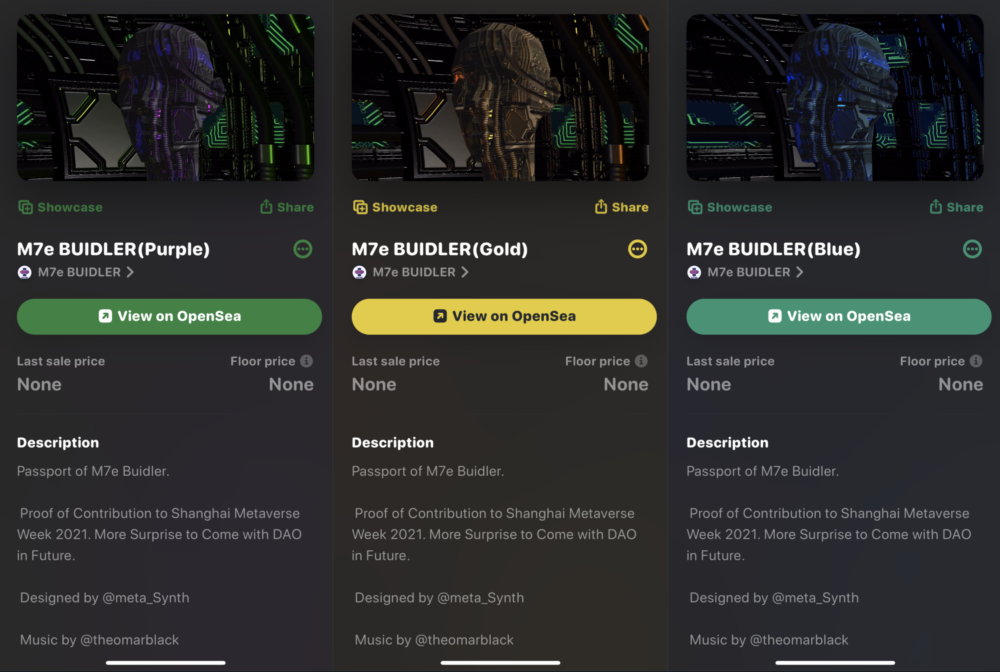
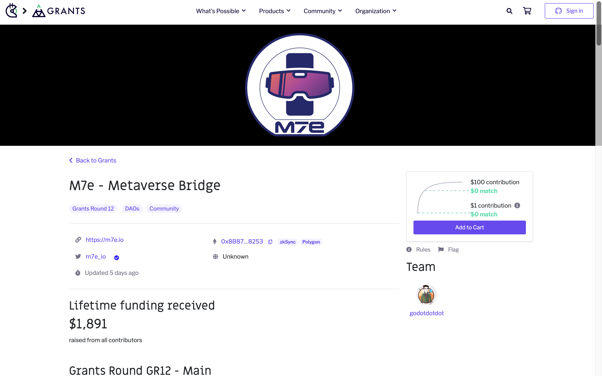

# M7e BUILDER NFT & Burning Metaverse

> 今天，我们铸造了金、紫、蓝三色 3 个版本的 NFT，赠送给所有赞助支持 2021 上海元宇宙文化周的赞助商及合作伙伴、参与 MOCA 主题展的艺术家、开幕论坛的演讲嘉宾和志愿者，以及元宇宙特攻队（M7e）团队，以志纪念和感谢。

(video)

## M7e BUILDER NFT

正如首届文化周主题「探寻元宇宙身份：自我的觉醒」所示，用户独立自主掌控的数字身份是人们进入元宇宙自由工作学习生活娱乐的先决条件，因此特攻队邀请多媒体艺术家 metaSynth 为我们的 NFT 设计了 360° 转动的 3D 金属人头，嘻哈音乐家/数字艺术家 Omar Black 专门为此编曲配上一段 Beats，尽可能让我们这个 Passport of M7e BUIDLER 以生动酷炫的形式呈现。

获得并持有 M7e BUILDER NFT 的朋友，确定拥有的是在过去的 8、9、10 月里支持帮助参与 2021 上海元宇宙文化周的贡献证明，或许拥有的是将来参与 M7e 组织的元宇宙相关活动项目的通行证。如果你相信元宇宙并坚持为此探索努力，假以时日，希望 M7e BUILDER NFT 能成为你作为「元宇宙建设者」身份标识。

## DAO 的力量

在「元宇宙特攻队」公众号 5 月 12 日开通运营之时，我们只是坚信由区块链技术支持的 NFT 能帮助人们在数字世界获得独立身份和所有权，是真正建成元宇宙的关键 —— 因此，我们英文账号为 NFT4Metaverse；在 10 月 28 日首届上海元宇宙文化周圆满落幕之际，我们才真正发现 DAO 的力量和魅力 —— 它让只有 2 个全职人手的团队用不到 3 个月的时间操办了一场线下 3 天、线上一个多月、千百人参与的文化周活动。

(video)

事后，我们团队的小伙伴各自写下了他们的感受 ——

> **Qijin：** 很开心参与到其中，本来以为是个小范围的聚会，没想到这么多人响应，最后变成了文化周。活动结束最大的收获，就是认识到这群有意思的朋友，期待更多好玩的活动。
>
> **Jessie：** 整个团队在策划组织执行文化周活动，让我想到了「鸟群」。鸟群远非鸟的简单聚合。对一个鸟群而言，最智能的状态应该是某种「团结紧张」的状态。这种状态恰好处在「有序」与「无序」之间，类似于相变的临界点处，此时，一个群体既能保持其稳定性，又能保证个体的信息在群体中有效地传递。
>
> **Yaxin：** DAO 是有组织的反叛，按图索骥而不失规则，人生也是是跟线索走的旅行，其中活法和玩法都跟 NFT 一样有太多衍生属性了。
>
> 曾经提出无限游戏和有限游戏概念的哲学家，已经给元宇宙的建设者定义为「无限游戏的玩家」，因为其目的是延续游戏的无限可能，打破既定规则，以及在为世界创造无限衍生可能。「对于无限游戏的参与者来说，时间并不流逝，时间的每一瞬间都是开始。」
>
> 跟我们这个小团体达成一致的开始是一次偶然的聚会，发现我们都是执着于探索的一群人，然后大家在一个契机中有了合作的想法。「执着」持续贯穿了整个活动，从计划、协商合作、执行、招商以及招募志愿者，这个小集体的执着从来没有燃灭过。
>
> 前不久 ENS 空投和域名注册掀起热潮，单单从域名绑定身份认证来看，元宇宙可能性的面纱在慢慢揭开：我们在另一个平行的或是交错的世界如何去协作？如何建设、学习、互助以及活着，全人类的共同理想如何与个人使命结合，是我们作为 DAO 组织应该在建立之初需要思考的初衷。
>
> **加拿大花式抖腿冠军：** 起初我是完全没有想到线下活动会如此的热闹，人们对于线下面基交流充满狂热的向往，活动爆棚的结果也带给我很多启示：
>
> 可能是现实社会并没有给大众带来真正的社会价值体系，相反生活中我们却经常收到很多错误低效的东西。大众更多的想寻求另一种参与社会的方式，因为我们有时候真的分不清虚拟与现实相比，哪个更荒诞一些。我是会经常去做一些与工作无关的但是自己喜欢的事，认识一些不直接带给你物质利益但你喜欢的人，让自己更快乐。人是需要情绪价值的，原因在于我们都是普通人，有地方能容纳你的表达，能够改进的才是有建设性的值得期待的，要把你认为值得投入的时间和精力放在你所热爱的事情上。
>
> 操办文化周的全职人手只有 2 人，是否能够对接各种需求，以及活动过程中的劳动强度，最初心里也是没底的：赞助商的权益、合作伙伴的需求是否能照顾周全，时间紧任务重。还好，有 4 个小伙伴通过各种神奇的链接加入我们，大家用最适合自己的方式给予了最大的支持：Jessie 是我们的「首席灵感官」，总是恰如其分地给予启发，瑟瑟是我们的「艺术总监」，操刀了文化周全部视觉设计，Yaxin 是「首席娱乐官」，Qijin 帮我们分担了很多具体繁杂的事，还有圈圈全程参与、用心输出了高质量的照片、视频和动效。
>
> Yaxin 在群里说我们对外介绍就是一个 DAO，Jessie 提出「鸟群」概念，大家一拍即合，我们是一群半独立的、形形色色的小单元组成的集合，在风险特征上会与一个巨型单元不同，不确定性，未知，混沌，机会等等，让组织在无序的冲击中成长受益，这些小的单元都是行动力超强的个体，有幸身在其中。我们都在探索这个世界，这个世界不希望我们了解它，它的魅力也在于我们无法真正的了解它，如果不觉得饥饿，山珍也味同嚼蜡，没有经历磨难，信念就不会坚固。

## Buring Metaverse

(video)

所以，不仅没有 NFT，而且离开 DAO，元宇宙也无法真正建成。10 月 29 日，在上海元宇宙文化周闭幕的第二天，元宇宙特攻队英文品牌与 Facebook 恰巧同时改名，它改名为 Meta，我们升级为 M7e。

M7e 代表什么？怎么念？7 又是什么意思？所有的诠释和发挥，我们交给所有关注、探索元宇宙和有志于建设下一代互联网的朋友们。

当下，我们对元宇宙特攻队（M7e）的定位是：建设一个信仰并投身元宇宙的创业者、投资人和早期用户的社区，通过媒体、活动、社区、投资和生态孵化推动下一代人人可拥有、治理和分享的互联网早日建成。

文化周闭幕这一个多月来，M7e 正在朝着这一方向前进：我们通过纽约-上海双城寻宝活动、特邀研究员 Diana 的实地访谈直播，关注传播 11 月初的纽约 NFT 大会和 12 月初的迈阿密艺术巴塞尔，以及与 IOSG 合办 12 月 19 日在深圳举行的元宇宙嘉年华，M7e 的官网也将于年底上线……

更重要的是，我们正在构思酝酿一场关于元宇宙商业、社会和文化建设的实验 Burning Metaverse，计划于明年第一季度某一时间段汇报演出。项目初次发布亮相，就在 12 月 1 日上周三启动的 Gitcoin 第 12 轮 Grant 中，欢迎支持！

**捐赠地址：** gitcoin.co/grants/4116/m7e-metaverse-bridge
