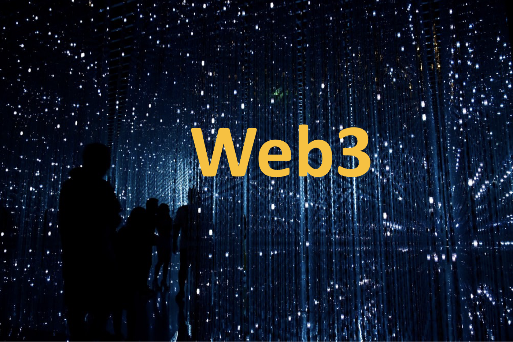
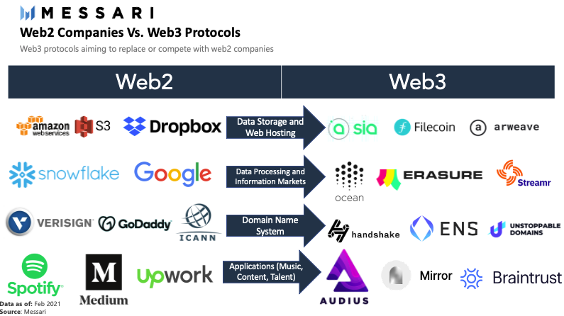
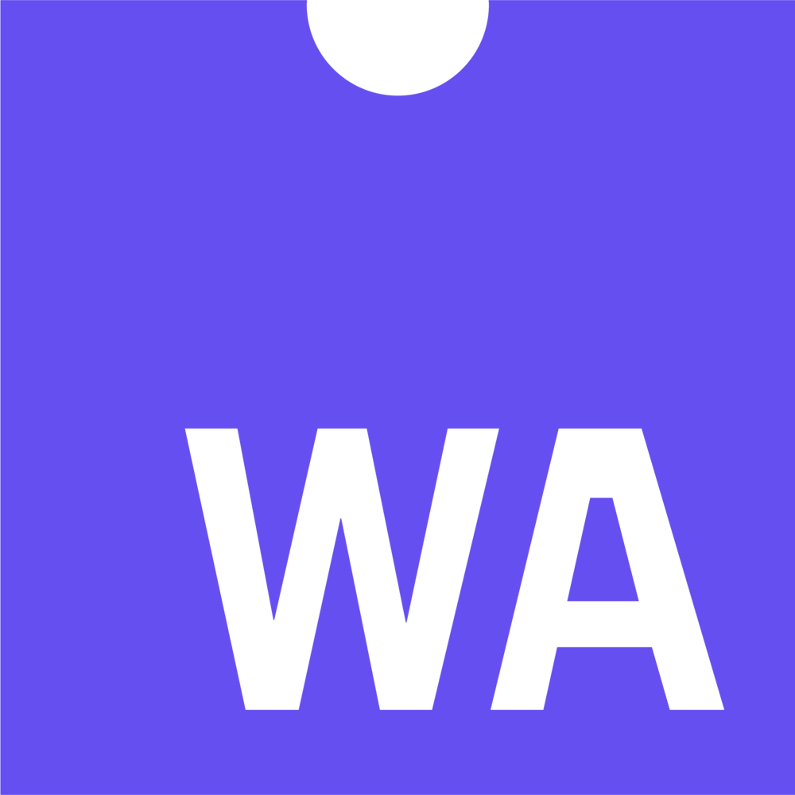
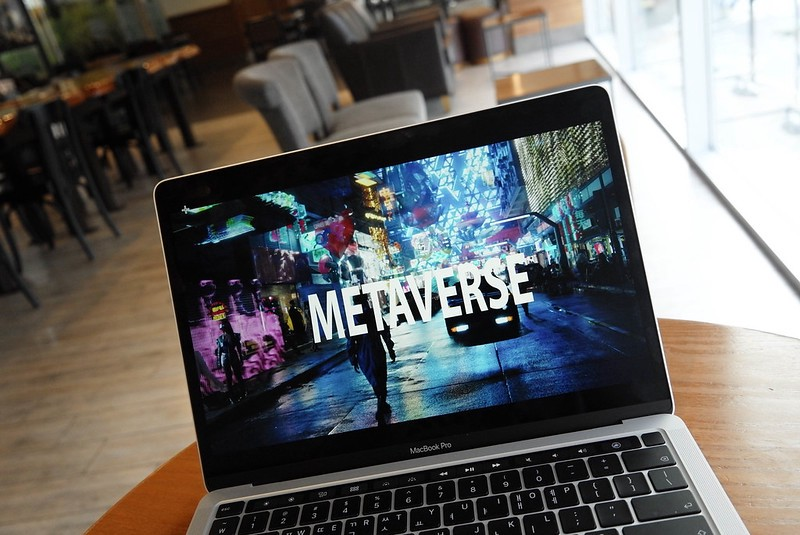

# Web3、互操作性和元宇宙 | Thought for Today

> 如今，关于「元宇宙」的诠释发挥层出不穷，令人眼花缭乱；Web3 这一区块链行业探讨交流实践多年的概念也火爆出圈。
>
> 那么，到底什么是元宇宙、Web3？两者关系如何？今天，「元宇宙特攻队」推荐由 Beamable 创始人、Building the Metaverse 博客编辑 Jon Radoff 撰写的这篇最新文章 —— 只需你有一点互联网使用的经验、信息技术的概念，应该很快了解并掌握元宇宙、Web3 这些新概念新技术的本质。

**By Jon Radoff**

对某些人来说，Web3 就是元宇宙。

对其他人来说，它是完全神秘的，被束缚在许多对新人来说似乎不透明的加密系统中。

正如我在过去所写的那样，元宇宙是实时的、基于活动的互联网。实时活动（如游戏和视频会议）已经存在了一段时间 —— 但像任何代际变化一样，未来的种子已经存在于现在。

元宇宙将提升数字自我的意识。它将带来新的个人表达形式、创造力，并为我们准备好全新的体验。

本文将解释什么是 Web3 —— 以及为什么元宇宙的这种创造性和表达需要它。

_图片来源：Robyn Hu_

## 为什么是 Web3？

Web1 是最初的万维网，建立在开源（如 Linux）之上，无需许可开发（如 PC 软件）和开放标准（HTML/HTTP）。现存的一些最大的互联网公司（如亚马逊、Netflix、谷歌）都是建立在这个生态系统上的，或者从扩展到这个生态系统中受益（微软、苹果）。

Web2 主要是关于异步的、用户生成的内容：博客、维基、社交网络等。大多数 Web2 是建立在 Web1 的技术上，或受益于搜索以获得受众。最大的 Web2 公司建立在与 Web1 相同的开放和基于标准的环境上，但创建了有围墙的生态系统以实现社交联系和内容创造。最多的例子是 Facebook/Meta，以及 YouTube（由谷歌拥有），它们为社交网络和用户生成内容建立了带有围墙的花园。Roblox 将是一个最新的例子。

**围墙花园之所以成功，是因为它们可以让事情变得容易做 —— 并提供给非常多的观众。**

但「围墙花园」是一种需要许可的环境，对你能做的事情进行管制，并收取高额租金作为交换。非常有说服力的是，虽然许多成功的公司都是在 Twitter 或 Facebook 等公司提供的 Web2 生态系统中创建的，但**还没有一个真正的巨头完全在这些 Web2 围墙花园中形成一个持久的、极具规模的业务**（市值超过万亿美元）。

让我们继续讨论将改变这一模式的 Web3 的特点。

- 价值交换（而不是简单的信息交换）
- 自我主权
- 互联网的再去中心化

## 价值交换是变革性的

如果你从本文没有得到更多的东西，我想让你明白，**Web3 让应用之间的价值交换是多么具有变革性**。

价值交换的赋能技术是区块链上的智能合约。区块链是一个共享账本，允许公司、应用、政府和社区以程序化和透明的方式相互交换价值（资产、货币、财产等），而不需要保管人、经纪人或中介机构 —— 所有这些都限制了创新，同时榨取大量租金。相比之下，智能合约区块链让高度的新兴创造力成为可能，而不是应用围绕着许可的生态系统的中心化创新模式。

在各方之间进行**程序化价值交换的能力**就像最初的互联网一样对人类文明产生了变革：这就像从美国在线 —— 一个由单方控制和管理的在线平台 —— 到万维网的所有新兴的创造力。

正如巴拉吉·斯里尼瓦桑（Balaji Srinivasan）在与蒂姆·费里斯（Tim Ferris）的播客中解释的那样：我们倾向于将国家、社区、公司等视为不同的事物；在未来，这些都将成为社交网络的投射（而不是 Facebook 意义上的社交网络 —— 而是我们带到不同背景下的实际社交关系集合）。

区块链成为这方面的赋能软件栈。区块链为存储、交换和编程产权、货币、资产和身份提供了一种可互操作的手段。社区和公司在这个生态系统中成为软件应用。

## 自我主权

现在，你可能使用 Facebook 登录或谷歌登录来与大量的在线应用进行互动。这些是由大型中心化机构运行的用户数据库。

Web3 的一个重要部分是颠覆这种模式：不是让一个公司拥有你的身份，然后授予你对其他应用的访问权 —— 你将拥有你的身份，并选择与哪些应用互动。这是通过使用一个数字钱包来实现的，如 Metamask（用于以太坊和与以太坊兼容的区块链）或 Phantom（用于 Solana 区块链）。你的钱包成为你的身份，然后可以让你使用互联网上需要与你的货币和财产互动的各种去中心化应用。这包括去中心化金融应用，以及将基于可互操作的头像化身、自我表达的物品、游戏物品等产生的元宇宙体验。

## 再去中心化

目前，整个互联网对少数高度集中的应用存在大规模的依赖。谷歌和 Facebook 提供的身份系统只是两个例子。

但在 Web3 中，权力又转移到了个人用户、创造者和应用开发者身上。这是因为可供提取租金或征求许可的中心化机构少得多。这将导致应用、算法、艺术品、音乐、人工智能/机器人、虚拟世界和元宇宙体验等形式的新创造力的爆发……而更多的回报则掌握在所有者和创造者手中。

Messari 的这张图显示了功能如何从一些目前集中的平台迁移到建立在区块链上的更去中心化的版本。

## 从无服务器到分布式区块链计算

无服务器软件有点名不副实：它是一种软件开发模式，允许数据存储和其他服务器授权功能在云中发生 —— 同时让应用开发者不必考虑开发运维、后端可扩展性、部署，以及其他许多通常与全栈互联网软件开发相关的 IT 功能。

许多 Web3 软件项目都建立在无服务器的后端。比如说，Moralis 提供了一个 SDK，让应用开发者建立基于 Web 的软件，将数字钱包与无服务器、服务器授权的数据存储结合起来。

我的公司 Beamable 为游戏直播提供无服务器框架，以便开发者可以将注意力聚焦到制作游戏上，而不是编写服务器代码和扩展游戏，我们的目标之一是弥合传统游戏开发和未来 Web3 原生数字钱包之间的差距。

无服务器架构通常在中心化架构内运行的 SaaS 框架之上运行。然而，无服务器架构有机会过渡到一个完全去中心化的未来。原因在此——

- 无服务器架构将设计运营/扩展/可用性的责任与软件的功能（例如，调用支付、社交功能、游戏规则、全局状态等功能的微服务）相分离。

- 更进一步是在微服务背后打开一个分布式计算环境，为生态系统增加新的功能 —— 甚至是额外的计算节点，以提供服务器授权的功能。这样做的好处是，客户将减少对中心化供应商的依赖，提供这些微服务的成本可以根据有效的最低成本/最高可用性计算的拍卖进行优化（而不是选择像 Azure 或 AWS 这样的云服务商，他们也将被欢迎在这个生态系统中竞标提供计算能力）。这些分布式计算节点很可能利用链上方法来解析规则和存储数据。

提供无服务器后端的 SaaS 公司在未来几年将有一个机会：**它们会去中心化吗？**

这对许多公司来说是商业模式的彻底改变，这可能会给许多人带来巨大的障碍 —— 但那些为实现这一目标而制定路径的公司，以及那些首先被设计为 Web3 原生的新创公司，有机会为整个生态系统增加巨大的价值。

## WebAssembly 和 Web3

WebAssembly 是一个新的标准，旨在允许字节码直接交付给你的网络浏览器：把它看作是向你的浏览器发送「应用」的一种手段，而不是依赖应用商店的生态系统。这些应用可以在网络浏览器运行的任何地方运行 —— 电脑、智能手机、VR/AR 头盔。

WebAssembly 甚至不需要局限于 Web 浏览器 —— 它甚至可以在后端服务器上运行，以获得一类全新的可移植服务器代码。

容器和 WebAssembly（WASM）能够很好地利用分布式和去中心化计算的新模式，因为它们具有高度的可移植性，捆绑自己的依赖，并在可运行的工作负载类型中提供最大的灵活性。

围绕 Web3 模式的自我主权身份、程序化的价值交换和去中心化建立的 WebAssembly，有可能从根本上改变各种应用商店生态系统的格局。

## Web3 的颠覆性

Web3 取代了创建或整合大量服务的需要（例如与资产保管或身份有关的服务），这些服务目前既费时又费钱，并导致对中心化服务的依赖，而这些服务可能与自己的利益一致，也可能不一致。

这意味着许多应用开发者将能够以更小的团队来开发软件，与那些围绕昂贵的传统技术和/或需要许可和谈判的软件合作伙伴建立业务的大型现有企业竞争。

## 捆绑、解绑和重新捆绑

网景公司的首席执行官 James Barksdale 曾经说过，他只知道如何通过捆绑或解绑来赚钱。

解绑的一个例子是 iTunes 将单曲从专辑中解除捆绑的方式。然后，Spotify 到来，将歌曲重新捆绑成播放列表。

今天，几乎每一个视频游戏都是高度捆绑的体验；但在互联网的元宇宙时代，我们将看到其中一些被解绑和重新捆绑。

## Web3，头像化身和元宇宙

数字身份 —— 我们是谁以及我们如何在网上表达自己 —— 将变得比现在更重要。带着我们的头像化身从一个体验到另一个体验，将取决于一个可互操作的框架。头像化身的属性是解绑的一个例子；新型的在线体验（不仅是游戏，还有音乐、戏剧和元宇宙中的许多其他应用）将成为重新捆绑这些自我表达形式的方式。为了在最广泛的应用中实现这一点，我们将需要一个可互操作的身份和资产的框架：这只是元宇宙中 Web3 的用例之一。

_图片来源：Aaron Yu_

除此之外，Web3 还为下一代的「边玩边赚」（P2E）提供了创意框架。现在，P2E 意味着某种版本的加密货币打金或权力等级（如发生在 Axie Infinity 中）。当然，人们多年来也一直在边玩边赚 —— 在加密货币/区块链背景之外 —— 通过电竞、Twitch 上的直播或某些形式的装饰游戏。我们知道，数以百万计的玩家渴望将他们的爱好变成一种生计 —— 所有这些都是游戏中已经发生的新生的解绑和重新捆绑的例子。

在未来，P2E 将涵盖所有这些：不仅仅是为了赚币而打游戏 —— 而是表演、创意、竞争、公会、地下城管理、关卡设计、现场角色扮演等等。我们将开始看到谁是玩家，谁是设计师之间的区别更加模糊。我们将看到新形式的捆绑和解绑。

我们需要一个可互操作的框架，用于所有这些颠覆性的经济交流。

这个框架将是 Web3。
