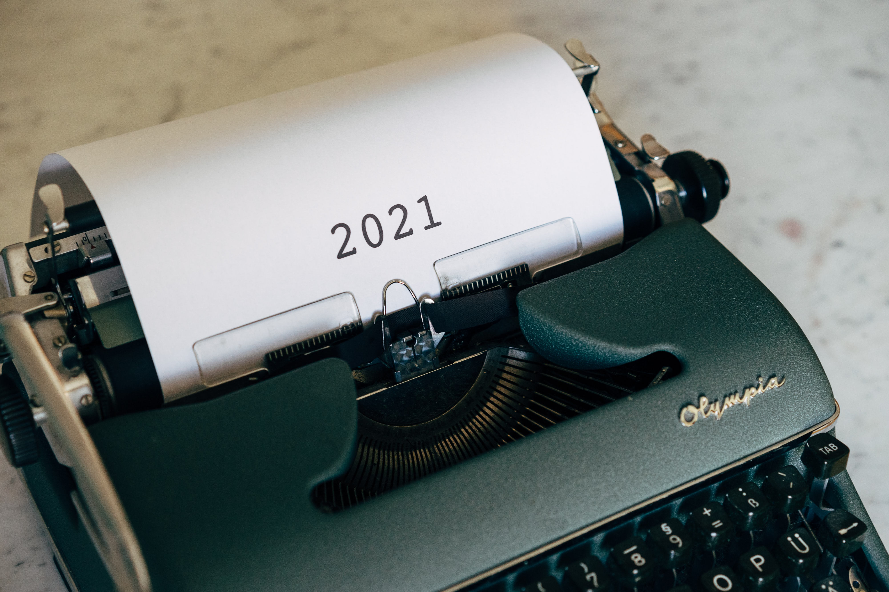

# 请回答 2021 | Thought for Today

> 2021 年的最后一天，不想程式化的说「告别」。

2021 年即将过去，它是最好的一年还是相反，每个人都有自己的答案。

对于「元宇宙特攻队」（M7e）来说，2021 年是应运而生的第一年 —— 这一年，是比特币为代表的加密数字资产进入主流的一年，是以太坊为代表的区块链支撑的 DeFi、NFT 爆发繁荣的一年，是区块链与 VR/AR、AI、云计算、大数据、5G 等各项技术和基础设施融合而生的「元宇宙」（Metaverse）概念席卷世界的一年，所有的风起云涌，皆因疫情推动全球法币泛滥、全世界人们工作学习生活娱乐加速数字化、虚拟化的趋势而起……

不管是否喜欢，所谓「元宇宙」、实则「下一代互联网」的数字新世界，或早或晚，总会到来。它是数字世界的应许之地，还是又一个楚门世界？我们始终抱持积极的态度，第一天起，去创造、去建设，万类霜天竞自由……

因此今年 5 月 12 日开通「元宇宙特攻队」这个公众号之时，我们的想法很简单，就是搜索推荐 NFT 新鲜项目，吸引团结关注或投身元宇宙的创业者、投资人和从业者，为下一代互联网早日到来做点贡献。

迄今，我们介绍了 ——

然后，也在公众号的读者、朋友和伙伴的鼓励支持和帮助下，我们举办了以下活动 ——

_2021 上海元宇宙文化周_

_2021 东京区块链周万圣节派对_

_纽约+上海双城寻宝_

_IOSG 元宇宙嘉年华_

在做「元宇宙特攻队」的过程中，我们感受到了 DAO 的力量和魅力 ——

为此，我们为所有赞助支持 2021 上海元宇宙文化周的赞助商/合作伙伴、参与 MOCA 主题展的艺术家、开幕论坛的演讲嘉宾和志愿者以及特攻队团队铸造空投了 M7e BUIDLER NFT，希望它不只是对过去的参与贡献证明，而是在将来能成为元宇宙早期建设者的身份标识。

2021 年作为元宇宙元年载入史册，应该毫无疑义。未来，当我们回顾 2021 这一年，希望「元宇宙特攻队」交出的这份答卷还算让人满意……

新年快乐！
