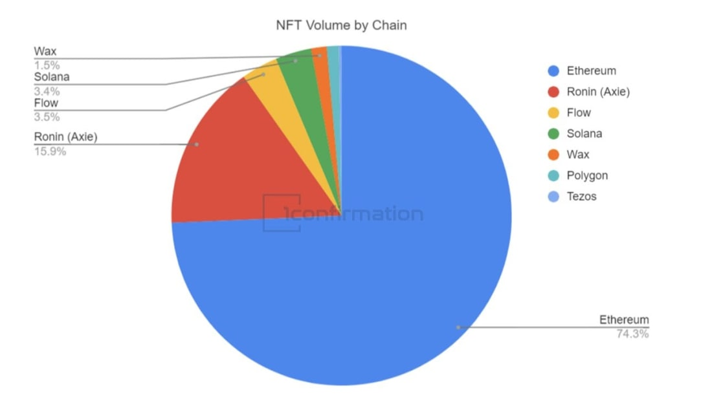
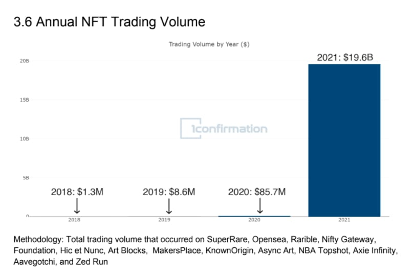

# 2021：NFT 之年 | Thought for Today

> 加密机构 1confirmation 用一份扎实的 2021NFT 年度回顾报告迎来新年。
>
> 
>
> 这是一份对 NFT 在 2021 取得突破性进展的了不起的记录，为行业在今年继续向前发展提供了很好的参考。为此，Metaversal 摘取了报告的部分亮点，以飨读者（点击「阅读原文」可获取英语全文报告）。

## 整体主题

「今年 NFT 广泛影响了视觉艺术、游戏、摄影、音乐、时尚和消费品牌。2017 年开始的一个在以太坊平台上的古怪想法（一个在链上交易和交配虚拟猫的游戏）已经发展成为一个数十亿美元的全球资产类别，帮助了数以万计的创作者和数百万的消费者。」（第 4 页）

## 以太坊仍然占据王座

「现在围绕相互竞争的 L1（一层协议）有很多噪音，但以太坊及其 L2（二层协议）仍然占 NFT 量的 90% 以上（见下文）。随着 2022 年及以后会有更多的 L2 创新（例如 Optimism 上的 Quixotic），我们预计以太坊的生态系统将继续保持其主导地位。但其他链的采用普及也可能会增长。」（第 8 页）

## 鸟瞰

- NFT 的总市值超过 314 亿美元，约占加密货币约 2.3 万亿美元市值的 1.36%。
- 以太坊上的 NFT 活跃用户达到 200 万。
- 2021 年，围绕 NFT 的交易量超过 196 亿美元。

## NFT 市场状况 📈

### 加密艺术

- 在 2021 年达到了 25 亿美元的市值。
- 去年至少有 66,600 个独立钱包购买或出售了加密艺术品。

### 头像图片项目（如 CryptoPunks）

- 市值达到约 140 亿美元。
- 至少有 376,600 个独立钱包购买或出售了头像图片项目。

### 文化收藏品（如音乐、摄影、体育）。

- 市值达到 134 亿美元。
- 至少有 482,100 个独立钱包购买或出售了文化收藏品。

### 游戏

- 在 2021 年达到了 15 亿美元以上的市值。
- 至少 1.5 万个独立钱包购买或出售游戏 NFT。

### 交易市场

- 2021 年，NFT 市场 **OpenSea** 通过 126 万活跃用户实现了 160 亿美元的交易量。
- NFT 碎片化协议 **Fractional** 通过 3.7 万交易者实现了 17.8 亿美元的交易量。
- 加密艺术平台 **SuperRare** 通过 4400 位收藏者实现了 2.075 亿美元的交易量。

## 2021 年 NFT 亮点

- **Pak** 变得多产（第 23 页）
- **CryptoPunk** 的地位得到巩固 (第 24 页)
- **Bored Ape Yacht Club**（无聊猿猴游艇俱乐部）的崛起（第 25 页）
- **Art Blocks** 的成长（第 26 页）
- **Beeple** 的 Everydays 的天价拍卖（第 27 页）
- **XCOPY** 成为 SuperRare 最大的艺术家（第 28 页）
- **Axie Infinity** 引领「边玩边赚」运动（第 29 页）

## 1confirmation 对 NFT 的预测

**长期来看**，到 2020 年代末，NFT 将变得比加密货币更大!

**短期：**

- 像 Coinbase 这样的大型加密货币交易所将继续向 NFT 转型，反过来使人们更容易进入 NFT
- 大品牌（如耐克和阿迪达斯）将继续转向 NFTs，反过来带来更多的主流关注
- 视觉艺术之外的 NFT 类别，例如虚拟房地产，将迎来持续增长
- 以太坊 L2 上的 NFT 的出现将有助于在 2022 年底前带来 1 千万的 NFT 用户总数。
