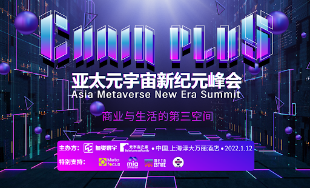
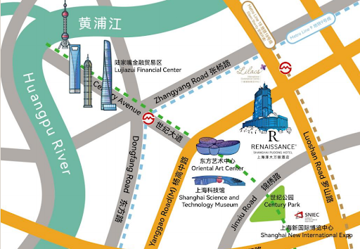

亚太元宇宙新纪元峰会 1 月 12 日在沪开幕 | 活动预告

> 亚太元宇宙新纪元峰会将于 2022 年 1 月 12 日在上海淳大万丽酒店召开，本次峰会由元宇宙信息聚合平台加资寰宇和元宇宙之家行业资讯媒体主办，NFT IP 打造平台 Epik 协办；以「商业与生活的第三空间」为主题，峰会将集结海内外 200 家**旅游、地产、博物馆、商场、院校、泛娱乐等场景机构和科技大厂一起聚焦探讨虚拟与现实技术-AR/VR/XR/MR、虚拟人物、NFT 数字藏品、全息投影/沉浸式、人工智能与云计算技术等对企业带来的新技术体验和新发展契机**。

### 分享嘉宾：

- 上海市多媒体行业协会，副秘书长, 端木海婴
- 加资寰宇，创始人，黄义辉
- 阿里巴巴云游戏事业部／元境，副总经理，龙志勇
- 网易伏羲，游戏 AI 负责人，陶建容（风天）
- 商汤科技，移动智能事业部副总裁，栾青
- 中兴通讯，XR 产品总经理 ，周琴芬
- 微软（中国）有限公司，云解决方案架构师，李争
- 景域驴妈妈集团，副总裁，朱强
- 上海风语筑文化科技股份有限公司，副总经理 &首席品牌官，张树玉
- 天下秀数字科技集团，区块链、AI 负责人 ，秦朝
- 北京数码视讯科技股份有限公司，产品运营总监，刘川林
- 北京奇领空间数字科技有限公司 CEO/中国电信天翼云图 XR，产品总监，陶柏帆
- 元梦人文智能国际有限公司,CTO,张雪源
- 创壹科技，梁子康，联合创始人&CEO
- 雷电所，策展人，虞雪晴
- 丝道奇华,创始人,沈冰流
- 声网，新兴市场及行业产品负责人，姚一晟
- 张家界元宇宙研究中心，负责人，毛坚坚
- 中青宝，元宇宙事业部总经理，Kevin
- MetaEstate，联合创始人，Jackey
- 加资寰宇，海外合伙人，Julia
- (香港知名游戏开发商)Animoca Brands,Yat Siu,Co-founder and executive chairman
- （头部 GPU 供应商）Imagination Technologies 中国区战略市场和生态副总裁，时昕博士
- （全球游戏和 NFT 顶级 IP 运营商）Epik,首席运营官,Gary Ma
- （全球游戏和 NFT 顶级 IP 运营商）Epik,产品副总裁，Darren Smith
- （VR 游戏开发商）Sandbox VR, 产品和科技部副总裁, Kimkind Yeung
- （全球知名媒体）彭博社 TV 主持人，Mike Mumola
- （韩国元宇宙社交）ZEPETO，首席商务官，Rudy Lee
- （日本元宇宙社交）GREE，Co-Founder，Kotaro Yamagishi
- （澳交所上市 VR 公司）OliveX，Marisa Lam，Head of Marketing and Communications
- （VR 游戏体验）Sandbox VR， Kimkind Yeung，SVP of Product and Technology
- （德国在线 VR 装修）VR next，Sergey Kiselev，CEO
- （纳斯达克 VR 巨头）D6 VR, A Glimpse Group Company，Si Yang，General Manager
- （维也纳 VR 教育）VR Motion Learning，Gregory Gettinger，CEO

秉持着助力元宇宙产业创新及落地，理清元宇宙发展脉络，推动元宇宙产业交流和元宇宙场景落地而不断贡献力量，亚太元宇宙新纪元峰会盛大启程，2022 年 1 月 12 日，现场见！

### 酒店信息：

- 上海淳大万丽酒店 4 楼宴会厅
- 上海市浦东新区迎春路 719 号（迎春路靠近长柳路）

### 酒店参会防疫须知：

为配合疫情防控工作并保证大会顺利召开，会务组温馨提示您：

1. 大会期间，请您全程佩戴口罩，入场时配合工作人员测温，并出示“行程码”绿码方可入场;如有异常，请您配合现场工作人员的应急安排。
2. 若您所在城市过往 14 天内有中、高风险区的或行程码标记有“\*”的绿码人员，参会需提供 48 小时核酸检测报告。
3. 以下情况请勿参会：若您 28 天内有国(境)外或 14 天内国内中，高风险区内的旅居史、健康码为黄色或红色的人员，请您按照防疫部门相关规定避免参与聚集性活动，请勿参与本次大会，感谢您的理解与配合!

### 联系信息：

- 报名通道：http://hdxu.cn/oLgIS
- 活动咨询：info@ccglobal.com.cn
- 微信联系：CCGlobal-China
