# Decentraland：元宇宙的早期推动者

> 这个虚拟世界的用户在过去一年中增长了 3300%，市值达到了 120 亿美元的峰值。它可能被证明是对 Meta 长期雄心的最好挑战者。

## 可操作的洞察

如果你只有几分钟的时间，以下是投资者、操作者和创始人应该知道的关于 Decentraland 的内容。

- **只有一个元宇宙**。虽然这个流行词的含义经常被延展成不同的含义，但只有一个明确的定义。元宇宙只是互联网，更新升级，以适应空间体验。
- **Decentraland 的世界正在迅速扩展**。在过去的一年里，Decentraland 的用户增长了 3300%，其通证价格增长更多。他们要感谢马克·扎克伯格，至少是一部分。
- **虚拟地产可以赚到真正的钱**。像 Decentral Games 这样的项目证明了在「元宇宙」中也能挣钱。这家初创公司在 Decentraland 内经营受人欢迎的赌场。财富效应吸引了正经的开发者投入数百万美元投入工作。
- **数字城市的行为方式与实体城市不同**。我们习惯于我们的城市缓慢地变化，一砖一瓦，一幢楼接着一幢楼，但虚拟大都会可以按照不同的规则行事。根据人的活动而改变的「动态土地」只是一个例子。
- **我们才刚刚开始**。尽管像 Decentraland 这样的项目已经取得了很高的估值，但我们感觉似乎处于向更具表现力的数字体验的长期转变的最初阶段。创造一个具有深刻、持久吸引力的世界需要时间。

——-

1905 年，一条连接盐湖城和洛杉矶的铁路建成。它经过了一个人烟稀少的小城镇。在其作为中途站的地位的推动下，它获得了一片 110 英亩的土地，正式成为一个城市。它被称为拉斯维加斯。

在接下来的几十年里，拉斯维加斯成为了一个繁荣的大都市。它吸引了投资 —— 先是来自黑手党，后来是来自更有利的来源 —— 并将自己打造成一个标志性的全球旅游目的地。到 2000 年，它拥有不到 50 万人口，成为 20 世纪建立的最大的美国城市。2019 年，拉斯维加斯谷地的 GDP 达到了 1310 亿美元的高峰。

少数仍然活着的人可能还记得拉斯维加斯作为一个城市的早期几十年 —— 先入为主的感觉是怎样的。你能感觉到机会；你能闻到钱的味道吗？

如果让我猜测，我想那感觉就像今天走进 Decentraland 一样。尽管有华丽的色彩和 90 年代的图形，但这个基于区块链的「元宇宙」与美国的「罪恶之城」有几分相似。这里有满是绿票子的赌场、奢华的艺术画廊、喧闹的酒馆、卖票的夜总会和隐蔽的妓院。当地人在这里做买卖，而「外地人」则是为了听音乐会、参加会议或只是为了凑热闹而路过这里。

Decentraland 的「人口」大约有 80 万注册用户资料，已经超过了拉斯维加斯的水平。根据其现任首席技术官的说法，其「城市」**在 2020 年 12 月和 2021 年 12 月之间扩大了 3300%**。这个数字不包括约 70% 的游客是「客人」，因此没有记录在系统中。

Decentraland 的通证 MANA 已经反映了这种激增。在去年，它的价格升值超过 4,100%。在撰写本文时，该项目完全稀释的市值为 65 亿美元。

我们应该如何看待这种惊人的增长和价格升值？

这取决于你问谁。我采访的一些消息人士指出，Decentraland 的表现停滞不前，每日用户账户较少，证明该项目估值与其说是反映其特殊的优势，不如说是马克·扎克伯格对「元宇宙」的关注。其他人认为 Decentraland 的市值低估了一个有可能成为下一个大型社交网络、一个繁荣的商业城市和一种新的「空间 」互联网的门户的项目 —— 这些被打包在一个单一的项目里。

本文将探讨这些不同的观点，并解读一些活跃在这个领域的趋势。我们将触及：

- **元宇宙**。我们将为一个被滥用和误用的流行词下一个具体的定义。
- **去中心化的起源**。这个虚拟世界诞生于布宜诺斯艾利斯的一个黑客之家。它成为了加密货币创新的温床。
- **Meta 效应**。Decentraland 在一场大规模的牛市周期中脱颖而出。在许多方面，它都要感谢扎克伯格。
- **陌生的旅程**。你在 Decentraland 能做什么？在导游的带领下，穿越一片狂野而偶尔奇妙的土地。
- **在城市的下面**。Decentraland 不仅仅是一个虚拟游戏。它是一个通证，一个社区，和一个治理系统。随着时间的推移，这些可能会被证明更加重要。
- **棘手的估值**。有些人认为 Decentraland 的资产将成为世界上最有价值的。你如何评估数字房地产和支持它的项目？
- **光谱化的未来**。新的虚拟世界正在进入市场，对这一概念进行创新，并蚕食 Decentraland 的地盘。我们应该期待更多的迭代。

希望读完这篇深度调查后，我们将对这一领域的潜力和 Decentraland 成为本世纪最大城市的机会有一个坚实的了解。

## 什么是元宇宙？

定义「元宇宙」这个词很快会变得模糊不清。我们很想看看「第二人生」、「堡垒之夜」和「Roblox」等虚拟世界，并把它们都当成这个概念的版本。这条路可能会让你突然质疑任何大型网络游戏或协作工具是否符合这一要求。魔兽世界是一个元宇宙吗？Slack 是吗？

### 时间

也许作为平衡这种模糊性的尝试，一些人提出了耐人寻味的替代方案。企业家和创作者 Shaan Puri 提出，元宇宙是一个时间 —— 当「我们的数字生活对我们来说比我们的物理生活更有价值」的时刻。虽然很有挑战性，但要达到 Puri 的标准，并不需要技术变革。根据这一标准，许多数字原住民可能有理由相信他们已经居住在元宇宙，他们最好的朋友分布在 Discord 服务器上，主要资产是虚拟货币。对一些人来说，数字生活已经超过了物理存在。什么时候「元宇宙时代」开始了 —— 当世界上 51% 的数字生活更有价值时？百分之百？它真的只不过是每个人都变得极度在线的那一刻吗？

Puri 的重新定义（故意）删去了一些太过根本的东西：地点。在科幻小说《雪崩》中，作者尼尔·斯蒂芬森描绘了一个由一条 66553 公里长的街道组成的虚拟世界，周围有不同的景点，通过一个类似 VR 的头盔访问。虽然词语不需要虔诚地保留其原始含义，但「元宇宙」的意义在很大程度上在于，它允许用户将虚拟体验当作实体来摄取。空间和体现并不是附带的。Puri 诱人的原创性建议应该有它自己的命名。他描述的是一种类似于「物理翻转」的东西。(朗朗上口，是吧？）

### 空间互联网

我所发现的最好的、最简洁的定义来自于 Tony Parisi，他是虚拟现实的先驱，也是「虚拟现实建模语言」（VRML）的创造者。Parisi 概述了七条「公理」规则，总结如下：

1. **只有一个元宇宙**。不存在多个「元宇宙」。「堡垒之夜」和 Roblox 不是相互竞争的元宇宙，而是「虚拟世界」或「游戏」，它们有一天可能存在于一个更大的元宇宙之中。Parisi 主张像我们使用「互联网」一样使用「元宇宙」。
2. **元宇宙是为所有人服务的**。根据 Parisi 的定义，元宇宙是无处不在的，是全球性的。正因为如此，他指出，它必须是广泛可用和可解读的。它的使用成本不应该太高，也不应该太深奥。
3. **没有人控制元宇宙**。虽然企业会试图控制元宇宙，但 Parisi 认为他们注定要失败，因为他们无法满足每一个可能的使用案例。去中心化将使创造者能够更好地抵制垄断的企图。
4. **元宇宙是开放的**。Parisi 主张它将建立在公共标准之上，就像互联网产品一样。可能需要建立新的标准，以适应更多的 3D 优先的环境。
5. **元宇宙是独立于硬件的**。尽管元宇宙的许多内容将以三维形式被消费，但沉浸感并不总是必要的。Parisi 希望三维虚拟产品」可以从二维显示器上获取。
6. **元宇宙是一个网络**。元宇宙不是一个单一的程序，而是一个巨大的信息网络，可以方便地穿越和参与。用户可以在这个平面上进行交流、交易和消费。
7. 元宇宙就是互联网。这个概念与 Puri 的概念是呼应的。随着时间的推移，Puri 认为互联网将演变成元宇宙。然而，其生动的特征与其说是数字价值超越了物理价值（尽管数字生活肯定会变得更加丰富），不如说是互联网的开放、协作方式所带来的新体验和技术。

尽管 Parisi 的列举更加细致入微，但这个缩写突出了核心要素。在他文章的结尾处，有一句话可以作为一个很好的独立定义。

> 元宇宙是互联网，经过强化和升级，可以持续提供三维内容、空间组织的信息和体验，以及实时同步通信。

这句话让人感觉足够清晰，也有足够的空间让人发挥创造力。元宇宙是互联网，适应于支持更全面、更立体的体验。

有趣的是，Decentraland 的现任领导人 Agustin Ferreira 在我们的谈话中首先指出，他认为这个词不适合这个项目。

「我不太喜欢元宇宙这个词。这不是我们所建立的重点。」相反，Ferreira 主张使用「空间网络」或「沉浸式网络」。

那么，Decentraland 不是元宇宙，至少在这个框架下不是。但是它所开发的技术、它所激励的社区以及它所积累的资本，都可能在将我们目前的网络转向那个未来的过程中证明是关键的。这种令人振奋的使命来自于卑微的开始。

## 起源：世界建设者

顾名思义，布宜诺斯艾利斯的巴勒莫好莱坞街区以其电视演播室和制作公司最为出名。它也在一些加密货币的最大产品中扮演了主演的角色。

2011 年，Manuel Araoz 是 ITBA 的一名计算机科学学生，这所大学被称为「阿根廷的 MIT」。作为密码学课程的一部分，他发现了中本聪的比特币白皮书。阿根廷过去 20 年的经济波动和货币快速贬值，给中本聪的话带来了切实的力量。Araoz 被迷住了。正如 Decentraland 的一篇博文所报道的那样 —— 这篇博文后来被删除了，但在其他地方仍然存在 —— 他指出：

> 这篇论文看起来非常有趣。但当我和我的教授们分享时，他们认为这是无稽之谈。我认为这项技术可以改变世界。

Araoz 开始尝试在新的领域里有所作为，推出了「存在证明」（POE），被称为「有史以来第一个非金融区块链应用」。POE 作为一个公证人，允许任何人通过向区块链添加一个加密的 「摘要」来「证明」一个文件的存在，并在那里盖上时间戳。正如其网站所指出的，这是「第一个允许你公开证明你拥有某些信息而不透露数据或你自己的在线服务。」

Araoz 还加入了 BitPay，当时的一家比特币支付企业。作为技术负责人，他的职责包括在布宜诺斯艾利斯开设一个办公室。他在巴勒莫好莱坞挑选了一栋两层楼的房子。

### 伏尔泰之家

作为 BitPay 的工程师、ITBA 的朋友和其他早期的加密货币痴迷者的居住地，「伏尔泰之家」很快就成了一个深思熟虑者聚集的地方。在写作这篇文章的过程中，我与几个前住户和访客交谈，包括 Decentraland 的创始人之一 Esteban Ordano。他回忆起这个地方的部分特别之处：

> 我们都是在家工作的，在午餐时，我们经常就技术、科学、政治进行深入的交谈。这是一段美丽的经历，一个可以公开表达自己和共同学习的地方。

虽然具有哲学思想，但伏尔泰「集体」寻求将他们的想法付诸行动。它的居民建立了一些加密货币最有趣的早期实验和持久的基础设施。这包括：

- **OpenZeppelin**。在 DAO 黑客事件之后，Araoz 与人共同创办了一家智能合约审计公司 OpenZeppelin。它已经成为行业标准，受到以太坊基金会、Brave、Coinbase、Compound 等的信任。
- **Streamium**。虽然不再活跃，但 Streamium 是 Araoz 和 Ordano 的雄心勃勃的尝试，试图打造一个视频流媒体应用 Periscope 的 Web3 竞争者，流媒体人通过比特币小额支付来获得他们的报酬。
- **Nomic Labs**。Nomic 是以太坊开发环境 Hardhat 的开发商，Hardhat 被 Aave、Sushi、Uniswap、Celo、Aragon 和其他团队使用。Franco Zeoli 和 Patricio Palladino 创立了它。
- **Muun**。这个由用户自我保管的比特币钱包使用闪电网络，似乎因其易于使用和流畅的设计而受到赞赏。Muun 是由 Dario Sneidermanis 创立的。
- **Big Time Games**。虽然尚未完全启动，但 Big Time 是一个区块链上的多人角色扮演游戏。用户可以购买虚拟的「空间」，与土地块并无不同。它是由 Decentraland 的创始团队之一 Ari Meilich 创立的。

即使在考虑其最成功的创造之前，伏尔泰团伙的影响也是有意义的。

### 一片新的土地

2015 年，伏尔泰的居民凑钱买了一台 HTC Vive。这个 VR 设备让他们看到了空间体验的潜力。Ordano 将其描述为一个觉醒的时刻：

> 当我第一次遇到沉浸式 VR 体验时，感觉就像我第一次了解到区块链。我认为我们只是触及了可能发生的事情的冰山一角。

与 Manuel Araoz、Ari Meilich 和 Yemel Jardi 一起，Ordano 开始讨论创造一种新型区块链环境的可能性。那些早期的对话具有伏尔泰自由的、哲学性的午餐会谈的基调。在我们的交流中，Ordano 描述了它：

> 我们最初的想法是，「我们怎样才能建立一个以区块链为动力的透明模拟？」这只是一个思想实验，而且大多是不切实际的，但后来「三维空间的所有者可以决定宇宙的那一部分存在什么」的想法开始变得有意义。

像他那一代的许多人一样，Ordano 是在大型多人在线角色扮演游戏（MMORPG）中长大的。特别是，他在接触了为阿根廷市场制作的 Ultima Online 的开源仿制品 Argentum Online 之后，受到了启发，开始了编码工作。在他和他的同事们思考建立一个虚拟世界的潜力时，这些经验将被证明是有益的。Ordano 指出，他们也从林登实验室开发的虚拟世界「第二人生」中得到了很大的启发。

在接下来的两年里，四人组发展了他们的想法，一次又一次地回到建立「一个完全透明的'游戏'/体验，一个开源并由其社区管理的东西」的想法上。根据 Ordano 的说法，一个新型的虚拟世界、一个去中心化的土地。

他承认这是一个只有「疯子」才会接受的挑战。在最好的情况下，建立一个 3D MMORPG 是非常困难的。但是，试图在浏览器中、开源、采用点对点服务器架构、利用不成熟的区块链生态系统来做这件事？这是很疯狂的。当我问 Ordano 人们对他的创作有什么误解的时候，他给我发了这个模因（Meme）：

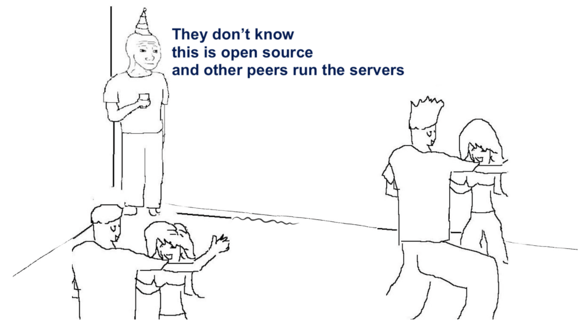

该团队并不气馁。从 2016 年开始，该团队开始了「青铜时代」版本的 Decentraland 开发，基本上是一个被分割成一片片土地的 3D 世界。

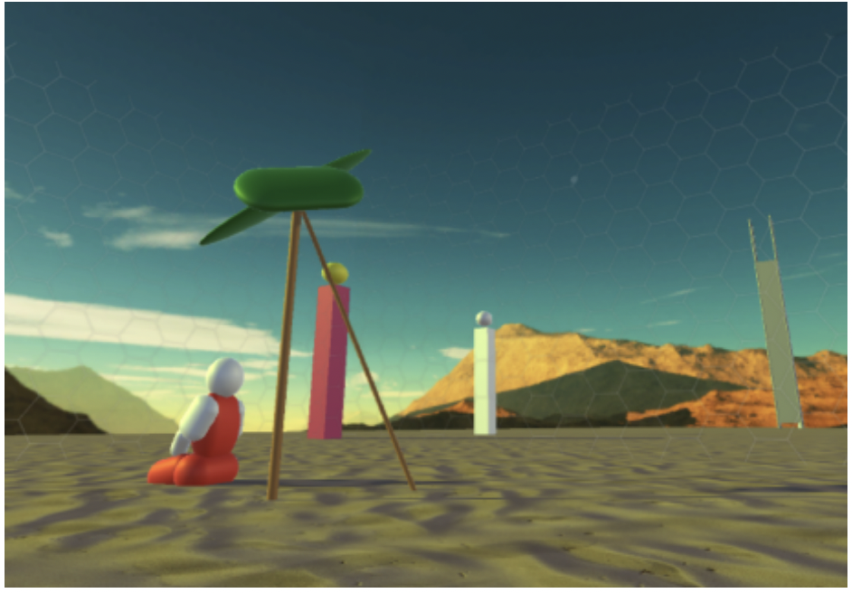

2017 年 3 月，青铜时代被部署在一个用于测试的替代区块链的测试网上。现在是把它带到世界其他地方的时候了。

## 百万美元和 MANA

在团队测试的几个月后，他们发布了一份白皮书，概述了他们的愿景。虽然在细节上很模糊，但该文件指出，他们打算建立一个由社区管理的、具有链上经济的可穿越的世界。该领域的地形被细分为地块，其细节存储在一个「基于区块链的账本」上。这些 NFT —— 一个当时尚未普及的术语，在白皮书中没有提到 —— 可以用 Decentraland 的特有通证 MANA 获得。用户还可以在 Decentraland 内的商品和体验上赚钱和花钱。预期的用例包括广告（考虑虚拟广告牌）、社交互动和数字收藏品。值得注意的是，Decentraland 的白皮书先于 OpenSea 的推出，甚至领先于「加密猫」（CryptoKitties）的热潮。

2017 年 8 月 17 日，Decentraland 开启了 IC0，希望筹集 86206 个以太坊，即 2600 万美元。在 35 秒内，整个分配被抢购一空。虽然这给了 Decentraland 足够的火力来建设，并带来了 2000 个独立购买者，但许多人被冷落了，并对大型购买池抢购如此大的份额感到沮丧。一个名为 ico.info 的团体，汇集了一千多名参与者的资金，最终抢到了近 21%的分配。

我采访了一个人，他在众筹中成功获得了一笔可观的地产 —— 据消息人士估计，他们目前在 Decentraland 拥有大约 0.3% 的土地。据他们回忆，他们被 Araoz 的参与所吸引，鉴于他在 OpenZeppelin 上的成就，他是一个 OG（行业老炮）。虽然这个团队的令人印象深刻，但这个项目的远见也引起了共鸣。线人表示：「愿景是非常广泛和雄心勃勃的，Manuel 的参与让我相信他们可以完成它。」

这一看法得到了 Fabric Ventures 的 Max Mersch 的回应，Fabric Ventures 是 Decentraland 的第一个在朋友和家人之外的「外部」投资者。经过 2017 年的介绍，他对项目的核心团队留下了深刻印象：

> 当时，团队包括 Ari、Esteban 和 Manuel……他们是一个由来自阿根廷的狂热者和加密货币 OG 组成的团队，他们主要是在伏尔泰之家工作、编码和生活在一起。他们日复一日地以此为生 —— 在那个时候，加密货币和元宇宙还没有达到今天这样的炒作程度。

## 打开大门

那些有幸在 IC0 上买到土地的人，有一段时间并没有什么用处。随着可用的虚拟版本的构建，这个世界仍然处于 alpha 状态。与此同时，Decentraland 在 2018 年推出了一个软件开发工具包（SDK），授权开发者创建虚拟「场景」，可以在他们的土地上部署。大约在同一时间，「LAND 市场」启动，这是平台交易的家园。到 2019 年底，它已经处理了价值 1660 万美元的 MANA 交易。今天，该市场提供了更多种类的 NFT，包括「可穿戴装备」和为你的化身「取名」。

2020 年 1 月，Decentraland 终于向公众打开了它的世界之门，以大规模的寻宝活动拉开序幕，提供了赢得 CryptoKitties、Axies 和其他通证的机会。

用户开始聚集在平台上，尽管这个虚拟世界的性能和活力让每月活跃用户（MAU）总数相对较低。到 2021 年年初，Decentraland MAU 达到了大约 2 万个，随着加密货币牛市的到来，这个数字开始更快地攀升。在第一季度内，MAU 增加了一倍多，超过了 50,000。在整个春季和夏季，数字将徘徊在 60,000 至 80,000 之间。秋天，MAU 进一步增加，达到 14 万。

然后发生了一些事情。

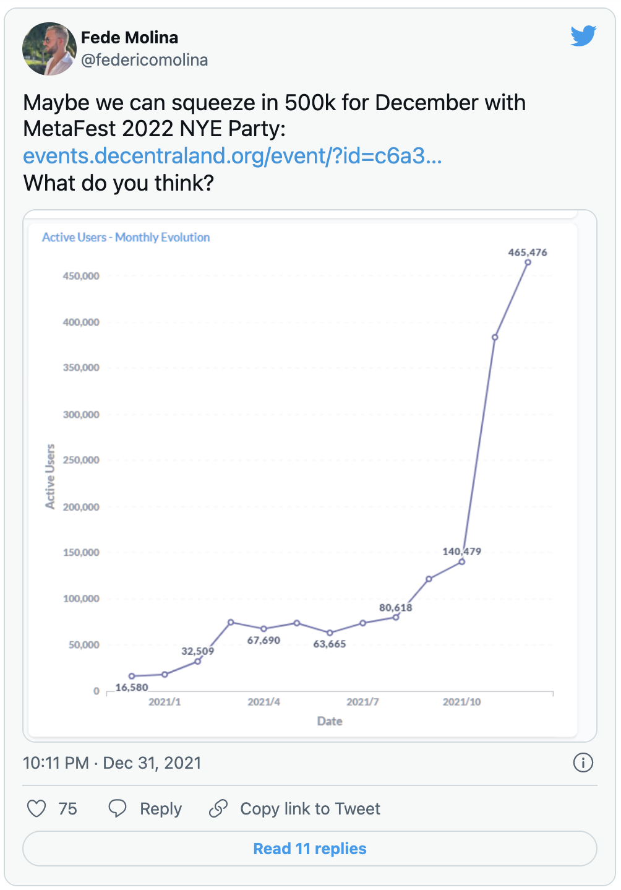

## Meta 效应

马克`扎克伯格在 Facebook 的 Connect 大会上以回顾网络表达的历史开始了他的演讲。当进入他的演讲主旨时，他说：

> 下一个平台和媒介将是一个更加身临其境的互联网，在那里你是在体验中，而不仅仅是看着它。我们把这称为元宇宙。

传言经被证实。这家以前被称为 Facebook 的公司正在全力以赴地投身元宇宙，包括改名。

曾经是科幻小说的概念范畴，但扎克伯格的宣布让元宇宙的承诺和潜在利润突然成为现实。全世界注意到了这一点。据报道，在宣布后的两个月内，不仅有 12,000 篇文章提到了这个词 —— 是以往任何一年的 30 倍 —— 而且用户和资金都涌向了相关产品。

从一个月到下一个月，Decentraland 的 MAUs 几乎增加了两倍。MANA 的价格几乎垂直上升，从 0.75 美元到 3.56 美元，最终逼近 5.5 美元。

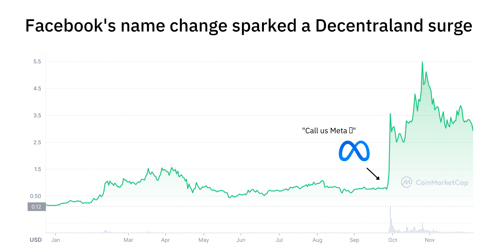

Decentraland 完全稀释市值在四天内从 16 亿美元跃升至超过 70 亿美元，在相当于一个长周末的时间里，有效地将其规模从一家名为 1-800-FLOWERS 的花店增加到《纽约时报》。自那次飞跃以来，MANA 与许多其他通证一起价格回落，但它仍然比 Meta 宣布之前高出数倍。

这种急剧上升的背景说明了 Decentraland 的一些挣扎。正如我们稍后将讨论的那样，该产品并不像人们对其规模所期望的那样稳定或成熟。这种批评从一个角度看是合理的，从另一个角度看则是不公平的。是的，这个项目现在是最热门的加密项目之一，但市场已经把它向前推进了好几年。它可能需要一些时间来吸收新的需求。现任负责人 Agustin Ferreira 指出，Decentraland 在许多方面的仍然是一个「概念验证（产品）」，而首席技术官 Agustin Mendez 则解释了这种涌入是多么棘手。

> 我经常想，「年度关键词」可能是元宇宙。所有来自 Meta 的新方向和名称的验证无疑提高了人们对这种项目的认知……托管在 play.decentraland.org 的 Decentraland 版本在 12 月获得了 33 倍的月度用户增长。而保持服务器和去中心化节点的性能达到这种规模是一个挑战。

虽然不是没有缺陷，但 Decentraland 已经是一个耐人寻味的、值得一游的地方。

## 产品：奇特的旅程

Decentraland 是什么？它是一个世界吗？一个协议？一个通证？一个 DAO？

答案皆为「是」。Decentraland 是所有这些东西，以及相当多的东西。让我们来看看它的不同元素。

### 世界

我想把你介绍给 Sutherland。他长着胡子，留着莫霍克头，戴着雷达面罩，穿着黄色小短裤。他是我的 Decentraland 化身。

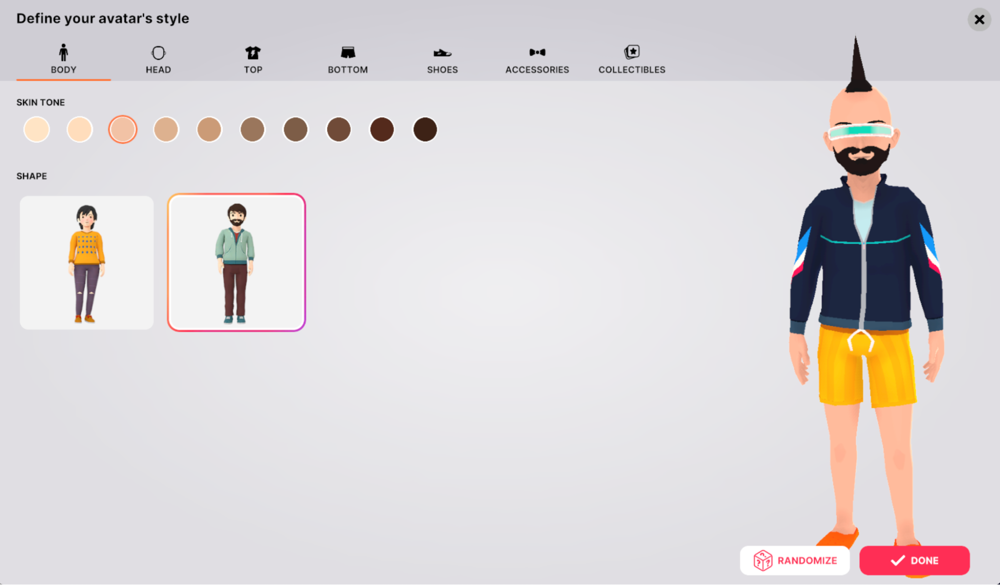

在过去的一周里，我用 Sutherland 尽可能多地游览了 Decentraland 的世界。我们从 「创世纪广场」的喷泉跳下来，去了拉斯维加斯城的赌场，偶然发现了骄傲大游行，开采掉落的小行星以换取宝石，去了马厩，目不转睛地看着旋转的螺旋形房屋，在苏富比的画廊里浏览艺术品，并试图驾驶一条龙。我们走了大约 10 英尺就撞到了墙上。

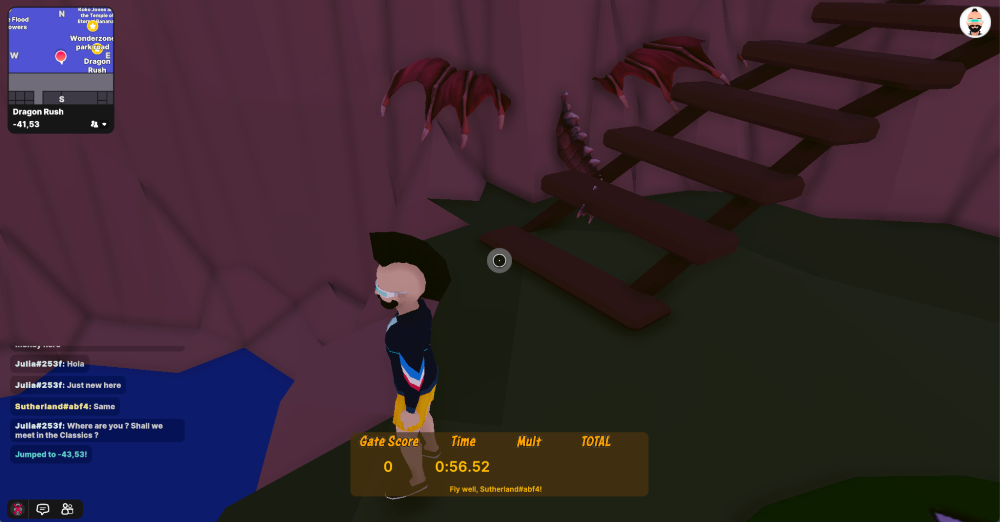

我也曾在空地和整个社区走来走去，没有看到一个人。在一个星期二的中午，我站在弗兰基酒馆（Frankie's Tavern），一个虚拟的潜水酒吧里，独自看着一个音乐视频。在听说了 X 区，Decentraland 的红灯区之后，我毫无结果地寻找显然存在的妓院。我希望能采访到世界上最古老的职业中最现代的成员(它是如何运作的？人们买的是什么？是否涉及 VR？）虽然失败了，但我确实偶然发现了 Waifu HQ，这是一座令人困惑的女性动漫人物纪念碑，里面有一个衣着暴露的霹雳舞者。

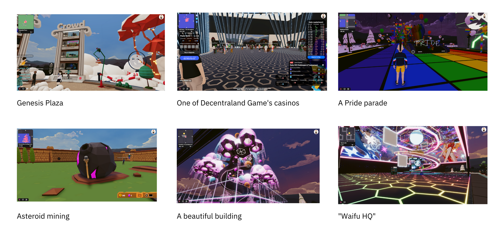

这些外出活动令人愉快吗？算是吧，尽管在 Decentraland 花时间感觉更有趣，而不是好玩本身。尽管在这个世界上花了几个小时，我没有发现一个游戏或活动能吸引我超过几分钟的注意力。没有任何令人上瘾的多巴胺漩涡把我拉回来，违背我更好的判断。

我怀疑如果我是一个热情的或有能力的赌徒，我会有不同的感受。在我的各种拜访浏览中，Decentraland 的赌场几乎都是人流最多的地方。Decentral Games 经营着许多业务，这家初创公司据说从数字货币集团等投资者那里筹集了 500 万美元，并以 DAO 的形式运作。它的场地包括 Chateau Satoshi、The Aquarium 和 Bored Ape Yacht Club，一个河船赌场。

其结果是，我对 Decentraland 的体验与拉斯维加斯相似，即使不是真正的快乐之旅，也算作为一项人类学研究而变得有趣。

在 Decentraland 度过的时间也可能是令人沮丧的。任何没有新款苹果 MacBook 电脑或游戏设备的人，都可能在启动时遇到困难。即使是那些拥有强大处理器能力的人，也会等上几分钟才开始，并在途中面临图形抖动和 Bug。

Decentraland 正在解决这个问题。Ferreira 告诉我，该团队预计将推出一个桌面客户端，以提高性能并允许创建新的体验。随着时间的推移，他希望 Decentraland 能够跨设备和通过不同的客户端运行。

外部各方也在为改善 Decentraland 的性能而努力。我被允许进入一个程序的测试版，该程序希望从根本上改善跨虚拟世界的流媒体。

除了使用 Decentraland 所需的计算机处理能力，最大的问题似乎是它的相对空虚。虽然有很多东西可以看，但也有很多东西尚待开发。许多土地所有者似乎满足于让他们的土地升值，而不在其上进行建设。当我问专注于元宇宙的基金 Sfermion 的管理合伙人 Andrew Steinwold，他认为 Decentraland 最大的弱点是什么时，他回答说。

> 缺少内容。学习如何在 Decentraland 中造房子的门槛很高，因为你需要了解 3D 建模。他们有一个拖放构建器，但它的能力是相当有限的。

一些公司正在出现，试图填补这一空白。在发现 Decentraland 的大部分地图是空的之后，Ed Radion 决定成立 Squiggly 学校。这个「元宇宙学院」正在制作一些课程，帮助创作者学习如何在这个新领域进行建设。值得注意的是，Squiggly 学校专注于不同的虚拟平台，更倾向于 Sandbox。Radion 说，这个较新的虚拟世界有更简单、更直观的工具：

> 我们全身心地投入到 Sandbox 中。他们的无代码游戏引擎和设计工具很容易上手，这意味着这个生态系统将比 Decentraland 有更多有趣的体验……Decentraland 很难吸引非土地所有者，因为他们的体验必须用生产级工具如 Blender、Unity 来构建。大多数人不知道如何去做，也没有时间去学习。

Decentraland 需要找到吸引土地所有者的方法，使创作更简单，以充分发挥其潜力。

### 平台

虽然用户与 Decentraland 互动的主要方式是通过其虚拟世界，但它确实有一个更传统的 2D 平台。这包括一个**活动目录，前面提到的市场，以及 Steinwold 提到的建筑工具**。

看一下这些**活动**，就能感觉到 Decentraland 在我的轶事浏览之外是如何被使用的。除了音乐会、赠品和游戏，还有喜剧表演、慈善活动和企业展示。作为消费电子展（CES）的一部分，三星开设了「837X」，这是他们「在元宇宙中的正式发布」。作为体验的一部分，这家手机制造商安排了一个 DJ 表演，并发放了 NFT。

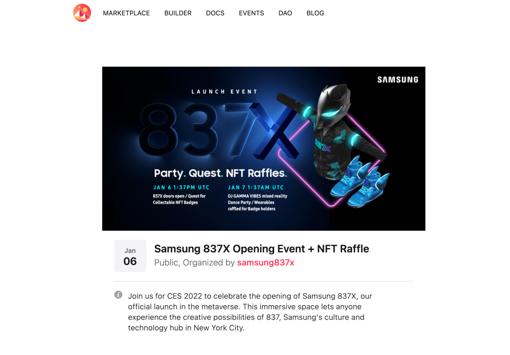

自 2018 年推出以来，Decentraland **市场**已经扩大到包括化身可穿戴装备和名字。只要花几个 MANA，你就能买到一件新外套、一个龙头、翅膀或其他任何数量的配件。这些都是由其他创造者制作的，让 Decentraland 成为一个可信的地方来营业。

你也可以为你的化身购买一个正式的名字；一些相当大的品牌名称似乎也在出售。

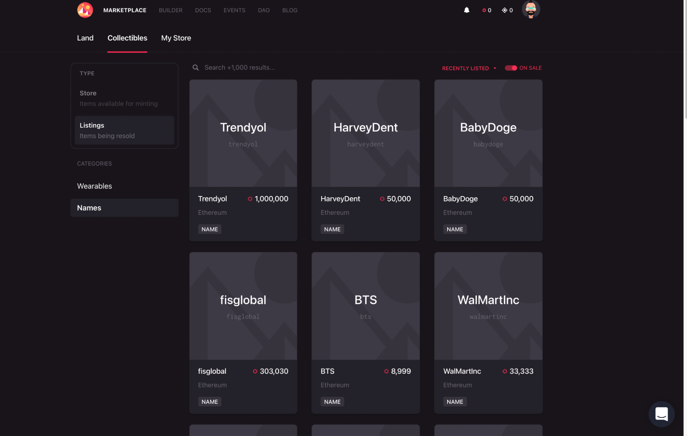

要创建新的场景，用户必须使用**构建器**。在那里，用户可以上传收藏品，注册独特的名字，或构建场景。我发现构建器很有趣，也很容易玩，尽管我创造的东西没有任何构图或品味的感觉（沙地、水池、门口。出租车？仙人掌！）。如果我拥有一块土地，我可以看到自己有一个很好的时间把一些不那么糟糕的东西放在一起。

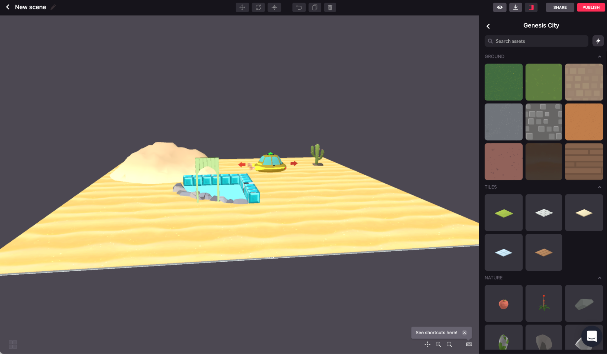

随着时间的推移，开发虚拟房地产可能会被视为类似于在真实土地上的建筑 —— 你可以做到这一点，但除非你是一个专家，否则你最好雇用一个专业人士。像 Renovi 这样的平台就是带着这样的论调进入市场的。NFT 市场的目标是成为购买建筑工艺场景的目的地。当被问及这一行的机会时，联合创始人 Adonis Zachariades 说：

> 很快，你的数字空间将占据中心舞台，并将成为元宇宙的下一个大热门。如果你的虚拟空间是由扎哈·哈迪德建筑师设计的呢？或者福斯特公司？而且更重要的是，每个人都可以来看看？如果你也能将你的虚拟建筑货币化呢？……我们相信这将是下一个 元宇宙/NFT 的前沿领域。

随着时间的推移，Decentraland 的空地可能会被令人惊叹的专业创作所填满。那些想自己建造的人可以进入 SDK，直接为拖放式建造器提供动力。这允许更大的控制。

### 协议

Decentraland 的「世界」是由其协议驱动的。这里对项目建设的最好描述仍然来自于原始白皮书。

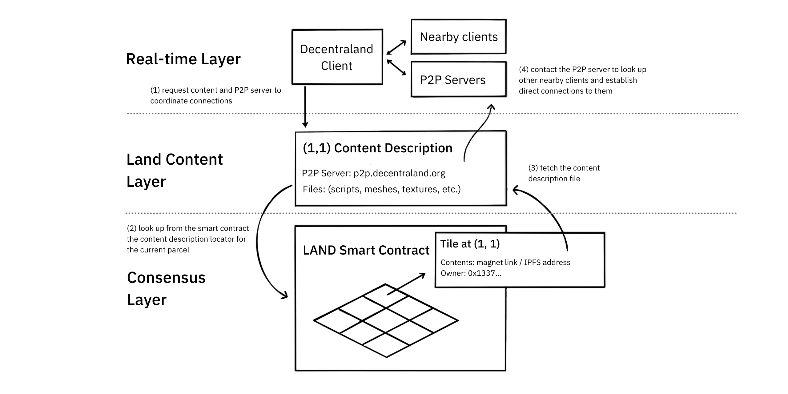

如上图所示，该协议分为三层。

1. **共识层**。地块，或项目更喜欢的 LAND，是具有「唯一的（X，Y）坐标、所有者和对内容文件的引用」的不可伪造的资产。该内容文件包括对用户想要「服务」的场景的引用。
2. **土地内容层**。一个去中心化的存储系统分发填充世界的内容。这包括文本、音频、视觉信息，以及更复杂的动画。
3. **实时层**。通过点对点的连接，该协议可以在世界中创造社交互动。这包括语音聊天、信息传递和化身。

这些共同作用，创造了虚拟世界的完整体验。Decentraland 还管理其领域内的支付流程。

作为一个旁观者，由于 Decentraland 的点对点架构，有趣的事情有时会发生。首席技术官 Mendez 指出，当 Decentraland 的 NFT API 发生故障时。与其说是整个系统出了问题，不如说是 404 错误在一部分用户中传播。因为他们的「可穿戴装备」无法被找到，他们出现时就没有穿衣服。

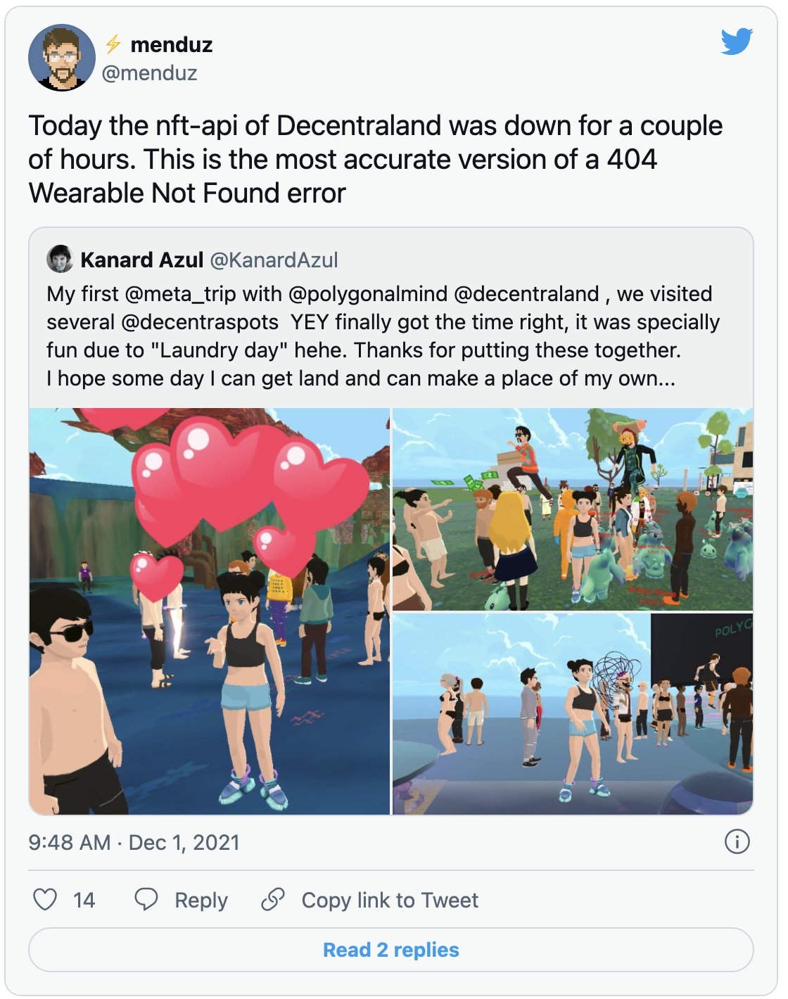

### 通证

MANA 是 Decentraland 的通证。其总供应量在 IC0 时为 28 亿多一点。在接下来的五年里，它已经减少到了 22 亿以下。这种减少是由于 Decentraland 的经济机制而发生的。每当用户购买 LAND，注册一个新名字，或购买收藏品时，就会有一定比例的 MANA 被烧掉。

随着 MANA 供应的减少，理论上，它应该变得更有价值。如果 Decentraland 能让 MANA 更有用，增加它的消费和赚取方式，这一点尤其正确。

除了作为一种交换手段，MANA 还可以作为一种治理通证。LAND 或 MANA 的持有者可以通过 Decentraland 的 DAO 对项目的方向进行权衡。

DAO

2020 年初，Decentraland 完成了其最初的目标之一 —— 将项目的控制权移交给其社区。它通过正式成立一个 DAO，并将控制 LAND、可穿戴装备、市场等基本智能合约的权力交给它。如果这些有一天发生变化，那是因为社区投票支持，而不是因为一个开发者决定这是一个好主意。

作为这一过渡的一部分，Decentraland 的创始人退了一步。虽然 Araoz 和 Jardi 共同撰写了白皮书，但他们都没有继续全职参与这个项目。相反，它主要由 Ari Meilich 和 Esteban Ordano 领导。从 2020 年 4 月开始，两人都转为顾问角色。大约在同一时间，Meilich 似乎已经开始从事加密大型多人在线角色扮演游戏 Big Time。这两人的退出，无论是认为的还是真实的，都让元宇宙投资者 Andrew Steinwold 感到警惕。

> 每当创始人离开一个项目，我就会看跌，因为你需要有远见的人实现一些东西，直到它成为主流……我们仍然处于元宇宙的极早期，所以创始人需要深深扎根。

为了填补这一空白，Decentraland 求助于 Agustin Ferreira。他不仅曾是伏尔泰之家的一员，而且在项目的早期就为其做出了贡献。他现在与首席运营官 Justin Edwards 和首席技术官 Agustin Mendez 一起领导该基金会。与 Ferreira 一样，Mendez 与 Decentraland 有一段很长的历史，在 2018 年至 2019 年期间全职从事该项目工作。

Ordano 的角色似乎也远未完成。当我问他为什么退下来时，他回答说：

> 初创企业往往会对企业家造成伤害。我想确保 Decentraland 成为一个「给人类的好礼物」：我们可以建立一些东西并不意味着我们应该这样做。经过几个月大部分时间的离线，我认为世界需要更多像 Decentraland 这样的开放信息网络的例子，所以我开始越来越多地参与到社区中，看看我如何/在哪里可以提供更多帮助。

Decentraland 可能已经完美地完成了过渡，带来了新的血液，同时给它最初的设计师之一一个机会来重新激发活力。

虽然现在还处于早期阶段，但 Decentraland 的社区似乎已经接受了这种转变。这个项目的快照页面显示它有 8840 名成员，高于 Yearn、Polygon、The Graph 和 Compound 等热门项目。写作本文时，有超过 50 个提案目前是活跃的，从琐碎的到严肃的。

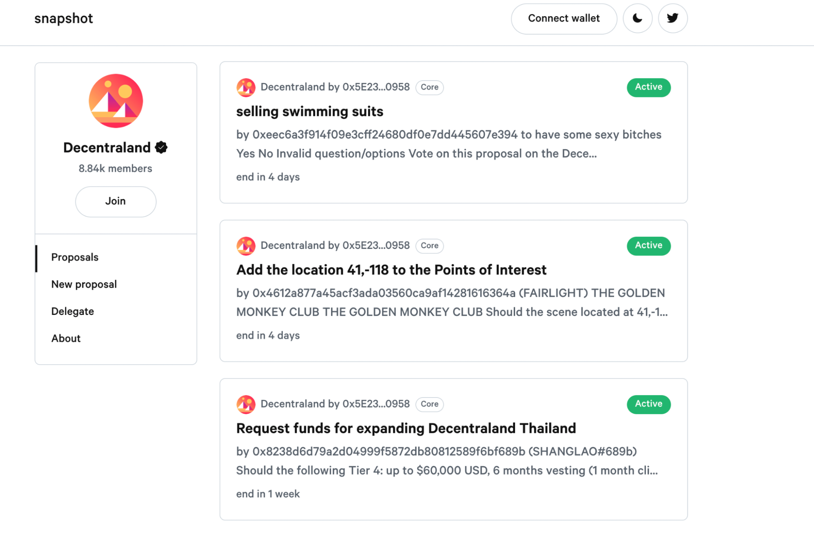

重要的是，MANA 的价格上涨也让 Decentraland 的 DAO 有能力在新的水平上投资其社区。作为其成立的一部分，DAO 被授予 2.22 亿 MANA，归属期为 10 年。这笔钱在 2021 年初价值 1.665 亿美元；现在大约是 6.5 亿美元。真正的钱将被投入到社区活动中。时间将证明它的分配情况。

## 价值：为虚拟领域定价

去年炙热的 NFT 市场迫使投资者和评论家从头开始重新思考估值问题。你如何评估一块石头图画的升值潜力？2025 年，数字化猴子的市场将是怎样的？

任何希望认真对待这一运动的人 —— 并不是所有的人都会 —— 可能不得不把他们的现金流折现模型放在一边，而专注于社交信号、模仿价值和社区的力量。这一切都说明，试图对 NFT 进行估值，无论是个人资料图片还是数字地块，都会感到荒谬或不严谨。在许多情况下，支持它们的平台也是如此。

尽管如此，我们将尽力把 Decentraland 的价值和它所创造的世界联系起来。

### Decentraland 对比 Roblox

回顾一下，写作本文时，Decentraland 的市值为 65 亿美元，有超过 80 万个注册账户，在 12 月记录了 46.5 万 MAU。在过去的 30 天里，Decentraland 的市场已经处理了 1500 万美元的 GMV（商品总价值），收取了大约 38 万美元的费用。这让它的收入倍数达到 1425 倍。值得注意的是，上个月个人市场交易方的数量也很少，只有 458 个独立买家和 178 个卖家。

让我们把它与 Roblox 进行比较，这是 Decentraland 最好的公开比较。这个 Web2 虚拟世界游戏的市值为 490 亿美元，根据上个季度的报告，年化收入为 24 亿美元。季度收入比上年同期翻了一番，让该公司的收入倍数大约为 20 倍。2021 年第三季度，Roblox 的日活跃用户达到 4700 万。

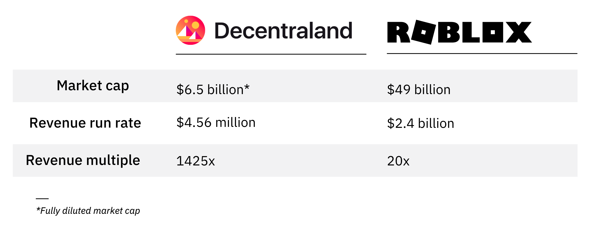

这种比较有用吗？它太简单从而没什么太大意义。它没有考虑到 Decentraland 更高的增长，也没有考虑到 6.5 亿美元归属到 DAO 财库的情况。不过，它也不是一无是处。从基于收入的估值角度来看，很明显，投资者对 Web3 世界的估值很高。

不止一个与我交谈的消息人士暗示或直截了当地说，他们认为 Decentraland 被高估了。一位大的土地所有者表示他们希望转移他们所持有的一些土地，而一位元宇宙投资者和专家表示，Decentraland 的上升主要是由「潮人」对「土地」这一概念的追捧所推动的。尽管看好这一领域，但该人士承认，虚拟世界「在真正变得有趣之前还有很长的路要走」。

### 爱荷华州的农田

其他人不同意，没有人像元宇宙集团和 GDA 资本的联合创始人 Michael Gord 那样坚定。元宇宙集团是 Tokens.com 的子公司，是一家虚拟房地产投资者，也是 Decentraland 最大的开发商之一。该公司在完成有史以来最昂贵的「元宇宙土地收购」时吸引了公众的注意。去年 11 月，Gord 的团队在 Decentraland 的时尚街区完成了一个 116 个地块的房地产，总价为 618,000 MANA。在交易宣布的时候，相当于 243 万美元。对 Gord 来说，这次收购不费吹灰之力:

> 现在，Decentraland 的土地价值约为爱荷华州农田价值的 5%。我不指望爱荷华州农田的人数会成倍增长。

对元宇宙集团的团队来说，Decentraland 不仅有机会成为最热门的房地产市场，还有机会成为下一个社交网络。还是来自 Gord 的观点：

> Decentraland 的定位是成为世界上用于社交聚会的第一社交网络……元宇宙将完全吞噬社交媒体市场，而现在，Facebook 和其他社交媒体平台有数千亿的市值。我认为这就是 Decentraland 在未来几年内的地位，当其网络从 50-60 万月活跃用户增长到 6 亿月活跃用户。

这一切到底需要多长时间？Gord 列出了一个非正式的时间表，表明我们可以看到 Decentraland 在今年达到 2000 万用户，后年达到 8 亿，也许在 2025 年达到全球统治地位。

「假设我错了，就说 2030 年吧，」他补充说。「但我认为未来是……世界上每个人都在使用元宇宙。"

元宇宙集团正在采取行动以确保这种情况的发生，在他们的地盘上举办活动和独特的体验，包括音乐会。今年 3 月，该公司将与 UNXD 合作举办 Decentraland「时装周」，UNXD 是一个数字市场，负责管理 Dolce&Gabbana 的第一个 NFT 系列。

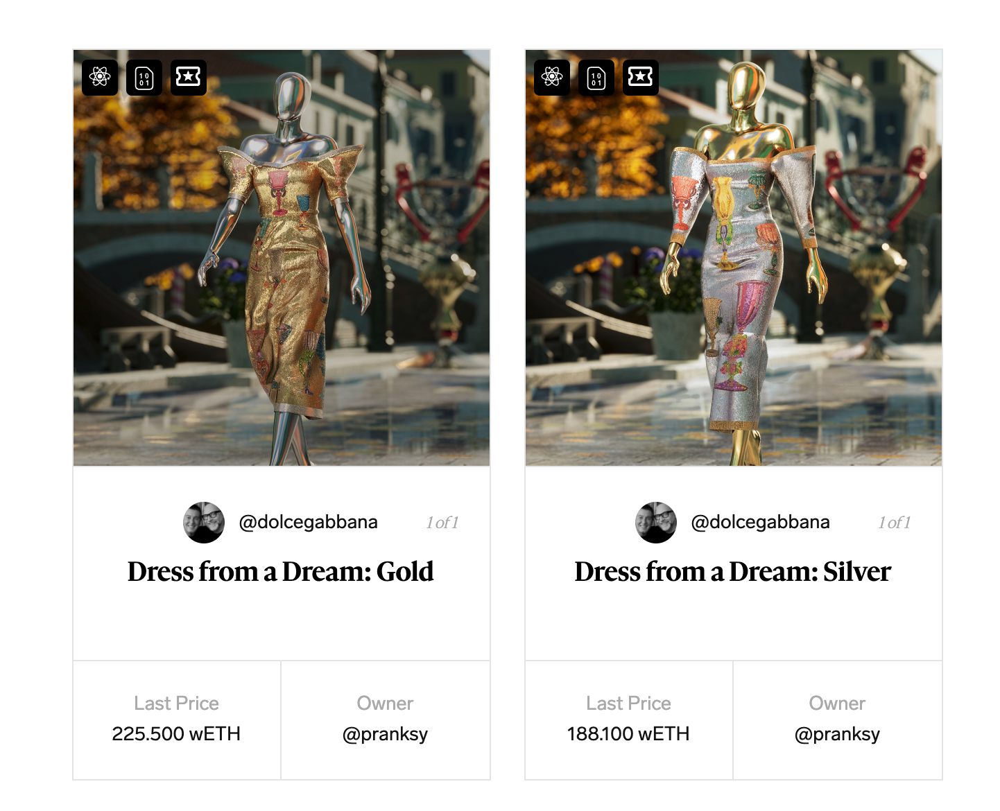

事实上，Decentraland 已经接待过大人物。去年 10 月，DJ Deadmau5 作为「元宇宙节」的一部分进行了 30 分钟的表演。可以期待有更多的名人接踵而来。

### 元宇宙商场

这些计划说明了数字土地的价值从何而来。在与纽约大学房地产经济学和市场分析的兼职教授 Kevin Clark 的交流中，他指出，可以根据「通过商业运作（如零售）或通过出租给零售商可以产生的租金的收入潜力」进行估值。你可以想象，在未来，为数字会议、NFT 快闪商店、咨询业务或其他任何形式的活动租用一块土地是很平常的。为了促进这种商业活动，地点当然很重要。正如在物理世界中一样，靠近其他令人兴奋的地点的房产会从更多的人流和「市场互动」中受益。Clark 补充说，数字地产「毫无疑问，将继续存在」。

我们可能有一天也会将 LAND 用于购买数字物品以外的用途。NFT 项目 Ludo Labs 的创始人 Aaryaman Vir 向我介绍了 Boson Protocol。这个去中心化的网络为「在元宇宙 」购买实体物品提供动力。该项目在 Decentraland 购买了一个价值 70.4 万美元的房产，开发成一种虚拟商场。

随着时间的推移，我们可能会通过空间网络进行购物，使用我们身体的模型来「试穿」一件连帽衫或一双运动鞋，以直观地了解是否合适。这将是真正的混合型购买，提供实体产品并传达虚拟的好处 —— 化身饰品或进入私人区域。

最终，对 Decentraland 的估值感觉主要是你选择关注的地方的功能。看一下收入，几乎不可能证明其市值。但观察最近的快速增长和未来令人眼花缭乱的可能性，你可能会觉得有很大的空间。

## 未来：一个活生生的前沿阵地

Decentraland 不是唯一的世界建设者。其他人也在追逐新范式变革所带来的红利，Meta 就是其中的佼佼者。

### Meta

Decentraland 应该担心扎克伯格军队的进展吗？尽管我的消息人士更倾向于 Web3，但似乎没有人对 Meta 的参与感到过分担心。尽管该公司宣称要建立一个「开放」的元宇宙，但一些人对它是否会贯彻这一言论表示怀疑。Meta 公司会不会足够仁慈地实现真正的互操作性？Esteban Ordano 概述了可能让它难以实现的动机。

> 我不确定是否有激励措施让它成为一个非常开放的平台。甚至像……你的显示名称也是非常相关的。例如，我不认为 Facebook 允许你的头像与你的 Decentraland 用户名一起显示，因为你想确保不同体验之间的一致性，并防止冒名顶替……互操作性听起来不错，但我相信这是个比许多人意识到的更难的问题。而在 Facebook 内部，一些人将面临一个不费脑子的决定：我是否应该冒着职业生涯的风险，在一个涉及数百名设计师和工程师的 9 个月计划中，让产品的用户体验更加复杂，以便我们能够支持竞争对手的身份系统？

Andrew Steinwold 更犀利地表示不相信：

> Facebook 在其平台对心理健康的损害上撒了谎，并建立了自己的平台来鼓励愤怒，因为它能增加用户参与度。他们声称他们的「元空间」将是开放的，人们将能够赚取和拥有自己的资产，但我不相信他们。他们在追求权力的过程中已经撒了无数次谎，那么他们为什么会突然变得友好和「善良」？

Meta 公司可能仍然是成功的，并且对开源项目表现出一些友好。首席技术官 Agustin Mendez 强调了其「巨大的」贡献，指出他们对 glTF 文件的原生支持 —— 一种显示 3D 模型的开放标准。他还提到 Meta 的 Oculus 产品是「元宇宙的关键」。

最终，市场有足够的空间容纳多个赢家。Meta 的实例不太可能满足所有需求。许多其他耐人寻味的项目正在将新鲜的想法带到人们面前。

### 挑战者

虽然 Decentraland 是 Web3 虚拟世界中的头牌，但紧随其后的是 The Sandbox。作为区块链游戏企业 Animoca Brands 的子公司，Sandbox 似乎表现出一种略微不同的精神。一位消息人士将其描述为比 Decentraland 更「游戏化」，他们认为 Decentraland 更类似于一个游乐园。由于 Sandbox 的 Alpha 第一季已经关闭，目前还没有办法玩，也许这表明该产品在其生命周期的早期。

这些限制似乎并没有阻碍 Sandbox 的发展。在 2020 年出现后，它也从扎克伯格的宣布中获利。它的代币 SAND 在不到一个月的时间里从 0.8 美元左右飙升到 8 美元以上。其完全稀释的市值位于 140 亿美元以北（其流通市值为 43 亿美元）。在过去的一个月里，它已经超过了 Decentraland 在 OpenSea 二级市场的交易量。

Cryptovoxels 是另一个拥有忠实基础的玩家。Delphi Digital 的创始合伙人和 Bitkraft Ventures 的加密货币主管 Piers Kicks 评论说，鉴于开发团队的渺小，这个项目是多么令人印象深刻。还有几个人提到了这个产品。来自 Sfermion 的 Andrew Steinwold 赞扬了它的「更公平」的土地价格和内容建设功能。当我问 Decentraland 的首席技术官 Mendez，他认为哪些其他的世界是引人注目的，他回答说：

> 我很欣赏 CryptoVoxels 项目，他们一直在投入大量的精力，而且他们是第一个推出真正有效的东西。我认为他们在项目中保持了赛博朋克的精髓，从我的角度来看，他们做的是他们认为最好的东西，没有被其他东西染指。

Somnium 也赢得了一个核心的追随者。「这是唯一一个甚至接近的 VR 加密项目，」Kicks 说。虽然在网络上可以访问，但 Somnium 似乎在 Oculus 下活了起来；Kicks 注意到其虚拟世界的感觉是多么的无缝，社区是多么的热情。

还有一些正在崛起，有些明确地以游戏为导向，有些则追求多用途。第一类包括 Bright Star Studios 的 Ember Sword、Meilich 的 Big Time、Faraway 和 Defi Kingdoms。第二类包括 NFT Oasis、NFT Worlds、Nifty Island，以及那些坚持与我们现实世界地图相关联，如 SuperWorld 和 Upland。每一个新项目都可以为构建元宇宙的任务带来新鲜的想法。

### 开放的设计空间

在我们的讨论中，Piers Kicks 强调了还有多少空白空间；还有多少设计空间可以探索。土地是否必须按照我们在现实世界中所期望的方式行事，或者它可以有新的维度？有什么好的方法来资助其发展？

目前的情况是，在 Decentraland 上购买一块土地的底价是 1 万美元以上。虽然这是一个强劲需求的标志，但它将许多想要投身于这个世界的人排除在外。为了保持稀缺性，Decentraland 不太可能想要扩大其供应。同时，随着新来者被价格挡在门外，许多现有的土地持有者未能利用他们的持仓来创造价值。

虚拟世界如何解决这个难题？一种方法可能是通过降低进入的门槛，同时仍然允许巨鲸和 OG 显示其地位。

例如，Kicks 提出了「动态土地」的潜力，即围绕一个固定点移动的地产。靠近地图中心的有价值的位置可能只提供给那些开发和抵押它的人。你可以想象这样的决定包含了投资的资本、游客的数量和持有的时间等因素。有了这样的建设，项目可以扩展他们的边界，增加他们的供应，同时奖励财大气粗的人。同时，他们可以减少「死地」的数量，这些「死地」让 Decentraland 这样的世界部分荒芜。

Kicks 提到的另一个例子是允许用户增加他们在世界地图上的地产的大小。虽然他们的地产面积不会增加，但他们的地形将拥有更大的地位并吸引更多的注意力。Nifty Island 显然正在试验这种机制。

还有很多方法可以实验这些维度。如果有些房产是黑白的，而其他房产是彩色的，会怎么样？如果有些是低清晰度而有些是高分辨率呢？如果你的邻居根据某种资产的价格、钱包活动、社交图谱、时区或任何其他因素而改变呢？明天的城市不必像今天的城市那样行事。与以往任何时候相比，地图不是领土。

金融创新也是需要的。虽然去中心化金融（DeFi）已经使通过抵押和稳定币实现两位数的利率成为可能，但这似乎并没有让它进入虚拟世界。在我们对 Terra 的研究中，我们注意到新项目如何允许用户用通过 Terra 的 Anchor 协议获得的利息来支付产品。不需要支付利息以外的费用。

如果你能用 Decentraland 做一些类似的事情呢？投资者可以通过 Anchor 将他们的 Terra 质押，随着时间的推移慢慢购买，而不是直接购买 LAND。同样，现有的持有者可以选择在他们现有的地产上增加股权，以资助发展、扩张，或将资金回笼到项目本身。

在接下来的几年里，我们应该看到一波新模式的出现。

---

Decentraland 还不是一个繁荣的城市。虽然它可能有大量的资金和快速增长的用户数量，但现在，它是一个正在运行的大都市，一个仍在努力成熟的城市。这里有艺术和商业，有经济和治理体系，但它仍然缺乏那种不可言喻的、活生生的品质，而这种品质让现实世界和城市充满活力从而吸引我们进入。

伏尔泰，这位为孕育了 Decentraland 的房子命名的作家，建议我们应该「通过问题而不是答案来判断一个人」。这感觉是评估 Ordano 和他的团队所建立的东西的正确、公平的方式。Decentraland 并不完美。

但在过去的七年里，很少有人提出过更有趣的问题。总有一天，也许很快，他们会找到答案的。
