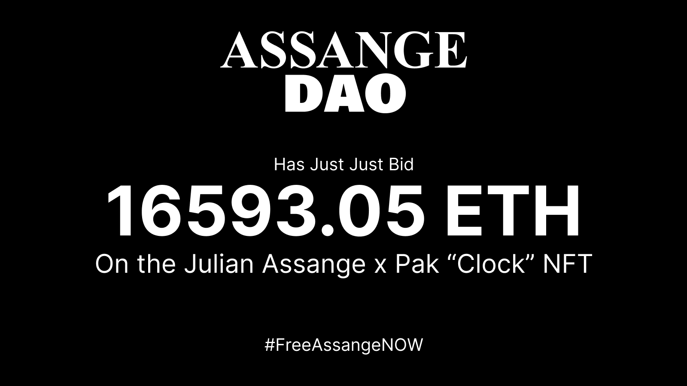
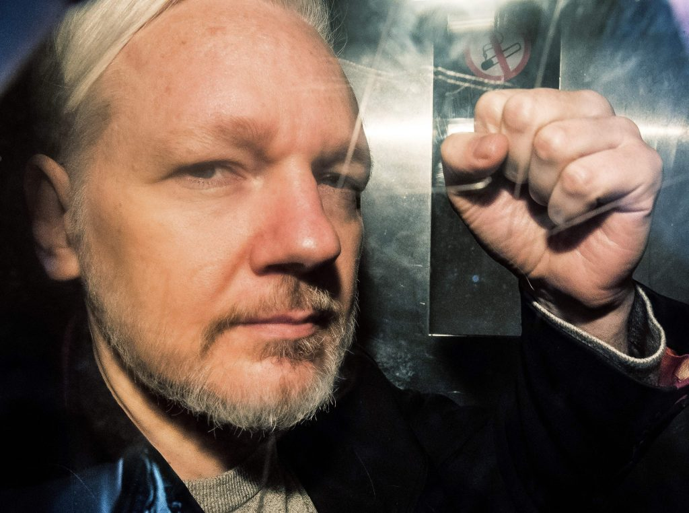
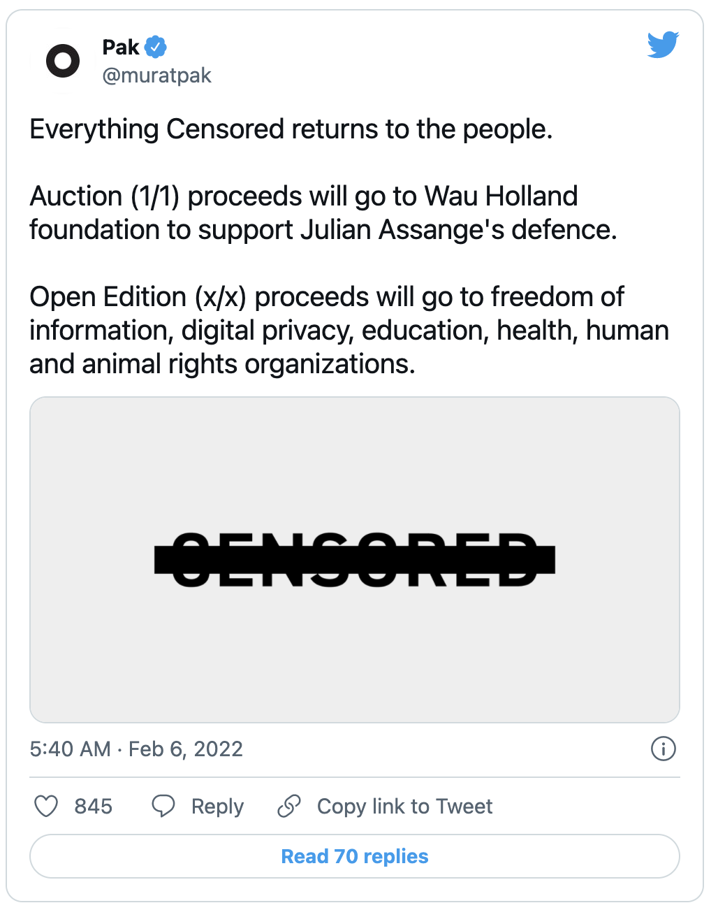

# Pak 谈与朱利安·阿桑奇的合作 NFT，以及为何不自认为艺术家 | Today's Interview

> 就在北京时间 2021 年 2 月 9 日 18:44，AssangeDAO 将其募集的所有以太坊（扣除筹款平台 JuiceBox 的手续费）16593.05 ETH 拍下了 Pak 与阿桑奇合作出品的 NFT 作品「时钟」。
>
> 
>
> 元宇宙特攻队特此翻译 Artnet News 两天前对 Pak 的专访，以飨读者。

**By Vivienne Chow**

加密艺术家 [Pak](https://news.artnet.com/market/pak-nft-91-8-million-2044727) 与被监禁的维基解密创始人朱利安·阿桑奇合作，推出了名为「审查」的 NFT 系列，今天（注：指 2021 年 2 月 7 日）刚刚上线，进行为时 48 小时、2 个部分的[在线销售](https://censored.art/)。收益将用于阿桑奇的讼战，以及信息自由事业。

2 月 7 日的发布日期与阿桑奇的律师要求英国最高法院重新考虑美国政府对他的引渡案的[最后期限](https://www.bbc.co.uk/news/uk-60108379)相吻合。

「审查」NFT 的第一部分是公开拍卖一幅独版 NFT 作品「时钟」，其中有一个[静音的计时器](https://censored.art/clock)，计算阿桑奇在狱中度过的天数。拍卖收益将捐给位于汉堡的非营利组织[沃霍兰基金会](https://wauland.de/en/news/2019/04/zivilcourage-julian-assange/)，该基金会自 2009 年以来一直在支持维基解密。

「审查」NFT 的第二部分是对「随意开价」的销售概念的发挥。买家可以通证化一条消息，创建一个属于「审查」系列中开放版 NFT 的作品。买家可以选择支付任何价格来铸造他们想要的 NFT，而且在 48 小时窗口期内创建的通证化消息的数量没有限制（每个加密钱包只能连接一条通证化消息，买家在铸造 NFT 作品时需要支付 gas 费用）。

这一作品紧随 Pak 另一件众筹的 NFT 作品[「合并」](https://news.artnet.com/market/pak-nft-91-8-million-2044727)的脚步，该作品在去年 12 月以 9180 万美元的总价向近 3 万名买家拆零出售。

新成立的 [AssangeDAO](https://twitter.com/AssangeDAO/status/1490451594768437259?s=20&t=FgijoqFefQJAQZ_zSItCOw) 是为竞标独版 NFT 作品「时钟」而成立的「赛博朋克集体」，仅仅 5 天内已经在加密版 Kickstarter 的 [JuiceBox](https://juicebox.money/#/p/assangedao) 上筹集了超过 13252 个 ETH（4140 万美元），这打破了之前由 ConstitutionDAO 在 JuiceBox 上筹集 11613 个 ETH（3670 万美元）创造的记录，该组织试图在苏富比购买一份罕见的美国宪法副本，但未获成功。

在「审查」发布近 6 个小时后，币圈用户已经创建了约 14000 条通证化消息（可以在 [OpenSea](https://opensea.io/collection/censored-pak-assange) 上查看）。

自 2019 年 4 月起，阿桑奇在厄瓜多尔驻英大使馆的庇护期结束后，一直被关在英国伦敦的一所监狱里。他现在面临的间谍罪指控源于 2010 年维基解密公布的数十万份与美国在阿富汗和伊拉克的战争有关的泄密文件。如果在美国被定罪，他可能面临长达 175 年的刑期。英国法院在 12 月作出的允许阿桑奇被引渡到美国的裁决，引发了包括中国艺术家活动家[艾未未](https://news.artnet.com/art-world/ai-weiwei-julian-assange-treadmill-2048228)在内的新闻自由倡导者的强烈抗议。

Artnet News 在「审查」推出之前采访了这位神秘的数字艺术家 Pak。以下是专访内容。

_2019 年 5 月 1 日，维基解密创始人朱利安·阿桑奇在驶入伦敦南华克刑事法庭时，从一辆囚车的窗口打出手势，他因 2012 年违反保释条件被判处 50 周监禁（照片：法新社 Daniel Leal）。_

**你和朱利安-阿桑奇是如何开始合作的？**

几个月前，朱利安的哥哥加布里埃尔[希普顿]与我联系。我有机会深入了解朱利安的故事。当时，我正在做一个以自由为主题的空投作品。因为作为艺术领域创作者的个人问题，我不断感受到把关和审查。我爱上了创造不同的机制来传达我的信息。对于「审查」，这个空投作品需要一个很好的存在理由，而朱利安正好是最合适的。

（我想传递的）最重要的信息是「审查无处不在」。

**作品的发布日期恰好是阿桑奇引渡案的一个重要期限。这些年来，你是如何密切关注此事的，到目前为止，你对这场政治棋局和法庭程序的印象如何？**

政治？那是什么？

**拍卖出售的钱将捐给支持维基解密的沃霍兰基金会。这笔钱将会是什么？**

独版 NFT「时钟」的拍卖收益将给予以支持朱利安事业的沃霍兰基金会，而公开版 NFT 的收益将支持致力于信息自由、数字隐私、教育、健康以及人类和动物权利的组织。换句话说，所有被审查的东西最终都会回归到人民手中。

**为什么信息自由对你来说很重要，加密世界如何在这场斗争中发挥作用？**

███████████████████████████████████

**你为什么想在「审查」中包括「开放版」作品？它在你的 NFT 作品中是否具有广泛的重要性？**

在我 2020 年早期的作品 X 中，我发明了开放版机制。它当时被称为「无限版」，其目的是动态地解决供需困境。在一年的时间里（在币圈相当于一个世纪），开放版机制确立了自己作为接触个人和建立社区的最成功方法。我已经把我的开放版设计改编成各种其他的配置，包括我与苏富比拍卖行合作的「同质化开放版」（Fungible Open Editions）以及我最近的破纪录作品「合并」中的「堆叠开放版」（Stacking Open Editions）。因此，我认为在一个与我们这么多的人对话的作品收藏中保留它的美是至关重要的。这是第一次以「按需付费」的模式免费提供开放版空投。我认为它将再一次永远改变行业格局。

**你为什么称这是「有史以来发行的最大系列之一」？在什么方面是最大的？**

「合并」目前保持着围绕单一收藏品建立的最大社区的记录，有超过 3 万名个人收藏者。在我看来，「审查」是一个类似位置的有力竞争者。

**你用「他们」来指代你，而你的身份仍然是未知的。你认为你会永远保持匿名吗？为什么这对你很重要，特别是考虑到你对像维基解密这样的提倡透明的事业的支持？**

我不是匿名的。我是 Pak，正如我的公共记录所显示的那样。我试图将我的物理存在与我的作品分开，因为我觉得当人们看到一张脸时，听到名字就会自动想起它。与其如此，我希望人们能想起我的作品。

**你曾说过，你最初是在第一次空投的前几天发现了加密艺术。但你是什么时候开始关注艺术的？那么加密货币呢？它们在你的 NFT 中是如何交织的？**

作为比特币的早期投资者，我一直认为加密货币是我的领域。正如你所看到的，我已经创作了近二十年的数字艺术，所以我把它视为我的创作领域。这是这两者的一个很好的交集。我不认为我创造了艺术；相反，我认为我在美和技术的交汇点上创造了设计。我不认为自己是一个艺术家。

**一些评论家认为，你作品的销售机制是你玩弄或挑战某些经济和生产概念的方式。你曾说过游戏化是加密艺术价值的关键。你如何看待自己的使命？**

我不关心它是否是艺术，我关心它是否有趣。如果它不耐人寻味，为什么会有价值？

**你曾说过，艺术的未来将是「（智能）合约级的创新，即使对艺术」。你这样说是什么意思？**

NFT 通过我们所谓的加密艺术取得了突出的地位，它最初都是关于图像、像素和「右键保存」文件的。文件，或图像，只是区块链合约的同质化元数据中的一个元素。从一开始，我就专注于这种媒介的其他深度；我发现微不足道的细节，「图像」，很乏味，尽管我觉得我完全有能力创造它们。专注于图像并仅以其外观来判断这种媒介的产出是一种天真的观点，是 NGMI[不会成功]。你会仅仅根据纸币上的图像来选择它吗？只有在你无知的情况下。

**你对所有权的概念有什么看法？单独拥有一件艺术品（或 NFT）的想法在未来会不会变得过时？**

所有权？我们还没有到那一步。

**你似乎对艺术市场持批评态度，但你却与大型拍卖行合作。你在那里试图实现什么？**

变化。

**你认为在加密艺术行业中缺少什么？您希望看到更多的是什么？或者更少？**

历史是缺失的，而我们正在共同创造它。
