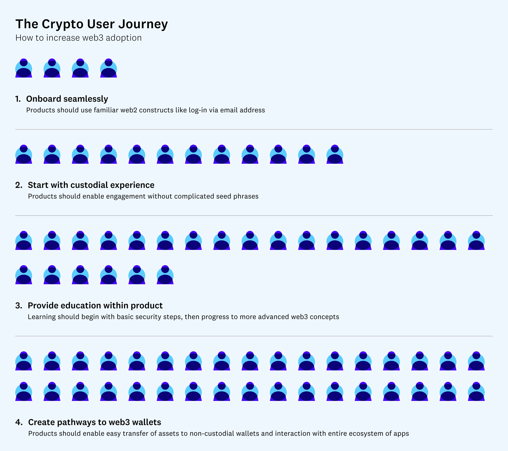
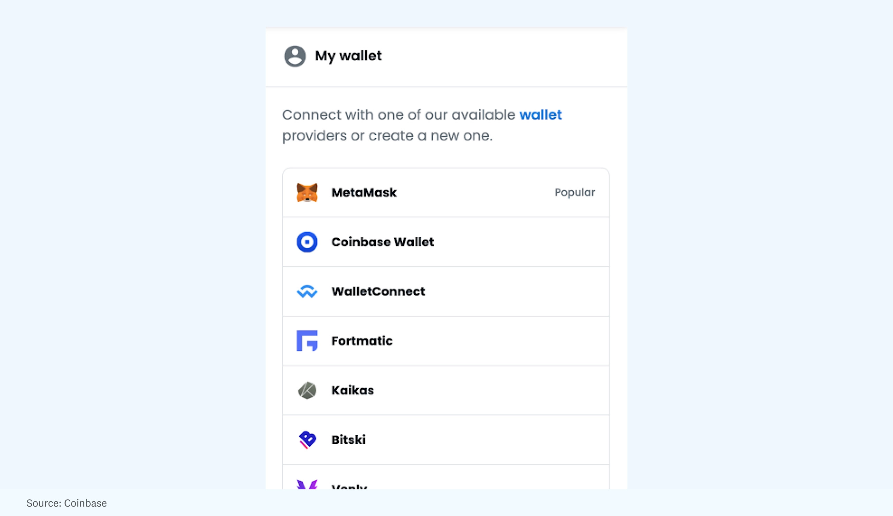
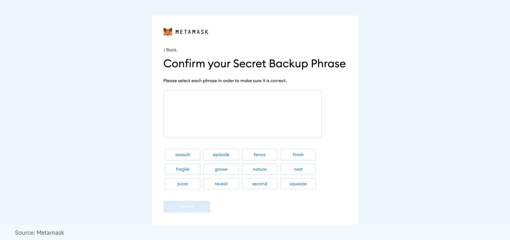
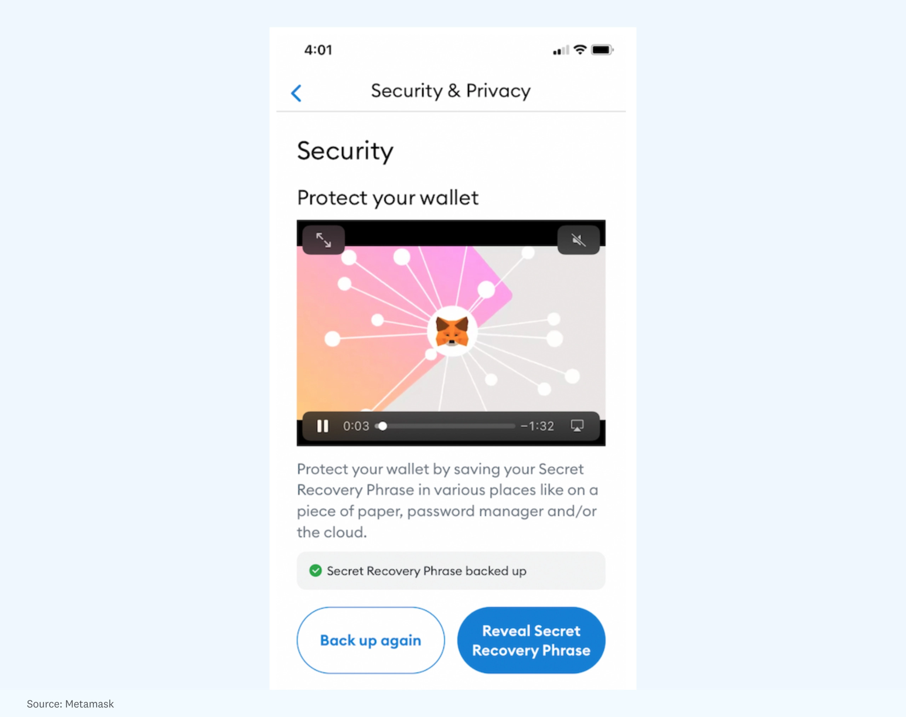
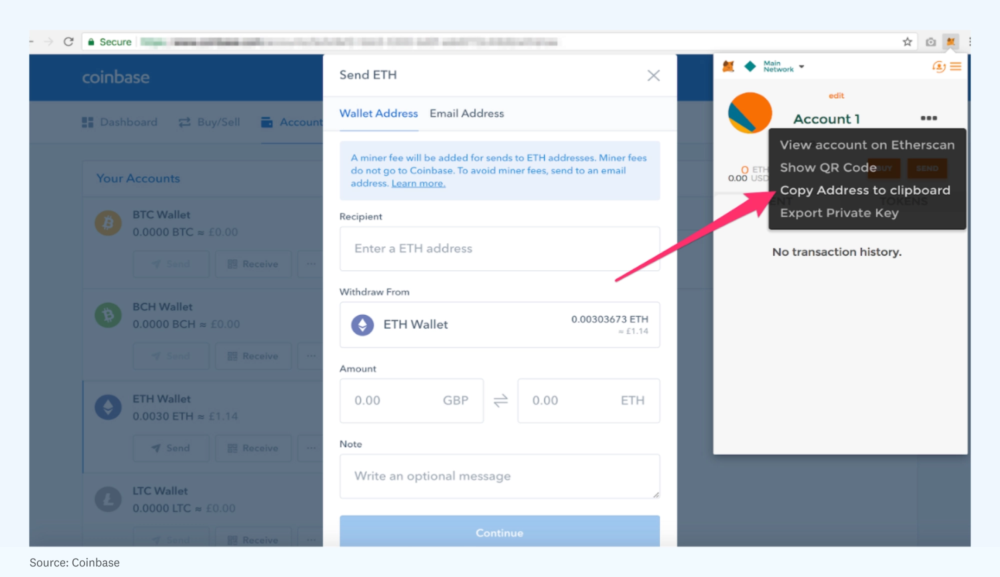
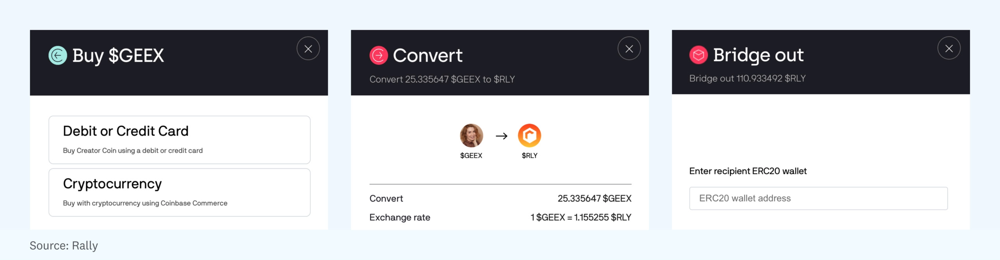

# Web2 和 Web3 之间的缺失环节：托管

**By Mahesh Vellanki**

币圈应用大规模普及的一个主要障碍就是，用户上手使用的历程很复杂，尚未完全成熟。对于刚接触加密通证的人来说，即使是「完全控制自己的数字资产」这件最简单的事情，也不是很容易或直观的。

当然，并不要求用户对其资产拥有完全的控制权来投资加密通证。像 Coinbase 这样的中心化交易所已经证明了「托管」模式在加密通证交易中的功效。在这种模式下，人们将他们的资产存放在托管人那里，由托管人对其进行保护和跟踪。这种模式的关键优势是方便。任何人都可以比较容易地使用 Coinbase 应用或其他交易所购买加密通证，而不必记下「助记词」（即构成控制资产访问的「私钥」的一串文字）。通过这种方式，用户可以购买和出售各种加密通证，用它们换取其他加密通证，使用资产进行购买和支付，并很快能够购买 NFT。

然而，进一步进入更广泛的 Web3 生态系统，即完全去中心化、可互操作的应用和网络 —— 不仅仅是交易所，还有玩赚游戏、通证化的社交网络、粉丝参与的社区和其他丰富的用户体验 —— 这些用户体验很大程度上无法通过托管方式获得。这种 **Web3** 体验需要将他们的加密资产发送到一个非托管钱包，在这个钱包里，除了用户，没有人持有私钥，而且对可以进行的交易类型没有任何限制。

的确，这是币圈最令人兴奋的部分，但也是我们看到许多首次使用的用户望之却步的地方。Web3 产品不能指望用户立即从熟悉的中心化体验一步到位地跳入去中心化的大潮之中。大众市场加密体验的未来在于提供熟悉的托管体验的应用，并有能力升级到非托管体验。

本文将概述一些方法，开发者可以考虑用户历程，在利用一些熟悉的 Web2 结构将用户引入币圈，并帮助这些用户了解 Web3 的潜力，然后再将资产的钥匙交给他们 —— 最终导致他们的产品被更多人采用。

## 帮助用户完成旅程的框架

通证和 NFT 对许多人来说已经很陌生了，一般人愿意去探索新体验的历程有多远，在理论上是有限制的。在一个纯粹的非托管环境中，大多数人看了一眼屏幕上提示他们写下 24 个词的「助记词」（随机生成的短语，以构成他们的「私钥」或密码），就会决定这不值得。

如果目标是让第一次接触币圈的人快速上手使用，那么体验必须是托管性的 —— 至少在开始时是这样。

这张图显示了更广泛的采用完整的 Web3 体验的途径 —— 以及人们舒适地从托管系统转移到非托管系统所需的简化的用户历程。

下面我们将更详细地介绍每一个步骤，为什么它们很重要，以及它们是如何相互构建，以促进对新兴的 Web3 活动的信心和兴奋。

**第 1 步：通过熟悉的 Web2 结构（例如，用电邮地址登录），让首次使用的用户无缝进入**。今天存在的许多 Web3 应用邀请用户通过连接他们的钱包来登录。

这可能会成为未来许多应用的默认选项 —— 钱包登录是非常方便和安全的。但是，第一次使用加密通证的用户可能会感到困惑，不知所措，甚至怀疑，如果他们不认识他们在看什么。对于许多没有钱包的首次用户来说，传统的登录方式是他们在尝试新应用时唯一愿意使用的选择。

对于越来越多地寻求使用 Web3 技术来创造新形式的粉丝参与的创作者来说，这是用户历程中特别重要的一步。在艺术家职业生涯早期支持他们的粉丝可能会得到创作者访问、认可和津贴等形式的好处 —— 这里的设计空间几乎是无限的，创新和实验的浪潮才刚刚开始。

然而，大多数粉丝并非加密通证原住民，让他们获取硬件钱包和创建安全系统的要求太高了。粉丝应该能够注册，掏出他们的信用卡，购买他们喜欢的创作者通证，并在他们的账户中看到它 —— 它必须是直观的，它必须反映熟悉的 Web2 体验，以便看到用户的整个旅程。没有加密钱包、密钥管理、「汽油」（交易）费、卡住的交易或任何其他陌生的用户体验。

通过这种方式，创作者可以与粉丝建立共享的数字经济，他们可以在互联网上的任何地方带着这些数字经济，但加入的方式不会让粉丝感到畏惧或麻烦。

**第 2 步：提供选项，让用户在简单的、完全托管的体验中开始接触产品。** 对于有经验的币圈用户来说，管理私钥或助记词是日常生活的一部分，但大多数第一次接触加密通证的用户在看到这样的信息时，会立即放弃 —— 「这 12 个词是恢复你的账户的唯一方法。把它们保存在安全和秘密的地方：exhaust turtle silly pretty fog midnight enact throw journey nephew animal reward。把这个写下来。」

与其用这种体验来迎接用户，不如为他们设置一个熟悉的体验，然后在用户历程的更远处为他们提供非托管选项。他们最初的注册流程应该更像是：注册、创建用户名/密码、同意条款、开始购买加密通证。然后一旦他们进入应用并进行交易，他们应该可以选择自主托管并进入更广泛的 Web3 生态系统。

一些项目已经尝试了其他的解决方案，如可嵌入的 iFrames，通过他们的 Google Drive 存储用户的种子短语。这是一个诱人的解决方案 —— 对用户来说超级简单，不需要写下他们的种子短语。但是加密社区很快指出，这创造了危险的用户习惯，没有充分教育用户他们所面临的风险，并使他们的谷歌账户成为黑客的目标。与其采取半途而废的措施，不如让用户保持干净的体验：从他们习惯的托管体验开始，然后帮助他们在准备好时毕业，实现完全的自主托管。

**第 3 步：在产品中和平台外对用户进行教育**。当涉及到安全问题时，这一点尤其重要 —— 大多数用户甚至没有在 Web2 应用和产品中使用当今的最佳实践（如密码管理器、双因子认证方法等）。引入新的体验需要更多的教育。Metamask 在为用户提供他们需要的安全内容方面做得很好。

随着钱包建立更多「首次使用加密通证的用户」的功能，预计将看到钱包将这种教育和内容直接纳入产品。

**第 4 步：创造通往 Web3 钱包的途径**。一旦以前不熟悉加密通证的用户上了手，Web3 产品可以设法让他们沿着自主托管的道路前进。一个无障碍的 Web3 产品必须确保用户能够退出该系统，例如将他们的资产转换为其他形式的通证，或者将他们带出特定的生态系统，进入更广泛的 Web3 世界。

随着用户越来越熟悉，他们应该更容易无缝地参与创作者经济，而不是受制于某个特定平台。例如，Coinbase 使用户能够简单地将他们的资产转移到一个非托管的钱包。这意味着他们可以注册，尝试购买加密通证，然后将他们的资产发送到一个 Web3 钱包，并与整个应用的生态系统互动。

在我共同创办的社交通证社区 Rally，用户可以自由地将创作者通证转换为社区的原生通证 $RLY，然后他们可以将其转移到 ERC-20 以太坊兼容钱包，使他们能够将其转换为任何加密通证或与其他社区互动（虽然创作者社交通证本身现在是完全托管的，但将通证桥接出来的能力即将到来）。

教育非加密原生用户的关键是创造一种体验，让粉丝能够轻松上手，参与到围绕社交通证的高功能产品体验中，但仍然保留交易资产、变现和根据需要提取价值的灵活性。

当然，不同的消费产品需要不同的方法。对于 Rally 来说，我们已经在侧链上进行了建设，所以一开始就采用托管的方式是有意义的。就像我们为 RLY 生态系统设想的渐进式去中心化一样，我们决定对 Rally 来说，最好的方法是先为终端用户提供熟悉的体验，并随着时间的推移逐渐建立扩大主网和自主托管的能力。但其他产品会做出不同的决定；例如，去中心化交易、每日奇幻体育或迎合高消费用户的硬核游戏可能更适合从一开始就采用非托管的体验。这些用户群的复杂性和对去信任的需求增加，保证了他们从一开始就获得非托管的用户历程。

## 托管体验意味着基础设施要求

当然，建立托管资产的应用也有其自身的障碍和挑战，即合规性和安全性。允许用户从托管钱包转移到非托管钱包意味着用户身份认证（KYC）和反洗钱（AML）检查将是不可避免的。此外，通过托管资产，你也承担了在面对一些非常复杂的攻击者时代表你的用户保持这些资产安全的相关风险。

现在，加密公司在很大程度上是靠自己来做这件事。要么自己建立和管理基础设施，要么找到少数值得信赖的合作伙伴之一。这对 Rally 来说不是一个小任务 —— 它是可以做到的，但并不直接或便宜。一个简单的事实是，当涉及到合规性时，真的没有任何规范性的建议，因为有许多因素决定了一个加密项目的合规战略：公司处于什么成长阶段？它在哪些司法管辖区运营？领导层的风险容忍度是什么水平？

两种不同方法如何发挥作用的一个很好的例子是 Coinbase 和 FTX。Coinbase 一直以美国为基地，对托管采取了谨慎的态度，在合规方面进行了大量投资。另一方面，FTX 通过首先在美国以外地区推出并在国际上发展公司来减轻风险。这两种方法都被证明在用户中是成功的。

事实上，我们目前看到新一波加密通证的采用来自新兴市场，这些市场以前被 Web2 公司忽视，他们无法在这些地区的广告模式中盈利。非托管式体验使新兴市场真正容易进入，因为应用不负责合规。另一方面，托管式体验涉及一种深思熟虑的方法，使这些用户能够跨越单一的支付供应商。例如，信用卡在这些地区经常被拒绝，然而往往有「非传统」的渠道，如在 7/11 商店用现金购买加密通证。甚至你如何以及在哪里成立你的公司，都会影响到你能提供什么样的托管体验。

但随着 Facebook、Twitter、Square 和 PayPal 等大型 Web2 社交和金融平台开始进一步推进加密通证，并需要更多的服务，生态系统将迅速发展，寻找可靠和负担得起的合作伙伴将变得更加容易。

## 对 Web3 访问的需求不断增长

我们比许多人意识到的更接近于这种向 Web3 的演变。可以说，在五年内，一半以上的大型 Web2 平台将以某种方式发起拥抱 Web3 的倡议，很可能考虑到上述的许多用户体验原则。

毫无疑问，有一种被压抑的需求，而且只会越来越多。当 Robinhood 宣布它将在 9 月 Messari 的 Mainnet 会议上立即推出其加密钱包时，每个人都期望有很大的反应。毕竟，一个独立的加密通证钱包是该公司最需要的功能之一。这将允许 Robinhood 用户将他们的币从该公司的平台发送到他们希望的任何地址。

但是，即使是最看好加密通证的人也可能没有预料到用户对 Robinhood 的钱包有多大的热情。该公司的联合创始人弗拉德·特内夫（Vlad Tenev）在 CNBC 会议上说，等待名单上的名字远远超过了一百万，而这是针对将在下一季度某个时候推出的一项功能。

对 Robinhood 钱包的巨大兴趣，暗示了加密通证产品组合中的其他情况。毕竟，用户在 Robinhood 应用中已经有了一个光滑、有趣和安全的交易币环境。为什么这么多人渴望有一个钱包，只是为了能把币送出去？很明显，人们想要移动他们的加密通证参与其他加密协议，并以不同方式存储他们的资产。

随着更多的应用努力满足用户的需求，并引导他们进入新的体验，以及加密基础设施对项目变得更加廉价和易于使用，通往下一次互联网迭代的道路将变得越来越清晰。

> **作者简介**
>
> Mahesh Vellanki 是 SuperLayer 的管理合伙人，SuperLayer 是一个加密货币风险工作室，在$RLY 协议上孵化新的通证化消费产品。之前是 Rally 和 Forte 的联合创始人，并曾在 Redpoint Ventures 工作。
