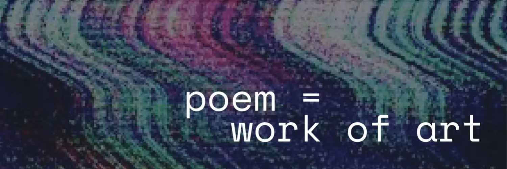
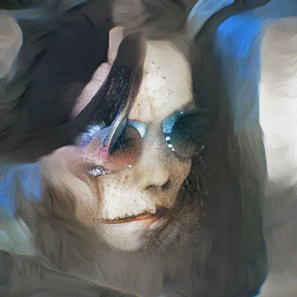
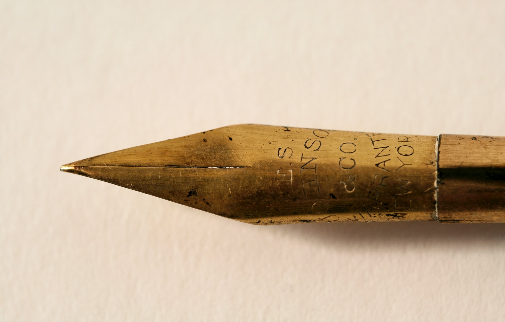

# 诗歌和 NFT：新的赛博文化？| Today's Pick

**By NonFungible**

> NFT 诗歌，像其他 NFT 艺术形式一样，拥有了自己的定义。与高中时经历（或忍受）的抑扬顿挫五音步不同，将现有传统与 21 世纪的加密世界相结合的 NFT 诗歌，更少的僵化。NFT 诗歌宣称其新意的方式，其新鲜感，使其与长期存在的诗歌传统相反相生，看起来有可能成为未来更持久的艺术表达。

## theVERSEverse

这个项目的特点是来自世界各地的诗人在创作 NFT 诗歌的过程中混合和改变体裁。[Ana Maria Caballero](https://anamariacaballero.com/)、[Sasha Stiles](https://www.sashastiles.com/) 和 [Kalen Iwamoto](http://kalen-iwamoto.com/) 发起了 [VERSEverse](https://theverseverse.com/)，以实现三方面的使命：

- 帮助传统诗人上手，将他们的诗歌与加密艺术家的作品配对，创造出沉浸式、多样化的作品
- 扩容、转化和鼓励刚接触加密世界的诗人
- 并凸显已经活跃在加密领域的文本艺术家

如果这还不够，theVERSEverse 通过生成性人工智能扩展和丰富他们的合作。他们的 GenText 系列展示了人工智能如何通过融合 —— 甚至是爆炸 —— 社会的、诗歌的和技术代码来催化新的可能性。

**项目官网：theverseverse.com**

## 来自 Pak 的 LOST POETS

由著名的 NFT 艺术家 Pak 提供的 [LOST POETS](https://lostpoets.xyz/) 项目起初可能像任何现代主义诗歌一样难以捉摸。经过进一步调研，Pak 的项目包含了自己的神话故事，而且是一个游戏。这个神话是通过有些隐晦的语言和逐渐推出的买家功能来实现的。

就像好几百年前的吟诵荷马史诗的荷马史诗一样，准确的讲述是实时的：虽然我们在讲述时对故事可能的走向有一些想法，但诗人和观众都在诗歌结束的那一刻后决定最终的意义。

购买了 LOST POETS NFT 诗歌的观众通过直接参与这些意义创造的分享，无需出版商、商店或外部代理等这些中介。

**项目官网：lostpoets.xyz**

## NFT Seed Poetry

经营 [The NFT Poetry Gallary](https://www.thenftpoetrygallery.com/seed-poem-collection.html)的凯瑟琳·多兹尔·莫什曼（Katherine Dozier Moshman）开始了一系列的 NFT 种子诗歌。如果「种子」这个词在记忆中引起了一些变化，请想想解锁你的加密钱包的助记词（Seed Phrase）。这位作家兼艺术家与买家合作，制作了以她的摄影作品为特色的定制诗作。

请注意，在 NFT 媒介中，多种类型的作品是如何和谐地结合在一起的：[诗歌发现](https://en.wikipedia.org/wiki/Found_poetry)的概念（与摄影融合在一起，后两个领域通过艺术家与观众的对话纠结在一起。这是 NFT 诗歌的巨大优势之一：它倾向于在一个更积极的关系中拉近诗人和观众的距离。

读者可能会通过在传统商店买书来被动地参与诗歌，而 NFT 诗歌的买家则可以通过与创作者的直接对话来提升他们的参与度并使其个性化。NFT 诗歌解放、连接和平等化了诗人与听众的关系。

**项目官网：https://www.thenftpoetrygallery.com**

## NFT Trash Art Poetry

NFT 诗歌也有轻松的一面。[垃圾艺术](https://medium.com/secondrealm/a-short-history-of-nft-trash-art-6656a88a31e9)场景中的 NFT 诗人嘲弄广泛的社会趋势和事件，包括 NFT 媒介本身和诗歌。这种多流派的创作方法与 LOSTPOETS 和莫什曼的作品相似，只是这些艺术家在打完啤酒杯后的休息时间嘲笑自己，嘲笑他们的押韵，以及对 Shel Silverstein [诗歌的讽刺](https://opensea.io/assets/0x3edf71a31b80ff6a45fdb0858ec54de98df047aa/827)。

颜色以怪异、颠簸的霓虹色跳出来，与古怪的字体搭配，会引起老板的注意。依偎在泥潭中的诗歌与 COVID 一样，踢开[倒垃圾](https://opensea.io/assets/0x495f947276749ce646f68ac8c248420045cb7b5e/76468748140376501513560028030912420415833020471315557894896021208386007728129?)这样的例行公事。诗歌是一种强烈的个人流派，问不同的人，他们中的许多人都会对它表达强烈的感受或反对。

NFT 重新引入的是早期诗歌的活力：读者和诗人可以在同一个社区、公共空间，甚至是个人空间。**在一起和一起创作，仍然是我们共同的人性的一部分。NFT 诗歌让这一点更贴近我们自己。**
