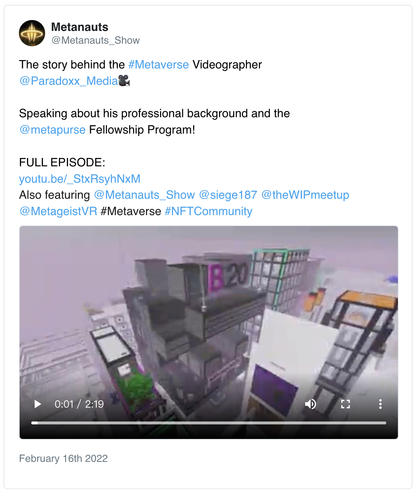

# 8 个值得关注的 NFT 工作

> 除了铸造或交易 NFT 之外，Bankless 的 METAVERSAL 博主 William M. Peaster 列举了 8 种 NFT 为中心的专业工作机会，值得关注。

在 Web3 和元宇宙交汇的十字路口，正绽放着各个方向的文化和经济活动，这导致了对一系列全新的 NFT 职业的需求不断增长。

## 1. 加密艺术推广者

艺术家喜欢艺术创作，但当涉及到商业和宣传事务时，许多人感到迷茫，这是完全可以理解的。在过去的两年里，我看到越来越多的加密艺术家探索将这项工作委托给有商业才干的专家，就像音乐推广人如何为音乐家推广一样。我认为，随着加密艺术家变得更加流行，这一情景进一步饱和，我们将看到更多的加密艺术推广人提供他们的服务。

## 2. DAO 设计师

NFT 项目经常围绕着社区进行。而 DAO（去中心化自治组织）可以帮助社区以去中心化的方式有效协调。因此，我期望在未来看到更多与 NFT 相关的 DAO。然而，对于不精通 DAO 的 NFT 人士 来说，建立一个健全的 DAO 可能是令人生畏和困难的，所以我认为 DAO 设计顾问在未来几年会越来越受欢迎。

## 3. 元宇宙建筑师

基于 NFT 的虚拟世界项目的数量正在快速增长。这将导致对像 Devil.eth 这样的虚拟建筑师的需求不断增加，他们因在基于以太坊的元宇宙 Cryptovoxels 上进行复杂的受托建造而闻名。

## 4. 元宇宙摄像师

说到以太坊元宇宙，在这里我们很快就会开始看到更多的现场活动、体育、广告、纪录片，你可以尽情想象。在这种情况下，会有更多的人想要记录和记载元宇宙发生的事情，所以预计会看到更多如 Paradoxx.eth 这样的元宇宙摄像师诞生。

## 5. 通证经济学家

NFT 项目将越来越多地依靠通证经济专家来有效设计新的通证。还记得领先的 NFT 游戏 Axie Infinity 是如何聘请 Delphi Digital 的咨询部门来设计 AXS 通证吗？预计大大小小的项目都会在未来寻找类似的帮助。

## 6. 空投专家

有了今天的工具和教程，准备和启动一个简单的 NFT 项目空投活动是一个相当简单的过程。然而，更难的是设计一个能够平衡收集者的需求，同时避免某些常见陷阱的 NFT 空投活动。因此，NFT 空投专家有继续存在的必要。

## 7. NFT 评估师

对没有地板价的 NFT 进行适当的评估是一项复杂的任务。虽然到目前为止我已经看到了一些 NFT 评估项目，但我的印象是这个行业仍然处于早期阶段。我认为，专业评估师和专业评估机构将有很大的发展空间，因此 NFT 的评估和分析能力将被证明越来越有用。

## 8. NFT 作家

我已经看到了 NFT 生态中对专业作家的难以置信的需求，但最近的需求远远超过了目前 Web3 人才库供给。因此，如果你了解 NFT 的方式，并且能够胜任地写一篇文章，就会意识到许多地方现在很想聘用你。与此相关的是，今年晚些时候，我正在考虑开设一个公共聊天室，有抱负的 Web3 作家可以提出问题并获得指导，没有任何附加条件。敬请关注。
