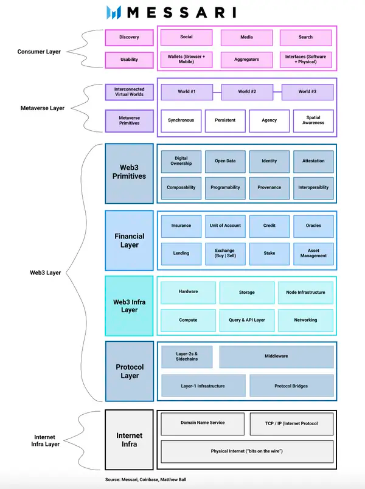
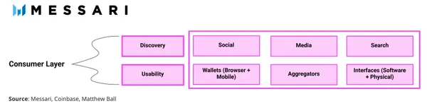
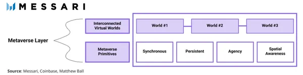
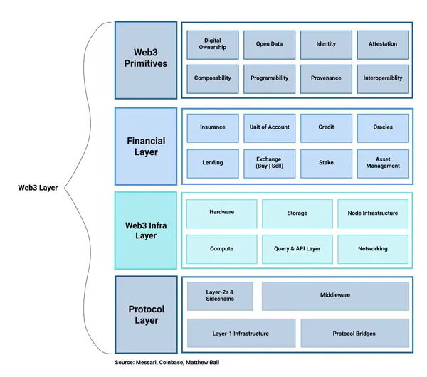
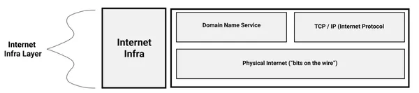
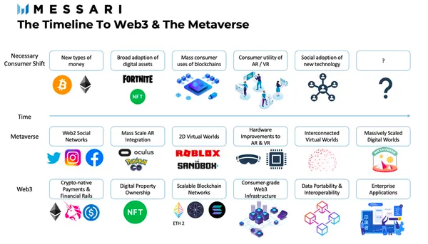

# Web3 在元宇宙中的角色

**By Mason Nystrom**

> 有朋友说，最近感觉元宇宙热度在下降。是的，狂热炒作的泡沫在破灭；然而，未来让人们在数字世界独立自由工作生活学习娱乐的元宇宙，其探索和建设才刚刚开始。
> 
> 今天，元宇宙特攻队翻译一份Mesarri Pro报告，看看作者Mason Nystrom如何用简洁的层级堆栈图介绍Web3 在元宇宙中的角色和作用。

「没有人知道它意味着什么，但它是如此刺激，让人人都兴奋起来。」

## 定义元宇宙

元宇宙仍然是一个没有定型、没有明确定义的术语，尽管这并没有阻止知名人士或机构尽力去这么做。

我汇集了处于这一领域前沿的公司和个人给出的各种最佳定义：

- Meta（原 Facebook）：一个我们将用 3D 方式**玩耍和联系**的地方。
- Coinbase：互联网的未来，一个**大规模、持久**、互动、**可互操作**的实时平台，由**相互连接的虚拟世界**组成，人们可以在这里进行社交、工作、交易、游戏和创造。
- Bitkraft Ventures 的 Pier Kicks：一个持久的、实时的数字化宇宙，赋予个人一种代理感、社交存在感和**共享的空间意识**，以及参与广泛的**虚拟经济**的能力，具有深远的社会影响。
- Epyllion Ventures 的 Matthew Ball：元宇宙是一个大规模、可互操作、实时渲染的 3D 虚拟世界网络，它可以有效地被无限数量的用户**同步**和**持久**地体验，具有个人的存在感，并具有**数据的连续性**，如身份、历史、权利、对象、通信和支付。

就像互联网的早期一样，定义在很大程度上是不重要的，但总体主题仍然是有意义的。从这些定义中，我们可以从「大规模的数字世界」和「虚拟经济（交易和游戏）」等短语以及「同步」、「互联」和「互操作/数据可移植性」等术语中编织出一条共同的线索。在互联网的早期应用中，它同样被归类为「实时信息」、「信息网络」和「公共访问」等短语。互联网最终表现出来的东西比早期的定义要多得多，但其基本属性仍然是真实的。同样，对于元宇宙来说，它的核心价值将是由可组合的数据、丰富的同步（共享）体验和个人在线生活更大的数字代理所促成的应用。我们应该把这些属性作为「元宇宙」的指路明灯，而不是一个肯定会在未来几年内变化的定义。

## Web3 在元宇宙技术堆栈中的作用

我们可以从最终消费者的角度想象元宇宙和 Web3 的潜在互联的基础设施。

### 消费者层

用户会在不同的层面与应用进行互动 —— 通常是在应用层面或通过聚合器和接口进行互动。由于这个图表是从消费者的角度堆积起来的，所以应该有用户如何与元宇宙应用互动的主导性服务：可发现性和可用性。可发现性层将帮助消费者找到元宇宙，而可用性层 —— 移动应用、钱包和界面 —— 将与这些虚拟世界互动的复杂性抽象化，以获得更方便的体验。显然，一些聚合器或界面有可能提供这两种功能。

### 元宇宙层

虽然元宇宙的表现形式还没有定论，但把元宇宙看成是一个应用层可能是最简单的。元宇宙层是用户找到虚拟世界的地方，无论是二维世界、虚拟世界（3D），还是在现实世界中的增强现实。

这些世界的存在是基于我们在早期定义中所确定的元宇宙基本要素。例如，元宇宙应该是同步的 —— 或在同一时间发生。但现在，即使是最受关注的虚拟体验，如「堡垒之夜」音乐会 —— 吸引了数以百万计的观众 —— 也不是统一的体验。相反，虚拟音乐会被分割成成千上万的体验空间，每次体验（音乐会）最多有 50-100 个玩家。此外，在 Web3 层赋能的数字所有权将在元宇宙层中体验（例如，用户使用界面或市场购买一个化身，并在虚拟世界中装备这个化身）。

随着时间的推移，消费者层和元宇宙层有可能部分合并，但在这期间，个人在跳入元宇宙之前，可能仍然会使用类似的界面或用户门户。

### Web3 层

为了直观地了解 Web3 层与元宇宙的关系，最简单的做法是将其分成四个子层：

- Web3 基元：表示为协议或标准的属性，对于元宇宙的金融经济和互联互通是必不可少的。例如，NFT 实现了数字所有权，为用户在虚拟世界中提供了某种形式的金融代理或权力。
- 金融层：元宇宙金融基础设施「DeFi 层」是在 Solana 和以太坊等区块链网络基础上构建，用于交易元宇宙商品。这一层是目前 Web3 中最强大的，我们可能会看到虚拟世界建立起自己的垂直整合市场，然后再将其聚合到一些应用中。
- Web3 基础设施层：核心基础设施协议和区块链，负责构建元宇宙的去中心化后端，包括计算、存储、查询、网络等。
- 协议层：基础区块链层，包括协议桥、第二层以及中间件的核心部分。

### 互联网基础设施层

核心互联网基础设施多年来基本保持不变。虽然其中一些可能会发生变化 —— 硬件的改进，加密技术与域名服务系（DNS）的整合（如 ENS）等等 - 大部分现有的基础设施将保持相似一致性。

## 我们如今身处何处？

在实现元宇宙和 Web3 之前，仍有大量的改进空间。在技术方面，区块链网络仍然需要更大的扩展性来实现大规模的消费者应用，而元宇宙还缺少对 AR 和 VR 硬件的关键改进，以使这些虚拟世界更加方便和愉快。

过去十年，随着数字商品 —— 数字货币（即比特币、以太坊、稳定币）、资产（如 NFT）等 —— 的价值无处不在，消费者行为发生了有意义的转变。最突出的例子之一是「堡垒之夜」等游戏中的头像皮肤、数字服装，现在代表了一个数十亿美元的产业。

## 最后的思考

我相信 Web3 将是元宇宙的基础后台基础设施。实物产权是民族国家发展的基础要素，而区块链网络上的数字产权是虚拟世界的基础要素，在虚拟世界中，用户对其资产拥有控制权和代理权。同样地，一个数据可迁移的元宇宙将需要区块链网络，因为这些属性 —— 可组合性、互操作性、数字所有权等 —— 肯定不会被今天存在的中心化数据垄断所灌注。
