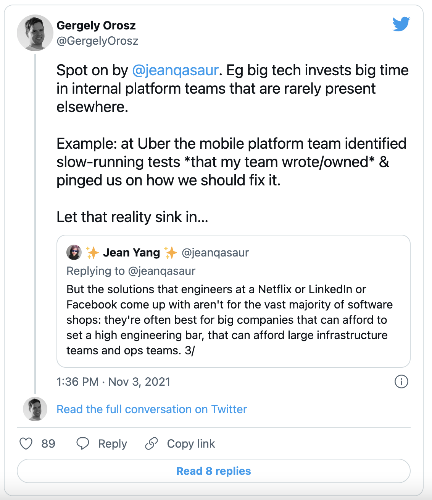
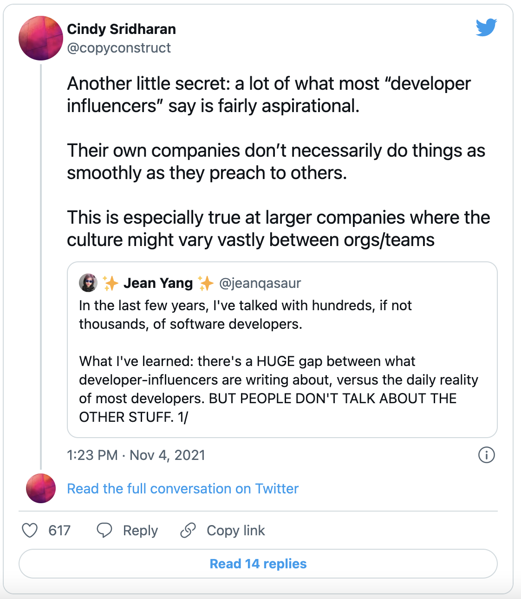
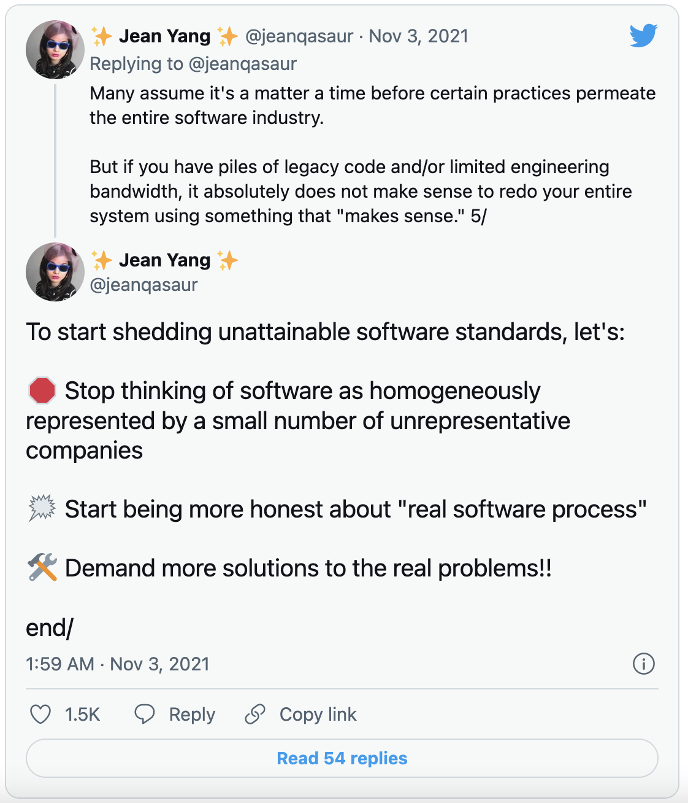

# 为 99% 的开发者构建

**By Jean Yang**

> Web3 的火爆，已经让越来越多用户意识到在未来建成的元宇宙里拥有独立自主的身份数据和资产是多么的重要。而眼下 Web3 产品的匮乏，确实招致推特创始人 Jack Dorsey 关于 Web3 被 A16Z 等风投公司所垄断的讥讽 ，但为广大传统互联网开发者摆脱 Web 2.0 的内卷指出了明路。
>
>不过，开发者在拥抱新世界的时候，必须意识到，无论是传统互联网还是 Web3 的技术产品开发，一样会面临本文指出的关于软件开发的神话和现实。
>
> 
>
> 且看本文作者、Akita 软件的创始人和 CEO、前卡内基梅隆大学计算机科学教授 Jean Yang 提供什么样的洞察和建议。

你应该转向无服务器吗？GraphQL 是解决你的 API 困境的答案吗？你是否应该遵循最新的开发运维手册来提高你的系统可靠性？在技术工具的世界里，有很多的噪音。但它并不总是反映程序员的日常现实。

作为一个开发者工具创业公司的创始人，在过去几年里，在例行的用户研究过程中，我与成百上千、甚至成千上万的软件开发者交谈过。这些谈话的共同主题，甚至比我们正在构建的产品的需求还要大，是一个目前没有得到充分满足的总体需求：为*真正的开发者*，或者我喜欢称之为 **99%的开发者**构建。

这些是在时髦的公司和框架之外完成工作的开发者，他们在关于「开发者想要什么」的对话中经常被忽视。在「网红开发者」所谈论的内容和大多数开发者的日常现实之间存在着*巨大*的差距。当你看到科技媒体报道的内容，或者顶级科技会议的演讲者，往往是来自 Airbnb 或 Stripe 这样高增长的宠儿，或者像 FAANG（Facebook、苹果、亚马逊、Netflix 和谷歌等科技巨头的缩写合称）这样成熟的高利润公司的人。

事实上，有一个长期的假设，即除了少数硅谷的独角兽公司之外，其他公司应该渴望拥有「小小 FAANG」的流程。但这越来越不真实。我们的用户会告诉我们，他们的做法与他们「应该」的样子完全不同。但对于这些[如微软的 Scott Hanselman 所称呼](https://www.hanselman.com/blog/dark-matter-developers-the-unseen-99)的「暗物质开发者」，Facebook 或 Pinterest 的做法是没有意义的。他们的用户需求不同，他们的团队需求也不同。

谈论 99% 的开发者很重要，因为这些开发者正在开发为我们的生活提供动力的软件 —— 保险、医疗保健、零售和银行，仅举几例。不仅仅是小公司不能轻易采用现代的、技术领先的公司的流程；大多数公司都不是围绕着技术建立的，它们有几十年的传统软件实践。许多这些公司都有相当多的资金流动。许多公司处理相当多的个人数据。如果技术创新不能让这些软件团队受益，我们就会失去对每个人生活质量的许多有意义的改善。

在这篇文章中，我将介绍一些企业软件购买者和开发者都可以接受的真理，以消除不利的误解，并提升所有人的开发体验。

## 「涓涓细流」的工具化是一种理想状态

### 神话

由于大量的编程和工具来自 Facebook、Netflix、LinkedIn、谷歌和亚马逊等公司，许多人认为有一种涓滴效应。那些有钱的公司的优秀工程师会想出很好的办法来解决其他人总有一天会遇到的问题。这只是一个时间问题，直到你的典型中小企业或财富 500 强公司遇到与亚马逊或 Facebook 一样的问题。

### 现实

类似 FAANG 的公司与中小企业或典型的财富 500 强公司在很多方面都不同，包括规模需求、对自建或购买的立场以及工程团队的构成。少数资本雄厚的大公司拥有整个团队，由世界上的专家专门负责可观察、测试、开发者生产力等等。除此之外，值得注意的是，FAANG 正在围绕一小部分产品进行优化，这些产品从一开始就是数字化的，这一点对于大多数软件开发商来说是不真实的。

许多非 FAANG 团队有一个小小的非专家团队，甚至是一小部分工程师并非专家，来做类似 FAANG 的公司有多个专家团队来做的事情。这些组织主要依靠外部工具和服务，而他们没有什么资源来进行定制。

### 该如何应对

首先，科技行业需要承认，在不同规模和不同工程预算下运营的组织有不同的需求。一个每天提供低至数百万用户请求的公司不需要像 Netflix 或谷歌那样优化其系统。大多数公司都没有延迟、数据存储和其他方面的问题，这导致他们编写自己的定制基础设施组件和工具，例如，Facebook 在其 [Tao 数据存储](https://engineering.fb.com/2013/06/25/core-data/tao-the-power-of-the-graph/)和[蜂巢数据仓库工具](https://engineering.fb.com/2014/04/10/core-data/scaling-the-facebook-data-warehouse-to-300-pb/)方面所做的工作 —— 而且他们很可能没有必要使用这种工具。

承认不同的需求将为讨论更为广泛的组织的不同需求提供空间。例如，拥有遗留系统的公司没有能力迁移到最新的架构上，他们采用新工具的方式与新成立的公司不同，或者是那些能够拿出一个专门的团队进行大规模迁移的公司。

认识到没有一个理想的公司形象，可以帮助开发者在了解用户时跳出通常的假想。这对于以一种可实现的方式弥合软件需求和软件工具之间的差距至关重要。

## 没有黄金标准的开发环境

### 神话

如果你看了足够多的会议讲座或读了足够多的博客文章，就会发现有许多软件团队拥有纯洁的编码标准、无漏洞的单元测试、反映生产环境的暂存环境和/或应对事件的顺利的人员流程。要达到这一点，只需要一个强有力的指示和工程团队的纪律。

### 现实

就像任何其他领域的网红一样，网红开发者经常描述一种现实，甚至对他们自己的公司来说也是一种渴望。也许真的是这样，编写理想过程的人生活在一个理想化的环境中，这是有可能的，在这种情况下，他们是提供规则的例外。但大多数时候 —— 即使在一个组织的某个部分或某个时刻是真实的 —— 这种现实也不会在他们整个公司中永远存在。

例如，Spotify 承认，一旦他们的团队达到一定的规模，[他们对开发运维的雄心勃勃的方法就无法扩展](https://www.jeremiahlee.com/posts/failed-squad-goals/)。我们也看到一些例子，公司采用了新的热门技术，然后在事情没有按计划顺利进行的时候，又恢复了原状 —— 例如，[Segment 从微服务转回到单体架构](https://www.infoq.com/news/2020/04/microservices-back-again/)。

### 该如何应对

作为推动这一切的受众，开发者应该更加挑剔地要求获得真相。我们应该欢迎关于「真实的软件开发过程」的文章，就像我们对理想化内容的渴望一样。如果有人在一个理想化的过程中工作，有一个世界级的运营团队和整个团队，他们的存在是为了支持提高软件质量，那么应该让听众了解这一点！我们应该欢迎更多关于「真实的软件环境」的讲座、博文和书籍来提供指导：在人手不足的团队、没有专门的开发运维专家的团队、以及最初构建系统的人都已经离开的团队中，编码、测试和交付是什么样子的。

## 目标是进步，而不是完美

### 神话

太多的人认为，追求良好的软件质量意味着你需要完全采用那种新技术，无论是微服务、GraphQL，还是分布式跟踪。直到完全转换到理想的技术，你才算完成工作。

### 现实

今天，「真正的开发者」团队所处的位置和所给出的主流建议之间的不匹配，意味着许多团队在提高代码质量或系统可靠性时不知道从哪里开始。对于 99% 的开发者来说，他们的大部分代码永远不需要扩展到成千上万的组织，或者是数十亿的用户。这些开发者中的许多人所工作的代码库比他们整个职业生涯时间还要年长。这些组织大多数在内部没有专门的开发者工具或开发者生产力团队。

纯净的代码不是目标 —— 相反，目标是在其他限制条件下，代码的可靠性和安全性更有意义。例如，如果你的公司不在多个云上运行，每天部署数百个变化，那么像 Netflix 的 Spinnaker 这样的持续交付系统可能是不必要的。同样，在一个拥有开发运维专家的公司，如果他们知道如何设置和维护可观察性的「强力工具」，其开发者可能会比没有专家团队的公司在使用这些工具时要好得多。

### 该如何应对

认识到要取得进展 —— 从那些将整个团队投入到完善其流程的公司中可以学到一些经验，但在大多数情况下，完美是不现实的。与其全盘提升流程，不如看看哪些流程能很好地转化为资源较少的团队和具有不同目标的团队。

例如，[谷歌的这篇博客文章](https://testing.googleblog.com/2020/08/code-coverage-best-practices.html)提供了这样的准则：60% 的测试覆盖率为「可接受」，75% 为「值得赞扬」，90% 为「模范」。当你是一个像谷歌这样成熟的公司，拥有谷歌工程团队的规模和水平，这可能是有意义的。但是对于大多数较小的、处于早期阶段的公司来说，尽管公司的目标是什么，但实际的测试覆盖率会少很多。随着面向服务的架构和外部 API 的兴起 —— 这些做法在谷歌之外更为普遍 —— [在生产环境中的测试](https://increment.com/testing/i-test-in-production/)正在成为传统的单元和集成测试技术的一个可行替代方案，此时「代码覆盖」作为一个概念是有意义的。

在许多这样的现代系统中，[正如 Honeycomb 联合创始人 Charity Majors 写道](https://increment.com/testing/i-test-in-production/)：「一旦你部署，你就不再是在测试代码，而是在测试系统 —— 由用户、代码、环境、基础设施和一个时间点组成的复杂系统。」

## 一个好的产品演示不会显示出第 2 天的卡顿现象

### 神话

我们很容易陷入这样一个陷阱，即认为产品演示和上手培训能够反映出每天使用产品的体验。人们必须相对快速地对新产品做出购买决定，所以我们默认通过演示来判断一个产品。

### 现实

开发者的工具帝国是通过华丽的 GIF 动图和视频片段建立的。团队在看了几分钟的演示后，就对工具做出承诺 —— 有时甚至是几年。投资者根据演示进行投资。开发者被告知要专注于演示 —— 以及之后使用的前 60 秒 —— 作为产品的决定性部分。但是，虽然能够很好地进行演示*可能*表明团队*能够*在日常使用中执行开发者的经验，但这两者并不一定相关。

对于大多数值得他们标价的工具来说，开发者所经历的大部分事情 —— 以及围绕着这些事情的痛苦 —— 都发生在使用的第一分钟之外，这不应该是个意外。首先，与开发者的日常工作流程（例如，现有的代码审查、CI/CD 工作流程和协作模式）的整合是衡量一个产品是否具有粘性的更好指标，而不是最初的喜悦。例如，在开发者工具的创造者中，众所周知，与 GitHub 和 GitLab 的整合将有助于让你的工具更加有用和吸引人。

第二，有整类的工具，对其有效性的真正测试并不发生在第一天。一个例子是调试器。比起你的开发环境，比起你的 CI/CD 环境，你的调试工具箱是保证你作为一个开发者的生活质量的最关键因素。当你在部署前修复一个问题时，你是否有信心这个问题不会出现在生产环境中？当你因为生产事故而不得不加班或休息日工作时，你是否能够迅速找出根本原因并提出潜在的修复方法？由于这些工具的复杂性 —— 而且它们往往在你遇到重大问题时才显示出它们的真面目 —— 调试工具往往在良好的开发者体验方面得到最少的宣传和回报。

### 该如何应对

工具建造者经常极其关注第一天的体验，是因为用户如何评价工具。所以我在这里要特别呼吁一下用户。用户需要：

- 不要仅仅根据演示或第一天的体验来夸大工具；
- 在你或你的开发团队花了一段时间日复一日地使用该工具之前，先不要承诺大金额合同来购买那些的工具；
- 根据对你的团队生产力至关重要的不太「性感」的维度向其他人推荐工具，例如它们如何与工作流程整合，或者它们如何减少团队内部和跨团队的协作摩擦。

做好这些事情将为更好的开发者体验创造更大的空间。

## 异质性将继续存在

### 神话

经常有这样的假设：热门的新语言或框架就是某人系统中的全部。开发者和网红开发者都会对新的工具进行宣传，好像这些工具是*唯一*被使用的工具：例如，微服务架构、GraphQL 和基于 OpenTelemetry 的可观察性追踪。「一个真正的框架」的宣扬隐含着这样的假设：企业有可能完全转而使用这种新的语言、工具或框架。

### 现实

我遇到过很多团队，他们说迁移将在「下一季度」发生。现实情况是，即使他们设法最终开始，迁移还是成为连续的，而不是离散的过程。一个拥有原有代码的 99% 的开发者团队和一个精干的团队可能永远不会将他们的整个代码库转换为微服务或 GraphQL。对于大多数组织来说，技术栈和工具链是异质的，是多[年来获得的各层语言、框架和工具的组合](https://future.a16z.com/the-case-for-developer-experience/)。

我们遇到的许多团队会告诉我们，他们正在开始采用微服务或 GraphQL 或 OpenTelemetry。当我问他们有多少服务已经在新的框架内时，答案往往是相当小的比例，特别是对于超过几年的组织。其中一些组织会告诉我，他们实际上并不期望转换他们的整个代码库（例如，组织将期望保持其传统的单体与微服务架构在一起，或 REST 和 gRPC 端点与 GraphQL 端点一起)。对于其他许多组织来说，当我在几个季度后检查时，他们往往在计划的迁移中没有达到预期的程度 —— 并且在现实中维持着跨框架和工具的软件。

### 该如何应对

软件买家，从个人开发者到主管和 CIO，都知道异质性的存在。但完全接受这一点意味着：

- **接受缓慢的迁移。** 我遇到过很多团队，他们认为一旦完成了从过时的工具 X 到热门的新工具 Y 的迁移，他们的问题就会得到解决，每一个工具都生活在自己的解决方案生态系统中。不幸的是，对工具 X 的迁移可能直到热门的新工具 Z 才完成 —— 而现在你又有了两个生态系统的问题。
- **接受遗留的子系统。** 我遇到过很多团队，他们专注于围绕系统的较新部分进行工具箱的创新。不幸的是，遗留的子系统并没有消失 —— 它们的工具较少的情况意味着当出错时，你需要更长的分流和调试时间。

接受你的 API 不太可能汇聚到 GraphQL 上的事实，将让你投资于更可持续的、多 API 协议的工具。认识到你的组织可能不会将其所有的传统单体架构转换为微服务，将使你能够投资于那些不忽视对单体或微服务中的代码监控和调试的工具。

在开发者方面，传统的智慧是，你为「土地」努力追求同质性，为「扩展」拥抱异质性。你是否对异质性进行规划将极大地影响你的扩张速度。某些类型的开发者工具需要为每种新的语言或框架定制。例如，一个只为 GraphQL API 提供洞察的工具可能不容易扩展到其他类型的 API，特别是因为 GraphQL 包含比 REST 或 gRPC 更丰富的信息。

其他类型的开发者工具可以轻松地跨语言和框架进行扩展。一个只需要能够从不同的编程语言中调用的 SaaS 工具支持语言的异质性，因为主要的核心组件不需要被翻译来支持每一种新的语言。

