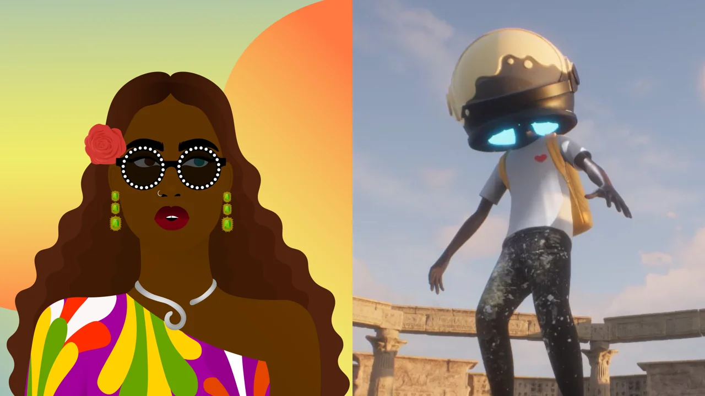

# 即将投拍电影的知名 NFT 项目

**By Andrew Hayward**

我们已经看到了由 NFT 资助的电影，而且至少有几部关于 NFT 热潮的纪录片正在制作中 —— 但是基于 NFT 项目的电影呢？

他们正在到来。在去年疯狂的 NFT 市场热潮中，这些代表数字所有权、炙手可热的通证产生了 250 亿美元的交易量，我们看到那些成功的 NFT 项目签署了将其角色和故事搬上大屏幕的协议。而且新闻通告不断出现。

以下是已宣布进军电影的主要 NFT 项目，以及那些已签署代理权以探索潜在影视版权交易的项目。

## World of Women（女性的世界）

女演员瑞茜·威瑟斯彭（Reese Witherspoon）已经大举进入 NFT，现在她的目标是将这个以女性为主导、以女性为中心的项目变成一个娱乐巨头。上个月，威瑟斯彭的 Hello Sunshine 工作室宣布计划根据 Yam Karkai 的 World of Women（女性的世界） NFT 项目创作影视剧。

今年 1 月，World of Women 与资深的音乐行业高管盖伊·奥塞里（Guy Oseary）签约，由后者代表它开展此类媒体和产品交易。威瑟斯彭说，World of Women NFT 持有者将在基于头像项目的创作中拥有发言权。

## Aku

艺术家米卡·约翰逊（Micah Johnson）的 Aku —— 一个梦想成为宇航员的黑人男孩 —— 是 2021 年 4 月第一个被选为电影和电视项目的原创 NFT 角色，就在第一个 Aku NFT 发布的两个月后。它被 Anonymous Content 和 Permanent Content 选中，后者是由音乐家肖恩·门德斯（Shawn Mendes）和经理安德鲁·格特勒（Andrew Gertler）组建的公司。

从那时起，Aku 的明星在随后的空投中大幅增长，以及去年 12 月在巴塞尔迈阿密艺术博览会上举行的奢华的 Aku 世界体验秀。前 MLB 球员约翰逊去年 8 月表示，当 Aku NFT 扩展到电影和其他领域时，Aku NFT 持有者可以影响该 IP 的发展方向。

「还有什么比让粉丝直接参与到该 IP 的成长和扩张中更有力量的呢？」约翰逊说。

## Huxley（赫胥黎）

赫胥黎是这个名单上的最新一员。就在上周，资深的漫威电影制片人阿里·阿拉德（Ari Arad「钢铁侠」）和他的阿拉德制作工作室宣布计划共同制作艺术家本·茂罗（Ben Mauro）的以太坊 NFT 漫画项目的电影改编。阿拉德将与 Web3 制作工作室 Feature 以及奥斯卡提名的视觉特效主管杰罗米·陈（Jerome Chen）一起开发。

茂罗在进入 NFT 世界之前，作为概念艺术家为「极乐世界」和「霍比特人」等电影以及「使命召唤」和「光环」游戏工作了多年。他的项目现在已经产生了价值数百万美元的交易量。Huxley（赫胥黎）的末世科幻气息可以很好地转化为大屏幕作品，正如这部电影的 CG 动画概念预告片所显示的那样。然而，目前还没有确认这部电影是真人版还是动画版。

## 可能：CryptoPunks/Meebits

2021 年 8 月，联合精英机构（UTA）宣布，它与打造 CryptoPunks、Meebits 和 Autoglyphs 的 Lava Labs 签约，帮助其将 IP 带入好莱坞。UTA 将代表 Larva Labs 在电影、电视、电子游戏和其他领域开展版权代理工作。

然而，这究竟将如何成形，还有待观察。自那时以来，没有更多的消息宣布。自从 2021 年初 NFT 市场爆炸以来，Larva Labs 对其社区利益一直是著名的（或者说是臭名昭著的）不闻不问。因此，我们可以在电影中看到 CryptoPunks 和 Meebits，但何时和如何实现仍是未知数。

## 可能：Bored Ape Yacht Club（无聊猿猴游艇俱乐部）

按照同样的思路，Bored Ape Yacht Club（无聊猿猴游艇俱乐部）的创建者 Yuga Labs 在 2021 年 10 月与 Guy Oseary 签约，探索将这一非常流行的以太坊 NFT 头像项目引入电影、电视、音乐和电子游戏。
