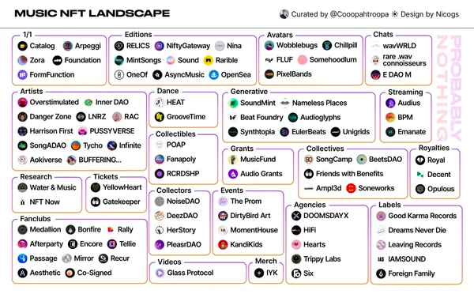
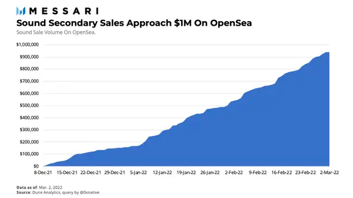

# NFT 对音乐产业的影响

**By Eshita Nandini**

NFT 的复兴正在将所有的媒体从传统的形式和商业模式转变为数字化的原生模式。视觉艺术一直是突出的形式，其交易金额已达数十亿美元，市场规模和参与者持续增长。艺术 NFT 已经看到了围绕头像图片（PFPs）、生成性收藏品、视觉效果、数字/实物作品、游戏物品等类别的活动。通常情况下，艺术 NFT 的所有者，在利润之外，发现艺术和艺术家的内在价值，而蓝筹股的收藏已经做得非常好，尽管 NFT 的投资在很大程度上缺乏流动性。

音乐被证明是一种更复杂的情况，因为它涉及到许多人和实体的多层创作和生产努力。与静态图像相比，音频内容是动态的，在形成其最终形式之前需要反复的试音、作曲和生产价值。然而，NFT 对音乐的影响似乎是艺术家和建设者都在试图弄清楚的，因为 NFT 为艺术家释放更多的收入和机会渠道，包括将粉丝纳入其中提供了更多机会。

市场很快就形成了一个共识：NFT 将重组整个音乐产业，首先是改变音乐的创作和消费方式。

## 目前的竞技场

各种各样的集体组织已经形成，以支持音乐的发现、制作和发行。

在基础设施方面，几乎所有支持 NFT 的链上都有音乐活动，但以太坊和 Tezos 上的活动正在增加。

### 以太坊

大多数 Web3 NFT 平台主要基于以太坊，如 Foundation、Zora 和 OpenSea。有几个主要的音乐 NFT 市场需要强调：Catalog，SongCamp，MintSongs 和 Sound。让我们来看看其中的一个：Sound。

截至目前，90% 的音乐流量是由顶级艺术家获得的。[Sound](https://www.sound.xyz/) 允许艺术家发起一个试听派对；同时，听众能够评论对歌曲的反应，并将这些时刻作为限量版的 NFT 来铸造 —— 这种机制是激励自然发现的一种方式，而不是像 Spotify 那样只播放最热门的歌曲或播放列表。

该平台正在迅速接近 100 万美元的二级市场交易量。

Sound 的销售只占 OpenSea 交易量的一小部分，而蓝筹 NFT 项目占据了大部分份额。当交易者能够看到围绕音乐或音频 NFT 的更多流动性时，这可能会勾起人们的兴趣。

### Tezos

由于 Tezos 采用了环保的 PoS 权益证明共识模型，成名的艺术家经常选择在 Tezos 上发布项目。

有一些和 Tezos 合作、有趣的已发布和即将发布的音乐 NFT，预示着 Web3 解决方案将开始进行更多的探索。12 月，惠特尼·休斯顿的一张未发行的唱片在 OneOf（TezosNFT 市场）以 100 万美元的价格售出，这是迄今为止 Tezos 上价格最高的拍卖。Doja Cat 在 OneOf 上推出了一个 NFT 系列，其中包括音乐会门票和进入她的 Discord 等福利。华纳音乐集团最近宣布与 OneOf 合作，为他们的艺术家提供服务，OneOf 已经成为 Tezos 上首要的音乐 NFT 平台。

## 音乐的中间商：唱片公司和流媒体服务

在一个理想的世界里，艺术将直接从创作者到消费者，但由于分销和发现带来的挑战，它通常不是这样。在传统音乐产业，有两个中间商，艺术家通常依赖于唱片公司和流媒体服务。在这里我们也要澄清一下，有各种类型的艺术家，从兼职、全职、DIY、纯制作人、独立艺术家到签约大唱片公司的艺术家。根据他们的情况，每个艺术家都会选择不同的方式来实现其作品的货币化。

Multicoin Capital 的管理合伙人 Kyle Samani 提议把唱片公司看作是一个风险投资基金 —— 把艺术家比作一个高风险的创业公司。考虑到这个比喻，目前的音乐环境是非常寡头垄断的，只有三大唱片公司：环球音乐集团、索尼音乐和华纳音乐集团，决定了谁将是世界上最大的艺术家。在 2021 年底，这三大唱片公司的收入超过了 200 亿美元。

## 收藏家 DAO：新唱片公司

投资 DAO 正变得越来越流行，一群人聚集在一起，为音乐 NFT 筹集和部署资本。随着我们走向无需许可到投资，更多的临时投资者以天使身份进入，或通过 [Republic](https://republic.com/) 等服务进行投资，并选择承担早期阶段的风险。粉丝和收藏家自己可以通过直接投资来选择哪些艺术家「成功」，从而质疑唱片公司的必要性。

一个投资 DAO 基础设施的供应商 [SyndicateDAO](https://syndicate.io/) 在今年早些时候推出，推出两周后立即有 450 多个投资 DAO 形成。虽然我们无法证实所有这些 DAO 都将保持运作，并将向生态系统注入可观的资本 —— 但它仍然是一个指标，表明人们对自我管理的风险基金抱有兴趣。

随着艺术家开始使用更多的 Web3 原生渠道进行艺术创作，对唱片公司的需求不会突然消失，相反，艺术家的新需求将迫使唱片公司进化以更好地适应他们。虽然我们今天知道的三大唱片公司可能会保留，但其中几个新的「唱片公司」将出现。散户投资者现在可以沿着这条自然之路，参与到音乐收藏中来。收藏家 DAO 将扮演决定哪些艺术家进入主流，有这么多 DAO 和粉丝影响这一决定，一个新的粉丝模式将出现，以维持这一局面。

我们已经看到艺术 NFT 收藏家 DAO 专注于策展和以许多不同的方式支持艺术家。例如，[Flamingo DAO](https://flamingodao.xyz/) 现在拥有价值超过 10 亿美元的投资组合，最后成为几个高价值 NFT 项目的早期投资者。在 Tribute Labs 的保护伞下，Noise DAO 希望收集音乐 NFT 和策划作品，但也参与招募和艺术家开发工作。当今的唱片公司拥有策展功能的副手，因为他们负责寻找和资助新的人才，这最终会成为我们消费的音乐。

音乐收藏家 DAO 最终将作为唱片公司，以某种方式承担所有这些功能，这是一个自然的进步，因为投资 NFT 通常是对创作者的投资。

## Web3 流媒体服务

流媒体服务支付给艺术家的费用往往很低，其中顶级艺术家受益最大，因为他们积累了最多的媒体流量。苹果音乐向他们的艺术家支付每次流媒体播放的费用为 0.01 美元，而 Spotify 支付 0.003 美元。[Audius](https://audius.co/) 是一个 Web3 流媒体平台，由于他们的通证$AUDIO 结构，每次流媒体播放支付近 0.35 美元。

Audius 上播放最高的曲目有 50 万次，而 Spotify 有 30 万次。鉴于后者是一个家喻户晓的应用，除了传统的流媒体渠道外，艺术家可以通过 Audius 做得很好。

音乐流媒体是一个重要的行业，但只有一小部分收入能到达艺术家手中。像 Audius 这样的 Web3 流媒体平台能够为艺术家提供更好的收入。

## NFT 是一个行业性的转变

当音乐从模拟到数字，它永远被改变了。在硬件层面上，录制和制作音乐变得更加容易 —— 艺术家们现在能够在家里用更多的便携式设备和软件来制作，这导致了新的流派和多样化的艺术家入场。在这种数字化之后，实体 CD 的销售急剧下降，艺术家们不得不适应使用流媒体服务，并在现场表演上投入更多精力。疫情大流行让这一切暂停了，艺术家们开始了闭门直播活动。互联网催化了从磁带、CD 和 MTV 音乐视频到流媒体世界的转变，以及现在基于 NFT 的音乐。

将 NFT 用于音乐的简单机会是将曲目或整个专辑进行通证化。NFT 为艺术家重新思考他们的创作和发行模式创造了大量的机会。正如前面提到的，铸造和拍卖音乐作品只是 NFT 为艺术家和音乐家提供发展机会的**一种**方式。

以下是艺术家们对 NFT 一些有趣的应用：

### 曲目/专辑/EP 的所有权

艺术家可以出售单曲或专辑的独版或限量版 NFT。大多数 NFT 市场允许直接销售音频文件。[Catalog](https://beta.catalog.works/) 允许艺术家将单曲或专辑作为 NFT 出售，由 Zora 提供支持。到目前为止，该平台上已经有大约 622 张唱片售出，中位价为 2311 美元。

### 版税通证化

分享艺术家的成功的想法，没有比分享版税销售更好的例子了。[EulerBeats](https://eulerbeats.com/)，一个生成性声音项目，是最早的通证化版税的实验之一。有 27 首歌曲发布了创世曲目和该曲目的拷贝。每首曲目的创世持有人在该曲目的每个新拷贝售出后都能获得 8% 的版税，他们还拥有该曲目的商业权利。

[Royal](https://royal.io/) 允许歌迷购买通证化版税，然后在数字服务提供商（流媒体服务）向艺术家付款时按比例赚取份额。粉丝们还能在平台之外交易版税通证，并因持有通证而获得独家利益。

与流媒体服务的情况类似，通证持有者在与艺术家分享版税时可能会看到微不足道的投资回报，直到平台普及流行。额外的价值是通过艺术家将来提供给他们的通证持有者的效用来累积的。

### 音乐的社交通证

社交通证允许艺术家逐步去中心化。随着通证的推出和围绕通证形成的 DAO，艺术家可以利用这点为粉丝的体验和互动设置通证门户。RAC 是一位艺术家和制作人，他在推出自己的社交通证 $RAC 时利用了这种潜力。他最近还发布了一个名为 racOS 的操作系统，为通证持有者提供独家产品。

### 生成性音乐

生成性曲目是音乐 NFT 让粉丝更多参与实际创作过程的另一种方式，有时甚至达到他们有能力拥有艺术家的曲目并制作自己的混音版本。

[Soundmint](https://soundmint.xyz/) 专注于与艺术家一对一的合作，帮助他们发布 NFT 系列。他们的第一次合作是与 Kloud 的合作，发布的是与 DJ 制作的一系列主干相搭配的视觉器集合。Kloud 已经将这些作品的所有知识产权和商业权利释放给收藏者，并计划允许收藏者从他们的 NFT 中交换声音，以创造新的曲目/声音。

## 音乐 NFT 的挑战

由于这仍然是一个新的想法和新的货币化方法，有几个问题让音乐 NFT 的工作不是很理想。如果一个艺术家选择只通过 NFT 销售他们的音乐，目前的氛围将是不可持续的，也是有利可图的。根据音乐研究机构 DAO Water & Music 的数据，与 140 万活跃的 OpenSea 投资者相比，据音乐研究 DAO [Water&Music](https://www.waterandmusic.com/) 披露，在 2021 年底，以太坊上只有 500 名音乐 NFT 收藏者。这些投资者往往是富有的 NFT 投资者，并倾向于成名艺术家。

正如 Li Jin[所写](https://future.a16z.com/1000-true-fans-try-100/)的那样，创作者模式始于面向支付更多费用的较少粉丝。对于艺术家来说，这意味着拥有较少的真正粉丝群可以产生更大的收入。这实际上拿走了唱片公司的权力，因为订阅和播放流量是他们支持和接受谁的巨大指标，最终谁能在行业中看到名声。

这种模式颠覆了粉丝群的概念。通常情况下，一个创作者会积累数以百万计的粉丝，其中大多数人的贡献是 0 美元，并通过 Spotify（一些基于订阅的服务）或 YouTube 等渠道消费音乐，或者根本不为流媒体付费。然而，最高比例的粉丝总是购买唱片、商品、巡演门票 —— 所有这些都有助于创作者的收入 —— 除了赞助和在粉丝之外可能有的任何其他合作。

另一方面，从少数歌迷那里获得一些大的销售并不能保证这些歌迷或收藏家会复购以后的发行，特别是由于今天大多数音乐 NFT 收藏家都是 NFT 大鳄。然而，大额销售确实让艺术家有更长的跑道，有能力花更多的时间在其他渠道。

### 有限的可发现性

艺术家的音乐发现将继续依赖于主流渠道，以及已经普及的额外策略。抖音是艺人通过声音获得病毒式传播的主要渠道，少数艺人已经自然地在 Billboard Top 100 或 Spotify 的 Viral 50 中爬到最高。

对于原生的 NFT 艺术家，发现是有限的，因为与现有的服务相比，这些平台上的用户并不多。另一方面，像 3LAU 和 Steve Aoki 这样的艺术家已经有了可观的观众，他们可以很容易地转而购买他们的 NFT。

### 成名艺术家的风险/回报

大艺术家们没有花时间围绕他们的 NFT 空投培养社区或效用。举个例子，Snoop Dogg 最近在 OpenSea 上发布了一盘混音带，其质量与歌迷可能期望的并不相符。成名的艺术家有能力从 NFT 中获得令人难以置信的收入，但同样的艺术家和他们的团队很可能不会花时间在他们自己的 Discord 上与粉丝互动或为他们专门设置体验，因为向他们更广泛的粉丝群开放可能更有利可图。

很多收藏家继续成为 NFT 大鳄，他们可能不是真正的粉丝，这让我们很难衡量对音乐 NFT 的需求的解读是否准确。

## NFT 并不能解决音乐版权问题

对消费者来说，这可能并不显眼，但目前音乐产业的流程相当陈旧和复杂，有几类权利和版税与音乐所有权相联系。

举个例子，当 Scooter Braun 的控股公司收购一家唱片公司时，泰勒·斯威夫特的专辑母带被出售，斯威夫特不得不重新录制她的专辑。母盘是曲目或专辑的原始记录，所有者有合法权利从中获得收益。在斯威夫特的案例中，唱片公司拒绝将音乐的权利卖回给艺术家。像这样的情况很常见，唱片公司对艺术家仍有很大的权力。权利、条款和版税通常被分割，唱片公司最终通常比艺术家获利更多，并保留对音乐的大部分权利。通常情况下，唱片公司持有签约艺术家作品的主控权，而艺术家通常只能有权获得 15% 的版税。

虽然智能合约提供了公开协议和条款的能力，并以程序化方式分配版税，但音乐权利仍然很复杂，将它们上链并不一定能解决根本问题。[Opulous](https://opulous.org/) 为任何人提供了交易音乐版权份额的能力，还提供由现实世界的音乐资产和版税支持的 DeFi 贷款。该团队在 Republic 上发布了他们的音乐证券 NFT（S-NFT），允许 Lil Pump 和 KSHMR 对他们的版税份额化并作为 NFT 提供。据 Water & Music 报道，该团队没有向美国证券交易委员会注册 S-NFT，由于目前所有的活动和模糊的监管，这在未来可能会成为一个问题。

## 但是，时机是正确的

尽管在移动链上的东西有自然的挑战，音乐将继续探索通证化解决方案。主要的唱片公司和艺术家已经在各种链和平台上进行试验。目前已经有 50 多个音乐 NFT 项目在积极尝试销售 NFT 或让艺术家入门，而现实是，并非所有的项目都能存活。同样不可否认的是，人们对音乐 NFT 的兴趣越来越大，无论它们以何种形式出现。这里有几个重要的指标:

- NFT 市场总体上是繁荣的
- 艺术家意识到唱片交易的古旧结构对他们不利
- 逐渐走向一对一的粉丝模式，而不是一对多的粉丝模式（OnlyFans，Patreon）
- Web3 平台已经开始接纳大艺术家（Steve Aoki, Diplo）

随着传统的音乐合约被搞清楚，NFT 提供了以智能合约形式提高许可效率的能力。此外，艺术家们有了新的盈利方法，粉丝们也有能力成为真正的投资者。不管音乐 NFT 的影响如何，与唱片公司签约的艺术家们正在错过被唱片公司占用的收入，甚至在这个过程中失去了对其知识产权的权利。在新的、不断改进的音乐产业中，我们将看到艺术家重新获得控制他们的艺术和收入流的权力，并与他们的消费者、粉丝分享。
