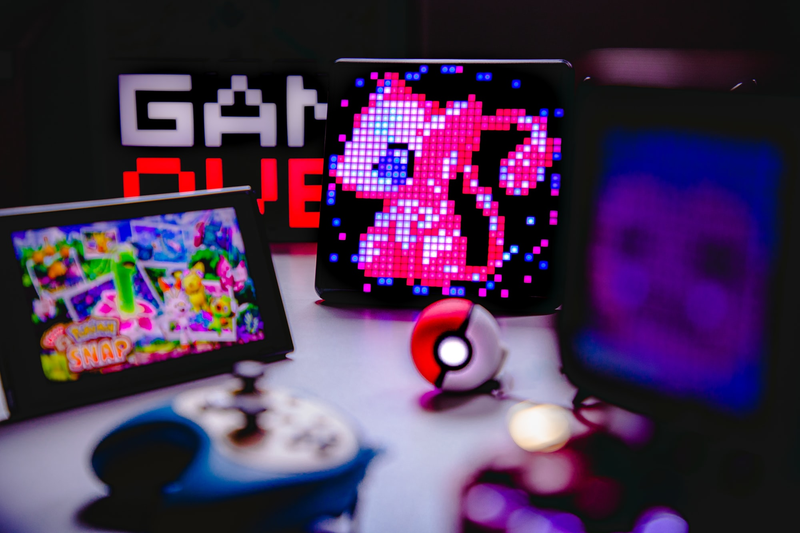
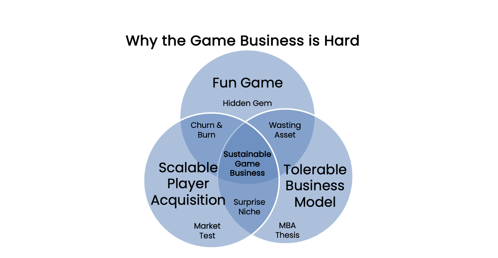

# 为什么游戏业这么难？

**By Jon Radoff**

2021 年，有超过 850 亿美元投入到游戏行业。在 2022 年的第一个月，由于微软收购动视，这个数字更是见涨。游戏是历史上最大的媒体类别 —— 而现在一些最大的技术公司同时也是游戏公司。

但是在游戏行业赚钱不容易，随着所有这些资本入场，带来的竞争比以往更加激烈。

## 可持续的游戏业务

几乎所有游戏公司的最终目标都是创造一个**可持续的游戏业务**。但，为什么这么难呢？

## 交付一个有趣的游戏

制作一个有趣的游戏是最难做到的事情之一。这是一项需要长期磨练掌握的技艺。虽然也有个人开发者制作游戏的罕见例外（如 Undertale, Stardew Valley），但通常情况下，游戏开发是一项团队作战 —— 这意味着你还必须充分利用和调整多人的创造性才能。你必须同时在你的资本约束下承担创意的风险。由于上述及更多的原因，大多数游戏创意甚至从来没有变成一个可交付的产品，更不用说一个人们可玩的有趣游戏。

**游戏的客户也已经改变。**交付粗糙的测试版的日子已经一去不复返。客户的要求更高。很少有人会容忍不合格的体验、瑕疵或崩溃的服务器。许多人寻找的游戏能提供与其他玩家交流的社区，自我表达的机会和在线友情。他们比以往更加挑剔，也更加没有耐心。

当我们谈论让游戏变得有趣时，这上面有一个重要的注脚：**对特定受众有趣。**没有任何游戏能被 100% 的人所喜爱。绝大多数游戏甚至对一半的人来说都不太有趣，如果有 20% 的人喜欢他们的作品，很多游戏制作者都会很高兴。一个游戏越是小众，它就越需要在商业拼图的其他部分做得更好，才能成为可持续的产品。

## 可扩展的玩家获取

如果目标是创建一个可持续的游戏业务，那么仅仅交付一个有趣的游戏是不够的。你还需要一种方法来扩大你的客户群。有时这种可扩展性是通过口口相传、模因（meme）和社交媒体找到的。更常见的是，通过有针对性的广告。在其他时候，通过品牌、意见领袖的认可和特许加盟的建立 —— 或通过创建强大的社区来获得杠杆效应。

## 可容忍的商业模式

我说「可以忍受」是因为事实是，如果没有必要，大多数人不愿意付出。因此，这是关于想出一个适合你的目标受众的商业模式 —— 同时也产生足够的收入来支付运营费用并产生开发投资的回报。

最早的电子游戏是让你以越来越快的速度将硬币倒入街机投币口中。一旦人们开始在家里玩电子游戏，他们就会像购买其他软件一样购买游戏 —— 每购买一款游戏都会加强对品牌或特许经营权的依恋，来增加玩家购买下一款游戏的可能性。

今天，「可容忍的」也可以包括**游戏内消费、广告、订阅/捆绑和开放经济** —— 取决于你的游戏受众。这些商业模式有经常性收入的好处 —— 但取决于经济模型，这些模型很难设计，技术上很复杂，操作起来很有挑战性，而且很难与游戏设计和受众保持一致。

无论什么选择，如果人们不愿意接纳这种商业模式，那么就没有办法创造一个可持续的业务。

## 有哪些可能的结果？

- **可持续的游戏业务：**全力以赴为目标受众提供一个有趣的游戏，拥有可扩展的玩家获取和繁荣的商业模式。
- **隐藏的宝藏：**这种有趣的游戏很少有人发现，或者因目标市场不接受的商业模式而受到损害。
- **浪费资产：**一个游戏获取了早期受众，它的货币化是好的，但从来没有设法扩大其玩家数量。通常情况下，这意味着收入会随着时间的推移而减少，所以它总是在游戏的剩余收入和重新投资于另一个项目之间进行取舍。
- **MBA 论文：**实际上那里没有什么游戏，只是有一个游戏的理论和一些证据表明人们会为它付费。由很多众包的、未交付的想法和区块链「白皮书」填充。有时，这仍然是启动社区的好方法，但直到你开发出产品之后才会有业务。
- **市场测试：**有人为一个游戏创意贴出广告，检查人们是否会点击它。这实际上可以成为测试游戏的视觉效果、市场定位和目标市场是否值得投入资本和时间的好方法。通常在你制作游戏的时候而不是在游戏完成之后弄清楚其中一些情况会更好。
- **流失与燃烧：**游戏很有趣，你找到很多人玩它，但玩家迅速流失，因为他们讨厌你的商业模式 …… 或者根本没有合适的商业模式。
- **惊喜的细分市场：**对于最初的目标受众来说，这些游戏未能带来乐趣，但却能不顾一切地找到一个意外的市场。这些都是规则的例外。游戏的客户就在那里，这一点从获取玩家和货币化的能力中得到了证明 …… 但通常情况下，这些游戏最终都是非常小众的，很难成为大型游戏。
