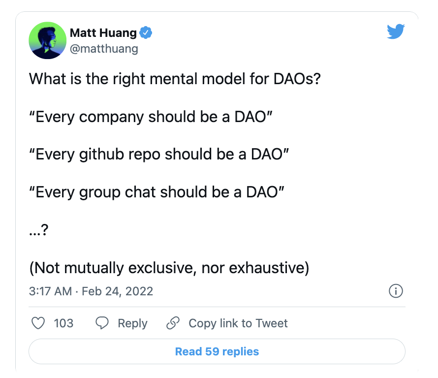

# DAO 在 2022 年需要克服的 5 个挑战

**By sarahlu.eth**

7 天内超过 7 百万美元。每日平均 120 万美元。

就在乌克兰战争爆发后不到一天，俄罗斯朋克摇滚乐队「造反猫咪」（Pussy Riot）宣布了一个非正统的解决方案来帮助受影响的人：UkraineDAO。该 DAO 的目标是通过拍卖乌克兰国旗的独版 NFT 来援助乌克兰的平民 —— 在短短不到一周的时间里，他们成功地通过加密通证捐款筹集了 700 多万美元，百分百的收入用于乌克兰民间组织。

如果你熟悉去中心化自治组织（DAO）或经常查看加密推特，那么这可能已经是旧闻。但是对于那些刚接触 DAO 的人来说，UkraineDAO 只是揭示 DAO 潜力的吉光片羽。2022 年被参与者和观察者视为「DAO 的一年」。DAO 开始在「纽约时报」、雅虎新闻和财富」等主流媒体获得详细的报道，而且正如我们所讨论的，每天都有令人兴奋的新 DAO 诞生。

随着新的 DAO 继续渗透到 Web3 领域，重点是要注意 DAO 在 Web3 这片狂野西部仍然是一个相对未开发的边疆。毕竟，DAO 在技术上只有 6 年的历史 —— 直到 2016 年，有史以来第一个 DAO（被称为「the DAO」）的数百万美元的黑客偷袭导致了以太坊的硬分叉（现在已经发展成为我们今天所知并喜爱的以太坊）。

对于任何能够让我们协调大量资本和人力的新型组织，必然会有挑战。本文挖掘了 2022 年 DAO 需要克服的五大挑战。

## 挑战一：没有人正确地进行招聘 —— 他们甚至不知道要招聘什么人

虽然这是一个普遍的挑战，存在于 Web3 的每个细分领域，但 DAO 特别容易受到招聘问题的影响。协调人们之间工作的历史 —— 至少在最近的现代性中 —— 基本上是在大多数工作是中心化的前提下运作的。

在一个传统的公司里，你有一群 C 字母打头的高管，他们将 KPI 和建立 OKR 指派给他们的下属，后者也将同样的指标指派给他们的下属，如此延续 …… 以使最高层的股东或投资者利益最大化。大多数招聘者在这个前提下运作。但 DAO 正试图颠覆这种模式，甚至更多：横向委托工作，同时试图为一个由其成员集体拥有的组织带来价值。

对于 DAO 来说，这意味着一种新型的「雇员」或贡献者可能更有价值。当招聘者和公司寻找能够执行专门任务的有经验的工作者时，DAO 可能会优化那些对社区和/或 DAO 的愿景充满热情的贡献者，能够在没有集中授权的情况下提供价值，或者仅仅是能够发现问题并提出解决问题的方法的人。你是一名 solidity 工程师？修复一个 bug 就可以赢得 25 万美元的赏金，你甚至不需要为公司工作！

## 挑战二：缺少适当的上手培训和贡献者流动的框架

DAO 的另一个迫在眉睫的挑战是努力在贡献者加入后创建成员工作流程（也就是如果他们第一步正确加入上手的话）。正如 0xjustice.eth 所写的，「不是每个加入你的 Discord 服务器的人都是你的 DAO 的成员，他们也不应该是。」如果你是一个 DAO，你应该问以下问题：

- 我希望谁能成为贡献者？
- 他们知道如何做出贡献吗？
- 谁将帮助他们做出贡献？
- 为什么他们会继续贡献？

太多的 DAO 开始思考第一个问题，然后就完全停止思考。暂停一下。呼吸一下。停止用冷冰冰的私信拥有 12 万以上粉丝的网红来帮助推广你的 DAO。随着越来越多的用户学会为 DAO 做贡献，作为他们 Web3 旅程的一部分，必须制定适当的框架来接纳贡献者，以便 DAO 能够发现并保留那些能够为他们的社区提供最高价值的人。

我的个人意见：也许现在是时候了，DAO 开始考虑试图通过 Discord 集体协调参与者时产生的绝对混乱了。DAO 管理平台，什么时候？

## 挑战三：太中心化了？不够中心化？太中心化了？

_DAO 相互告诉对方，他们不够去中心化（即中心化）_

DAO 治理系统正在变得复杂，真的真的很复杂。Web3 中的各种声音不断推拉，他们都未能就 DAO 实际应达到的去中心化水平达成一套共同的规则 —— 这很好，但对于 DAO 参与者和贡献者来说，这很令人困惑。_等等，我必须在 Y 日之前将我的通证委托给 X 个数量的人，以对 Z 个数量的提案投票 ……？你的意思是我的 DAO 还没有去中心化到足以成为一个 DAO？元治理？我甚至不知道治理是什么。_

从本文发表到 2022 年底的这段时间里，许多新的 DAO 将会涌现，并不可避免地失败。许多新的 DAO 甚至是成熟的 DAO 也将不可避免地面临他们愿意妥协的去中心化程度的问题，以便在重要的提案和其他长期举措上恰当协调他们的成员。请记住：你关于去中心化的决定应该始终以你的社区为中心。

对于在治理方面苦苦挣扎的 DAO，推荐 Snapshot、Tally 和 Gnosis Safe，我们是这些工具的忠实拥趸。

## 挑战四：激励机制

对于许多 DAO 来说，激励机制偏向于所谓的「鲸鱼」，或那些在 DAO 中拥有较大所有权股份和/或财务投资的人。不言而喻，一个只有 50 美元所有权通证的成员与一个拥有 5 万美元所有权通证的成员的运作方式不同。后者在组织中也会有更大的影响力，那些试图将鲸鱼和非鲸鱼的激励尽可能紧密地结合在一起的 DAO 很可能是会取得长期成功的组织。减少鲸鱼存在的 DAO？也许更好。

以 Dinner DAO 为例：你以与其他人相同的价格购买 NFT，以获得进入一个轮流排座的晚餐俱乐部。你与同一城市的其他 7 个 NFT 持有者配对，每个 8 人餐饮小组有能力在整个季节中花费 4200 美元进行一系列的晚餐，每个成员都可以投票决定在哪里吃饭。一个简单得无懈可击的 DAO，将每个人都集中在一个共同的激励措施上：吃晚餐。

## 挑战五：他们能坚持到熊市吗？

DAO 的最后一个挑战是寿命，或者换句话说，持续兑现他们的承诺。的确，并不是所有的 DAO 都需要长寿，以问题为导向的 DAO（UkraineDAO、FreeRossDAO）、旨在为特定的购买或目标而联合起来的 DAO（LinksDAO、ConstitutionDAO、KrauseHausDAO），甚至只是为了 DAO 而 DAO，都有一些说法。但是，过去两年流入 Web3 和从 Web3 赚取的巨额投机资本无疑使人觉得每一个创建的 DAO 都会成功，或者每一个概念都需要成为一个 DAO。

现实情况是，就像任何其他组织或人类团体为了实现伟大的目标而形成的一样，DAO 需要向其参与者提供价值。无论是长期还是短期，DAO 的核心成员都有预测如何扩展的内在责任。而扩大规模往往意味着管理一个几百万美元的金库。一个在 2 周内就拼凑起来的 DAO，并且正在推广空投通证，其中 80% 的供应由其核心团队持有，是不会持久的。一个在最重要的时候始终不能提供价值的 DAO 也不会持久。

换句话说，我们不再是小学生了，DAO 也不是。

## 总结

DAO 的演变将是 2022 年 Web3 的一个决定性特征。随着许多新的 DAO 进入这个领域，创始人总是要预见到管理一大群人和大量资本所带来的责任和框架。这些挑战不会因为更有效的工具或更有能力的工程师而消失 —— 它们会被人类的意图所解决。
