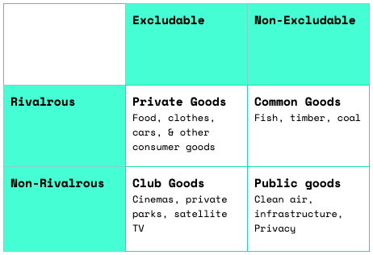
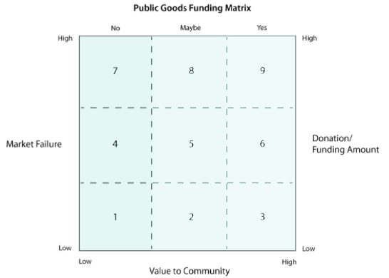

# 太阳朋克：以太坊时代对公共物品的重新认识

> Gitcoin 的联合创始人 Scott Moore 和 ENS 的社区负责人 Alisha.eth 最近分享讨论公共物品、社区参与，以及我们需要的工具，以建立我们想要生活的未来。

Web3 社区在本质上是一个植根于对未来抱有深深的乐观和希望的社区。技术的日益普及和进步让我们有理由相信，一个人人都有能力生存和发展的世界不仅仅是一个空想，而是一个切实的可能。然而，当我们审视大众想象中对技术的描述时，显而易见的是，我们经常设想一个我们实际上并不想生活居住的世界；在那里，技术肆行无忌，以我们的价值观、我们的隐私和我们的集体自由为代价。这是一个想象力的失败，具有深远的影响。这也是我们可以选择通过梦想更好的结果和帮助我们实现这些结果的系统来纠正的。

## 技术朋克文化，从功能紊乱到令人向往的

_赛博朋克 = 高科技，低生活_

赛博朋克（Cyberpunk）是一种科幻小说流派，最早出现在 20 世纪 60 年代和 70 年代的新浪潮科幻小说运动中，并在 80 年代随着雷德利·斯科特（Ridley Scott）的《银翼杀手》等电影和威廉·吉布森的《神经法师》等小说的出现而继续流行。即使在今天，它也可能是流行文化中对我们的技术未来最主要的描述，并经常被描绘成酷的、反叛的和反文化的。但赛博朋克所描绘的形象从根本上说是一个残酷的世界：在这个世界里，巨无霸企业盘踞在可怕的建筑中，耸立在被污染的灰色天空中；人类生活在可能被称为资本主义的反乌托邦里。尽管我们经常被它的想法所迷惑，但赛博朋克社会在技术上是先进的，但功能却高度失调。

_加密朋克 = 高科技，中生活_

加密朋克运动与赛博朋克思想有着密切的精神联系，它产生于 80 年代末，并在 90 年代的早期互联网时代继续流行。在这样做的过程中，它提供了一个更好的，但仍然有限的观点，即技术可以给我们带来的可能性，作为个人与日益强大的（尽管不是不现实的）全球监控国家作斗争。

像埃里克·休斯（Eric Hughes）这样的活动家主要为一个世界而奋斗，在这个世界里，强大的密码学将让系统增强隐私和个人自主性，从而让我们可以自由和不受干扰地生活。

_太阳朋克 = 高科技，高生活_

在 2000 年，一个关于未来世界的更广泛的概念开始形成：太阳朋克（Solarpunk）。虽然太阳朋克最初是一个专注于可再生能源和可持续技术的小众环境运动，但它后来发展成为一个关于**共同**建立一个乐观的未来的全球对话的关键部分；一个再生的，专注于人类与我们周围的世界**一起**繁荣的，而不是与之对立。

从根本上说，赛博朋克关注的是我们应该远离什么（反乌托邦式的巨无霸企业、腐败的政府和逐渐消失的叛军联盟），而太阳朋克则提供了一个我们可能想要走向的愿景。它强调技术和环境之间的深度融合，而不是分离，以及友好的保护、自我可持续发展和社会包容，即使是对那些没有能力的人。就未来而言，对于一个以人类集体繁荣和地方可持续发展为中心的未来，我们很难不感到兴奋。

## 太阳朋克提供了一个新的开始

但我们不妨问问自己：为什么这些运动真的很重要？特别是，为什么它们对我们在 Web3 中所做的事情很重要？简单来说，我们告诉自己的叙事深深地影响了我们存在的理由，反过来也影响了我们在世界上的行为方式。正如琼·迪迪安（Joan Didion）的名言，「我们为自己讲故事，是为了生活。」

但正如亚当·柯蒂斯（Adam Cutis）和其他人所指出的，有时我们告诉自己的故事实际上并不属于我们自己。很多时候，我们很容易被机构或算法所困，陷入不能改善我们福祉的叙事中，而不是被我们自己集体创造的叙事所赋能。我们必须仔细和有意地**选择**我们想在这个世界上看到的叙事，一起把自己从几个世纪以来的集体阴谋中解放出来。在太阳朋克的情境下，我们告诉自己的叙事可以给我们带来深刻的希望和代理，以建立我们希望看到的未来，探索技术在其中可能发挥的作用，以及集体协同，而不仅仅是作为个人。

除了它所描绘的再生世界之外，太阳朋克还可以被认为是一种充满希望的谢林点，尤其是对于我们 Web3 的人来说。我们中许多人都在努力想办法摆脱历史权力结构的包袱，或者至少更好地检查历史权力结构，无论这些权力结构是以政府、公司的形式存在，还是其他不太明显的力量，比如经济，它本身就是一个共同的叙事结构；一个集体幻象。现在，我们中的许多人正在独立地做这件事，没有一个统一的愿景或方法。

我们中的一些人可能会研究为什么现代民族国家（另一种类型的叙事，只存在了几百年）与传统的本土实践相比，迅速成为政治和社会协调的同义词。其他人可能会在卡尔·波兰尼（Karl Polanyi）的著作中找到灵感，他认为我们对持续增长和经济优化的追求，而不强调地方或历史背景，造成了功能紊乱的市场社会。我们可以探索伊万·伊里奇（Ivan Illich）的著作，以便更广泛地了解像大学这样的教育机构（以及像成绩这样的衡量标准）是如何成为教育和终身学习的替身的。

太阳对人类繁荣的前瞻性关注为在社会和机构权力的交汇处探索所有这些话题提供了肥沃的土壤，并为我们提供空间来观察我们可能在围绕着我们可以与彼此的联系的哪里建立了不必要的墙。

## 其他世界是可能的

一个值得深入探讨的政治和社会协调的特定替代模式可以在埃莉诺·奥斯特罗姆（Elinor Ostrom）的作品中找到，她因对公地管理的研究而在 2009 年获得诺贝尔奖。在高层次上，这种做法可以被认为是对国家或市场管理资源的一种替代。相反，它研究了一个用户社区以一种更加公共的、互惠的方式自我管理其创造的资源可能是什么样子。

奥斯特罗姆研究了包括尼泊尔、西班牙、印度尼西亚、尼日利亚、玻利维亚、瑞典和美国在内的许多国家的灌溉、渔业和森林使用方面的安排。通过将理性选择理论和发展经济学的见解具体应用于生态保护，奥斯特罗姆的工作表明，「地方财产可以由地方公地成功管理，而不需要中央当局的任何监管或私有化。」

她的著作值得全文阅读，而我们对她著名的八项原则总结如下：

1. 在社区和资源之间设定明确的界限；
2. 与直接的利益相关者一起，在当地制定规则；
3. 为更新规则提出明确的参与性程序；
4. 一旦制定了规则，就要建立问责制；
5. 应用**渐进式**的社会制裁来解决冲突；
6. 确保冲突解决方案是非正式的、可利用的和低成本的；
7. 如果需要，确保你的规则不受上级地区当局的阻碍；
8. 继续以这种方式嵌套规则，直到每个人都保持一致。

虽然这些原则大部分对我们 Web3 的人来说可能是显而易见的，但即使在十多年后，在西方社会的大部分地区，看到这些概念以非等级的方式实施也是不常见的。

另一种选择，这次是与公司形成对比，可以在《罗奇代尔原则》中找到，这是一套在 19 世纪英国创建的合作社运作的理念。这些原则今天仍被世界各地的合作社积极采用。概括来说：

1. 建立自愿、开放的会员制；
2. 建立参与式决策程序；
3. 确保每个人都有参与游戏的权利；
4. 在所有安排中允许成员自主；
5. 进行教育和宣传，以确保成员平等参与；
6. 与其他合作社建立网络；
7. 为社区产生正向的外部效应。

这两个例子都为我们提供了灵感，让我们可以利用其他久经考验但较少采用的工具，来调整我们如何治理自己的标准模式。如果我们保持乐观并共同努力，也许我们终究可以避免在赛博朋克媒体中呈现的巨型国家与赛博朋克活动家的二元对立。

## 我们能摆脱公地的悲剧吗？

简单地说，公地或基于方法的合作社所面临的一个挑战是，关系是复杂的，而且随着团体规模的扩大，关系会变得更加复杂。虽然几十个人的公社往往运行顺利，但当我们接近「社交邓巴数」时，冲突的几率越来越大，邓巴数是平均每个人能够维持 150 个密切关系的理论最大值。

从网络增长的角度来看，根据梅特卡夫定律，两个人的小组只能建立一个连接，但 5 个人可以建立 10 个连接，12 个人可以建立 60 个。当一个社区是小的、本地的和嵌套的时候，治理是一回事，但我们在现代文明的规模上的关系是大的和蔓延的。那么，当我们的公共资源达到全球规模时会发生什么？

显而易见的解决方案是每个人都拿出一点来，简单地一起工作 —— 但如果没有一个协调机制来确保每个人的贡献，他们往往不会这样做。这被恰当地称为公地的悲剧。虽然，正如奥斯特罗姆批判性地显示，它是可以避免的，但它仍然是今天我们所有人的一个主要挑战（无论是由于规模、文化还是人性的原因，仍然很难说）。

Web3 中正在建立的再生经济工具，包括「dweb（去中心化万维网）」技术，是解决这些全球协调问题的一个有前景的方案。再生经济工具是太阳朋克。但从根本上说，没有任何工具是完美的，我们必须**选择**，不仅要关注正确的问题，而且要继续对潜在的解决方案进行迭代，直到我们拥有可能的最佳解决方案。把握好这一点关系到世界的每个角落。

但是，要做好这一点，我们需要抵制守旧主义。虽然对新工具持批评态度很重要（正如马歇尔·麦克卢汉（Marshall McLuhan）所说，「我们塑造了我们的工具，此后我们的工具又塑造了我们」），但我们首先必须保持乐观，认识到我们都有能力夺回对腐败机构的控制权，集体设计新的框架和机制来取代它们，并利用新合作货币的力量来资助我们的努力。

## 重新定义公共产品

可以说，要修改的最关键框架之一是公共物品的传统概念。经济学概论中的公共物品有两个不可改变的特征：它是非排他性的（意味着不能阻止任何人使用该物品）和非竞争性的（意味着一个人的享受不会减少另一个人的享受）。这通常由政府来提供公共物品，因为企业没有动力去解决「免费搭车」的问题（为什么要为一个无论如何都无法阻止你使用的物品付费）。

_不同类型商品分类的一些传统例子_

正如劳拉·洛蒂（Laura Lotti）、萨姆·哈特（Sam Hart）和托比·肖林（Toby Shorin）在《正和世界：重塑公共物品》中所说，「要创造一个雄伟而平等的社会，需要对公共物品有更广阔的视野，而不是仅仅用经济学就能想象到的。」我们必须深入思考什么是 Web3 中的公共物品，然后思考我们可能建立的工具，因为分类并不那么容易辨别。例如，开源代码被广泛认为是一种公共物品。但是开发者呢？作为创造基础设施的人，他们是否也应该被视为（和被资助的）公共物品？或者是共同物品，因为他们是有限的？

对什么是公共产品进行批判性但又乐观的思考，将让我们能够解决过去一直困扰公共产品筹资的「免费搭车」问题。我们越是清楚，就越容易决定哪些项目值得资助。

上述标准框架之外的一个框架已经被 Gitcoin 和 ENS 等团队所应用：

**轴 1** 是市场失败，表示从项目中获取任何经济价值的可能性有多大(也就是说，你在市场失灵轴上的位置越高，就越难将其货币化）。

**轴 2** 是项目为社区提供的价值（捐赠/资助金额由项目在这两个轴上的位置决定）。

现在让我们考虑一下，如果我们不仅考虑公共产品对特定社区的价值，而且考虑它对其他社区产生的**正外部性**，会发生什么。通过这种方式，我们可以想象俱乐部或公地如何能够作为真正的公共产品的**生成器功能**。

考虑将开源软件作为一个真正的全球公共产品的例子（在大多数情况下，而且越来越多，任何人都应该能够访问和使用它）。尽管例如以太坊可能主要是对维护网络安全的通证持有者负责，但产生的代码对每个人都是公开的，永远的，并且可以成为其他项目的基础。事实上，我们已经在基于 EVM（以太坊虚拟机）的链上一次又一次地看到了这一点。

## 促进社会进步的工具

以下是 Web3 中的一些实际例子，这些项目可以帮助我们达到一个更加太阳朋克的未来，其中许多项目是通过其他项目产生的正外部性来维持的，而所有这些项目又反过来创造它们自己的正外部性：

- ENS 的数字签名和在线身份帮助我们在网上创建可持续的、独立的（和相互依赖的）实体；
- OPtimism 的追溯性公共产品资助允许对开源项目进行与它们在过去产生的价值相称的奖励；
- 像 Gitcoin 这样的项目所建立的二次方资助，使社区能够以多元化的方式表明他们对公共产品的支持，并共同资助公共产品，这既是利他主义的（支持公共产品本身），也是工具性的（支持他们自己生态系统中的产品，反过来通过一轮轮资助为更广泛的开源软件提供资金）原因；
- 像 Gnosis Guild 这样的模块化治理工具，可以帮助受资助的项目以分形方式治理和维持自己。

## 以太坊是太阳朋克，但前提是我们选择它

Web3 并不只是营销炒作和骗局，但如果我们不谨慎，它很容易落得如此下场，而不是成为一个有意义的社会变革工具。技术不一定要与我们的环境，或与我们彼此之间的关系对立。特别是以太坊，它不受任何一个司法管辖区的束缚，可以作为一个全球协调的底层，为一个破碎的世界建立新机制。

但正如我们多次说过的，这是我们必须主动选择的工作，它不会自己发生，事实上，如果任由我们自己决定，我们可能会反对它。让我们利用我们讲述的故事，以及我们建立的再生经济体系来推动我们自己产生我们所寻求的正外部性。归根结底，这都是协调。
