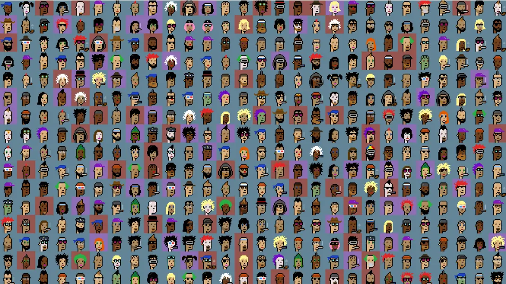
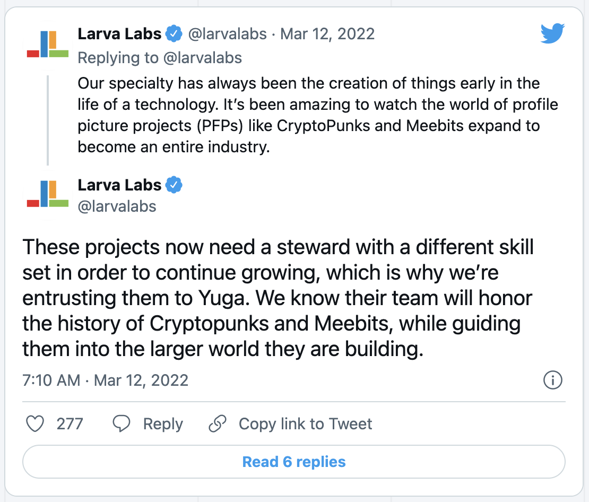
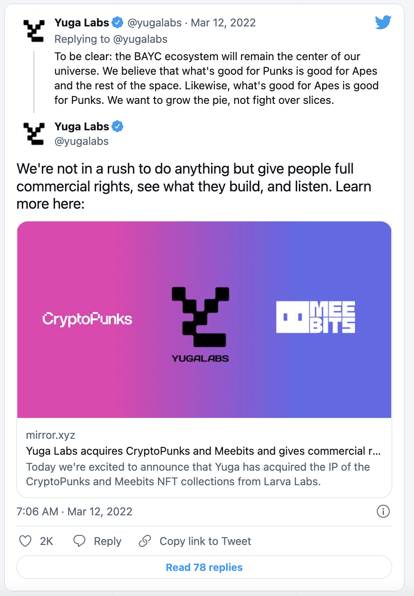

# 为什么 Larva Labs 将「加密朋克」NFT IP 卖给了「无聊猿猴」创作者？

**By Andrew Hayward**

> 是什么导致了这桩 NFT 的大手笔交易？为什么「朋克」的创作者说他们并不「很适合」支持这个项目？

就在上周，「加密朋克」（CryptoPunks）和「无聊猿猴游艇俱乐部」（Bored Ape Yacht Club）还是 NFT 头像项目领域的两个主要竞争对手。现在，它们有了共同的主人，在上周五的新闻中，Larva Labs（幼虫实验室）将「加密朋克」的 IP 卖给了「无聊猿猴」的创作者 Yuga Labs（尤加实验室）。

尽管是该领域最大的两个 NFT 头像项目，然而，它们两者采取了非常不同的途径。Larva 在 2017 年打造的这一 NFT 系列在以太坊领域拥有 OG（Original Gangster 的缩写，意为「江湖老炮」）的地位，但随着去年整体市场的膨胀，官方很大程度上放手不管。与此同时，Yuga 的项目以其可观的利益和日益增长的名人效应的会员俱乐部异军突起。

这形成了一个鲜明的对比，而且这种对比在最近几个月里一直在放大。现在，Larva 已经将「加密朋克」和 Meebits 的版权卖给了 Yuga Labs，同时还有他们拥有的两个系列的 NFT。「无聊猿猴」的创作者计划对一些「加密朋克」所有者的长期抱怨做出反应。

在本周晚些时候发布的公告之后，我们来看看导致 Larva Labs 决定退出「加密朋克」管理的原因，以及两家公司在交易时的说法。

## NFT 巨头

Larva 的两人团队 Matt Hall 和 John Watkinson 在 2017 年创建了「加密朋克」以太坊 NFT，总量 10000 个中的 90% 供任何人免费铸造。渐渐地，「朋克」在尚处于起步阶段的 NFT 领域获得了价值和声望，并在 2021 年初市场爆炸时大获成功。

「加密朋克」迅速成为 NFT 领域突出的地位象征，1 月的平均售价（按 CryptoSlam 计算）突然达到五位数，然后在 8 月随着 NFT 市场飙升到新的高度而达到六位数。仅在那个月，就有价值近 6.8 亿美元的「加密朋克」在二级市场上售出。甚至维萨信用卡（Visa）也买了一个。

「无聊猿猴游艇俱乐部」比「加密朋克」新得多，它于去年 4 月推出，借用了 1 万个具有随机特征的 NFT 化身。但它将 NFT 头像这一概念推向了一个新高度，将所谓的游艇俱乐部打造成了一种独特的社会组织，为那些接受其愿景的人提供额外和持续的好处。

在发布后的几个月里，「无聊猿猴」的持有者得到了两个额外的免费 NFT —— Bored Ape Kennel Club（无聊猿犬舍俱乐部）和 Mutant Ape Yacht Club（突变猿猴游艇俱乐部） —— 同样证明价值不菲。除此之外，持有者还能购买独家商品，并能参加去年秋天在纽约市举行的免费音乐会，音乐会上有 The Strokes、Chris Rock 和其他明星。

但对一些持有者来说，BAYC（「无聊猿猴游艇俱乐部」的缩写）如同镶嵌在皇冠上的宝石、最有价值的部分是让他们拥有的猿猴形象商业化的能力。「无聊猿猴」可用于产品营销和包装，或用于原创商品，甚至用于创建虚拟乐队 —— 正如制作人 Timbaland 和环球音乐集团正在分别做的那样。

Yuga Labs 还在开发一款基于「无聊猿猴」的玩赚游戏，并计划在不久的将来也推出一个可能有价值的以太坊通证。

## 不同的路径

虽然一些「加密朋克」持有者证明他们的出处让他们有价值和引人注目，然而创作者没有提供额外的津贴或福利，因此其他人开始抱怨 Larva Labs 对该项目缺乏关注。

例如，在去年秋天的纽约 NFT 大会期间 —— 当时 Yuga 举办了 2021 年猿猴节活动（包括上述的音乐会），一些「加密朋克」持有者在推特上吐槽 Larva Labs 在大会周围什么都没做：没有聚会，没有福利。

但更大的问题是，对一些持有人来说，「加密朋克」的商业化权利指引不明确，再加上 Larva 对衍生的 NFT 项目 —— 或那些明显受原始「加密朋克」启发的项目 —— 动辄提告兴讼，证明是一个楔子。

例如，著名的化名收藏家 Punk 4156，在厌倦了 Larva Labs 明显不愿意澄清该项目的权利问题之后，在 12 月以超过 1000 万美元的价格出售了他的「加密朋克」头像。官方试图将衍生品从市场上赶出去 —— 比如 CryptoPhunks（一个对「加密朋克」图像镜像翻转的戏仿项目）—— 也让他很生气。

今年 2 月，另一种情况激怒了一些「加密朋克」持有人。NFT 社区成员创建了一个智能合约，允许持有者根据原来的「加密朋克」合约（由于一个错误而被放弃）铸造一个单独的「包装」NFT，并作为「包装 V1」版出售。

Larva Labs 对该项目进行了反击，声称它们不是「官方」的「加密朋克」。但与此同时，这两个人开始销售一些自己保留的、但声称不合法的 V1 版「朋克」。最终，Larva Labs 为此事道歉，霍尔称他们的行为「愚蠢」。同时，这对二人组预告对 V1 版项目采取潜在的法律行动，此后不久，V1 版项目从 OpenSea 上被删除。

与此同时，「无聊猿猴游艇俱乐部」正在吸引像阿姆（Eminem）、斯诺普·道格（Snoop Dogg）和斯蒂芬·库里（Steph Curry）这样的名人买家，而且 NFT 正在增值 —— 在过去三个月的大部分时间里，市场上「无聊猿猴」的地板价比「加密朋克」还要高。

在失误和缺乏沟通的情况下，一些人认为 Larva Labs 是一家在快速发展的 Web3 市场中摸索前进的 Web2 公司，试图努力满足那些期望从昂贵的 NFT 投资中获得更多透明度、协作和权利的所有者。

## 一条新的前进道路

他们现在至少可以在 Yuga Labs 的所有权下得到一些，该实验室在上周五宣布收购了「加密朋克」和 Meebits 的 IP。

一开始，Yuga Labs 就表示，它将授予这两个系列 NFT 持有者完整的商业化权利，这意味着他们可以将他们的「加密朋克」和 Meebits 头像用于产品、服务、营销和其他想法。据报道，Yuga 还将不追究 Larva Labs 之前关于衍生项目任何依据《数字千年版权法》（DMCA）的移除请求。

在周五发表的通告中，Larva Labs 承认，对当今 NFT 头像（PFP，Profile Picture）项目日益增长的要求超出了他们的目标和能力。

他们写道：「我们的个性和技能并不适合社区管理、公共关系，以及这类项目所需要和值得的日常管理。」

Larva Labs 和 Yuga Labs 是通过资深的音乐行业高管 Guy Oseary 联系上的，他代表 Yuga 在其不断增长的娱乐事业中发挥作用。Larva Labs 写道，它曾考虑与「无聊猿猴」的创作者合作，最终认为 Yuga 可以更好地维持「加密朋克」和 Meebits 的 IP，继续前进。

「我们发现了许多共同点，但我们也在他们身上看到了我们所缺少的这个领域的技能和专业知识，」Larva Labs 写道。「在许多方面，Yuga 是现代 NFT 头像项目模式的创新者，是世界上最擅长运营和发展这些项目和周围社区的人。」

Larva Labs 卖掉了 IP，但将继续实验和推出新的项目，官方写道，这比维持现有的项目更符合其优势。它还保留了生成艺术 NFT 项目 Autoglyphs，该项目和 Art Blocks NFT 项目类似，但比它早。

除了开放商业化权利，目前还不清楚 Yuga Labs 计划如何使用「加密朋克」和 Meebits 的 IP。联合创始人 Wylie Aronow（又名 Gordon Goner）告诉 The Verge，Yuga 不打算将这些项目重塑为「无聊猿猴」式的会员俱乐部，而且它也不打算在目前免版税的系列中增加版税。但他说，我们可以看到围绕新 IP 的街头服饰、活动和游戏等内容。

「我们并不急于做什么事情，而是给人们充分的商业权利，看看他们创造了什么，然后倾听，」Yuga Labs 上周五在推特上说。
