# 比特币是如何改善环境的

**By Sami Kassab**

比特币挖矿利用大量能源进行计算处理，这已经不是什么秘密。随着对气候危机的关注不断上升，世界各地的各行各业正面临着越来越大的压力，以减少不可再生能源的消耗量和向大气中的碳排放。比特币网络的能源使用很容易量化，让它成为一个很有吸引力的审视目标。事实上，没有任何一个行业的能源使用量像比特币网络那样透明和容易计算的。关于比特币能源使用情况的争论从它诞生之初就已经存在，至今仍在持续。与其被耸人听闻的头条新闻和批评其能耗的文章所淹没，不如了解能源数据的实际分类。

根据 CoinShares 最近发布的关于比特币挖矿网络的报告，估计该网络在 2021 年消耗了 82 太瓦时（TWh）的电力，比 2020 年增加了 9%。截至 2021 年 12 月，目前的年化用电量为 89 太瓦时。从这个角度来看，比特币网络消耗了 2019 年全球总能耗的 0.05%，这实际上相当于全球能耗的一个四舍五入的错误。作为比较，NYDIG 报告说，2020 年国内滚筒式干燥机和数据中心分别使用了 108 太瓦时（0.07%）和 204 太瓦时（0.13%）。

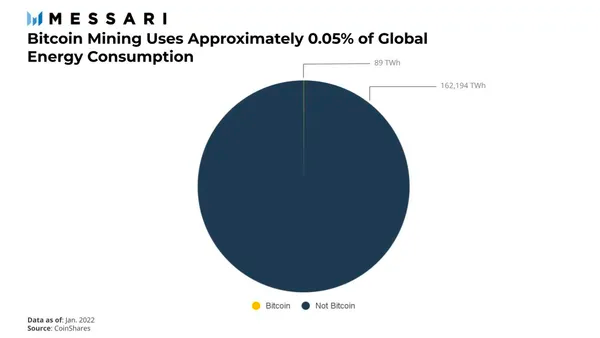

CoinShares 还量化了用于为网络供电的能源来源，并将能源组合分为以下几类：煤炭、天然气、水力、核能风能和其他（少量石油、太阳能的混合物，主要是地热）。他们的研究结果表明，比特币网络消耗的能源有 39% 是可再生能源。

最后，CoinShares 估计，2021 年比特币挖矿的碳排放量为 41 公吨（Mt）的二氧化碳。相比之下，黄金行业每年的排放量估计在 1 亿至 1.45 亿吨二氧化碳之间。Galaxy Digital 估计全球银行系统在 2019 年使用了 264 太瓦时的能源。使用每千瓦时 492 克二氧化碳的全球平均碳强度，CoinShares 能够将其换算为每年 1.3 亿吨的二氧化碳排放量。为了解更多情况，据估计，全球航空业、海洋运输业、空调、电风扇、数据中心和滚筒式干燥机每年分别排放 1,982、1,503、984、100 和 53 公吨的二氧化碳，这些数据在下图可见。

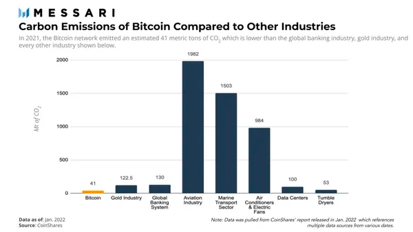

## 闲置和浪费的能源

比特币的能源消耗与其他行业不同，它的核心可变输入是电力。因此，比特币矿工主要专注于获取廉价的电力资源，以保持盈利能力，这让他们与正常的电力用户不同。出于这个原因，矿工们在世界各地寻找低效率的能源，寻找闲置和浪费的能源。他们是能源界的蜣螂，希望利用别人不愿意或不能使用的能源。由于比特币挖矿不受地理位置的限制，矿工们可以灵活地去任何他们能找到能源和互联网连接的地方。另一方面，正常的工业能源消费者被限制在靠近发达地区的能源，并且有适当的基础设施来传输能源 —— 这在经济上往往是不可行的，在技术上也不可能。

随着矿工搬迁到电力资源利用不足且价格低廉的地区，他们自然会寻求创新的解决方案来获得高效的能源生产。例如，矿工利用闲置能源的一个常见方法是通过集装箱将矿机运送到提供能源的地方，类似于即插即用的设置。

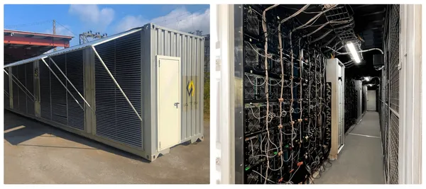

_运输集装箱内的工业比特币挖矿数据中心_

鉴于挖矿所提供的灵活性，比特币矿工已经制定了一些战略，以利用几种浪费和闲置的能源来源。本报告将对以下四种能源进行仔细研究：

1. 闲置的天然气
2. 闲置的地热能源
3. 煤炭垃圾
4. 回收的废旧轮胎

## 石油和天然气工业的闲置和浪费的能源

石油是现代工业世界的命脉。虽然它是最值得依赖的能源之一，但石油也是世界上最不受欢迎的行业之一。现实情况是，即使世界转向使用可再生能源作为主要的能源来源，也总是有使用石油的理由。石油被用于大多数塑料产品、服装材料、电器、建筑材料，以及最明显的作为运输用汽油。石油部门的消费分为以下几类：运输（66%），工业（28%），住宅（3%），商业（2%），和电力（1%）。独立投资分析师和战略家 Lyn Alden 指出，当考虑未来的能源消费时，重要的是要记住，较新的能源在历史上并没有取代以前的能源。以前的能源通常保持平稳，甚至继续增长，而较新的能源增长更快，变得更有优势。

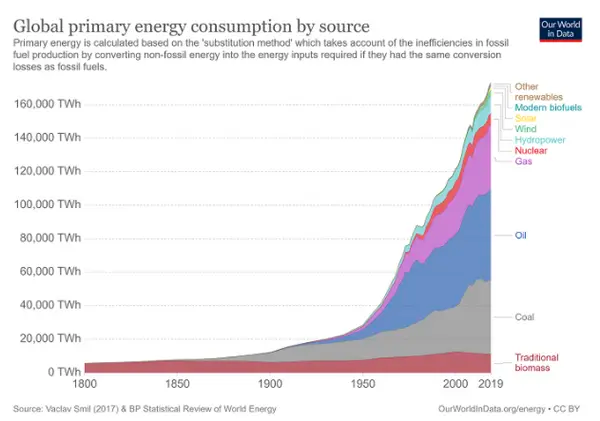

美国的石油和天然气生产每天产生近 1200 万桶原油，其中天然气是副产品。天然气是一种不可再生的能源，在全球范围内用于取暖、烹饪和发电。由于石油钻井地点通常位于偏远地区，没有管道和电力线基础设施，天然气经常被闲置，因为它不能以经济的方式进入市场。因此，石油公司被迫通过两个过程中的一个来处理这些气体。第一个是排放，这涉及到将气体直接释放到大气中。当天然气（主要是甲烷）被排放到大气中时，它所造成的温室效应是 100 年内二氧化碳的 30 倍以上，这导致许多州对排放天然气的数量实施监管。由于将气体直接排放到大气中对环境极为有害，大部分气体最终通过被称为燃烧的第二个过程进行处理。燃烧包括用吊杆或烟囱收集不需要的气体，并将其燃烧处理。当气体在无风的情况下被燃烧时，99%的甲烷可以被燃烧，只剩下二氧化碳和水。然而，正常的大风条件下，平均燃烧效率降低到 68%。当风速达到 6 米/秒以上时，效率会急剧下降 10-15%，导致大量的甲烷泄漏到大气中，甚至在燃烧时也是如此。

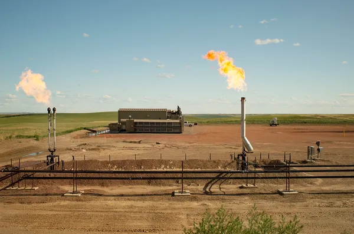

_克鲁索能源（Crusoe Energy）公司的一个油田在燃烧天然气_

燃烧不仅是防止甲烷进入大气层的一个糟糕的解决方案，而且也是对能源的巨大浪费。该行业已经花费了数十亿美元来寻找可能的解决方案，而一个不寻常的解决方案已经落在了他们的家门口。比特币矿工已经想出了如何将闲置的天然气货币化，并以一种对环境危害较小的方式来处置它。像克鲁索能源和 Upstream Data 这样的公司已经出现，提供了一个解决方案，将比特币采矿数据中心（在集装箱内）与天然气发动机配对，将浪费的能源货币化，并将其转化为有用的工作。天然气也在受控环境内燃烧，防止任何甲烷泄漏到大气中。这导致了比特币矿工和主要的石油天然气公司之间建立了许多合作关系，因为他们开始使用这种新颖的解决方案来处理自 1859 年美国石油工业诞生以来一直困扰着他们的问题。

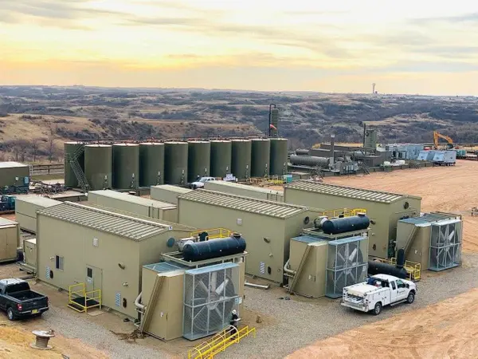

_克鲁索能源公司巴肯油田的比特币挖矿数据中心_

至少可以说，美国因燃烧而浪费的能源数量是巨大的。Coinshares 公司估计，美国每年有 69 太瓦时的电能浪费在燃烧中，这导致了 78 百万吨二氧化碳当量（MtCO2e）的碳排放。换句话说，美国燃烧浪费的能源目前相当于全球比特币网络使用的能源的 78%。浪费的燃烧能源不仅可以被重新利用，为比特币网络的很大一部分提供能量，而且还可以以减少碳排放的方式进行。

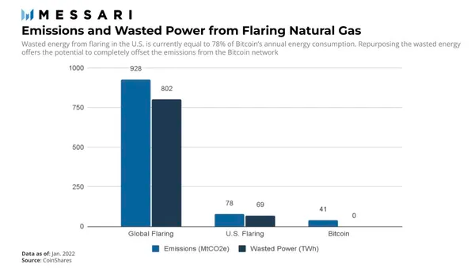

## 地热能源

地热能是来自地壳深处的热量，可用于清洁发电。热量来自分布在世界各地不同温度和深度的热水和蒸汽储层。这些水库通常通过火山、温泉或间歇泉到达地面。最活跃的地热资源分布在主要构造板块的边界上。因此，像冰岛、萨尔瓦多、新西兰、肯尼亚和菲律宾这样的国家在电力消费方面严重依赖地热。例如，冰岛从地热发电厂获得的能源消耗总量的三分之一以上，这也占了住宅供暖能源的 90%。与其他可再生能源相比，地热的主要优势在于它能够提供全年的基荷电力，而无需依赖电池存储或电网。

地热能源最大的局限性在于，大多数已知的储层都位于偏远地区，远离传统的消费者。由于比特币挖矿不受地点限制，矿工能够利用这些未被充分利用和闲置的能源。这导致比特币矿业公司，如 Genesis Mining 和 Bitfury，涌向冰岛这样的国家，寻找廉价、丰富的地热能源。最近，萨尔瓦多总统 Nayib Bukele 开始尝试使用国有地热发电厂，利用其火山的能量进行比特币挖矿。Bukele 总统的愿景是围绕该国的地热能源资源设计一个完整的比特币挖矿中心。

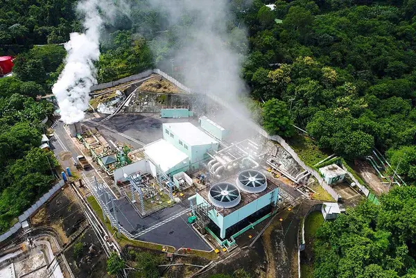

_萨尔瓦多的地热电力设施_

地热能源的潜力是巨大的。有一项估计称，只要地壳下 0.1% 的热含量就能满足人类 200 万年的总能源需求。在全球范围内，地热能源的装机容量一直在增加，在 2020 年达到 14 吉瓦。随着地热技术的不断进步，地热能源注定会在为电网提供清洁、可再生能源方面发挥更大的作用。

## 废煤

美国的煤矿开采遗留了大量的环境问题和负债，特别是在宾夕法尼亚州。煤炭垃圾是采煤留下的材料，导致 770 多个废弃的煤炭垃圾堆。宾夕法尼亚州环境保护局已经确定，这些堆积物包含超过 2.2 亿吨的煤炭垃圾。宾夕法尼亚州环境保护部承认，他们的数据库并不完整，其他估计表明，煤炭垃圾的数量实际上是数十亿吨。超过 8,300 英亩的土地被煤炭垃圾覆盖，有些堆积物有数百英尺深。煤炭垃圾是宾夕法尼亚州最大的废水污染物之一，因为从煤堆中排出的酸性矿井水。酸性排放物含有铁、锰、铝以及其他金属和材料，已经影响到超过 3300 英里的河流。这导致溪流变成橙色，造成水污染并对水生生物产生负面影响。煤炭垃圾场也有很高的自燃概率，导致有毒空气污染物和温室气体不受控制地排放到大气中。早在 2021 年，宾州环保局报告了超过 45 个堆积物失控燃烧。煤炭垃圾堆对土地、水和空气质量产生负面影响，从而对公众健康和安全构成风险。

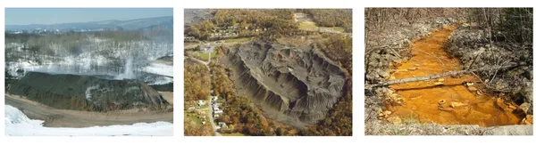

直到 20 世纪 80 年代末，还没有可行的方法来清理煤矿留下的混乱。随着循环流化床（CFBs）的发明，有可能在废煤发电厂燃烧煤炭垃圾作为能源，同时实现较低的污染物排放。该工艺将石灰石与煤炭垃圾混合在一起，吸收硫磺，产生的灰烬可以被有效利用。

在过去的三十年里，废弃的煤电厂已经回收了大约 3700 英亩的土地，根据宾州环保局的数据，还剩下 9000 英亩。然而，这些废旧煤电厂遇到了一个问题。他们在电网上不敌更便宜的能源。完全依靠电网的收入在经济上是不可行的，特别是当电网甚至经常不需要发电厂的电力时，这就威胁发电厂到关门的地步。为了让环境清理工作继续下去，需要一个新的和更有利可图的收入来源，幸运的是，比特币达到了这个目的。

Stronghold 数字矿业公司的成立是为了继续利用比特币挖矿作为经济上维持运作的方法来进行煤炭垃圾清理。该公司将自己描述为 21 世纪的加密货币矿工，在美国一些环境最被忽视的地区来弥补 19、20 世纪的煤炭开采的影响。他们的工艺消除了大部分有毒排放物，并产生有益的灰烬，可用于水泥和中和煤炭垃圾场的任何剩余酸性物质。他们的灰烬也被宾夕法尼亚州农业部列为认证肥料，这意味着它足够安全，可用于农作物。宾州环保局还与 Stronghold 密切合作，确定和处理任何需要立即关注的煤炭垃圾场。

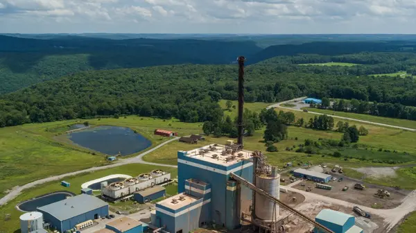

_煤炭垃圾发电厂，后面有比特币挖矿拖车_

在帮助清理这个环境灾区的同时，Stronghold 还帮助稳定当地的能源网络。Stronghold 是一家垂直整合的矿企。这意味着他们有自己的电力资产和数据中心，而且产生的电力从未离开过设施。唯一的例外是当该公司被要求在能源短缺时向电网提供能源。由于他们的业务能够 24 小时不间断地运行，Stronghold 能够在一瞬间将电流从他们的矿工转到电网上。如果一个典型的发电厂在离线的情况下被要求向电网提供电力，它可能需要 24 小时才能上线，而 Stronghold 可以立即采取行动。

## 废旧轮胎

仅在美国，每年就有超过 3 亿个废旧轮胎产生。这相当于每天每秒钟都有九个废旧轮胎被扔掉。这个令人震惊的统计数字还没有考虑到那些没有通过轮胎制造商严格的安全标准报废的轮胎，这几乎相当于 10% 的产量损失。美国轮胎制造商协会在 2019 年报告称，近 76%（低于 2013 年的 96%）的废旧轮胎被回收为橡胶改性沥青、园林绿化用地膜和轮胎衍生燃料等产品，其余 14% 被送入垃圾填埋场。轮胎衍生燃料是一个花哨的术语，用于燃烧轮胎发电，它占了「回收」轮胎的 49%。美国环境保护署（EPA）不认为这个过程是一个回收过程，但它被接受，因为它是一个比让轮胎堆积在垃圾场更好的选择。

虽然自 2013 年以来，产生的废旧轮胎数量继续平均每年增加 7%，但回收的废旧轮胎总数却平均每年减少 3%。此外，在美国的垃圾填埋场仍有 5600 万条废旧轮胎。显然，在过去六年中，有关轮胎废物问题的进展已经停滞。为了继续取得进展，需要新的、更可持续的、经济上可行的市场来激励废旧轮胎的清理工作。

有一家公司在传统的轮胎回收过程中进行了创新，那就是产品回收技术国际公司（PRTI）。PRTI 正在通过他们新发明的名为 PRTI 热力脱胎的工艺来改变废旧轮胎的处理方式。这个过程允许 PRTI 通过一个近乎零废物、对环境有帮助和收入积极的回收过程，将轮胎分解成有用的工业商品。该过程使用精心管理的温度和压力，将橡胶分解成油、碳、钢和能源。除能源外，通过该过程产生的商品随后被转售。从回收过程中产生的能源使 PRTI 成为一个自给自足的操作，利用电力来运行他们的回收操作，同时也为内部的比特币矿工提供动力。这实质上将 PRTI 变成了一个废物变能源的比特币挖矿。挖矿产生的额外收入也使得用卡车从更远的地方运来的轮胎进行回收在经济上是可行的。

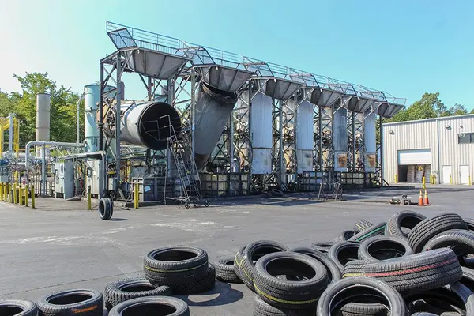

_PRTI 在北卡罗来纳州弗兰克林顿的设施_

PRTI 工艺的模块化设计使他们能够轻松地扩大经营规模，并在世界各地建立新的基地，以便更接近废旧轮胎的来源。他们在北卡罗来纳州的一个工厂生产约 6.15 兆瓦的能源，大约相当于一个 20 英亩的太阳能发电场。

PRTI 还直接与轮胎制造商合作，卸载那些没有通过制造和安全标准的轮胎。PRTI 计划在美国再发展 171 家工厂，旨在将美国的垃圾转化为有价值的商品，消除对焚烧、掩埋和研磨轮胎的需求。

## 最后的思考

与全球能源消耗总量相比，比特币挖矿消耗的能源微乎其微，其中超过三分之一的能源来自可再生能源。矿工们不是与传统的能源消费者竞争，而是寻求廉价的能源，而这些能源往往被闲置或浪费了。许多公司已经开发出创新的方法来利用闲置或浪费的能源，同时也对环境留下积极的影响。例如，像克鲁索能源公司、Stronghold 数字矿业公司和 PRTI 这样的公司，经常被媒体歪曲，并因其一阶效应（将二氧化碳释放到大气中）而受到批评，但却忽视了其二阶效应的重要性（通过减少有害的温室气体和防止土地、水和空气质量进一步退化来提供环境友好服务）。

比特币的能源消耗是令人难以置信的可量化，现在，它对环境的潜在积极影响也变得可量化了。有一天，比特币有可能完全依靠可再生能源运作，但在那一天到来之前，比特币矿工将继续通过创新的解决方案寻找最便宜的电力来源，将未被充分利用或浪费的能源加入到比特币的能源组合中。仅仅这些创新可能就足以让一些人认为比特币的能耗是合理的，但最终，比特币的合理性取决于人们是否认为其能耗为社会增加了价值。而到了最后，价值是一个主观判断。
