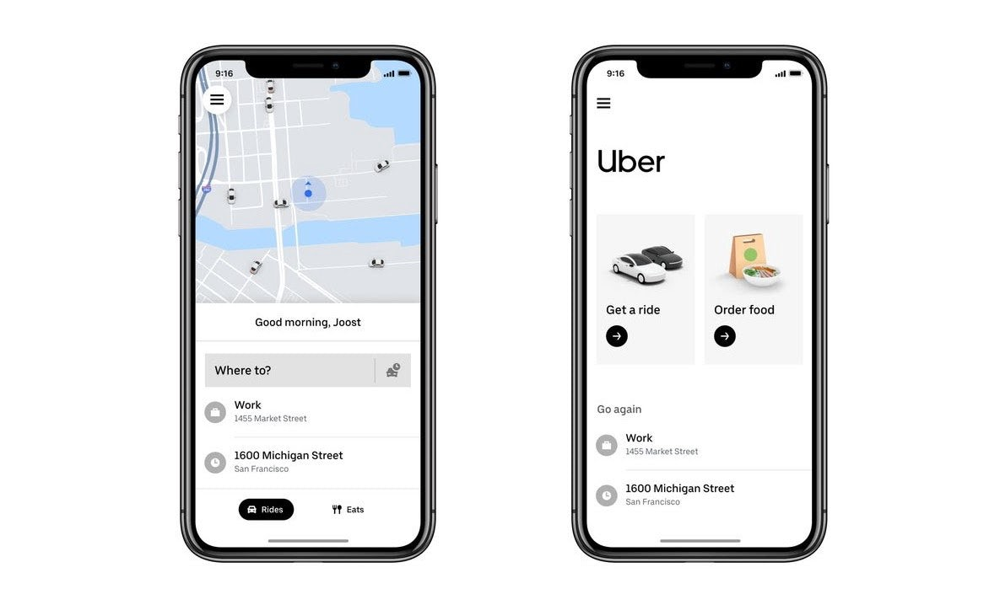
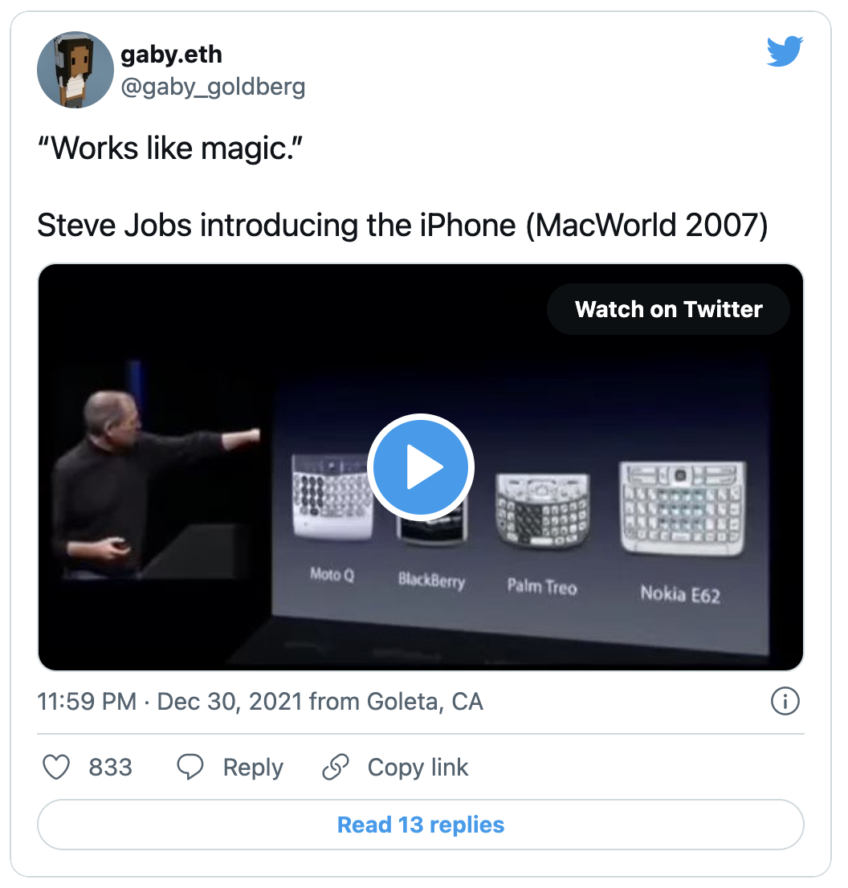
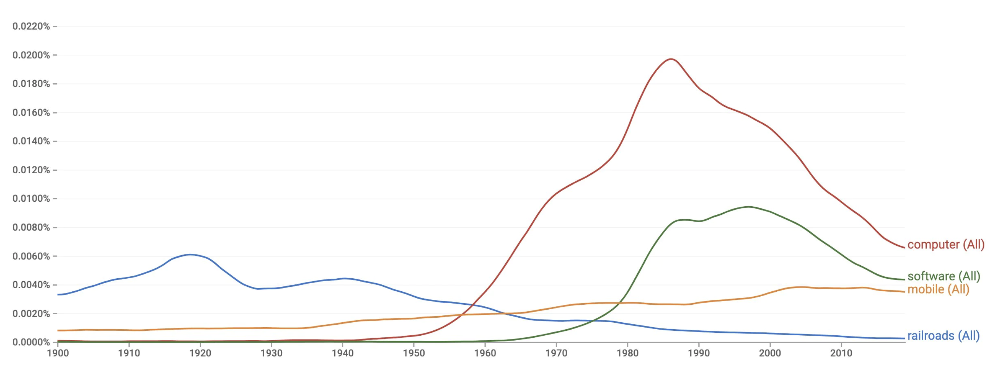
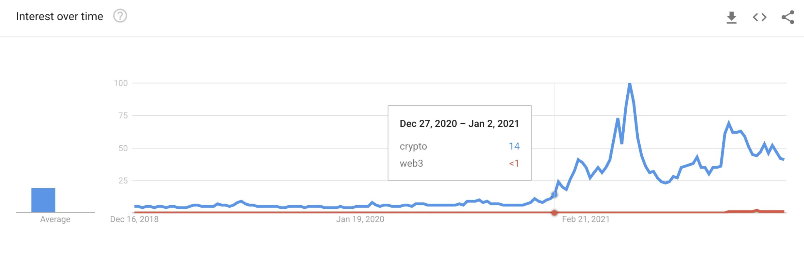

# Web3 的移动时代

**By Gaby Goldberg**

> 眼下，Web3 这个词很热，但实际为普通用户使用且体验良好的 Web3 产品应用寥寥无几，而且都集中在桌面互联网。Web3 的大规模普及，移动应用的诞生成熟，必不可少。请看 TCG 加密基金投资人 Gaby Goldberg 写的这篇文章。

2013 年，媒体和技术分析师本尼迪克特·埃文斯（Benedict Evans）提出了「移动互联网正在吞噬世界」的观点，探讨了移动互联网的空前规模是如何改变互联网和整个经济的。当时，56% 的美国成年人拥有一部智能手机（今天是 85% 相比）。无法想象未来十年会发生什么；正如我在之前的文章「Curators All the Way Down」中写道，技术创新往往在我们似乎最不需要它们的时候出现。

埃文斯的想法是有先见之明的。他知道，随着每一波技术浪潮（铁路、软件、移动……我敢说，Web3）的出现，都会带来新的商机。因此，当我们看到移动原生创新的崛起就在埃文斯发表演讲的前后开始时，这并不奇怪：2009 年的 Uber，2011 年的 Snap，2012 年的 Lyft，2013 年的 DoorDash …… 这个名单还在继续。

移动是一个平台的转变 —— 互联网工作方式的范式转变。它扩展了规模、提高了消费者体验的复杂成熟度，让应用的使用容易了 10 倍。与台式电脑不同，手机是*个人的*。你可以把它们带到任何地方，毫无障碍地使用它们做任何事情：打电话、拍照、查找位置、付款、听歌或浏览应用商店。智能手机本质上也是社交属性的，与桌面互联网不同。应用可以进入智能手机的通讯录，获得一个现成的社交图谱；它们可以从用户的相册中导入照片，或者轻松地抓取用户的地理坐标，进行基于位置的社交。

这将有助于将其纳入视野：1999 年，有 800 亿张消费者的照片是用胶片拍摄的。2014 年 —— 仅在这一年 —— 就有 8000 亿张照片在社交网络上被分享。突然间，每个人都成了摄影师。**智能手机代表了新一代的计算机。但它们也代表了新一代的用户：休闲用户的诞生，任何人都可以成为其中的一员。**

今天，Web3 在很大程度上是网络原生的。几乎没有广泛使用的移动原生 Web3 应用程序。正如派基·麦考密克（Packy McCormick）所写的，「如果 Web3 要像拥有 46.6 亿用户的互联网一样大，它只渗透了不到 1% 的市场。」我相信，如果我们要达到这个目标，我们将首先看到移动原生的 Web3 应用的出现，以吸引休闲消费者。

那么，什么样的移动原生 Web3 用户体验会出现呢？我的猜测和其他人差不多，但我想到的几个例子包括：

- **地理定位的 NFT**，如 Mirage 或 Dropverse。我希望在这里看到新的基于位置的社交图谱的诞生，几乎就像 NFT 的 Zenly。Superlocal 正致力于开发一个有趣的版本；
- **增强现实的 Web3 游戏**，如 Jadu；
- 在这一点上，任何涉及**增强现实和 NFT** 的东西（我设想了一个世界，我们将 NFT 带入 Snapchat、TikTok 和 Instagram 的视频中 …… 就像最近在全世界人们用 TikTok 拍下庞大的史瑞克在各大城市景观建筑上出现并性感热舞的那样，但请不要引用我的话）；
- **社交 Web 3 钱包**，如 Genesis 或 Family；
- **高度可视化的「战利品口袋」和 NFT 画廊**，如 Surreal 和 Cyber。

Web3 移动端的最大障碍将是谷歌和苹果继续对移动原生平台上发生的任何应用内交易进行寻租。我看到了苹果在这里开放的迹象（有点！），但景观正在继续发展(注：这也正是我对 ethOS 这样的东西感到兴奋的原因，它的目标是成为以太坊的第一个原生移动操作系统：无需许可的设计，去中心化的浏览，一个 dApp 商店，以及强大的钱包支持。我正在密切关注这个项目，我建议你阅读其白皮书）。

我从埃文斯的演讲中得到的最喜欢的启示是，当技术完全普及时，它就会消失。你可以用几乎所有的技术革新来测试这个理论。下面，我用铁路、电脑、软件和手机这些词进行了测试，查找了从 1900 年到今天每个词在谷歌图书语料库中的频率。

你可以看到每个词都经历了某种形式的钟形曲线，人们的兴趣在某一时刻达到顶点，然后从那里开始下降。在某一点上，这个词基本上消失了。埃文斯是对的。现在，当我们用 Web3 和 crypto 这两个词从 2018 年到今天测试这个理论时：

还有很长的路要走，直到我们达到任何上图中看到的钟形曲线的样子。我们还没有接近全面普及。我相信移动原生应用将帮助我们达到这个目标。

如果你正在这个领域创造建设，或者正在考虑 Web3 移动的未来会是什么样子，我很愿意和你谈谈。像往常一样，我的推特私信是开放的。

**链接：**

- **移动互联网正在吞噬世界：** https://www.ben-evans.com/benedictevans/2013/5/17/mobile-is-eating-the-world
- **Curators All the Way Down：** https://gaby.mirror.xyz/qvnNJhylZz-w6t4ubZzHfxd5gP17zDAXa6ruwOyO7sc
- **ethOS 白皮书：** https://uploads-ssl.webflow.com/61ad57ec839c036816011d71/61be99355662f72eed8c8809_whitepaper.pdf
- **作者推特：** https://twitter.com/gaby_goldberg
