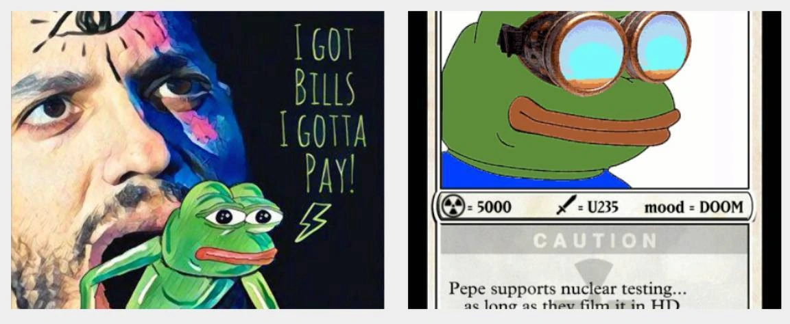
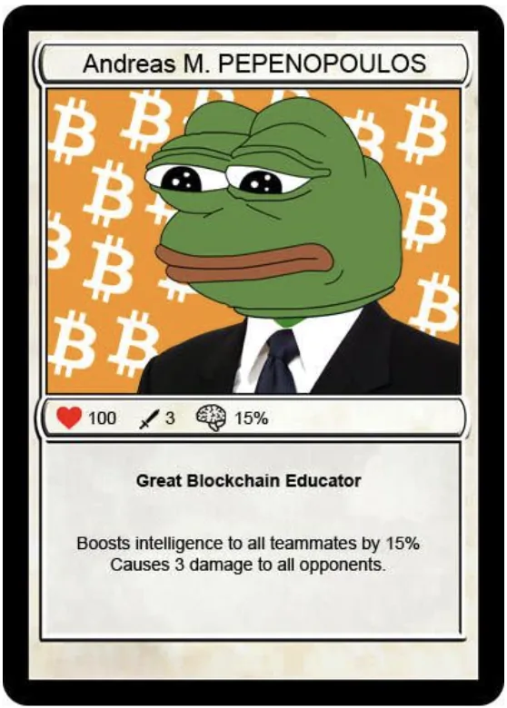
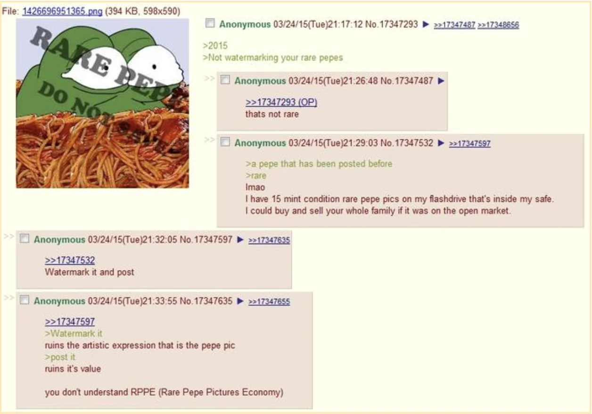
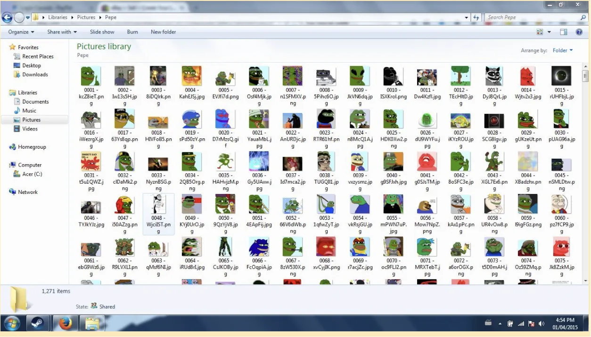
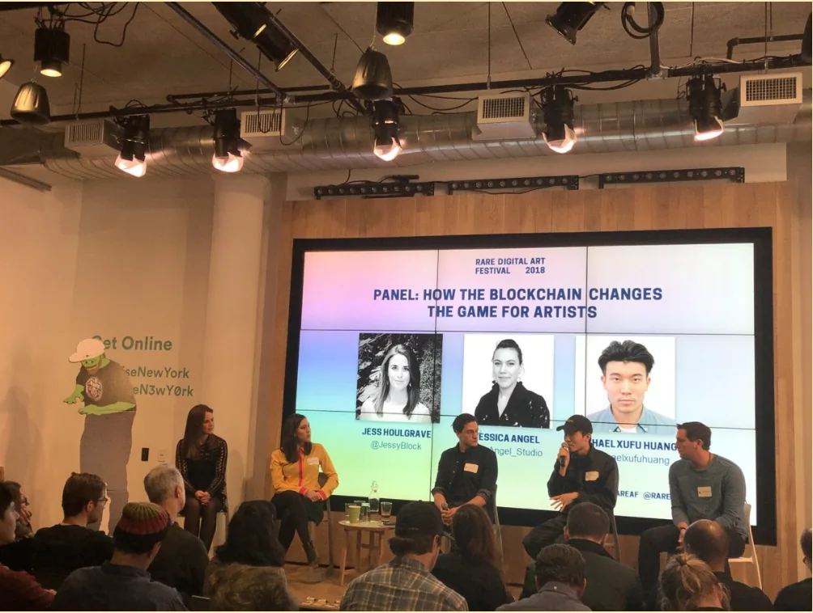
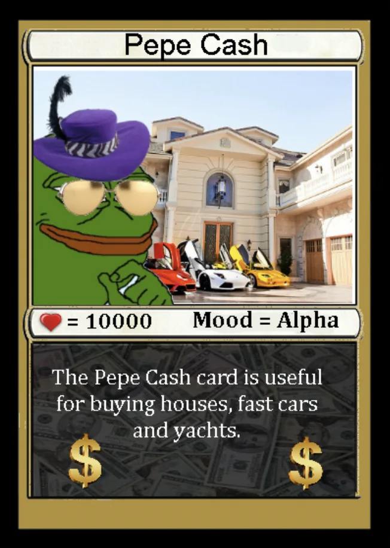
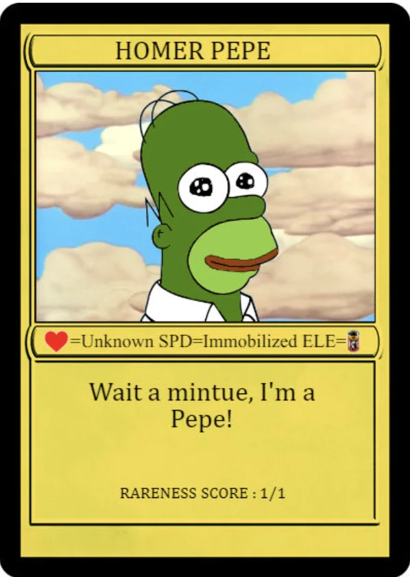

# 稀有佩佩 NFT 是如何重获青蛙佩佩这一文化模因的？

**By Mason Marcobello**

> 青蛙佩佩（Pepe the Frog）不仅是最古老的互联网模因（meme）之一，也是最古老的 NFT 之一。在佩佩被短暂地与另类右派联系在一起后，Web3 重新获得了这个模因。

_这个故事来自于 PubDAO，一个去中心化的新闻通讯社_

对于老人和新兴的 DeFi「老手」来说，模因是 Web3 的本源，就像中本聪的比特币白皮书是比特币的本源一样，这不是什么秘密。说到 NFT 世界中的拟人化角色，没有什么比青蛙佩佩更适合币圈了。

虽然佩佩最近可能没有得到像「无聊猿猴俱乐部」（Bored Ape Yacht Club）和「加密朋克」（CryptoPunks）那样的热度和关注，但没有什么比这更能表明佩佩在 NFT 世界的持久吸引力了。10 月，一个名为 Pepenopoulos 的独有的稀有佩佩 NFT（创建于 2016 年）在苏富比拍卖会上以 360 万美元成交。

青蛙佩佩第一次作为 NFT 发布是在 2016 年一个名为 Counterparty 的点对点市场上。它最早可以追溯到 2006 年，当时它出现在马特·弗里（Matt Furie）的漫画《男孩俱乐部》中。几年后，由于社交媒体的寒武纪大爆发，这个角色迅速演变成一个独立的模因，在 Myspace 和 4chan 上广受欢迎。

到 2015 年，这个两栖动物的卡通变体，被称为「稀有佩佩」（Rare Pepes），开始出现水印，如「稀有佩佩不要保存」，以表明每个设计背后的艺术家还没有公布这一模因供公众使用。那一年，一个由 1200 张稀有佩佩图片组成的收藏品在 eBay 上架，据说在被从该网站下架之前，价格达到了 99166 美元。

除了许多晦涩怪异的佩佩抽大麻或吃飞行披萨的动画演绎外，设计还包括偶尔的加密文化讽刺，如斯坦利·库布里克改编的《闪灵》中臭名昭著的双胞胎的青蛙版，名为 Winkelpepe。

## 另类右派的侵占

但佩佩也在 2015 年走入黑暗。那一年，唐纳德·川普宣布竞选总统，这是美国政治中一个争议时代的开始。

这段时间出现了稀有佩佩的变种，其中包括与纳粹德国、三 K 党和白人至上等主题的极右运动的联系。尽管佩佩本身的性质相对无害，但在川普赢得选举后，这一模因与政治之间的联系甚至进一步巩固了。值得注意的例子包括小唐纳德·川普在 Instagram 上发布的《绝命毒师》的戏仿电影海报。在图片中，佩佩与川普、小川普和其他人站在一起，作为对希拉里·克林顿关于川普支持者属于「一群垃圾」评论的回应。

希拉里·克林顿的竞选网站上有篇博文后来批评了该漫画的应用，称其为「与白人至上主义有关的符号」。然而，小川普否认对这只青蛙的二元跨文化角色有所了解。

在 2016 年 9 月接受 Esquire 杂志采访时，马特·弗里对佩佩被用作仇恨符号做出了回应：「这很糟糕，但我无法控制它，就像任何人无法控制互联网上的青蛙一样。」弗里的出版商 Fantagraphics Books 也发表了一份声明，谴责这一「非法且令人厌恶的挪用行为」。

在那个月，尽管将佩佩加入了其仇恨符号数据库，但反诽谤联盟表示，佩佩大多数情况都不是在与仇恨有关的背景下使用。

在 2016 年 10 月《时代》杂志的一篇专栏文章中，弗里写道：「我明白这不是我所能控制的，但最终，佩佩是你说他是什么就是什么，而我，创造者，说佩佩是爱。」

## 佩佩在 NFT 的进展

青蛙佩佩及其衍生品稀有佩佩，随着在 Counterparty 市场的出现，过渡到了 NFT。Counterparty 由罗伯特·德尔莫迪（Robert Dermody）、亚当·克瑞棱斯坦恩（Adam Krellenstein）和伊万·瓦格纳（Evan Wagner）于 2014 年基于公开分布的比特币网络上创建，允许用户创建通证化资产。

由于对链上可收藏资产的需求不断增长，第一批稀有佩佩在 2016 年 9 月比特币区块链上的第 428,919 区块被开采出来，远在 NFT 一词被普遍使用之前，实际上早于 2017 年基于以太坊的 NFT 收藏系列，如 Larva Labs 的「加密朋克」。

随着 2017 年以太坊突飞猛进，以及越来越多的市场支持，一个更大的社区开始围绕数字收藏品成长，刺激开发者创建更多的平台来帮助编目和交换他们的数字图片。在新兴的以艺术为中心的加密市场中，创作者可以将他们的作品以数字通证的形式发布，并有固定的流通量，然后将艺术品发行给收藏家，然后出售、交易或储存他们的收藏品。(而后，在 2020 年 9 月，以太坊徽章库将允许交易者将 2016 年初的稀有佩佩包裹在以太坊 ERC-721 通证内，以转移和出售给以太坊兼容的钱包)。

在这些活动中，包括一个不断增长的稀有佩普电报聊天组，Jason Rosenstein，拍卖行 partion.io 的创始人，在首届稀有数字艺术节上主持了第一次稀有佩佩的现场拍卖，出售了一幅受萨尔瓦多·达利启发的佩佩的双联画。

## 钱包、现金、卡片和小文件

一旦佩佩成为 NFT，佩佩的加密应用和内容就开始起飞。

开发者 Joe Looney 创建的稀有佩佩钱包是一个加密的数字仓库，Counterparty 上的交易者和收藏家可以用它来购买、出售、赠送和销毁他们的稀有佩佩。

这个钱包还允许交易者和收藏者使用 PepeCash 作为交换媒介。根据稀有佩佩目录，PepeCash 是作为佩佩世界的货币而创建的，与总体收藏中的其他卡片类似，只是供应量更大，大约有 7 亿张在流通。PepeCash 可以在 Counterparty DEX（去中心化交易所）或日本的 Zaif 和加拿大的 TuxExchange 等交易所购买。

PepeCash 主要用于在向目录和钱包提交稀有佩佩时支付费用，但稀有佩佩社区也将 PepeCash 整合到游戏中。

可以理解的是，所有这些对新入者来说都是不透明的，而且令人生畏。

虽然有一些现有的资源供首次收藏稀有佩佩的人使用，如稀有佩佩目录（所有已知稀有佩佩的目录），佩佩社区的一些爱好者，如马特·加西亚（Matt Garcia），已经在推特上提供了粗略的购买指南。

但有些买家不需要任何帮助，比如彼得·凯尔（Peter Kell），他于 2018 年在纽约市首个数字艺术品拍卖会 RareAF 上以 3.9 万美元买下了一幅珍贵的独一无二的「荷马佩佩」。虽然凯尔后来说，他很清楚当时很多人认为这是一次离奇的购买，但几年后像「加密朋克这样的早期收藏品的出现和流行，帮助凯尔在 2021 年 3 月以 31.2 万美元的价格出售了他的「荷马佩佩」。

然后是佩佩在圣丹斯电影节的首映。

2020 年，一部关于该模因的美国纪录片《感觉良好，伙计！》（Feels Good Man）在圣丹斯电影节上首映，并赢得了新锐电影人特别评委奖以及新闻和纪录片艾美奖的研究奖。

作为亚瑟·琼斯（Arthur Jones）的导演处女作，《感觉良好，伙计！》讲述了佩佩的创造者马特·弗里在佩佩被另类右派成员收编后，试图重新获得控制权并挽回佩佩。

考虑到网上的病毒式传播和青蛙佩佩在币圈的影响力，2021 年 10 月，马特·弗里与 NFT 市场 Chainsaw.fun 合作，推出 FEELSGOODMAN 稀有佩佩卡，这是水到渠成的事。

考虑到比特币和以太坊极端主义者长期存在的分歧，这一 NFT 的创作团队分别在比特币（通过 Xchain）和以太坊区块链上发布。

在宣布之后，稀有佩佩钱包的化名创建者 Loonardo Joe Vinci 在推特上以一种近乎浪漫的语气谈论这张卡，他说：「就这样，稀有佩佩目录完成了。」
